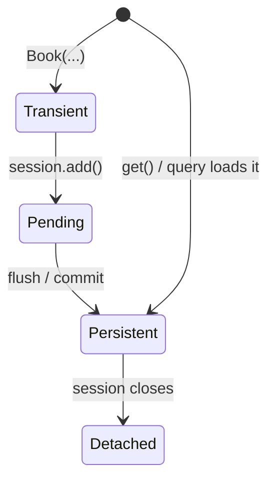

# The Session & Unit of Work

In [Phase 3](03-defining-models.md) you taught SQLAlchemy the shape of your world — `Author`, `Book`,
`Tag` — and even built the tables with `create_all`. But a mapping just sits there. Something has to
actually *use* it: insert a new author, fetch one back, change a title and have that change reach the
database. That something is the **`Session`**, and it's the single most important object in the whole ORM.

If you take one idea from this entire guide, take this one. Almost every SQLAlchemy surprise you'll ever
hit — a change that saved without you calling save, a query that ran once instead of twice, a lazy load
that worked here but exploded there — traces straight back to what's in this file.

## The mental model: a workbench, not a pipe

📝 People picture an ORM as a pipe: Python object goes in one end, SQL comes out the other, a row lands in
the table. That picture will mislead you for years. The Session isn't a pipe — it's a **workbench**. When
you add or load objects, the Session lays them out on a bench it keeps for the duration of your work,
watches them, and only sends SQL to the database when it decides it's time.

The **`Session`** is your handle to that workbench. It holds your objects, tracks every change you make to
them, and talks to the database through the `engine` you built in [Phase 2](02-the-engine-and-connecting.md).
You open one with the modern context-managed pattern:

```python
from sqlalchemy import create_engine
from sqlalchemy.orm import Session

engine = create_engine("sqlite:///library.db")

with Session(engine) as session:
    # do all your work here — add, load, modify
    ...
```

*What just happened:* `Session(engine)` created a workbench bound to your engine — that's how it knows
which database to talk to. The `with` block is the modern, recommended way to use it: when the block ends
(normally or via an exception), the Session is closed and cleaned up automatically — no dangling
connections. Everything you do with your models happens inside this block.

💡 If you've come from Java's Hibernate/JPA, this is the *exact* same idea wearing Python clothes.
SQLAlchemy's `Session` is Hibernate's `EntityManager`/persistence context: a per-unit-of-work, in-memory
area that manages your objects and syncs them to the database on *its* schedule. If the workbench framing
feels familiar, that's why — see [/guides/hibernate-and-jpa-from-zero](/guides/hibernate-and-jpa-from-zero)
for the Java framing. The concepts transfer cleanly in both directions.

## Persisting: `add` + `commit`

Let's save an `Author` and a `Book`. Two steps: hand the object to the Session with `add`, then make it
permanent with `commit`.

```python
with Session(engine) as session:
    author = Author(name="Ursula K. Le Guin")
    book = Book(title="A Wizard of Earthsea")

    session.add(author)     # author is now on the workbench (pending)
    session.add(book)

    print(author.id)        # None — no INSERT has run yet

    session.commit()        # NOW the INSERTs fire

    print(author.id)        # 1 — the database assigned it, SQLAlchemy read it back
```
```sql
INSERT INTO authors (name) VALUES ('Ursula K. Le Guin');
INSERT INTO books (title) VALUES ('A Wizard of Earthsea');
```

*What just happened:* `Author(name=...)` made a plain Python object — at that moment the Session knows
nothing about it. `session.add(author)` placed it on the workbench, but **no SQL ran yet**, which is why
`author.id` is still `None`. The `INSERT`s didn't fire on the `add` lines — they fired at `commit`. That's
when SQLAlchemy sent the pending work to the database, the database assigned each row a primary key, and
SQLAlchemy read those ids back and populated `author.id` (now `1`). That gap between "I told the Session
about this object" and "the SQL actually ran" is the whole story of this phase.

⚠️ **Nothing hits the database permanently until `commit`.** Until then your changes live only on the
workbench. If the `with` block exits without a `commit` — including because an exception was raised — the
work is rolled back and never reaches the database. `add` schedules; `commit` saves.

## The identity map & unit of work

This is the core idea, and it surprises everyone the first time. 📝 Within a single Session, each database
row maps to exactly **one** Python object — this is the **identity map**. Ask the Session for author `1`
ten times and you get the *same instance* back every time, and after the first lookup, **no further
queries**.

Watch how many `SELECT`s come out:

```python
with Session(engine) as session:
    first = session.get(Author, 1)    # runs a SELECT, puts the Author on the bench
    second = session.get(Author, 1)   # same id, same Session

    print(first is second)            # True — not just equal, the SAME object
```
```sql
SELECT authors.id, authors.name FROM authors WHERE authors.id = 1;
```
```console
True
```

*What just happened:* two `get` calls, but **only one `SELECT`**. The first call ran the query, built an
`Author` from the row, and stored it on the workbench. The second call found it already there and handed
it straight back from memory — no database round trip. And `first is second` is `True`: not two objects
with equal data, the very *same* object. That's the identity map guaranteeing one row, one object, per
Session.

💡 The other half of this idea is the **unit of work**. The Session doesn't send your changes to the
database one at a time as you make them. It collects everything — new objects from `add`, modifications to
existing ones, deletions — and flushes them together as a single coordinated batch, in the right order, at
the right moment. You describe *what* the data should look like; the Session figures out the minimal set of
`INSERT`/`UPDATE`/`DELETE` statements to get there and runs them as one unit. The identity map is what
makes this possible: one object per row means there's exactly one source of truth on the bench to watch
and synchronize.

## Flush vs commit & dirty tracking

Two words get thrown around a lot, and conflating them causes real confusion. 📝 **Flush** = send the
pending SQL to the database (the `INSERT`s, `UPDATE`s, `DELETE`s), but inside the still-open transaction.
📝 **Commit** = make it all permanent.

Here's the relationship: `commit` always flushes first, then commits. And the Session also **autoflushes**
automatically right before it runs a query — so that any pending changes are visible to that query. Most of
the time you never call `flush()` yourself; it happens for you. You think in terms of `commit`. But knowing
flush exists explains *when* your SQL actually runs.

Now the behavior that feels like magic until you understand the workbench: **dirty tracking** (also called
*dirty checking*). 📝 When you change an attribute on an object the Session is managing, the Session
*notices* — and issues an `UPDATE` at the next flush. There is **no explicit save call**.

```python
with Session(engine) as session:
    book = session.get(Book, 1)        # load it — now managed by the Session
    print(book.title)                  # 'A Wizard of Earthsea'

    book.title = "A Wizard of Earthsea (Illustrated)"   # just set the attribute

    session.commit()                   # the Session noticed — UPDATE fires
```
```sql
SELECT books.id, books.title FROM books WHERE books.id = 1;
UPDATE books SET title='A Wizard of Earthsea (Illustrated)' WHERE books.id = 1;
```

*What just happened:* you loaded a `Book`, which put it on the workbench under the Session's watch. Then you
just **assigned a new value** to `book.title` — no `session.add`, no `session.save`, no `session.update`
(there is no such method). At `commit`, the Session compared the object's current state to what it loaded,
saw `title` had changed, and emitted exactly one `UPDATE` for that one column. This is the unit of work
doing its job: you mutate plain Python objects, and the Session translates your mutations into the right
SQL. (Java/Hibernate developers know this exact behavior — it's the same dirty checking, see
[/guides/hibernate-and-jpa-from-zero](/guides/hibernate-and-jpa-from-zero).)

## Object states & the session-scope rule

Every object, from the Session's point of view, is always in exactly one of four **states**. Learn these
names — error messages, docs, and your own debugging all speak this language.

📝 The four states:

- **Transient** — a brand-new object you made with `Book(...)`. The Session has never heard of it; it's not
  on the bench and has no row. (`Book(title="...")` before any `add`.)
- **Pending** — you've called `add`, so it's on the bench and scheduled for `INSERT`, but the flush hasn't
  happened yet. (After `add`, before `commit`/`flush`.)
- **Persistent** — on the bench, tracked by the Session, *and* tied to a real database row. This is the
  state where dirty tracking works. (After commit, or anything `get`/a query returns.)
- **Detached** — *was* persistent, but its Session has closed. It still holds its data, but nobody's
  watching it; changes go nowhere. (An object you loaded, after the `with` block ended.)



⚠️ Here's the trap that bites everyone eventually: **a detached object can't lazy-load.** If you load an
`Author` inside a `with Session(...)` block, let the block end, and *then* try to walk to a relationship
that wasn't fetched yet (say `author.books`), there's no open Session to run the query through — and you
get a `DetachedInstanceError`. You don't have relationships yet (they arrive in
[Phase 6](06-relationships.md)), and we'll meet this error properly in [Phase 7](07-loading-strategies-and-n-plus-1.md).
But you already understand *why* it happens: no open Session, no workbench, nothing to do the lazy load.
That's the payoff of learning states first.

💡 So how should you scope a Session? The pattern is **one Session per unit of work**: open it, do a
coherent chunk of work, `commit` (or `rollback` on error), close it — exactly what the `with` block gives
you. In a web app this becomes **one Session per request**. Keep them short-lived. ⚠️ And do **not** share a
single Session across threads or across concurrent requests — a Session is not thread-safe, and sharing one
is a classic source of corrupted state and baffling bugs. One unit of work, one Session, then let it go.

💡 This is the lens for everything that follows. Nearly every ORM behavior in the rest of this guide is one
of these Session ideas wearing a costume:

- *"I changed a field and it saved without calling save"* → the object was **persistent**, and dirty
  tracking caught the change.
- *"The same query ran once instead of twice"* → the **identity map** served the second lookup from memory.
- *"`is` returned `True` for two loads"* → the identity map gave you one object per row.
- *"Why did this `DetachedInstanceError` blow up?"* → you touched a **detached** object after its Session
  closed.

Master the Session, and the rest of SQLAlchemy is just details. Next, in [Phase 5](05-querying-with-select.md),
you'll use this Session to run real queries with `select()`.

## Recap

1. The **`Session`** is your handle to the ORM — a workbench that holds your objects, tracks their changes,
   and talks to the database via the engine. Open it with `with Session(engine) as session:`. It's
   SQLAlchemy's equivalent of Hibernate's `EntityManager`/persistence context.
2. **`session.add(obj)`** schedules an insert; **`session.commit()`** makes it permanent. The primary key
   is populated only *after* the flush/commit — nothing hits the database permanently until `commit`.
3. The Session is an **identity map**: within one Session, a row maps to exactly one object, so `get` the
   same id twice → one `SELECT` and the *same* instance (`is` is `True`). It batches all changes and applies
   them as one **unit of work**.
4. **Flush** sends pending SQL inside the transaction (it autoflushes before queries and on commit);
   **commit** makes it permanent. **Dirty tracking** means changing an attribute on a persistent object
   issues an `UPDATE` at flush — with **no explicit save call**.
5. Every object is **transient** (new, unknown), **pending** (added, not flushed), **persistent** (tracked
   + in the DB), or **detached** (Session closed, unwatched). A detached object can't lazy-load — that's the
   `DetachedInstanceError` you'll meet in Phase 7.
6. 💡 Scope a Session as **one unit of work** (one per request in web apps); keep it short-lived and never
   share one across threads. Nearly every ORM behavior traces back to the Session — it's the lens for the
   rest of the guide.

## Quick check

The three ideas that explain the most future bugs:

```quiz
[
  {
    "q": "You call `session.add(author)` and then immediately print `author.id`. What do you see, and why?",
    "choices": [
      "The real primary key — `add` runs the INSERT immediately",
      "None — `add` only schedules the insert; the id isn't populated until the flush/commit, when the database assigns it",
      "A randomly generated UUID assigned by SQLAlchemy",
      "It raises an error because the object isn't committed yet"
    ],
    "answer": 1,
    "explain": "`add` places the object on the workbench in the pending state but runs no SQL. Nothing hits the database until commit (or a flush), so the database hasn't assigned a primary key yet and `author.id` is None. After commit, SQLAlchemy reads the assigned id back and populates it."
  },
  {
    "q": "Inside one Session, you call `session.get(Author, 1)` twice. How many SELECT queries run, and is the result the same object?",
    "choices": [
      "One SELECT; both calls return the same object instance (`is` is True) — the identity map serves the second call from memory",
      "Two SELECTs; you get two separate objects with equal data",
      "Two SELECTs, but SQLAlchemy returns the same object both times",
      "Zero SELECTs; get never touches the database"
    ],
    "answer": 0,
    "explain": "The Session is an identity map. The first get runs the SELECT and stores the Author on the workbench; the second get finds it already there and returns that same instance from memory with no new query, so `is` is True. One row maps to exactly one object per Session."
  },
  {
    "q": "You load a Book (it's now persistent), set `book.title = \"New Title\"`, and call `session.commit()`. There's no `session.save()` call. What happens?",
    "choices": [
      "Nothing is saved — you must call session.save() or session.update() to persist the change",
      "It raises an error because you modified an object without re-adding it",
      "An UPDATE fires at commit — dirty tracking noticed the changed attribute, so no explicit save call is needed",
      "The whole row is re-inserted as a new record"
    ],
    "answer": 2,
    "explain": "While an object is persistent, the Session watches it. Changing an attribute marks it dirty, and at the next flush (which commit triggers) the Session emits an UPDATE for the changed column. This is dirty tracking — there is no session.save()/session.update() method; mutating the object is the save."
  }
]
```

---

[← Phase 3: Defining Models](03-defining-models.md) · [Guide overview](_guide.md) · [Phase 5: Querying with select() →](05-querying-with-select.md)