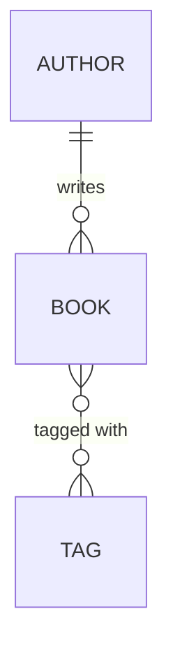

# Relationships

Up to [Phase 5](05-querying-with-select.md), every model has been a loner. An `Author` had a name and a
bio; a `Book` had a title and a year; nothing pointed at anything else. But the whole reason you reached
for a relational database is that things *relate* — an author writes books, a book wears tags. This phase
is where you wire those connections so you can walk from one object to another in plain Python:
`author.books`, `book.author`, `book.tags`.

## The mental model: a foreign key with a Python face

📝 **A relationship lives in two places at once.** In the database, "this book was written by that author"
is a single column: `books.author_id` holds the `id` of a row in `authors`. That's all a foreign key is —
a column whose value matches some other table's primary key. In the ORM, that *same* link shows up as an
attribute you navigate: `book.author` hands you the whole `Author` object, and `author.books` hands you the
list of `Book`s. One foreign key in the database, two attributes in Python — and `relationship()` is the
thing that keeps those two views talking to each other.

If foreign keys themselves are fuzzy, [Relationships & Keys](/guides/relationships-and-keys) is the
prerequisite — it explains primary keys, foreign keys, and referential integrity from the ground up. And
[SQL Joins Explained](/guides/sql-joins-explained) shows how the database stitches the rows back together
underneath what `relationship()` does for you.

Here's the domain we'll build for the rest of this phase:



*What just happened:* one author writes many books (`1—*`), and books and tags form a many-to-many
(`*—*`) — a book carries many tags, a tag labels many books. Two relationship shapes, two SQLAlchemy
tools. We'll do the one-to-many first, since it's the one you'll write most.

## One-to-many: foreign key + relationship()

A one-to-many needs two ingredients, and it's worth knowing which is which. **The foreign key is the part
the database cares about.** **The `relationship()` is the part *you* care about** — it's pure ORM
convenience that turns that key into a navigable attribute.

Start with the foreign key. Many books point to one author, so the `author_id` column lives on `Book`:

```python
from sqlalchemy import ForeignKey
from sqlalchemy.orm import Mapped, mapped_column, relationship


class Author(Base):
    __tablename__ = "authors"

    id: Mapped[int] = mapped_column(primary_key=True)
    name: Mapped[str]

    books: Mapped[list["Book"]] = relationship(back_populates="author")


class Book(Base):
    __tablename__ = "books"

    id: Mapped[int] = mapped_column(primary_key=True)
    title: Mapped[str]
    author_id: Mapped[int] = mapped_column(ForeignKey("authors.id"))

    author: Mapped["Author"] = relationship(back_populates="books")
```

*What just happened:* `author_id: Mapped[int] = mapped_column(ForeignKey("authors.id"))` is the real
foreign key — an integer column on `books` that references the `id` column of `authors`. That single line is
all the database needs. The two `relationship()` calls are the ORM layer on top: `Author.books` is the
collection side (typed `list["Book"]`), and `Book.author` is the single-object side (typed `"Author"`). The
string `"Book"` is a forward reference — `Book` isn't defined yet when `Author` is being read, so you name it
as a string and SQLAlchemy resolves it later.

📝 **`back_populates` is what links the two `relationship()` calls into one.** `Author.books` says
`back_populates="author"` and `Book.author` says `back_populates="books"`: each names the attribute on the
*other* class. That cross-reference tells SQLAlchemy "these two attributes are the same relationship seen
from opposite ends" — so it keeps them in sync in memory. Set one, and SQLAlchemy updates the other for you
(more on that in a moment).

Now you can walk the link both ways:

```python
author = session.get(Author, 1)
for book in author.books:          # one-side → many-side
    print(book.title)

book = session.get(Book, 5)
print(book.author.name)            # many-side → one-side
```

*What just happened:* `author.books` gives you a list of that author's `Book` objects; `book.author` gives
you the one `Author` who wrote it. You never wrote a JOIN or touched `author_id` by hand — `relationship()`
issues the query and hands back live objects. (When those queries actually fire, and why that can bite you,
is [Phase 7](07-loading-strategies-and-n-plus-1.md).)

Only the foreign key shows up in the schema — the `relationship()` calls generate no SQL of their own:

```sql
CREATE TABLE authors (
    id   INTEGER NOT NULL,
    name VARCHAR NOT NULL,
    PRIMARY KEY (id)
);

CREATE TABLE books (
    id        INTEGER NOT NULL,
    title     VARCHAR NOT NULL,
    author_id INTEGER NOT NULL,
    PRIMARY KEY (id),
    FOREIGN KEY(author_id) REFERENCES authors (id)
);
```

*What just happened:* there's one foreign key in the whole picture — `books.author_id`, with a
`FOREIGN KEY ... REFERENCES authors(id)` constraint that the database enforces. Both `author.books` and
`book.author` are just two ways of reading that one column. The `relationship()` calls added zero columns;
they're ergonomics, not storage.

## The both-sides gotcha

Here's where `back_populates` earns its keep, and where people trip. Because the two sides are linked, you
only ever need to touch **one** of them — appending to the collection sets the other side automatically:

```python
author = Author(name="Ursula K. Le Guin")
book = Book(title="A Wizard of Earthsea")

author.books.append(book)          # this ALSO sets book.author = author
print(book.author.name)            # → "Ursula K. Le Guin"  (already wired up)

session.add(author)
session.commit()                   # author_id is written correctly
```

*What just happened:* appending `book` to `author.books` made SQLAlchemy set `book.author = author` in the
same breath — that's `back_populates` doing its job in memory. When you `commit`, SQLAlchemy reads the
relationship, fills in `book.author_id` with the author's id, and saves both rows. You added `author` to the
session and `book` came along with it through the relationship. (Equivalently, you could set
`book.author = author` and SQLAlchemy would add `book` to `author.books` — the sync goes both ways.)

⚠️ **The trap is reaching around the relationship.** Two ways to make your objects and your database
disagree:

- **Setting only the raw `author_id`.** If you write `book.author_id = 1` by hand instead of
  `book.author = author`, the relationship attribute `book.author` may still read as stale or `None` in the
  current session until things refresh — the ORM's in-memory graph and the column you poked don't match.
  Prefer assigning the object (`book.author = author`) and let SQLAlchemy manage the id.
- **Forgetting to add the parent to the session.** If you build `author.books.append(book)` but never
  `session.add(author)` (and there's no cascade reaching `book`), nothing gets persisted — your beautifully
  linked objects never touch the database.

💡 The reliable habit: link objects by assigning the relationship attribute (append to the collection, or
set the single side), add the top of the graph to the session, and let SQLAlchemy compute the foreign-key
ids. Don't hand-edit `_id` columns unless you have a specific reason — that's working *under* the tool
instead of *with* it.

## Many-to-many: the association table

Books and tags are many-to-many: a book has many tags, a tag labels many books. Neither table can hold the
foreign key — which single row would `books.tag_id` even point at? — so the database uses a third table whose
only job is to pair ids. In SQLAlchemy you declare that table directly with `Table(...)` and hand it to
`relationship()` as `secondary=`:

```python
from sqlalchemy import Column, ForeignKey, Integer, Table
from sqlalchemy.orm import Mapped, mapped_column, relationship

book_tag = Table(
    "book_tag",
    Base.metadata,
    Column("book_id", Integer, ForeignKey("books.id"), primary_key=True),
    Column("tag_id", Integer, ForeignKey("tags.id"), primary_key=True),
)


class Book(Base):
    __tablename__ = "books"

    id: Mapped[int] = mapped_column(primary_key=True)
    title: Mapped[str]

    tags: Mapped[list["Tag"]] = relationship(secondary=book_tag, back_populates="books")


class Tag(Base):
    __tablename__ = "tags"

    id: Mapped[int] = mapped_column(primary_key=True)
    name: Mapped[str]

    books: Mapped[list["Book"]] = relationship(secondary=book_tag, back_populates="tags")
```

*What just happened:* `book_tag` is a bare association table — two foreign-key columns, `book_id` and
`tag_id`, that together form its primary key (each pairing is unique). It's a `Table`, not a model class,
because it carries no data of its own; it exists only to connect. Each `relationship(secondary=book_tag, ...)`
tells SQLAlchemy "to get from a `Book` to its `Tag`s, hop through `book_tag`." `back_populates` ties the two
sides together exactly like the one-to-many did, so adding on one side reflects on the other.

Navigating it feels identical to the one-to-many — the join table is invisible:

```python
book = session.get(Book, 5)
tag = session.get(Tag, 2)

book.tags.append(tag)              # inserts a row into book_tag
session.commit()

for t in book.tags:               # → the tags on this book
    print(t.name)
for b in tag.books:               # → every book wearing this tag
    print(b.title)
```

*What just happened:* `book.tags.append(tag)` doesn't touch `books` or `tags` — it inserts a `(book_id,
tag_id)` row into `book_tag`. Because of `back_populates`, `tag.books` now includes that book too. You work
in objects on both ends; SQLAlchemy manages the pairing rows in the table you never query directly.

💡 **When the link itself needs data, drop the bare `Table`.** A plain association table holds *only* the two
ids. The moment you need to record something *about* the pairing — when the tag was applied, who applied it,
a relevance score — there's nowhere to put it. The fix is to promote the join to a real model (an
*association object*, e.g. a `BookTag` class with its own columns plus two `relationship()`s back to `Book`
and `Tag`). Rule of thumb: pure pairing → `secondary=` table; pairing *with attributes* → association
object.

## Cascades: propagating deletes to children

By default, deleting an `Author` does not delete their `Book`s — SQLAlchemy will try to null out
`books.author_id` and leave the books orphaned (or error if the column is `NOT NULL`). Often that's not what
you want: if a book can't exist without its author, deleting the author should delete the books too. That's
what `cascade` controls.

📝 **`cascade="all, delete-orphan"`** makes the children share the parent's lifecycle. Set it on the
*collection* side of the relationship:

```python
class Author(Base):
    __tablename__ = "authors"

    id: Mapped[int] = mapped_column(primary_key=True)
    name: Mapped[str]

    books: Mapped[list["Book"]] = relationship(
        back_populates="author",
        cascade="all, delete-orphan",
    )
```

*What just happened:* `"all"` propagates the usual operations (save, refresh, and crucially delete) from an
`Author` to its `Book`s — `session.delete(author)` now deletes that author's books too. `delete-orphan` adds
one more rule: if you *remove* a book from `author.books` (so it no longer belongs to any author), that book
is deleted on commit rather than left dangling with a null `author_id`. This is exactly right for a true
parent-child where the child can't outlive the parent.

⚠️ **Be deliberate — cascade deletes are easy to over-apply.** The cascade belongs on the side that *owns*
the children's lifecycle (here, `Author.books`). Do not slap it on a relationship pointing at something
*shared*. A cascade-delete on the many-to-many `Book.tags`, for instance, would delete the `Tag` rows
themselves when you delete a book — but tags are shared across many books; you meant to remove the *pairing*,
not destroy the tag. Ask "do I own this thing, or just reference it?" Cascade only what you own.

💡 Step back at what relationships bought you. You now move through your data as objects — `author.books`,
`book.tags`, `book.author` — instead of writing JOINs by hand. That's a genuine ergonomic win. But it hides
something: every one of those attribute accesses can fire a query you didn't write. Loop over a hundred
authors touching `author.books` each time and you've quietly issued a hundred-and-one queries. That hidden
cost is the **N+1 problem**, and taming it — eager loading, `selectinload`, `joinedload` — is exactly what
[Phase 7](07-loading-strategies-and-n-plus-1.md) is about.

## Recap

1. A relationship is **one foreign key in the database** but **a navigable attribute in Python**;
   `relationship()` translates between the two. The FK (`ForeignKey("authors.id")`) is what the database
   stores — the `relationship()` calls add no columns.
2. A **one-to-many** needs the FK column on the many-side (`Book.author_id`) plus a pair of
   `relationship(back_populates=...)` calls — `Author.books` and `Book.author` — wired to each other.
3. **`back_populates` keeps both sides in sync in memory**: appending to `author.books` also sets
   `book.author`. Link objects through the relationship attributes; let SQLAlchemy fill in the FK ids.
4. The **gotchas** are reaching around the relationship: hand-setting the raw `_id`, or building the link but
   forgetting to `session.add()` the parent (with no cascade to carry the child).
5. A **many-to-many** uses an **association `Table`** passed as `secondary=`; navigate `book.tags` /
   `tag.books` and SQLAlchemy manages the pairing rows. When the link needs its own data, use an
   **association object** instead of a bare table.
6. **`cascade="all, delete-orphan"`** on the collection side propagates deletes to children the parent owns
   (Author→Books) — be deliberate, and never cascade-delete shared data like tags.

## Quick check

Lock in the ideas most likely to bite you when wiring relationships:

```quiz
[
  {
    "q": "In a one-to-many between Author and Book, where does the foreign key column actually live?",
    "choices": [
      "On Author, as a list of book ids",
      "On Book, as author_id referencing authors.id",
      "In a separate join table linking the two",
      "Nowhere — relationship() stores the link internally"
    ],
    "answer": 1,
    "explain": "Many books point to one author, so the FK lives on the many-side: books.author_id references authors.id. The two relationship() calls (Author.books, Book.author) are ORM navigation on top of that one column; they add no columns of their own."
  },
  {
    "q": "With back_populates wired between Author.books and Book.author, you call author.books.append(book). What happens to book.author?",
    "choices": [
      "It stays None until you set it manually",
      "It is set to author automatically, in memory, by back_populates",
      "It raises an error because you set the wrong side",
      "It is only set after you call session.commit()"
    ],
    "answer": 1,
    "explain": "back_populates links the two attributes as one relationship seen from both ends. Appending to author.books immediately sets book.author = author in memory — you only need to touch one side. On commit, SQLAlchemy writes book.author_id from that."
  },
  {
    "q": "You put cascade=\"all, delete-orphan\" on the many-to-many Book.tags relationship and then delete a book. What goes wrong?",
    "choices": [
      "Nothing — that's the correct place for the cascade",
      "It deletes the shared Tag rows themselves, not just the book's pairings, removing tags other books still use",
      "It deletes the book but leaves the join rows dangling",
      "It refuses to delete because tags are referenced elsewhere"
    ],
    "answer": 1,
    "explain": "Cascade belongs on relationships to children you own. Tags are shared across many books, so cascade-deleting them destroys data other books depend on. You only meant to remove the pairing rows in the association table. Ask 'do I own this, or just reference it?' and cascade only what you own."
  }
]
```

---

[← Phase 5: Querying with select()](05-querying-with-select.md) · [Guide overview](_guide.md) · [Phase 7: Loading Strategies & the N+1 Trap →](07-loading-strategies-and-n-plus-1.md)