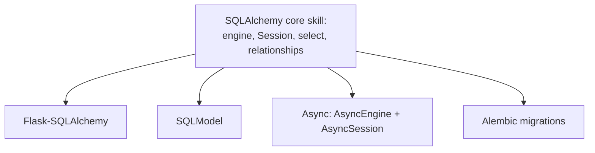

# SQLAlchemy in the Real World & Where to Go Next

Take a second and look at the ground you've covered. You started thinking of an ORM as a box that turned Python objects into rows by some unknowable trick. Now you can name every gear inside it. You understand the **engine** and the connection pool underneath it. You understand the **Session** — the unit of work, the identity map, the flush that emits SQL you never explicitly asked for. You can write a modern `select()`, map a `relationship()`, and — the big one — you can *see* the **N+1 problem** coming and reach for `selectinload` before it ever reaches production. And you know that `create_all` is a toy and Alembic is how real schemas change.

Most of all, you can read the SQL. With `echo=True` on, SQLAlchemy stopped being magic and became a tool whose output you can predict and debug. That's the whole game. A data layer is no longer something that happens *to* you — it's something you reason about.

This last phase isn't new mechanics. It's about where everything you learned actually lives in real codebases. And there's a revelation waiting that ties the whole guide together.

## The magic, revealed

💡 Here's the moment it clicks. If you went through [Flask From Zero](/guides/flask-from-zero), you met **Flask-SQLAlchemy** — that `db` object you imported, the one where `db.session.add()` and `User.query` somehow just worked. You now know exactly what's underneath. It *is* this. Flask-SQLAlchemy is a thin convenience layer that wires up the engine for you, hands you a Session scoped to each request, and gives the declarative base a friendlier face. Every concept — the Session, the unit of work, the mapped class — is something you've spent the last eight phases inside.

And if you went through [FastAPI From Zero](/guides/fastapi-from-zero), you met **SQLModel** — Sebastián Ramírez's library where one class is somehow both a database table *and* a Pydantic model. That's not a different ORM. SQLModel is **SQLAlchemy and Pydantic fused into one declaration**: the table half is SQLAlchemy mapping (the `Mapped` columns, the relationships, the Session), the validation half is Pydantic. You learned both halves separately; SQLModel just stacks them.

The point lands like this: **most database access in serious Python is SQLAlchemy** — sometimes directly, far more often wrapped. You didn't learn a niche library. You learned the engine that the popular wrappers wrap. When the generated query is slow, or the lazy-load fires at the wrong moment, or the SQL looks wrong, you're not staring at a sealed box anymore. You can open it.

## Core vs ORM, in practice

Back in Phase 1 you learned that SQLAlchemy is two libraries stacked: **Core** (Pythonic SQL building) and the **ORM** (classes mapped to tables) on top of it. At the time that was a mental model. Now it becomes a habit — knowing *which layer for which job*.

💡 Here's the honest map a seasoned hand carries:

- **ORM for domain objects and CRUD — the 90%.** Loading an author, saving a book with its tags, updating a row, walking relationships. This is what the ORM was built for, and it's where the overwhelming majority of your code lives. Reach for it by default.
- **Core or raw SQL for bulk operations.** Updating fifty thousand rows by loading each one into the Session, mutating it, and flushing is the slow path — you're paying for identity tracking you don't need. A single Core `update()` statement, or plain SQL, does it in one trip.
- **Core or raw SQL for gnarly reporting.** When you need a seven-way join, window functions, or a recursive CTE tuned to the bone, the ORM fights you. Don't fight back. Drop down and let the database do what it's great at.

The quiet win is that you can make every one of these calls now. Knowing *when the ORM is the wrong tool* is itself a skill the ORM can't teach you — you earned it by understanding what the Session costs. Never being trapped in one layer is the whole reason the two-library design exists.

## Async SQLAlchemy

📝 One branch worth knowing exists, even if you don't need it today. Modern async frameworks like FastAPI want to talk to the database without blocking the event loop, and SQLAlchemy has a full async story for exactly that: `create_async_engine` in place of `create_engine`, an `AsyncSession` in place of `Session`, and an async driver under the hood (like `asyncpg` for PostgreSQL instead of the synchronous `psycopg`).

The reassuring part: it's the *same concepts you already know*, with `await` sprinkled in. You still build a `select()`, you still work through a Session, you still dodge N+1 with eager loading. The shapes are identical; the calls are awaited. You don't need to relearn SQLAlchemy to go async — you need to learn where the `await` keywords go. (The one real gotcha: lazy loading doesn't play well with async, so eager loading via `selectinload` shifts from good-practice to near-mandatory.)

So here's the full landscape of where your knowledge travels:



Every branch is the thing you just learned, pointed at a different framework.

## What to build, and a last word

Reading got you here. Building is what makes it stay. The schema from this guide — **authors, books, tags** — is a perfect sandbox because it has every relationship shape and the N+1 trap baked right in. A couple of honest projects:

- **Build the model standalone.** Define authors, books, and tags with their relationships (one-to-many and many-to-many), then write a query that loads authors with their books using `selectinload` — and watch the query count drop from N+1 to two. Then add an **Alembic migration** to create the schema instead of `create_all`. That's the two things that separate a tutorial from production: fetch strategy and real migrations, practiced for real.
- **Or wire it into a framework.** Drop SQLAlchemy into a [Flask](/guides/flask-from-zero) or [FastAPI](/guides/fastapi-from-zero) app, expose a couple of endpoints, and keep `echo=True` on. Watch the SQL scroll past as requests come in. This is the most satisfying exercise in the whole guide — you'll see, line by line, the thing you learned to read being written and run for you.

Whichever you pick, **finish one.** A small app you actually debugged teaches more than three half-built ones. And when you want the canonical reference, bookmark the **official SQLAlchemy 2.0 documentation** — specifically the *Unified Tutorial*. It's thorough and genuinely good, and you can now read it as someone who recognizes the concepts rather than meeting them cold.

You came in seeing an ORM as a magic trick. You're leaving able to map classes to tables, command the Session, write modern `select()` queries, dodge the N+1 trap, choose when *not* to use the ORM at all, version your schema with Alembic, and read the SQL underneath all of it. The ORM was never magic — it's the Session and the engine you now understand. Go build the small thing.

## Recap

1. **Flask-SQLAlchemy and SQLModel *are* SQLAlchemy.** Flask-SQLAlchemy pre-wires the engine and a per-request Session; SQLModel fuses SQLAlchemy mapping with Pydantic validation. Most Python data access is SQLAlchemy, directly or wrapped — and you now see through both.
2. **Core vs ORM is a habit, not just a model.** ORM for domain objects and CRUD (the 90%); drop to Core or raw SQL for bulk operations and complex reporting. Knowing both means never being trapped.
3. **Async SQLAlchemy exists and is the same concepts awaited.** `create_async_engine`, `AsyncSession`, an async driver like `asyncpg` — for frameworks like FastAPI. Eager loading becomes near-mandatory since lazy loading doesn't suit async.
4. **Build the authors/books/tags schema for real:** relationships, a `selectinload` to dodge N+1, and an Alembic migration. Or wire SQLAlchemy into Flask or FastAPI and watch the SQL with `echo=True`. Finish one.
5. **The 2.0 docs (the Unified Tutorial) are your reference now** — and you can finally read them as someone who recognizes the gears.

## Quick check

One last check — on how SQLAlchemy actually shows up in the real world:

```quiz
[
  {
    "q": "You used Flask-SQLAlchemy's db object in a Flask app. What is it actually doing under the hood?",
    "choices": [
      "Wrapping SQLAlchemy — it pre-wires the engine and hands you a Session scoped to each request, all the machinery you learned in this guide",
      "Replacing SQLAlchemy with its own brand-new ORM engine built into Flask",
      "Talking to the database with hand-written SQL and no ORM involved",
      "Caching every table in memory so the database is never queried"
    ],
    "answer": 0,
    "explain": "Flask-SQLAlchemy is a thin convenience layer over SQLAlchemy: it configures the engine and gives you a per-request Session and a friendlier declarative base. Every concept under it — the Session, the unit of work, the mapped class — is exactly what you learned directly."
  },
  {
    "q": "You need to update fifty thousand rows in one shot. What's the mature call?",
    "choices": [
      "Use a Core update() statement or raw SQL — loading every row into the Session to mutate and flush it is the slow path",
      "Load all fifty thousand entities into the Session, change each one, and flush",
      "Avoid the update entirely because SQLAlchemy cannot run bulk statements",
      "Rewrite your models so the update becomes a single get_one_or_none call"
    ],
    "answer": 0,
    "explain": "The ORM handles the ~90% that's CRUD and domain logic. For bulk operations, loading each row pays for identity tracking you don't need — a single Core update() (or raw SQL) does it in one trip. Knowing when to drop down a layer is part of the skill."
  },
  {
    "q": "What's true about async SQLAlchemy compared to what you already learned?",
    "choices": [
      "Same concepts, awaited — create_async_engine and AsyncSession with an async driver, where eager loading matters even more because lazy loading doesn't suit async",
      "A completely different library with its own query language you'd start from scratch",
      "Faster automatically with no code changes at all",
      "Only usable with Flask, never with FastAPI"
    ],
    "answer": 0,
    "explain": "Async SQLAlchemy keeps the same shapes — select(), the Session, relationships — and adds await. You swap create_engine for create_async_engine, Session for AsyncSession, and use an async driver like asyncpg. Because lazy loading doesn't play well with async, eager loading via selectinload becomes near-mandatory."
  }
]
```

---

[← Phase 8: Migrations with Alembic](08-migrations-with-alembic.md) · [Guide overview](_guide.md)
