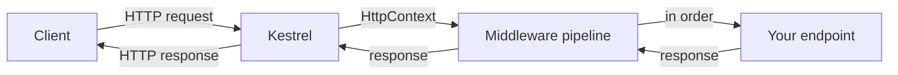

# What Kestrel & the Pipeline Are

When you write `app.MapGet("/", () => "hi")` and a browser gets your text back, a surprising amount of
machinery ran before your lambda did. Someone opened a socket. Someone read raw bytes off the wire and
turned them into a request you could work with. Something carried that request through a chain of steps
and finally handed it to your handler. This guide opens that box.

This is the **roots** guide for [ASP.NET Core From Zero](/guides/aspnet-core-from-zero). Up there you
learn to *use* the framework; down here you learn what's underneath `MapGet`. It's the .NET parallel to
the Go [net/http roots guide](/guides/web-services-with-only-net-http) — same goal, different ecosystem:
make the foundation visible so the conveniences stop being magic.

> 📝 This is a roots guide. It assumes you know basic HTTP — methods, status codes, headers (see
> [HTTP, Explained](/guides/http-explained)) — and it lands best *after* you've built something with
> [ASP.NET Core](/guides/aspnet-core-from-zero), so the pieces have somewhere to attach. If you've never
> touched the framework, skim it now and come back; it'll click harder the second time.

## The mental model: three pieces, one sentence

Before any detail, get the shape in your head. Everything in ASP.NET Core's request handling is **three
moving parts**, and you can hold all of them in a single sentence:

💡 **Kestrel listens, the pipeline processes, the host wires it together.**

Carry that and every line in `Program.cs` has an obvious home. A request comes in off the network, Kestrel
turns it into something your code can read, the pipeline walks it through an ordered set of steps, your
endpoint produces a response, and the response flows back out the same pipeline to Kestrel and onto the
wire.



*What just happened:* the client sends an HTTP request; **Kestrel** accepts the connection and packages
the request as an `HttpContext` (a tidy object holding the request, the response-in-progress, and shared
state). It hands that to the **pipeline**, an ordered chain of steps the request flows through. The last
step is **your endpoint**, which writes the response — and that response travels *back* through the same
chain on its way out. Notice the response retraces its steps: that round-trip is why middleware can act
both before and after your handler, which we'll lean on hard in later phases.

## The three pieces, one at a time

📝 **Kestrel** is the cross-platform web server built into ASP.NET Core. It's the part that actually opens
a socket, listens for connections, speaks the HTTP protocol, and reads raw bytes into an `HttpContext` it
can hand to your app. Every .NET web app has a real web server inside it — and it's Kestrel.

📝 **The middleware pipeline** is an ordered chain of functions that every request flows through. Each
function in the chain can inspect or change the request, decide whether to call the next function, and act
on the response on the way back out. Your endpoint sits at the *end* of that chain — it's the last thing
the request reaches.

📝 **The host** is the object that builds and runs everything. On startup it reads configuration (env
vars, `appsettings.json`, command-line args), sets up the dependency-injection container and logging, then
constructs the pipeline and starts Kestrel listening. It's the assembler that puts the other two pieces
together and presses start.

## Where these live in Program.cs

Here's the payoff. That familiar handful of lines at the top of every ASP.NET Core app isn't a magic
incantation — each line is *one of the three pieces*. Read it again with the model in hand:

```csharp
var builder = WebApplication.CreateBuilder(args);   // the host (config + DI)
var app = builder.Build();
app.Use(async (ctx, next) => { await next(ctx); }); // pipeline middleware
app.MapGet("/", () => "hi");                          // an endpoint (end of the pipeline)
app.Run();                                            // starts Kestrel listening
```

*What just happened:* line by line against the three pieces —

- `WebApplication.CreateBuilder(args)` builds the **host**. This is where configuration sources get read
  and the DI container and logging get set up. The `builder.Build()` that follows finalizes it into a
  runnable `app`.
- `app.Use(...)` adds a step to the **pipeline**. The lambda gets the current `HttpContext` (`ctx`) and a
  `next` it can call to pass control down the chain. This one does nothing but forward — a placeholder for
  the real middleware you'll meet in Phase 3.
- `app.MapGet("/", () => "hi")` registers an **endpoint** — the end of the pipeline, the code that
  actually produces a response for `GET /`.
- `app.Run()` starts **Kestrel**. It binds to a port, begins the accept-loop, and blocks here, serving
  requests until the process is told to stop.

So the whole startup reads as one motion: *build the host, describe the pipeline, name your endpoints,
then let Kestrel listen.* Host, pipeline, server — in that order, every time.

> ⚠️ Don't confuse `app.Use` with `app.Run` here. `app.Use(...)` adds middleware to the pipeline;
> `app.Run()` (no lambda, called last) starts the server. There *is* also an `app.Run(handler)` overload
> that adds a terminal middleware — same name, different job — which is a classic early stumble. Phase 3
> untangles `Use`, `Run`, and `Map` properly; for now, just register that the bare `app.Run()` on the
> final line is "start Kestrel."

## What to expect from here

Be honest with yourself about what this guide is: it's **conceptual plumbing**. None of it changes what
your endpoints return — it explains the machine they run inside. That's exactly why it pays off most
*after* you've felt the framework's conveniences and started wondering what's beneath them. If "Kestrel
listens, the pipeline processes, the host wires it together" already gives those conveniences a place to
sit, the rest of this guide is just zooming in on each piece.

And that's the plan. Each of the three pieces gets its own phase: Kestrel the web server next, then the
middleware pipeline, then the `RequestDelegate` that middleware really is, then the host with its DI
container and configuration — and finally how minimal APIs and MVC are thin conveniences sitting on top of
all of it.

## Recap

1. Underneath `app.MapGet(...)` sit three pieces, captured in one sentence: **Kestrel listens, the
   pipeline processes, the host wires it together.**
2. **Kestrel** is the cross-platform web server built into ASP.NET Core — it opens the socket, speaks
   HTTP, and hands each request to your app as an `HttpContext`.
3. **The middleware pipeline** is an ordered chain of functions; each can act on the request, call the
   next, and act on the response on the way back out. Your endpoint is the end of the chain.
4. **The host** reads configuration, sets up the DI container and logging, builds the pipeline, and starts
   Kestrel.
5. `Program.cs` maps cleanly onto the three: `CreateBuilder(args)` = host, `app.Use(...)` = pipeline,
   `app.MapGet(...)` = endpoint, `app.Run()` = start Kestrel.
6. This is conceptual plumbing — most rewarding after you've used ASP.NET Core. Each piece gets its own
   phase from here.

## Quick check

Three questions on the model that has to stick before Phase 2:

```quiz
[
  {
    "q": "In one sentence, what is the ASP.NET Core mental model?",
    "choices": [
      "Kestrel listens, the pipeline processes, the host wires it together",
      "The host listens, Kestrel processes, the pipeline configures everything",
      "MVC routes the request and Kestrel writes the JSON response",
      "The pipeline opens the socket and the endpoint starts the server"
    ],
    "answer": 0,
    "explain": "Kestrel is the web server that listens and produces an HttpContext; the middleware pipeline is the ordered chain each request flows through; the host reads config, sets up DI, builds the pipeline, and starts Kestrel. Those three roles are the whole machine."
  },
  {
    "q": "What does Kestrel do in an ASP.NET Core app?",
    "choices": [
      "It listens on a socket, speaks HTTP, and hands each request to the app as an HttpContext",
      "It reads appsettings.json and configures the dependency-injection container",
      "It is the ordered chain of functions every request flows through",
      "It is the lambda you register with app.MapGet"
    ],
    "answer": 0,
    "explain": "Kestrel is the cross-platform web server built into ASP.NET Core. It accepts connections, reads raw bytes into an HttpContext, and hands that to the pipeline. Reading config and setting up DI is the host's job; the chain of functions is the pipeline."
  },
  {
    "q": "In Program.cs, which line starts Kestrel listening?",
    "choices": [
      "app.Run()",
      "WebApplication.CreateBuilder(args)",
      "app.Use(async (ctx, next) => { await next(ctx); })",
      "app.MapGet(\"/\", () => \"hi\")"
    ],
    "answer": 0,
    "explain": "The bare app.Run() on the final line starts the server — it binds a port, runs the accept-loop, and blocks. CreateBuilder builds the host, app.Use adds pipeline middleware, and app.MapGet registers an endpoint at the end of the pipeline."
  }
]
```

---

[Guide overview](_guide.md) · [Phase 2: Kestrel: The Web Server →](02-kestrel-the-web-server.md)
