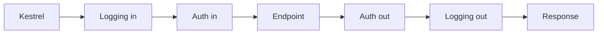

# The Middleware Pipeline

In Phase 2 we left Kestrel holding a fully-formed request, ready to hand it off. This is where it hands it off *to*.

**The pipeline is an ordered chain of middleware, and a request flows through it like an onion.** Each middleware gets the request on the way *in*, does some work, then calls `next` to pass control deeper. Eventually something at the center produces a response, and that response unwinds back *out* through every layer in reverse — each middleware getting a second turn on the way up. Kestrel feeds requests into the top of this onion; what comes back out is what the client sees.

That "in, then back out" shape is the thing to hold. A middleware isn't a one-shot handler that runs and disappears — it *wraps* everything registered after it. The first one you add is the outermost skin; the last is closest to the core.



> 💡 The onion isn't a teaching metaphor the framework bolted on — under the hood it really is a stack of nested function calls, each holding a reference to the next as a `RequestDelegate`. We stay at the using-it level here; Phase 4 cracks one open to show you that function.

## The three building blocks: `Use`, `Run`, `Map`

You assemble the pipeline in `Program.cs` by adding middleware to your `WebApplication` (the `app` variable). There are three verbs that do almost all the work.

**`app.Use`** adds a middleware that *may* call the next one. It receives the request `context` and a `next` delegate. You do work, `await next(context)` to run the rest of the pipeline, then do more work after it returns. Both edges of the onion in one lambda.

**`app.Run`** adds a *terminal* middleware. It takes only `context` — no `next` — because it's the end of the line. Whatever it writes becomes the response, and nothing after it runs.

Here's a tiny but complete pipeline: a logging `Use` wrapping a terminal `Run`.

```csharp
var builder = WebApplication.CreateBuilder(args);
var app = builder.Build();

app.Use(async (context, next) =>
{
    app.Logger.LogInformation("--> {Method} {Path}", context.Request.Method, context.Request.Path);
    await next(context);                          // run everything below us
    app.Logger.LogInformation("<-- {Status}", context.Response.StatusCode);
});

app.Run(async context =>
{
    await context.Response.WriteAsync("Hello from the bottom of the pipeline.");
});

app.Run();   // note: this Run() starts the host — different from app.Run(handler) above
```

*What just happened:* one request enters the logging middleware. The first log line fires on the way *in*. Then `await next(context)` hands control to the terminal `Run`, which writes the body — that *is* the center of the onion. Control comes back up to the logging middleware, the second log line fires on the way *out* (now that we know the status code), and the response leaves. One `Use` straddling both edges, one `Run` producing the response. (Watch the two meanings of `Run`: `app.Run(handler)` adds terminal middleware; the bare `app.Run()` on the last line is the host-start call from Phase 1. Same name, different jobs.)

**`app.Map`** branches the pipeline by request path. Anything matching the prefix peels off into its own sub-pipeline:

```csharp
app.Map("/admin", admin =>
{
    admin.Run(async context =>
        await context.Response.WriteAsync("Admin area"));
});
```

*What just happened:* requests starting with `/admin` enter the branch and run only what's configured inside it; everything else flows straight past, untouched. When you need to branch on something *other* than a path — a header, a query value, whether the request is HTTPS — reach for **`app.MapWhen(predicate, branch)`** (a fully separate branch) or **`app.UseWhen(predicate, branch)`** (runs the branch, then rejoins the main pipeline if it didn't short-circuit). `Map` is for "this whole slice of the app behaves differently."

## ⚠️ Order matters — a lot

This is where people get burned, so slow down here. **Middleware runs in the exact order you add it.** The first registration is the outermost layer; the last is nearest the endpoint. Swap two lines and you can silently break security or error handling — no exception, no warning, just wrong behavior.

The other half of that rule is **short-circuiting**: a middleware that calls `next` is a pass-through, but a middleware that **doesn't** call `next` ends the request right there and sends whatever response it has. That's not a bug — it's a primary tool. It's exactly how authentication rejects a bad request before the endpoint wastes a cycle on it, and how static-files serves a `.css` file and stops, never bothering routing or auth at all.

```csharp
app.Use(async (context, next) =>
{
    if (!context.Request.Headers.ContainsKey("X-Api-Key"))
    {
        context.Response.StatusCode = 401;
        await context.Response.WriteAsync("Missing API key.");
        return;                                  // <-- no next(): the pipeline stops here
    }

    await next(context);                          // key present — let it flow inward
});

app.Run(async context => await context.Response.WriteAsync("Protected payload."));
```

*What just happened:* when the header is missing we set a 401, write a message, and `return` without ever calling `next`. The request never reaches the terminal `Run` below — it short-circuited at the outer layer. When the header is present, `await next(context)` lets it continue. That fork, "reject now or pass it down," is the entire job of auth, caching, and rate-limiting middleware, just with real tokens instead of a header check. And it only works because this middleware sits *before* the thing it's protecting. Order is the law.

## Built-in middleware is packaged pipeline pieces

You rarely hand-write the security and routing layers — the framework ships them as `Use*` extension methods, each one a pre-built chunk of pipeline you drop in by calling it. `UseRouting` matches the request to an endpoint. `UseAuthentication` figures out *who* the caller is. `UseAuthorization` decides whether that who is *allowed*. `UseStaticFiles` serves files (and short-circuits when it finds one). `UseExceptionHandler` wraps everything below it to catch what they throw.

Because they're just middleware, the ordering law applies to them too — and their relative order isn't negotiable:

```csharp
app.UseExceptionHandler("/error");   // outermost — only an outer layer can catch inner errors
app.UseStaticFiles();                // serve a file and stop, before routing/auth even run
app.UseRouting();                    // decide WHICH endpoint matches
app.UseAuthentication();             // WHO is this? (reads tokens/cookies)
app.UseAuthorization();              // is this WHO allowed to hit that endpoint?

app.MapGet("/products", () => Results.Ok("listing products"));   // endpoints last
```

*What just happened:* each line is a packaged piece of the onion, and the sequence encodes real dependencies. The exception handler goes first so it surrounds everything. `UseRouting` runs before the auth pair because authorization can't read an endpoint's permission rules until routing has picked the endpoint. `UseAuthentication` always precedes `UseAuthorization` — you must know *who* before you can check *what they're allowed*. Endpoints come last, after auth has had its say. Move `UseAuthorization` below the `MapGet` and the endpoint runs before anyone checks permissions; your `[Authorize]` rules quietly do nothing.

> 📝 This is the **same pipeline** you used in [ASP.NET Core From Zero](/guides/aspnet-core-from-zero) — same `Use`/`Run`/`Map`, same ordering law. There you wired it up to build features; here you're looking at the mechanism itself. Phase 4 goes one level deeper and shows what a middleware *actually is* underneath: a `RequestDelegate` — a function that wraps the next function.

## Recap

- The pipeline is an **ordered onion of middleware**: Kestrel feeds the top, each layer runs on the way *in*, calls `next` to go deeper, and runs again on the way *out*.
- **`app.Use`** may call `next` to continue; **`app.Run`** is terminal and never calls `next`; **`app.Map`/`MapWhen`/`UseWhen`** branch the pipeline by path or condition.
- **Order is the law** — middleware runs in registration order, and getting it wrong fails silently rather than loudly.
- **Not calling `next` short-circuits** the request: it gets a response immediately and never reaches the endpoint. That's how auth rejects and static-files serves early.
- Built-in middleware (`UseRouting`, `UseAuthentication`, `UseAuthorization`, `UseStaticFiles`, `UseExceptionHandler`) are **packaged pipeline pieces**, and their relative order carries real dependencies.

## Quick check

```quiz
[
  {
    "q": "What is the difference between app.Use and app.Run?",
    "choices": [
      "Use is for GET requests; Run is for POST requests",
      "Use may call next to continue the pipeline; Run is terminal and never calls next",
      "Use runs in development; Run runs in production",
      "There is no difference — they are aliases"
    ],
    "answer": 1,
    "explain": "Use receives a next delegate and can pass control deeper; Run takes only context, ends the chain, and always produces the response itself."
  },
  {
    "q": "A middleware sets a 401 and returns WITHOUT calling next. What happens to the request?",
    "choices": [
      "It still reaches the endpoint, which overrides the 401",
      "ASP.NET Core throws because next is required",
      "The pipeline short-circuits — the 401 is sent and inner middleware/endpoints never run",
      "The request restarts from the top of the pipeline"
    ],
    "answer": 2,
    "explain": "Not calling next short-circuits the pipeline: the response is sent immediately and nothing registered after it runs. This is exactly how auth rejects early."
  },
  {
    "q": "Why must UseRouting be registered before UseAuthorization?",
    "choices": [
      "Alphabetical order is required by the compiler",
      "Authorization needs the matched endpoint to read its permission rules, and routing is what matches it",
      "Routing only works after authorization has run",
      "It doesn't matter — order is ignored for built-in middleware"
    ],
    "answer": 1,
    "explain": "Routing selects which endpoint the request hit; authorization then reads that endpoint's [Authorize] rules. Without routing first, there's no endpoint to authorize against."
  }
]
```

[← Phase 2: Kestrel: The Web Server](02-kestrel-the-web-server.md) · [Guide overview](_guide.md) · [Phase 4: The RequestDelegate →](04-the-request-delegate.md)