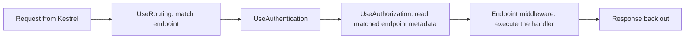

# How Minimal APIs & MVC Sit on Top

The whole payoff of this guide in one sentence: **your handlers - minimal API delegates and MVC action methods alike - are *endpoints*, and the pipeline's entire job is to route a request to one endpoint and run it.** Everything you learned the framework "does for you" is plumbing you've now seen from the inside. `MapGet` doesn't do anything mystical; it adds an endpoint to a table. The pipeline you studied in the last phases is what finds that endpoint and executes it.

For the last five phases we've been building from the metal up: Kestrel listens on the socket, a chain of `RequestDelegate`s processes each request, and the host wires up DI and configuration. This phase closes the loop by showing where *your* code - the `MapGet` lambdas and `[ApiController]` classes you write every day - plugs into that machine. They're not a separate world bolted on top. They're the last stop on the same pipeline.

> 📝 This phase is the bridge back to everyday ASP.NET Core. If you've used minimal APIs from [ASP.NET Core From Zero](/guides/aspnet-core-from-zero), you already *use* endpoints - here you'll see what an endpoint actually *is* and why middleware ordering shakes out the way it does.

## Endpoint routing: match, then execute

The thing that trips people up is that routing in ASP.NET Core is **two pipeline stages, not one**, and they sit at opposite ends of the pipeline. Hold that and the rest is obvious.

The first stage is **`UseRouting`**. It runs early. Its job is to look at the incoming request - method and path - and **match** it against the registered endpoints, picking which handler *will* run. It does not run your code. It just decides "this request belongs to the `GET /products` endpoint" and stashes that decision (plus the endpoint's metadata, like any `[Authorize]` attribute) on the `HttpContext` so later middleware can read it.

The second stage is the **endpoint middleware** at the very *end* of the pipeline (added by `UseEndpoints` in older setups, or implicitly for you in modern minimal hosting). Its job is to **execute** the endpoint that `UseRouting` matched - bind parameters, run your delegate or action, and write the response.

```csharp
var app = builder.Build();

app.UseRouting();        // STAGE 1: match - which endpoint will run?
app.UseAuthorization();  // in between: now we KNOW the endpoint, so we can check its [Authorize]
// ... endpoint execution happens at the end (added implicitly) - STAGE 2: run it

app.MapGet("/products", () => "all products");

app.Run();
```

*What just happened:* `UseRouting` matches the request to the `GET /products` endpoint near the front of the pipeline, but the endpoint isn't actually *run* until the terminal stage at the back. Between those two points, the request is still flowing through middleware - and that gap is where the next piece clicks into place.

> ⚠️ This is *the* reason `UseAuthorization` goes **between** `UseRouting` and the endpoint, and getting that order wrong is a classic bug. Authorization needs to know *which* endpoint was matched - and read its `[Authorize]` metadata - before it can decide whether to let the request through. Put `UseAuthorization` before `UseRouting` and there's no matched endpoint yet, so it has nothing to check. The match-then-execute split is what makes the ordering rule make sense instead of being a magic incantation you memorize.

Here's the flow end to end:



*What just happened:* The diagram makes the split visual. Matching happens up front (B), the matched endpoint's metadata is available to the auth middleware in the middle (D), and the actual handler doesn't run until the end (E). One pipeline, two routing stages, your code at the tail.

## Minimal APIs: `MapGet` registers an endpoint

Now map this onto code you've written. When you call `app.MapGet("/products", handler)`, you are doing exactly one thing: **adding an endpoint to the routing table**, whose handler is your delegate. That's it. `MapGet` is "register an endpoint." `UseRouting` later matches a request to it, and the endpoint middleware later runs your delegate as the pipeline's terminal stage.

```csharp
app.MapGet("/products/{id:int}", (int id) =>
{
    return Results.Ok(new { id, name = "Keyboard" });
});
```

*What just happened:* This line adds one endpoint to the table. Everything that feels automatic - the framework reading `id` out of the path and handing it to your lambda, and `Results.Ok(...)` turning into a `200` with a JSON body - are **conveniences the framework wraps around writing to `HttpContext` directly**. Parameter binding is the framework inspecting your delegate's parameters and filling them from the request. `IResult`/`Results` is a tidy object that knows how to write itself to the response. Strip the conveniences away and the endpoint is doing what any terminal middleware does: reading the request and writing the response. The request reaches your delegate as the *end* of the pipeline you've been studying.

> 💡 If the binding and `Results` mechanics feel hazy, that's the consumer's view - and it's covered hands-on in [ASP.NET Core From Zero](/guides/aspnet-core-from-zero). This guide's contribution is showing you the seam underneath: a `Map*` call is a table entry, and the table is consulted by `UseRouting`.

## MVC controllers: also endpoints, same system

Controllers feel like a different beast - classes, attributes, conventions - but on the pipeline they are **the same thing**: endpoints in the same routing system. You opt in with two lines:

```csharp
builder.Services.AddControllers();   // register the services controllers need
// ...
app.MapControllers();                // discover controllers, add them as endpoints
```

*What just happened:* `AddControllers()` registers the MVC services into the DI container you met in Phase 5. `MapControllers()` tells the framework to **discover your controller classes** and add each action as an endpoint in the *same* routing table that `MapGet` writes to. At request time, `UseRouting` matches the request to a controller-action endpoint just like any other, and the endpoint middleware runs it - doing **model binding, running filters, and invoking the matched action method**. The extra ceremony (filters, conventions, `[ApiController]` behaviors) is work the endpoint does when it executes; it's not a separate pipeline.

Because they share one routing system, minimal APIs and MVC **coexist on a single pipeline** without conflict:

```csharp
app.MapControllers();                       // controller endpoints
app.MapGet("/health", () => "ok");          // a minimal API endpoint, same table

app.Run();
```

*What just happened:* `MapControllers` and `MapGet` both add entries to the same endpoint table, so a request can route to a controller action or a minimal API delegate depending on what matches. They're two ways to describe an endpoint, not two competing frameworks. You can adopt minimal APIs incrementally in an MVC app, or sprinkle a controller into a minimal-API app, precisely because there's only one routing system underneath.

## Why minimal hosting hides all this - and why you should still know it

In modern ASP.NET Core, `WebApplication` (the thing `builder.Build()` returns) is helpful to a fault: it adds **`UseRouting` and the endpoint-execution stage for you** automatically, so most apps never call `UseRouting`/`UseEndpoints` explicitly. You write `MapGet` and `MapControllers`, never touch routing setup, and it works.

```csharp
var app = builder.Build();

app.UseAuthentication();
app.UseAuthorization();   // works correctly - routing is wired implicitly around it
app.MapControllers();

app.Run();
```

*What just happened:* There's no `UseRouting` line here, yet `UseAuthorization` still lands between matching and execution and behaves correctly. `WebApplication` placed the routing stage at the front and the endpoint stage at the back on your behalf, slotting your explicit middleware into the gap. Convenient - but invisible.

> 💡 Knowing the split is still worth it, because **the split is what explains middleware order**. The day you wonder "why does auth go after `UseRouting`?" or "why doesn't my middleware see which endpoint matched?", the answer is the two-stage model: match up front, execute at the back, metadata available in between. The framework hid the wiring, not the rules.

## Recap

- **Your handlers are endpoints.** Minimal API delegates and MVC actions are both endpoints; the pipeline's job is to route to one and run it.
- **Endpoint routing is two stages.** `UseRouting` *matches* the request to an endpoint (and exposes its metadata) near the front; the endpoint middleware *executes* it at the very end of the pipeline.
- **That split explains ordering.** `UseAuthorization` sits between them because it must read the matched endpoint's `[Authorize]` metadata before deciding - there's no endpoint to check before `UseRouting` runs.
- **`MapGet` adds an endpoint to the table.** Parameter binding and `Results`/`IResult` are conveniences over writing to `HttpContext`; the request reaches your delegate as the pipeline's terminal stage.
- **Controllers are endpoints too.** `AddControllers` + `MapControllers` discover controller classes and run binding/filters/the action as endpoints in the same routing system - so minimal APIs and MVC coexist on one pipeline.
- **Minimal hosting wires routing implicitly.** `WebApplication` adds `UseRouting`/endpoint execution for you, so you rarely call them - but the two-stage model is still what governs middleware order.

## Quick check

```quiz
[
  {
    "q": "Why does UseAuthorization need to sit between UseRouting and the endpoint execution stage?",
    "choices": ["Authorization is slow, so it runs in the middle to balance the pipeline", "UseRouting matches the endpoint and exposes its metadata, so UseAuthorization can read the endpoint's [Authorize] attribute before deciding", "It is purely a style convention with no functional reason", "UseAuthorization must run before any endpoint is matched so it can match faster"],
    "answer": 1,
    "explain": "Routing is split into match (UseRouting) and execute (endpoint middleware). Authorization needs the matched endpoint's metadata, which only exists after UseRouting runs - so it goes in between."
  },
  {
    "q": "On the pipeline, what does app.MapGet(\"/products\", handler) actually do?",
    "choices": ["It runs the handler immediately when the line executes", "It registers an endpoint in the routing table; the request reaches the handler as the terminal stage of the pipeline", "It adds a new piece of middleware that runs on every request", "It starts Kestrel listening on the /products path"],
    "answer": 1,
    "explain": "MapGet adds an endpoint to the table. UseRouting later matches a request to it, and the endpoint middleware runs your delegate as the pipeline's final stage. Binding and Results are conveniences over HttpContext."
  },
  {
    "q": "How do MVC controllers relate to minimal API endpoints on the pipeline?",
    "choices": ["Controllers run on a completely separate pipeline from minimal APIs", "Controllers bypass routing and are invoked directly by Kestrel", "AddControllers + MapControllers register controller actions as endpoints in the same routing system, so they coexist with minimal APIs on one pipeline", "Controllers must be converted to minimal APIs before they can run"],
    "answer": 2,
    "explain": "MapControllers discovers controller classes and adds their actions as endpoints in the same routing table MapGet writes to. They are the same kind of thing - endpoints - and share one pipeline."
  }
]
```

[← Phase 5: The Host, DI & Configuration](05-host-di-configuration.md) · [Guide overview](_guide.md) · [Phase 7: Where to Go Next →](07-where-to-go-next.md)
