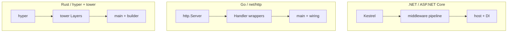

# Where to Go Next

Stop for a second and notice what changed. When you started this guide, a `Program.cs` was a wall of incantations — `builder.Services.Add...`, `app.Use...`, `app.MapGet(...)` — that you copied from a template and hoped worked. Now you can read it line by line and name every piece.

There's the **host**: the object that reads configuration, builds the dependency-injection container, sets up logging, and starts everything. There's the **middleware pipeline**: an ordered chain of `RequestDelegate`s, each one a function that can do work, call the next, and act again on the way back out. There's **endpoint routing**, which is where your minimal API handler or your MVC controller action actually plugs in. And underneath it all there's **Kestrel**, the web server that opens the socket and speaks HTTP. Four pieces. That's the machine.

> 📝 The throughline you should be able to recite without looking: **Kestrel listens, a pipeline of `RequestDelegate`s processes each request, and the host wires up DI, configuration, and the server.** Every `app.Use(...)` and every `builder.Services...` line now has an obvious home.

## What this actually unlocks

This isn't trivia. The pieces you learned are exactly the pieces that bite people in production, and now they'll make sense the moment you hit them.

- **Middleware ordering bugs.** When your authentication runs *after* something that needs the user, or your exception handler sits too low to catch the error, you won't be guessing — you know the pipeline is ordered and each `Use` wraps the next.
- **Auth placement.** `UseAuthentication` then `UseAuthorization`, before your endpoints, after routing. That ordering stops being a memorized spell and becomes "of course — you have to know *who* before you can decide *what they're allowed to do*, and both have to happen before the endpoint runs."
- **Service lifetimes.** "Why is this scoped service blowing up inside a singleton?" makes sense now, because you know what the container is and what a scope means per request.
- **Custom middleware.** You can write your own — a function that wraps the next one — instead of treating middleware as a closed box only the framework gets to open.

The framework stopped being a pile of conventions. It's a small, legible machine, and you can see all of it.

## Performance, now that you can see the cost

Here's a useful side effect of understanding the pipeline: you understand where time goes.

**Kestrel is fast** — among the fastest managed web servers anywhere, and it is not the bottleneck in almost any real app. Your database call is. Your external API is. So the performance advice that actually matters is about respecting the machine you now understand:

- **Keep the pipeline lean.** Every middleware in the chain runs on *every single request*. A middleware you added "just in case" is a tax paid millions of times. If it doesn't earn its place, take it out.
- **Go `async` end to end.** Kestrel's whole model is non-blocking I/O. A synchronous `.Result` or `.Wait()` on a hot path ties up a thread and quietly strangles throughput. Let `await` flow all the way down.
- **Watch allocations on hot paths.** Garbage you create per request is garbage the GC collects per request. On a busy endpoint, that adds up — this is where the profiler, not the guess, earns its keep.

💡 The honest version: don't micro-optimize until you've measured. But *because* you now know the pipeline runs per request and Kestrel is async underneath, you'll write code that's fast by default instead of fast by accident.

## The ecosystem worth knowing

The same host-and-pipeline machine has a few more rooms you'll want to walk into. You don't need them today — but when you do, you'll recognize them as the same building.

- **`IHostedService` / `BackgroundService`.** Work that isn't a request — a queue consumer, a scheduled job, a cache warmer. The host starts and stops these alongside Kestrel. Subclass `BackgroundService`, override `ExecuteAsync`, and you have a clean long-running task with graceful shutdown handled for you.
- **Health checks** (`AddHealthChecks` / `MapHealthChecks`). A built-in endpoint your load balancer or orchestrator can poll to ask "is this app alive and ready?" It's just another endpoint on the routing you already understand.
- **OpenTelemetry.** Tracing and metrics, wired into the host. Once you can trace a request through the pipeline in your head, distributed tracing across services is the same idea, exported.
- **YARP** — Microsoft's reverse proxy, built on *this exact stack*. It's an ASP.NET Core app whose job is forwarding requests. Knowing the pipeline means you can read and configure it.
- **Output caching and rate limiting.** Both ship as built-in middleware. They're `Use`-style entries in the pipeline you now know how to order.

Here's a small `BackgroundService` to make it concrete:

```csharp
public class Heartbeat : BackgroundService
{
    private readonly ILogger<Heartbeat> _log;

    public Heartbeat(ILogger<Heartbeat> log) => _log = log;

    protected override async Task ExecuteAsync(CancellationToken stoppingToken)
    {
        while (!stoppingToken.IsCancellationRequested)
        {
            _log.LogInformation("still alive at {Time}", DateTimeOffset.Now);
            await Task.Delay(TimeSpan.FromSeconds(30), stoppingToken);
        }
    }
}

// in Program.cs
builder.Services.AddHostedService<Heartbeat>();
```

Notice what you can already read here: it takes a logger from the **DI container**, the **host** starts it, and `stoppingToken` is graceful shutdown handing you the signal to stop. Same machine, different room.

## The same shape, in every language

The most valuable thing you can carry out of this guide is the pattern, not the API surface. What you learned isn't really "ASP.NET Core" — it's how *web stacks* are built. Every serious one is the same three things: a **server** that listens, a **pipeline** that processes, and a **host** that wires it together.



Read across the rows and it's the same skeleton:

- **The server.** Kestrel ↔ Go's [`http.Server`](/guides/web-services-with-only-net-http) ↔ Rust's [hyper](/guides/hyper-and-tower). Something opens the socket and speaks HTTP.
- **The pipeline.** ASP.NET's `RequestDelegate` chain ↔ Go's `func(http.Handler) http.Handler` wrappers ↔ tower's `Layer`s. A function that wraps the next one, runs before and after, and can short-circuit. Identical idea, three syntaxes.
- **The host / wiring.** The .NET host with its DI container ↔ Go's `main` that constructs and injects by hand ↔ a Rust app's builder. Something assembles the dependencies and starts the server.

You learned one of these deeply. That means you can now open the [Go net/http roots guide](/guides/web-services-with-only-net-http) or the [hyper & tower guide](/guides/hyper-and-tower) and read them as *the same story in a different accent*. The "magic" was always a server, a pipeline, and a host.

## What to do this week

Don't let this stay theory. Three small moves will turn "I read about it" into "I can do it":

1. **Trace one real request.** Open your own app's `Program.cs` and follow a single request all the way through: host builds it → request hits Kestrel → flows through each middleware in order → routing matches → your endpoint runs → the response flows back out through the pipeline. Do it once on paper. It cements everything.
2. **Write a custom middleware.** Something tiny — log the path and how long the request took. You'll feel the "before, call next, after" shape in your hands instead of in the abstract.
3. **Add a `BackgroundService`.** Copy the heartbeat above, watch the host start it on launch and stop it cleanly on shutdown. That's the whole lifecycle, made visible.

If you want to deepen the surface you build on top, go back to [ASP.NET Core From Zero](/guides/aspnet-core-from-zero) — every convenience in it will now read differently, because you can see the plumbing underneath.

You came in seeing a wall of magic. You're leaving able to read it. **Kestrel listens, a pipeline of `RequestDelegate`s processes each request, and the host wires it all together** — that's every .NET web app, and now it's visible to you.

## Recap

1. **You can read any `Program.cs` now.** Host (config + DI + logging), the middleware pipeline of `RequestDelegate`s, endpoint routing, and Kestrel underneath — four pieces, one legible machine.
2. **The hard bugs make sense.** Middleware ordering, auth placement, service lifetimes, and writing your own middleware all follow directly from knowing the pipeline is an ordered chain and the host owns the container.
3. **Performance is about respecting the machine.** Kestrel is among the fastest managed servers; keep the pipeline lean (it runs per request), go `async` end to end, and watch allocations on hot paths — and measure before optimizing.
4. **The ecosystem is the same building.** `BackgroundService` for non-request work, health checks and output caching and rate limiting as built-in pieces, OpenTelemetry for tracing, and YARP as a proxy built on this exact stack.
5. **Every web stack is server + pipeline + host.** This is the .NET version of [Go's net/http](/guides/web-services-with-only-net-http) and [Rust's hyper/tower](/guides/hyper-and-tower) — learn the shape once and you can read all of them.

## Quick check

Last three — the throughline that should stick:

```quiz
[
  {
    "q": "Why does keeping the middleware pipeline lean matter for performance?",
    "choices": [
      "Every middleware in the chain runs on every single request, so an unused one is a cost paid millions of times",
      "Middleware only runs at startup, so fewer of them means a faster boot",
      "The host removes unused middleware automatically, so it never matters",
      "Middleware runs on a background thread and never affects request latency"
    ],
    "answer": 0,
    "explain": "The pipeline is an ordered chain executed per request. Each middleware you add is work done on every request, so anything that doesn't earn its place is a tax paid at scale."
  },
  {
    "q": "What is a BackgroundService in the host-and-pipeline picture?",
    "choices": [
      "Work that isn't tied to a request — the host starts and stops it alongside Kestrel, with graceful shutdown handled for you",
      "A faster replacement for Kestrel that handles requests in the background",
      "A piece of middleware that runs after the endpoint",
      "A second DI container used only for HTTP requests"
    ],
    "answer": 0,
    "explain": "BackgroundService is for long-running, non-request work (queue consumers, scheduled jobs). The host manages its lifecycle next to the web server, and the stopping token gives you clean shutdown."
  },
  {
    "q": "What is the cross-language parallel you should carry out of this guide?",
    "choices": [
      "Every web stack is a server + a pipeline + a host: Kestrel/pipeline/host maps to Go's http.Server/handler-wrappers/main and Rust's hyper/tower-layers/builder",
      "ASP.NET Core is unique and shares no structure with Go or Rust web stacks",
      "Only Kestrel uses a middleware pipeline; net/http and hyper have nothing comparable",
      "The host is a .NET-only concept with no equivalent in other ecosystems"
    ],
    "answer": 0,
    "explain": "The shape is universal. A server listens, a pipeline of wrap-the-next functions processes each request, and a host wires up dependencies. Learn it once and you can read net/http and hyper/tower as the same story in a different accent."
  }
]
```

---

[← Phase 6: How Minimal APIs & MVC Sit on Top](06-how-minimal-apis-and-mvc-sit-on-top.md) · [Guide overview](_guide.md)
