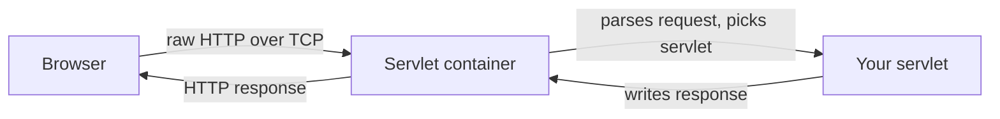

# What a Servlet Is

Every Java web app you'll ever touch — Spring Boot, an old-school JSP site, a JAX-RS REST API, the
internal tool nobody remembers writing — is standing on the same foundation. Dig under the annotations and
the auto-configuration and the dependency injection, and you eventually hit a plain Java object whose whole
job is: take an HTTP request, hand back an HTTP response. That object is a **servlet**, and this guide is
about the bedrock it sits on.

This is the roots guide. You'll rarely write one of these by hand at work — frameworks exist precisely so
you don't have to — but every framework is a convenience layer over the thing you're about to meet. Learn
the foundation and the layers stop being magic.

## The foundation: what a servlet actually is

Let's name the thing before we do anything with it.

📝 **Servlet** — a Java object that handles an HTTP request and produces an HTTP response. It's the base
unit of server-side Java web programming, defined by the **Servlet API** (the package `jakarta.servlet.*`,
called `javax.servlet.*` in older code — same idea, renamed when Java EE became Jakarta EE). A servlet has
a couple of methods on it; you fill them in; something calls them when a request arrives.

That's genuinely the whole concept. A servlet is not a server, not a framework, not a protocol — it's *one
object that answers requests*. The reason it matters out of all proportion to how small it is: **every Java
web framework runs on servlets.** Spring MVC, Jakarta Faces, JAX-RS, Struts — pick any of them, scrape off
the surface, and there's a servlet underneath doing the actual request-handling. So this isn't a museum
piece. It's the layer the entire ecosystem is built on, and understanding it is what makes the rest
legible.

> 💡 **Key point.** A servlet is the smallest unit of "code that answers HTTP" in Java. Frameworks are
> elaborate, helpful ways of arranging servlets. When something in Spring feels like sorcery, the honest
> answer is almost always "a servlet is doing it."

## The container runs it — you don't

Here's the part that trips people up first: you never start a servlet yourself. There's no `main` method
that boots it up, no line where you call your own servlet. Something else owns that job.

📝 **Servlet container** (also called a **servlet engine** or **web container**) — a program that accepts
incoming TCP connections, parses the raw HTTP, figures out which servlet should handle the request, calls
your servlet's method, and sends your response back over the wire. Tomcat, Jetty, and Undertow are the
common ones. The container is the thing that's actually *running*; your servlet is a guest it invites in
when a request shows up.

Picture the division of labor:



*What just happened:* the browser opens a connection and sends bytes. The **container** does every piece of
unglamorous plumbing — accepting the socket, reading the bytes, parsing them into a tidy request object,
deciding your servlet is the right handler, and afterward serializing your response back into HTTP and
shipping it. Your servlet sits in the middle and does the one interesting part: looks at the request,
decides what to send back.

💡 **The container does the HTTP grunt work; you write the handler.** This is the deal the Servlet API
strikes with you. You don't parse headers, manage sockets, or speak HTTP/1.1 by hand — the container hands
you a parsed request and a response to fill in. In exchange, you write your logic to *its* shape: a class
with the right methods, that it knows how to call. (If "the framework owns the loop and calls your code"
rings a bell, it should — it's the inversion of control from
[/guides/what-a-framework-even-is](/guides/what-a-framework-even-is), here at its root.)

## What one actually looks like

Enough description — here's a servlet. This is a taste, not a tutorial; the line-by-line detail comes in
Phase 3. For now, read it for shape, not mastery.

```java
import java.io.IOException;
import jakarta.servlet.http.HttpServlet;
import jakarta.servlet.http.HttpServletRequest;
import jakarta.servlet.http.HttpServletResponse;

public class HelloServlet extends HttpServlet {

    @Override
    protected void doGet(HttpServletRequest request, HttpServletResponse response)
            throws IOException {
        response.setContentType("text/plain");
        response.getWriter().write("Hello from a servlet");
    }
}
```

*What just happened:* `HelloServlet` extends `HttpServlet` — the Servlet API's base class for handling
HTTP. We overrode `doGet`, the method the container calls when a `GET` request arrives for this servlet.
The container handed us two objects: `request` (the parsed incoming request) and `response` (where we write
what to send back). We set the content type and wrote a string to the response's writer. That's a complete,
working servlet — no `main`, no socket code, no HTTP parsing. The container supplies the request and ships
the response; we filled in the middle.

Now picture the exchange it powers. A browser sends:

```http
GET /hello HTTP/1.1
Host: example.com
```

and the container, after running our `doGet`, sends back:

```http
HTTP/1.1 200 OK
Content-Type: text/plain
Content-Length: 21

Hello from a servlet
```

*What just happened:* the request line `GET /hello` told the container two things — the method (`GET`) and
the path (`/hello`). It routed that to `HelloServlet`, called `doGet`, and turned what we wrote into a
proper HTTP response: a `200 OK` status, the `Content-Type` header we set, a `Content-Length` the container
computed for us, and the body. We wrote one line of output; the container handled the rest of the protocol.
(If status codes and headers are fuzzy, [/guides/http-explained](/guides/http-explained) is the companion
read.)

## Where this sits under your frameworks

Here's the reveal that justifies the whole guide. That small `HttpServlet` you just saw? It's not a relic
you'll skip past on the way to "real" frameworks. It *is* what the real frameworks are made of.

- **Spring MVC** routes every request through a single servlet called `DispatcherServlet`. That's a real
  servlet — extends `HttpServlet`, has a `doGet`/`doPost`, the whole thing. When you write a Spring
  `@Controller`, Spring's `DispatcherServlet` receives the request from the container first, then dispatches
  it to your controller method. The annotations are a routing layer *on top of one servlet*.
- **JAX-RS** (Jakarta REST) — your `@Path`-annotated resource classes are reached because a servlet at the
  front catches requests and dispatches them to the right resource method.
- **Middleware** — that cross-cutting "runs before and after every request" layer every framework has? In
  the Servlet API it's a built-in concept called a **`Filter`**. Frameworks wrap it, rename it, decorate it
  — but a Spring filter chain is, underneath, Servlet API `Filter`s.

💡 **Frameworks are conveniences over this layer.** Routing, middleware, request parsing, dependency
injection — the framework adds ergonomics, but the request still enters through the container and lands on a
servlet. When you learn [/guides/spring-boot-from-zero](/guides/spring-boot-from-zero) and read that the
embedded Tomcat "just serves your app," now you know precisely what that means: Tomcat is the container,
Spring's `DispatcherServlet` is the servlet, and your controllers are what it dispatches to.

## Why bother learning it

Let's be honest about the trade-off, because the project's whole voice is anti-hand-waving.

⚠️ **You will rarely write a raw servlet in a real job — and that's fine.** Frameworks exist for good
reasons: they spare you boilerplate, give you routing and DI and validation, and encode years of hard-won
defaults. Reaching for raw servlets when Spring would do is usually a mistake, not a badge of honor. So
this guide is *not* arguing you should write servlets by hand.

It's arguing something more useful: knowing this layer is what makes the layers above it stop being magic.
Once you've seen the servlet underneath, a pile of mysteries resolve at once —

- **Routing** is "which servlet (or which method behind the dispatcher servlet) handles this path."
- **Middleware** is the Servlet API's `Filter` chain.
- **The request lifecycle** — where parsing happens, where your code runs, where the response gets sent — is
  the container's job, which you can now reason about.
- **Thread-safety surprises** (the bug where two users see each other's data) come straight from how the
  container reuses one servlet instance across many concurrent requests — a Phase 2 topic that's terrifying
  until you understand the container, and obvious afterward.

That's the payoff. Next we follow the request all the way in: how the container creates your servlet, when
it calls your methods, and why "one servlet, many threads" is the single most important thing to understand
before you trust a servlet with real traffic.

## Recap

1. A **servlet** is a Java object that handles an HTTP request and produces a response — the base unit of
   server-side Java web programming, defined by the Servlet API (`jakarta.servlet.*`, formerly
   `javax.servlet.*`).
2. **Every Java web framework runs on servlets.** Spring MVC, JAX-RS, and the rest are convenience layers
   over this foundation — which is why understanding it makes them legible.
3. You don't run a servlet yourself. A **servlet container** (Tomcat, Jetty, Undertow) accepts connections,
   parses HTTP, calls your servlet, and sends the response back. The container does the grunt work; you
   write the handler.
4. A servlet `extends HttpServlet` and overrides methods like `doGet`. The container hands it a parsed
   `request` and a `response` to fill in — no `main`, no socket code, no HTTP parsing on your part.
5. Spring's `DispatcherServlet` *is* a servlet; JAX-RS is dispatched by one; "middleware" is the Servlet
   API's `Filter`. Frameworks rename and wrap these, but the shape underneath is the same.
6. ⚠️ You'll rarely write raw servlets at work — but knowing this layer is what turns routing, middleware,
   the request lifecycle, and thread-safety from magic into mechanism.

## Quick check

Three questions on the ideas that have to stick before Phase 2:

```quiz
[
  {
    "q": "In plain terms, what is a servlet?",
    "choices": [
      "A Java object that handles an HTTP request and produces a response — the base unit of server-side Java web programming",
      "A web server you download and install, like Tomcat",
      "A Spring annotation that marks a class as a controller",
      "The HTTP protocol itself, implemented in Java"
    ],
    "answer": 0,
    "explain": "A servlet is just an object with request-handling methods, defined by the Servlet API. Tomcat is the container that runs servlets; Spring annotations are a layer on top; HTTP is the protocol the container speaks for you."
  },
  {
    "q": "Who actually accepts the TCP connection, parses the raw HTTP, and calls your servlet's method?",
    "choices": [
      "The servlet container (Tomcat, Jetty, Undertow)",
      "Your servlet, in its own main method",
      "The browser that sent the request",
      "The Servlet API package itself, at compile time"
    ],
    "answer": 0,
    "explain": "The container owns the running process and all the HTTP plumbing: it accepts the socket, parses the request, picks the right servlet, calls it, and ships the response. Your servlet has no main and never touches the socket."
  },
  {
    "q": "How does Spring MVC relate to the Servlet API?",
    "choices": [
      "Spring's DispatcherServlet IS a servlet; it receives requests from the container and dispatches them to your @Controller methods",
      "Spring replaces the Servlet API entirely with its own protocol",
      "Spring only works without a servlet container",
      "Spring controllers are themselves separate servlet containers"
    ],
    "answer": 0,
    "explain": "DispatcherServlet extends HttpServlet — a real servlet. The container hands it the request first, and it routes to your annotated controller methods. Frameworks are conveniences built over the servlet layer, not replacements for it."
  }
]
```

---

[Guide overview](_guide.md) · [Phase 2: The Servlet Container & Lifecycle →](02-the-servlet-container-and-lifecycle.md)
