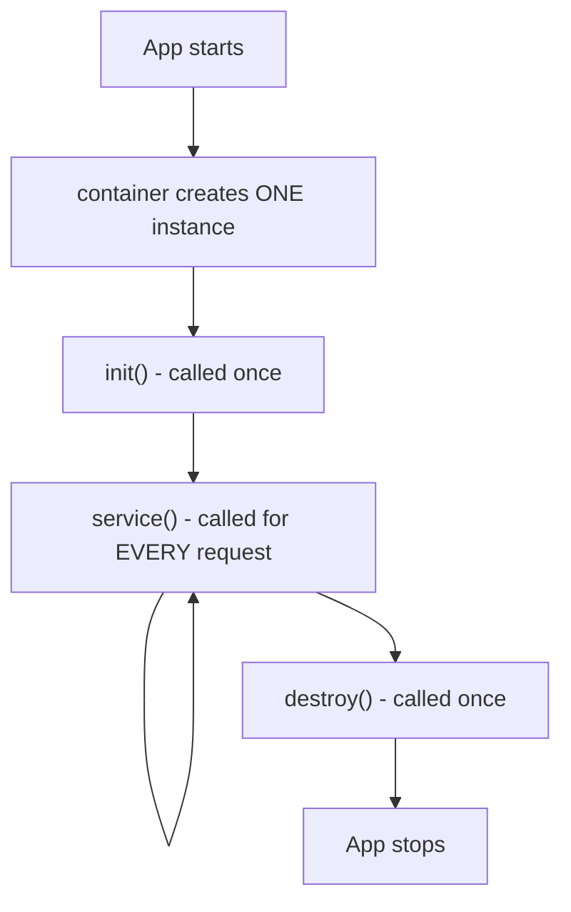
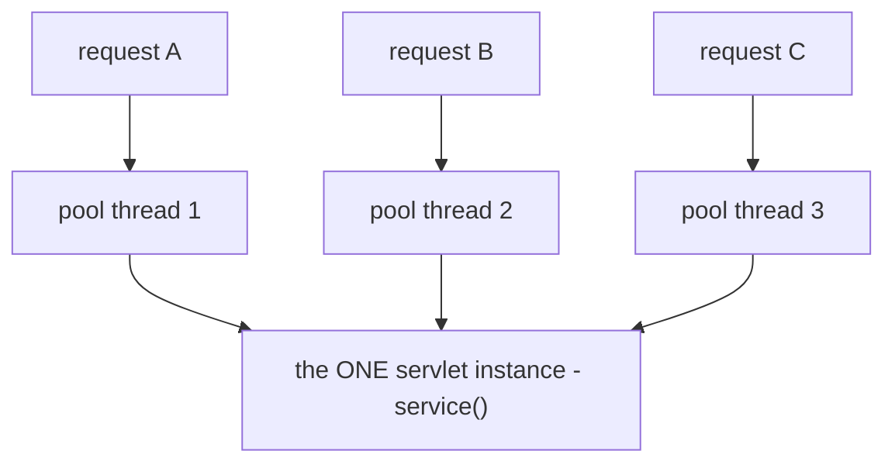

# The Servlet Container & Lifecycle

In Phase 1 you wrote a servlet - an object with methods that handle HTTP. But you never called those
methods. You never wrote `new MyServlet()`, never wired it to a socket, never spun up a thread to run
it. So who does?

📝 **The container owns your servlet's life, and it runs one copy of it across many threads at once.**
Tomcat, Jetty, Undertow - these are the *containers*. You hand them a class; they decide when to create it,
when to call it, when to throw it away, and - the part that bites people - they call it from *many threads
simultaneously, on a single shared instance*. Get that one sentence into your bones and the rest of this
phase, plus half of why Spring controllers look the way they do, falls out of it.

Let's take it in three moves: the lifecycle (when your code runs), the one-instance fact (how many copies
exist), and the thread-safety consequence (the lesson that actually matters in production).

## The lifecycle: init → service → destroy

📝 **A servlet's life has exactly three phases, and the container drives all three.** When the
application starts (or on the first request, depending on config), the container creates your servlet and
calls `init()` **once**. From then on, every incoming HTTP request makes the container call `service()` - 
which routes to `doGet`, `doPost`, and friends (Phase 3). When the application shuts down, the container
calls `destroy()` **once**, and the instance is gone.



The shape that matters: `init` and `destroy` are *bookends* - once each, at the edges of the servlet's
life. `service` is the *hot loop* - called again and again, once per request, for the entire time the app
is up.

You override `init` and `destroy` when you have setup and cleanup that should happen one time, not on
every request - opening a database connection pool, loading a config file, starting a background client.

```java
import jakarta.servlet.*;
import jakarta.servlet.http.*;
import java.io.IOException;

public class ReportServlet extends HttpServlet {

    private DataSource pool;   // expensive to build - do it once

    @Override
    public void init() throws ServletException {
        // runs ONCE, when the container creates this servlet
        this.pool = buildConnectionPool();
        System.out.println("ReportServlet initialised");
    }

    @Override
    protected void doGet(HttpServletRequest req, HttpServletResponse resp)
            throws IOException {
        // runs on EVERY GET - keep it about handling this one request
        resp.getWriter().write("rows: " + queryRowCount(pool));
    }

    @Override
    public void destroy() {
        // runs ONCE, at shutdown - release what init() acquired
        pool.close();
        System.out.println("ReportServlet destroyed");
    }
}
```

*What just happened:* The container called `init()` a single time and we used that one shot to build an
expensive connection pool, stashing it in a field. Every `doGet` after that reuses the same pool instead
of rebuilding it per request. At shutdown the container called `destroy()` once, where we closed the
pool. ⚠️ Notice the field `pool` - it survives across every request because there's only one servlet
instance holding it. That's convenient here (the pool is shared and read-only after setup) and a
*trap* in a moment, when the field is mutable. Hold that thought.

## ONE instance, MANY requests

Here's the fact that surprises almost everyone the first time, and it's the linchpin of the phase:

📝 **The container creates exactly ONE instance of your servlet and reuses it for every single request.**
It does *not* do `new ReportServlet()` per request. It is, in practice, a **singleton** - one object,
living for the whole lifetime of the app, handling thousands or millions of requests.

This is why the connection pool above worked: `init()` ran once, on the one instance, and every request
saw the same pool. If the container made a fresh servlet per request, each would rebuild the pool - slow
and pointless. So the container's design is deliberate: build the handler once, keep it warm, route all
traffic through it.

That single decision is the *entire* reason this phase exists. One instance is cheap and fast. One
instance is also **shared** - and shared is where the trouble starts.

## Thread-per-request: many threads, one instance

A real server handles many requests at the same time. It can't process them one-at-a-time in a queue;
your users would wait in line. So:

📝 **The container keeps a pool of worker threads, and runs each incoming request on a thread pulled from
that pool - all of them calling `service()` on the same single servlet instance, concurrently.** Request
A is being handled by thread 1, request B by thread 2, request C by thread 3 - at the same instant, all
three threads executing the *same* `doGet` method on the *same* object.



If you read [Java's concurrency phase](/guides/java-from-zero), the alarm should already be ringing. This
is *exactly* the dangerous setup from that chapter: **multiple threads touching the same object's shared
state at the same time.** The "thread pool" here is the same `ExecutorService` idea - Tomcat's default is
a couple hundred worker threads - and the "shared mutable state" is any field on your servlet. The
container handles the threading *for* you, which is great, right up until you forget it's happening and
write to a field.

## The thread-safety consequence - the big lesson

⚠️ **Because one instance is shared across many threads, any mutable instance field on a servlet is a
data race.** This is the single most important thing to take from this phase. Let's see it break.

Imagine you want to count how many requests you've served, so you add a field and increment it:

```java
public class CounterServlet extends HttpServlet {

    private int hits = 0;   // DANGER: mutable field on a shared, multithreaded instance

    @Override
    protected void doGet(HttpServletRequest req, HttpServletResponse resp)
            throws IOException {
        hits++;                                  // read-add-write - NOT atomic
        resp.getWriter().write("hit #" + hits);
    }
}
```

```console
# 1000 concurrent requests fired at this servlet:
expected final count: 1000
actual final count:   948
```

*What just happened:* Exactly the broken counter from the Java concurrency phase, now wearing a web
server's clothes. `hits++` is three steps - **read** the value, **add** one, **write** it back - and
because every request runs on its own thread against the *one* shared `CounterServlet`, two threads can
read `500` at the same instant, both compute `501`, and both write `501`. Two requests, one increment;
the lost updates pile up and you land at `948` instead of `1000`. ⚠️ It's *intermittent* - under light
traffic it might look fine for weeks, then corrupt under load. That's the signature of a race condition,
and it's the worst kind of bug to chase in production.

The fix is not to sprinkle locks everywhere. The fix is to **not keep request state in fields at all**:

```java
public class GreetServlet extends HttpServlet {

    // no mutable fields - nothing shared between requests

    @Override
    protected void doGet(HttpServletRequest req, HttpServletResponse resp)
            throws IOException {
        String name = req.getParameter("name");   // local variable - per request, per thread
        String greeting = "Hello, " + name;       // also local - no sharing possible
        resp.getWriter().write(greeting);
    }
}
```

*What just happened:* Every piece of per-request data - `name`, `greeting` - is a **local variable**.
Local variables live on each thread's own stack, so thread 1's `name` and thread 2's `name` are entirely
separate; there is nothing shared to corrupt. The servlet itself holds no changing state, so it's safe to
hammer with a thousand concurrent threads. 💡 The rule that drops out of this: **keep servlets
stateless.** Per-request data goes in local variables and the request object; anything genuinely shared
(like that read-only connection pool, set up once in `init`) is fine, and anything that *must* be mutable
and shared needs a real concurrency tool - `AtomicInteger`, a `ConcurrentHashMap`, a lock - never a plain
field.

💡 **And here's the payoff that reaches far beyond raw servlets.** Ever wondered *why* Spring controllers
are singletons that you're told to keep stateless? Why "don't store request data in controller fields" is
drilled into every Spring tutorial? This is why. A Spring `@RestController` is, underneath, handled by one
shared object inside the `DispatcherServlet` - which is itself a servlet, running on this exact
thread-per-request, one-instance model. The rule isn't a Spring quirk; it's the servlet container's
shared-instance reality, inherited. Learn it here, bare, and it stops being a memorized rule and becomes
something you actually understand.

## Container responsibilities - what you got for free

Step back and notice how much the container did that you never wrote. It managed the **thread pool**,
accepted the **network connections** and parsed the raw HTTP, created and **deployed** your servlet,
called the **lifecycle** methods at the right moments, and (you'll see in Phase 5) runs the **filters and
listeners** around your code too. You wrote one method that handles one request; the container handled
concurrency, sockets, parsing, and lifetime.

💡 **This is the original "inversion of control" in Java web.** You don't call the framework - the
*framework calls you*. Your code doesn't run a loop pulling requests off a socket; you hand the container
a class and it invokes your methods when requests arrive. That "you write the handler, the runtime drives
it" inversion is the deepest pattern in the whole Java web stack - and every framework on top of servlets
(Spring, JAX-RS, all of it) is built on this same hand-it-over-and-let-it-call-you arrangement.

## Recap

1. **The container owns the lifecycle: `init` → `service` → `destroy`.** `init()` runs once at startup
   (do expensive setup there), `service()` runs for *every* request (routing to `doGet`/`doPost`),
   `destroy()` runs once at shutdown (clean up what `init` acquired).
2. **One instance, reused for every request.** The container creates a *single* servlet instance - an
   effective singleton - not a new one per request. That's why setup in `init` is worth doing once.
3. **Thread-per-request on that one instance.** Each request runs on a worker thread from the container's
   pool, and they all call `service()` on the *same shared object* concurrently - the classic
   shared-mutable-state danger from [Java concurrency](/guides/java-from-zero).
4. **Mutable instance fields are a data race.** A plain `int hits` counter loses updates under load
   because `hits++` isn't atomic and the field is shared across threads. ⚠️ Intermittent, load-dependent,
   miserable to debug.
5. **Keep servlets stateless** - use local variables and the request object for per-request data. 💡 This
   is *exactly* why Spring controllers are stateless singletons: they inherit the servlet container's
   one-instance, multithreaded model.
6. **The container handles concurrency, networking, parsing, and lifetime for you** - the original
   *inversion of control*: you write the handler, the runtime calls it.

## Quick check

Three questions on the model that explains half of Java web framework behaviour:

```quiz
[
  {
    "q": "How many instances of a given servlet class does the container create, and how does it serve concurrent requests?",
    "choices": [
      "One instance, reused for every request; concurrent requests each run on their own thread from a pool, all calling service() on that one shared instance",
      "A new instance per request, each on its own thread, so no state is ever shared",
      "One instance, and requests are queued and processed strictly one at a time",
      "One instance per worker thread, so each thread has a private copy"
    ],
    "answer": 0,
    "explain": "The container makes a single servlet instance (effectively a singleton) and runs each request on a pooled thread, all hitting the same instance concurrently. That shared instance is the whole reason thread-safety matters."
  },
  {
    "q": "A servlet has a `private int hits = 0;` field incremented with `hits++` in doGet. Under heavy concurrent traffic the count comes out too low. Why?",
    "choices": [
      "`hits++` is read-add-write (not atomic), and because the one servlet instance is shared across request threads, two threads can read the same value and one increment is lost - a race condition",
      "The container resets the field between requests",
      "Each request gets its own copy of the field, so they never add up",
      "Integers in servlets silently overflow under load"
    ],
    "answer": 0,
    "explain": "One shared instance + many threads + a non-atomic read-add-write = lost updates. The fix is to keep servlets stateless (local variables, the request object) or use a real concurrency tool like AtomicInteger."
  },
  {
    "q": "Why are Spring controllers conventionally kept stateless (no request data in fields)?",
    "choices": [
      "Because they run on the same servlet model: a single shared instance handling requests across many threads, so mutable fields would be a data race - exactly as in a raw servlet",
      "Because Spring creates a brand-new controller per request and fields are wiped anyway",
      "It's purely a style preference with no technical basis",
      "Because Spring controllers can't legally declare fields at all"
    ],
    "answer": 0,
    "explain": "A Spring @RestController is handled by one shared object inside the DispatcherServlet - itself a servlet on the thread-per-request, one-instance model. The 'keep it stateless' rule is the servlet container's shared-instance reality inherited, not a Spring quirk."
  }
]
```

---

[← Phase 1: What a Servlet Is](01-what-a-servlet-is.md) · [Guide overview](_guide.md) · [Phase 3: Handling Requests with HttpServlet →](03-handling-requests.md)
