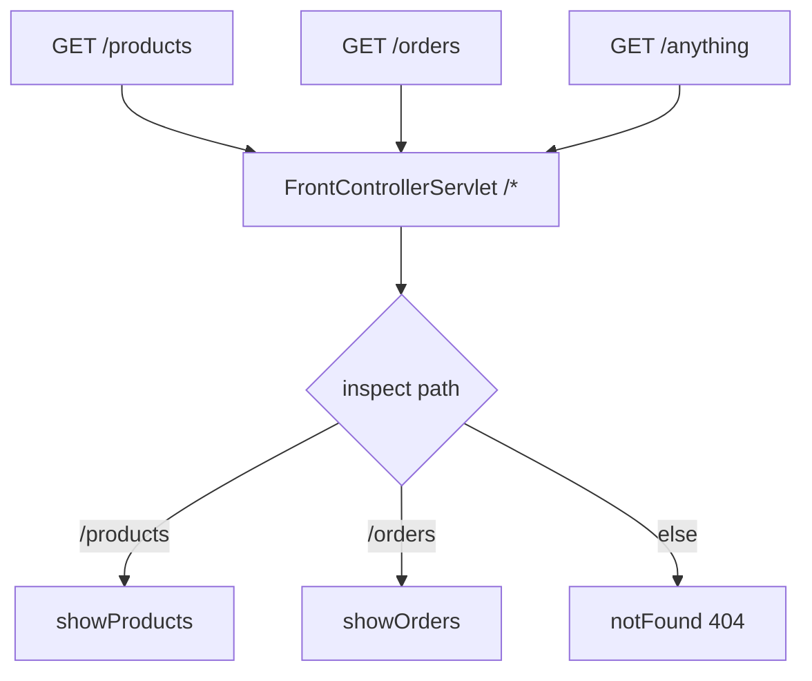

# Mapping & the Front-Controller Pattern

In [Phase 3](03-handling-requests.md) you wrote a servlet that reads a request and writes a response. But we waved a hand over one thing: *how does the container know that `GET /hello` should reach your `HelloServlet` and not some other class?* That's the missing link, and chasing it all the way down lands you on the single most important pattern in Java web development - the one every framework you've ever used is quietly built on.

**The container keeps a routing table that maps URL patterns to servlets.** When a request arrives, it looks up the path, finds the matching servlet, and hands the request over. Everything in this phase is about who writes that table, and the moment you realize you can write a *clever* one yourself.

## URL mapping: how the container finds your servlet

📝 A servlet isn't reachable until it's *mapped* to a URL pattern. There are two ways to register that mapping, one modern and one classic.

The modern way is an annotation right on the servlet class:

```java
import jakarta.servlet.annotation.WebServlet;
import jakarta.servlet.http.HttpServlet;

@WebServlet("/products")
public class ProductServlet extends HttpServlet {
    // doGet, doPost, etc.
}
```

*What just happened:* `@WebServlet("/products")` tells the container, at startup, "any request whose path is `/products` goes to this class." The container scans your classes for this annotation and builds its routing table from what it finds. No external file needed - the mapping lives next to the code it routes to.

The classic way is a `web.xml` deployment descriptor, an XML file the container reads at startup:

```xml
<servlet>
    <servlet-name>products</servlet-name>
    <servlet-class>com.example.ProductServlet</servlet-class>
</servlet>
<servlet-mapping>
    <servlet-name>products</servlet-name>
    <url-pattern>/products</url-pattern>
</servlet-mapping>
```

*What just happened:* Two linked blocks. `<servlet>` gives the class a name; `<servlet-mapping>` ties that name to a URL pattern. It's more verbose than the annotation and lives away from the code, but it does the exact same job - it's an entry in the same routing table. You'll still meet `web.xml` in older codebases, so it's worth recognizing.

💡 Both approaches feed the **same** container routing table. The annotation is just a more convenient way to write the entry. Pick one per servlet; don't map the same servlet both ways.

The URL pattern itself comes in a few flavors, and the differences matter:

- **Exact match** - `/products` matches *only* the path `/products`. Nothing else.
- **Path prefix** - `/products/*` matches `/products`, `/products/42`, `/products/42/reviews` - anything under that prefix.
- **Extension** - `*.do` matches any path ending in `.do`, like `/checkout.do`. (A relic of older frameworks, but you'll see it.)

⚠️ The catch-all pattern is `/*` - it matches **every** request, no matter the path. Hold that one in mind; it's the hinge this whole phase turns on.

## The naive approach: one servlet per URL

The obvious way to build an app is: one servlet per endpoint. Need two URLs? Write two servlets.

```java
@WebServlet("/products")
public class ProductServlet extends HttpServlet {
    @Override
    protected void doGet(HttpServletRequest req, HttpServletResponse resp)
            throws IOException {
        resp.getWriter().write("Here are the products.");
    }
}

@WebServlet("/orders")
public class OrderServlet extends HttpServlet {
    @Override
    protected void doGet(HttpServletRequest req, HttpServletResponse resp)
            throws IOException {
        resp.getWriter().write("Here are the orders.");
    }
}
```

*What just happened:* Two endpoints, two complete servlet classes, two mappings. It works, and for a two-page app it's perfectly fine.

⚠️ But picture a real app: products, orders, customers, login, search, an admin section - fifty endpoints. That's fifty servlet classes and fifty mappings to keep straight. Every cross-cutting concern (logging the request, checking authentication) has to be repeated or bolted on in each one. The mapping sprawl alone becomes a maintenance tax. This pattern doesn't scale - and the fix is the big idea of the whole guide.

## The front-controller pattern

📝 Here's the move. Instead of mapping many servlets to many URLs, map **one** servlet to `/*` - catch *everything* - and have that single servlet inspect the request path and dispatch to the right handler *itself*. One front door for the whole app, with the routing logic on the inside.



Every request lands on the same servlet, which then reads the path and decides where it goes:

```java
@WebServlet("/*")
public class FrontControllerServlet extends HttpServlet {

    @Override
    protected void doGet(HttpServletRequest req, HttpServletResponse resp)
            throws IOException {
        String path = req.getPathInfo();   // the part after the context, e.g. "/products"

        if ("/products".equals(path)) {
            showProducts(resp);
        } else if ("/orders".equals(path)) {
            showOrders(resp);
        } else {
            resp.setStatus(404);
            resp.getWriter().write("Not found: " + path);
        }
    }

    private void showProducts(HttpServletResponse resp) throws IOException {
        resp.getWriter().write("Here are the products.");
    }

    private void showOrders(HttpServletResponse resp) throws IOException {
        resp.getWriter().write("Here are the orders.");
    }
}
```

*What just happened:* One servlet, mapped to `/*`, now owns every incoming GET. It pulls the path out of the request, runs it through an `if`/`else` chain, and calls the matching method. Add a new endpoint and you add a method plus one branch - not a whole new class and mapping. The cross-cutting work (logging, auth) can happen once, at the top of `doGet`, before any branch.

💡 Look at what that `if`/`else` ladder really is: **a routing table you wrote by hand.** "If the path is X, call handler Y." You've moved the routing decision out of the container's table and into your own code, where you control it. That single shift is the foundation of essentially every Java web framework.

## This *is* DispatcherServlet

💡 Now the reveal. Over in [Spring MVC](/guides/spring-framework-from-zero), there's one object that catches every request: the **`DispatcherServlet`**. You may have read that phase and taken it on faith. Here's what it actually is - *the exact thing you just built.*

`DispatcherServlet` is a servlet mapped to `/` (the catch-all). Every request in a Spring web app flows through it. It then consults a routing table - Spring calls it the **HandlerMapping** - to find which `@Controller` method should handle this path and HTTP method, and dispatches to it. That's your `if`/`else` ladder, except industrial-strength.

And the annotations you sprinkle on controllers?

```java
@GetMapping("/products")
public List<Product> showProducts() { ... }
```

*What just happened:* `@GetMapping("/products")` is nothing more than an **entry in the routing table**. It's the declarative equivalent of your `if ("/products".equals(path))` branch - you're telling the HandlerMapping "register this method under the path `/products` for GET." Spring reads all those annotations at startup and builds the table for you, so you never write the `if`/`else` by hand. But the shape is identical: one front-controller servlet, a routing table, dispatch to a handler.

You just built a tiny `DispatcherServlet` in twenty lines. The real one adds parameter binding, JSON conversion, view resolution, and error handling - but the spine is this pattern, and now you can see it.

## Forwarding within the server

One related tool you'll bump into: a front controller often needs to hand a request *off* to another servlet or a JSP page to render the actual HTML. That's `RequestDispatcher.forward()`:

```java
RequestDispatcher dispatcher = req.getRequestDispatcher("/WEB-INF/products.jsp");
dispatcher.forward(req, resp);
```

*What just happened:* The front controller passes the *same* request and response on to `products.jsp`, which renders the page. The browser never knows - it's all one server-side handoff, one HTTP round-trip. This is exactly how Spring MVC reaches a view template after your controller returns a view name.

⚠️ Don't confuse `forward()` with `resp.sendRedirect("/login")`. A forward is *internal* - the server quietly delegates and the URL in the browser stays the same. A redirect sends a `302` back to the browser telling it to make a *brand-new* request to a different URL (two round-trips, the address bar changes). Forward to render a view; redirect to send the user somewhere else (like after a successful form post).

## Why the frameworks won here

💡 Step back and weigh the hand-written front controller plainly. The pattern is great - one entry point, centralized cross-cutting logic - but maintaining that routing table *by hand* is tedious and error-prone. Every endpoint is a new `if` branch. Typo a path string and you get a silent 404. Want to also match on HTTP method, extract a path variable like `/products/{id}`, or pick the right handler by content type? Your `if`/`else` ladder turns into a swamp.

That swamp is precisely the convenience frameworks sell. The front-controller servlet plus a **declarative** routing table - `@GetMapping("/products")` instead of a fragile string comparison - is the value Spring MVC adds *over this exact servlet pattern*. It didn't invent a new way to handle the web; it automated the routing table you'd otherwise hand-write.

You now see the pattern under the magic. And there's one more piece of "framework magic" rooted right here: the logic you'd run *before* every branch - logging, authentication, compression - has a cleaner home than the top of `doGet`. That home is the **filter chain**, and it's where Phase 5 picks up.

## Recap

1. **The container keeps a routing table** mapping URL patterns to servlets. You write entries with `@WebServlet("/path")` (modern) or `<servlet-mapping>` in `web.xml` (classic) - both feed the same table.
2. **URL patterns** come in flavors: exact (`/products`), path prefix (`/products/*`), extension (`*.do`), and the catch-all `/*` that matches every request.
3. **One servlet per URL doesn't scale** - fifty endpoints means fifty classes, fifty mappings, and cross-cutting logic repeated everywhere.
4. **The front-controller pattern** maps *one* servlet to `/*`, inspects the request path, and dispatches to the right handler internally. That dispatch logic is a routing table you write yourself.
5. **`DispatcherServlet` is exactly this pattern** - one servlet on `/`, with a HandlerMapping routing table. `@GetMapping` is just a declarative entry in that table. The convenience frameworks add is automating the table you'd otherwise hand-write.

## Quick check

Make sure the front-controller picture clicked before moving to filters:

```quiz
[
  {
    "q": "What URL pattern does a front-controller servlet use, and why?",
    "choices": [
      "/* - so it catches every request and can route them all internally",
      "/products - so it only handles the products endpoint",
      "*.do - so it only handles legacy file extensions",
      "An exact match per endpoint, one servlet for each"
    ],
    "answer": 0,
    "explain": "The front-controller pattern maps a single servlet to the catch-all /* (or / for DispatcherServlet) so every request flows through one place, which then inspects the path and dispatches to the right handler."
  },
  {
    "q": "In Spring MVC, what is @GetMapping(\"/products\") in front-controller terms?",
    "choices": [
      "An entry in the routing table the DispatcherServlet consults - the declarative version of an if-branch on the path",
      "A separate servlet that the container maps directly to /products",
      "A database query that loads the products",
      "A filter that runs before the request reaches any servlet"
    ],
    "answer": 0,
    "explain": "@GetMapping registers the method under a path in Spring's HandlerMapping (its routing table). It's the declarative equivalent of the hand-written if (\"/products\".equals(path)) branch in your own front controller."
  },
  {
    "q": "What is the difference between RequestDispatcher.forward() and response.sendRedirect()?",
    "choices": [
      "forward() is an internal server-side handoff (same request, URL unchanged); sendRedirect() tells the browser to make a new request to a different URL",
      "forward() changes the browser URL; sendRedirect() keeps it the same",
      "They are identical, just different names",
      "forward() is for GET requests and sendRedirect() is for POST requests"
    ],
    "answer": 0,
    "explain": "A forward delegates internally within the server - same request/response, one round-trip, URL stays put (used to render a view). A redirect sends a 302 so the browser issues a brand-new request to another URL - two round-trips, the address bar changes."
  }
]
```

---

[← Phase 3: Handling Requests with HttpServlet](03-handling-requests.md) · [Guide overview](_guide.md) · [Phase 5: Filters & the Chain →](05-filters-and-the-chain.md)
