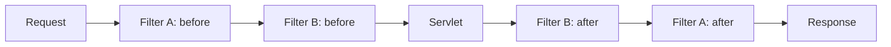

# Filters & the Chain

Here's a problem you hit on every real web app within about a week. You want to log every request. Then you want to time every request. Then someone says "we need to check the auth token before *any* endpoint runs." Where does that code go?

If your answer is "in every servlet," stop — that's how you end up copy-pasting the same six lines into forty handlers and forgetting one. The Servlet API has a purpose-built place for exactly this kind of code, and once you see it, you'll recognize it in every web framework you ever touch. It's called a **filter**, and the way filters stack up is the literal origin of the word "middleware."

## What a filter actually is

📝 **A filter is code that intercepts a request *before* it reaches your servlet — and gets to touch the response on the way back out — without the servlet knowing it exists.**

Picture the request as a visitor walking toward a room (your servlet). A filter is a doorway the visitor must pass through to get in. The doorway can inspect the visitor, log their arrival, check their ID, reject them outright, or wave them through. When the visitor leaves the room, they walk back out through the same doorway, which gets one more chance to act — on the response this time.

The servlet on the other side has no idea any of this happened. It just receives a request and produces a response, exactly as in [Phase 1](01-….md). That separation is the whole point: your business logic stays clean, and the *cross-cutting* concerns — the ones that apply to many or all requests — live somewhere else.

📝 What kinds of things go in filters? The classic list:

- **Logging** — record every request's method, path, and timing.
- **Authentication / authorization** — check a token or session before any handler runs.
- **Compression** — gzip the response on the way out.
- **CORS** — add the cross-origin headers browsers demand.
- **Timing / metrics** — measure how long requests take.

💡 Hold onto this, because it's the reveal at the end of the phase: **this is what every framework means by "middleware."** Express calls it middleware. ASP.NET calls it middleware. Django calls it middleware. Spring calls it the filter chain. They are all the same idea, and that idea is *the servlet filter* — code that sits in the request's path before your handler.

## `doFilter` and the one line everyone forgets

A filter is a class implementing `jakarta.servlet.Filter`, which has a single method that matters: `doFilter`.

📝 The mechanism is a sandwich. Inside `doFilter` you write your **before** logic, then you call `chain.doFilter(req, res)` to pass control onward — to the next filter, or eventually to the servlet — and when *that* returns, control comes back to you and you run your **after** logic. The request goes in through the top of the sandwich; the response comes back out through the bottom.

```java
import jakarta.servlet.*;
import jakarta.servlet.annotation.WebFilter;
import jakarta.servlet.http.HttpServletRequest;
import java.io.IOException;

@WebFilter("/*")   // apply to every path
public class TimingFilter implements Filter {

    @Override
    public void doFilter(ServletRequest req, ServletResponse res, FilterChain chain)
            throws IOException, ServletException {

        // --- BEFORE: runs on the way in ---
        long start = System.currentTimeMillis();
        String path = ((HttpServletRequest) req).getRequestURI();

        chain.doFilter(req, res);   // hand off to the next filter / the servlet

        // --- AFTER: runs on the way back out ---
        long elapsed = System.currentTimeMillis() - start;
        System.out.println(path + " took " + elapsed + "ms");
    }
}
```

*What just happened:* `@WebFilter("/*")` registers this filter for every request. On the way in we grab a timestamp and the path. The single line `chain.doFilter(req, res)` is the hinge of the whole thing — it passes the request down the line to whatever comes next. Everything *above* that line runs before your servlet; everything *below* it runs after the servlet has produced its response. So `elapsed` is the real wall-clock time the request spent in the application, printed on the way back out.

⚠️ **The number-one filter bug, by a mile: forgetting `chain.doFilter`.** If you leave that line out, the request stops dead inside your filter. It never reaches the next filter, never reaches the servlet, and the client gets an empty or broken response with no error to explain why. When a filter "swallows" requests and you're staring at a blank page, the first thing to check is whether you actually called `chain.doFilter`. Calling it is opting *in* to letting the request continue — silence means "stop here."

## The chain: an onion of filters

You rarely have just one filter. You have several — a logging filter, an auth filter, a CORS filter — and they don't run independently. They run **in order**, each one wrapping the next, forming a **chain**.

📝 The shape to picture is an onion. The request travels *inward* through each filter's "before" half, reaches the servlet at the core, and then the response travels *outward* through each filter's "after" half — in reverse order. The first filter to see the request is the last one to see the response.



*What just happened:* The request enters Filter A, which does its before-work and calls `chain.doFilter` — handing off to Filter B, which does *its* before-work and hands off to the servlet. The servlet produces the response, and now we unwind: control returns to B's after-work, then to A's after-work, and finally out to the client. That reversal is why a filter can wrap the whole downstream operation — A's before runs first and A's after runs last, so A genuinely surrounds everything inside it. A timing filter placed first measures the entire chain plus the servlet.

So how is the order decided? With `@WebFilter` annotations, ordering across multiple filters is **not guaranteed** by the spec — annotation-based filters run in an unspecified order. When order matters (and for auth, it always does), declare your filters in `web.xml` instead, where the order of `<filter-mapping>` elements is the order they run:

```java
// web.xml ordering is explicit and reliable:
//
// <filter-mapping> for CorsFilter      ← runs 1st
// <filter-mapping> for AuthFilter      ← runs 2nd
// <filter-mapping> for LoggingFilter   ← runs 3rd
```

*What just happened:* In `web.xml`, filters run in the order their `<filter-mapping>` entries appear. That gives you the deterministic control you need — for example, putting CORS before auth so preflight requests aren't rejected, and auth before everything else so unauthenticated requests die early. ⚠️ If you mix `@WebFilter` and `web.xml`, you lose predictable ordering; pick one approach for any set of filters whose order matters.

## A real filter: gatekeeping with auth

Logging and timing are gentle — they always call `chain.doFilter` and let the request through. The interesting case is a filter that sometimes says **no**. This is the shape of authentication middleware everywhere, so it's worth seeing in full.

```java
import jakarta.servlet.*;
import jakarta.servlet.annotation.WebFilter;
import jakarta.servlet.http.HttpServletRequest;
import jakarta.servlet.http.HttpServletResponse;
import java.io.IOException;

@WebFilter("/api/*")   // guard everything under /api
public class AuthFilter implements Filter {

    @Override
    public void doFilter(ServletRequest req, ServletResponse res, FilterChain chain)
            throws IOException, ServletException {

        HttpServletRequest request = (HttpServletRequest) req;
        HttpServletResponse response = (HttpServletResponse) res;

        String token = request.getHeader("Authorization");

        if (token == null || !token.equals("Bearer letmein")) {
            // REJECT: set 401 and DO NOT call chain.doFilter
            response.setStatus(HttpServletResponse.SC_UNAUTHORIZED);   // 401
            response.getWriter().write("Unauthorized");
            return;   // the request dies here — the servlet never runs
        }

        // PASS: token is valid, let the request continue
        chain.doFilter(request, response);
    }
}
```

*What just happened:* The filter reads the `Authorization` header. If it's missing or wrong, the filter writes a `401 Unauthorized` response and `return`s **without** calling `chain.doFilter` — so the request is turned away right here and the protected servlet never executes. If the token checks out, `chain.doFilter` lets the request flow on as normal. Notice that here, *not* calling the chain is the deliberate, correct behavior — the opposite of the timing-filter bug. The decision to call or skip `chain.doFilter` is the entire power of a filter: it's the gate.

💡 Look at the structure: a single place that inspects every incoming request and decides "in or out" before any handler runs. That is *exactly* the shape of authentication in every framework. You've just written the bones of what big libraries dress up with tokens, sessions, and role checks.

## The reveal: this IS framework "middleware"

Now zoom out, because you've just learned something bigger than the Servlet API.

💡 Remember [Spring Security from the Spring Boot guide](/guides/spring-boot-from-zero)? Its core mental model is "a chain of filters every request passes through before reaching your controller — each one asking a single question and letting the request continue or stopping it cold." Read that sentence again. It's the chapter you just finished. **Spring Security is, quite literally, a chain of servlet filters.** The `SecurityFilterChain` you configure there is configuring the exact mechanism in this phase. Spring's authentication filter is your `AuthFilter` with years of hardening; its "permit or reject" decisions are `chain.doFilter` called or skipped.

And it doesn't stop at Java. As [What a Framework Even Is](/guides/what-a-framework-even-is) lays out, "middleware" is a universal pattern — Express's `app.use((req, res, next) => ...)` is a filter, and `next()` is `chain.doFilter`; ASP.NET's middleware pipeline with `await next()` is the same onion; Django's middleware classes wrap the view identically. Different languages, identical idea: **the request passes through layers before your code runs, and each layer can observe, modify, or stop it.**

That phrase — "the request passes through layers before your code" — is something you may have read in a dozen framework docs and accepted as magic. It isn't magic. It's the filter chain, and you now know the root mechanism that every one of those frameworks is dressing up. When you meet the next framework's middleware, you won't be learning a new concept; you'll be learning new syntax for this one.

Next up, [Phase 6](06-sessions-and-state.md): we tackle how the server *remembers* a user between requests — sessions and state — which is the other half of how auth actually works in practice.

## Recap

1. 📝 A **filter** intercepts a request before it reaches your servlet, and touches the response on the way back, without the servlet knowing. It's where cross-cutting concerns live: logging, auth, compression, CORS, timing.
2. 📝 `doFilter` is a sandwich: before-logic, then `chain.doFilter(req, res)` to pass control onward, then after-logic on the way back. ⚠️ Forgetting `chain.doFilter` kills the request silently — it never reaches the servlet.
3. 📝 Filters form a **chain** — an onion. The request goes in through each filter's before-half to the servlet, then the response comes back out in reverse order. First in, last out.
4. Ordering with `@WebFilter` is unspecified; use `web.xml` `<filter-mapping>` order when sequence matters (e.g. CORS before auth, auth before everything).
5. An **auth filter** checks a token and either rejects (set 401, skip `chain.doFilter`) or passes through. Skipping the chain is the gate — that's the shape of authentication everywhere.
6. 💡 This is the root of framework **middleware**: Spring Security is a chain of servlet filters; Express/ASP.NET/Django "middleware" is the same pattern. You now know the mechanism behind "the request passes through layers before your code."

## Quick check

Make sure the core idea — and the one line everyone forgets — actually stuck:

```quiz
[
  {
    "q": "What does calling chain.doFilter(req, res) inside a filter do?",
    "choices": [
      "Passes control to the next filter in the chain, or to the servlet if it's the last filter",
      "Immediately returns the response to the client and ends the request",
      "Restarts the filter from the beginning",
      "Logs the request to the servlet container's console"
    ],
    "answer": 0,
    "explain": "chain.doFilter hands the request onward — to the next filter, or to the servlet if this is the last filter. Code before it runs on the way in; code after it runs on the way back out. Omitting it stops the request dead inside your filter."
  },
  {
    "q": "An authentication filter decides a request is NOT authorized. What should it do?",
    "choices": [
      "Set the response status (e.g. 401) and return WITHOUT calling chain.doFilter, so the servlet never runs",
      "Call chain.doFilter anyway and let the servlet decide",
      "Throw an exception so the container picks a status code",
      "Remove the Authorization header and continue the chain"
    ],
    "answer": 0,
    "explain": "To reject, the filter writes the response (like 401 Unauthorized) and returns without calling chain.doFilter. That stops the request right there — the protected servlet never executes. Skipping the chain is exactly how a filter acts as a gate."
  },
  {
    "q": "Why is Spring Security described as 'a chain of servlet filters'?",
    "choices": [
      "Because it literally is one — its SecurityFilterChain is built on the servlet filter mechanism, the same pattern every framework calls 'middleware'",
      "Because it replaces the servlet container entirely with its own request handler",
      "Because it only works with Spring's @RestController and not plain servlets",
      "Because 'filter chain' is just a marketing name with no technical meaning"
    ],
    "answer": 0,
    "explain": "Spring Security is built directly on servlet filters: its filter chain installs ordered filters that each ask one question and call (or skip) the chain. Express, ASP.NET, and Django 'middleware' are the same idea in other languages — the filter chain is the root mechanism."
  }
]
```

---

[← Phase 4: Mapping & the Front-Controller Pattern](04-mapping-and-the-front-controller.md) · [Guide overview](_guide.md) · [Phase 6: Sessions & State →](06-sessions-and-state.md)
