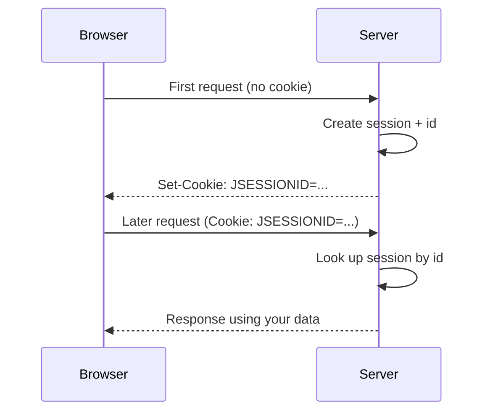

# Sessions & State

You log into a site, click around five pages, and it still knows who you are. Feels obvious. It is not
obvious at all - because the protocol underneath has no memory whatsoever. Every framework's "current
user," every shopping cart, every "stay logged in" rests on a single trick the Servlet API gives you raw.
This phase is that trick, demystified.

## The problem: HTTP forgets you between requests

Start with the uncomfortable fact, because everything else is a response to it.

📝 **HTTP is stateless.** Each request is a self-contained event. The server reads it, answers it, and
keeps nothing about you for next time. Two requests from the same browser, ten seconds apart, arrive
looking like two strangers - the server has no built-in way to know they're the same person. That's not a
bug; it's the design that lets HTTP scale (see [/guides/http-explained](/guides/http-explained) and the
statelessness discussion in [/guides/http-and-json-api-basics](/guides/http-and-json-api-basics)). A
server holding nothing per-connection can field requests from millions of browsers without drowning.

But real apps need memory. "This user is logged in." "Their cart has three items." "They're on step 2 of
checkout." None of that survives in a stateless world on its own. So how does a site remember you across
requests when the protocol throws you away after each one?

The answer isn't to make HTTP stateful. It's to carry a small token of identity on *every* request, and
keep the real memory on the server, keyed by that token. That token is a **session id**, and the carrier
is a **cookie**.

## Cookies + a session id: the mechanism

Here's the whole dance in one sentence: **the server gives the browser an id once, the browser hands that
id back on every later request, and the server uses it to find your stored data.**

Walk through it as an HTTP exchange. First request - the browser has nothing to identify itself with, so
the server creates a fresh session and tells the browser to remember its id:

```http
HTTP/1.1 200 OK
Content-Type: text/html
Set-Cookie: JSESSIONID=3F2A9C1B7E5D4088; Path=/; HttpOnly

<!-- the page -->
```

*What just happened:* the server made a new session, generated a hard-to-guess id (`3F2A9C1B7E5D4088`),
and sent it back in a `Set-Cookie` header. `JSESSIONID` is the conventional name the servlet container
uses. The browser quietly stores this cookie. Nothing about *you* travels in that header - just an opaque
key.

On every following request to the same site, the browser automatically attaches the cookie:

```http
GET /cart HTTP/1.1
Host: example.com
Cookie: JSESSIONID=3F2A9C1B7E5D4088
```

*What just happened:* the browser sent the `Cookie` header without being asked - that's what browsers do
with stored cookies. The server reads `JSESSIONID=3F2A9C1B7E5D4088`, looks up the session with that id in
its own memory, and instantly knows: this is the same visitor from before, here's their cart. The protocol
is still stateless on the wire; the *id riding along on each request* is what stitches the requests into a
session.

📝 **The cookie is just the key; the data lives on the server.** This is the part to hold onto. The cookie
carries a meaningless-looking id, nothing more. The actual contents - who you are, what's in your cart - 
sit in a map on the server side, looked up by that id. Lose the cookie and you lose the *key*, not the
data (the data's still there; you just can't point at it anymore).



## `HttpSession` in code

The Servlet API wraps that whole mechanism in one object so you never touch the cookie or the id by hand.
You ask for the session; the container handles `Set-Cookie`, the lookup, and the id generation for you.

Storing something during, say, a login:

```java
protected void doPost(HttpServletRequest request, HttpServletResponse response)
        throws IOException {
    User user = authenticate(request);          // your own check

    HttpSession session = request.getSession(); // creates one if none exists
    session.setAttribute("user", user);         // stash it server-side

    response.sendRedirect("/dashboard");
}
```

*What just happened:* `request.getSession()` returns the existing session for this browser, or creates a
fresh one if there's no valid `JSESSIONID` cookie yet - and when it creates one, the container adds the
`Set-Cookie` header to the response for you. `setAttribute("user", user)` puts the user object into
server-side storage under the key `"user"`. We never generated an id or wrote a cookie ourselves; the API
did it.

Reading it back on a *later* request - a different HTTP request entirely, stitched to this one only by the
cookie:

```java
protected void doGet(HttpServletRequest request, HttpServletResponse response)
        throws IOException {
    HttpSession session = request.getSession(false); // don't create; just look
    User user = (session == null) ? null : (User) session.getAttribute("user");

    if (user == null) {
        response.sendRedirect("/login");
        return;
    }
    response.getWriter().write("Welcome back, " + user.name());
}
```

*What just happened:* `getSession(false)` asks "is there already a session?" without creating one - the
`false` matters, since a bare `getSession()` would manufacture an empty session and a cookie even for a
logged-out visitor. We pull `"user"` back out with `getAttribute`. The object is the *same one we stored
earlier*, because it lived on the server the whole time; the request just arrived carrying the id that
finds it. On logout you tear it all down:

```java
HttpSession session = request.getSession(false);
if (session != null) {
    session.invalidate(); // drop the server-side data + the id
}
```

*What just happened:* `invalidate()` discards the session and its attributes on the server, so the old
`JSESSIONID` now points at nothing. The next request starts clean.

## Sessions vs the stateless/token alternative

Server-side sessions are simple and they work - but they have a cost, and the cost shows up the moment you
run more than one server.

⚠️ **Sessions hold memory per user, and that complicates scaling.** Every active session is RAM on a
specific server. Run two servers behind a load balancer and request #2 might land on the box that *doesn't*
have your session - your id finds nothing, and you look logged out. The usual fixes are **sticky sessions**
(the balancer pins each user to the server that holds their session) or a **shared session store** (sessions
live in Redis or a database that all servers read). Both work; both add moving parts and a thing that can
fall over.

📝 **The modern alternative for APIs: stateless tokens.** Instead of the server remembering you, the
*client* carries the state. On login the server hands back a signed token - a **JWT** is the common form - 
that itself contains the claims ("user 42, role admin, expires at noon"), cryptographically signed so it
can't be forged. The client sends it on each request (typically `Authorization: Bearer <token>`), and the
server just verifies the signature. No session map, no per-user RAM, nothing to share between servers - 
any server can validate any request. (This ties straight into the auth/security guides, where token
verification and signing live in detail.)

So which fits when?

- **Server-side sessions** - great for classic server-rendered web apps where the browser handles cookies
  for free, and you want the ability to revoke a session instantly (just delete it server-side).
- **Stateless tokens** - great for APIs, mobile clients, and multi-server fleets where you don't want
  shared session state. The trade-off: a token is valid until it expires, so instant revocation takes extra
  machinery (a denylist, short lifetimes + refresh tokens).

Neither is "correct." They're different answers to the same stateless-HTTP problem: sessions keep the
memory on the server, tokens push it to the client.

## What frameworks add

You now have the raw mechanism. Everything a framework gives you here is built directly on `HttpSession`.

💡 **Frameworks decorate this layer, they don't replace it.** Spring's `@SessionScope` beans? A bean whose
lifetime is tied to an `HttpSession` - the container's session underneath, with dependency-injection
ergonomics on top. **Spring Session** swaps the server-side store for Redis (the shared-store fix above)
without changing your code - your `getAttribute`/`setAttribute` mental model is intact; only *where* the
session lives moves. **Spring Security**'s entire "the user is logged in" machinery sits on the session you
just saw: it puts an authentication object into the session and reads it back on each request, exactly like
our `user` example, with a lot more rigor.

That rigor matters, because raw sessions have sharp edges frameworks help you handle - and you should know
them even when a framework is doing the work:

⚠️ **Session security basics.**
- **Regenerate the id on login** - otherwise an attacker who plants a known `JSESSIONID` before you log in
  can ride your authenticated session afterward. This is **session fixation**; the fix is a new id at the
  moment privilege changes.
- **`HttpOnly` and `Secure` cookies** - `HttpOnly` keeps JavaScript from reading the session cookie (so an
  XSS bug can't steal it); `Secure` keeps it off plain HTTP, so it only travels over HTTPS.
- **Timeouts** - sessions should expire after inactivity, so a forgotten-open session on a shared computer
  doesn't stay valid forever.

You can now see the real thing beneath "the user is logged in": an id in a cookie, data in a server-side
map, a few security rules around the id. That's the last piece of the bare mechanism - next we step back up
and watch the whole Servlet API reappear, named differently, inside the frameworks themselves.

## Recap

1. **HTTP is stateless** - each request is independent and the server keeps nothing about you between
   them. Sessions are how stateful behavior (login, carts) gets built on top of a forgetful protocol.
2. The mechanism: the server creates a session and sends a **session id** in a `Set-Cookie` header; the
   browser returns it in the `Cookie` header on every later request; the server uses it to look up your
   data. The container's conventional cookie name is `JSESSIONID`.
3. **The cookie is just the key - the data lives server-side.** The cookie carries an opaque id; the real
   contents sit in a map on the server, keyed by that id.
4. In code: `request.getSession()` (or `getSession(false)` to avoid creating one), `setAttribute` /
   `getAttribute` to store and read across requests, `invalidate()` on logout. The API handles the cookie
   and id for you.
5. ⚠️ Sessions cost per-user memory and complicate multi-server scaling (sticky sessions or a shared store
   like Redis). The stateless alternative for APIs is a signed **token (JWT)** the client carries - no
   server session at all.
6. 💡 Frameworks (`@SessionScope`, Spring Session, Spring Security) are built on `HttpSession`. Mind the
   security basics: regenerate the id on login (fixation), `HttpOnly`/`Secure` cookies, and timeouts.

## Quick check

Three questions on the ideas that have to stick:

```quiz
[
  {
    "q": "When a browser keeps you 'logged in' across requests, where does your actual session data live?",
    "choices": [
      "Server-side, in storage keyed by a session id; the cookie only carries that id",
      "Entirely inside the cookie, which is why it must be encrypted",
      "In the HTTP protocol itself, which tracks connections per user",
      "Nowhere - the server re-authenticates you from scratch on every request"
    ],
    "answer": 0,
    "explain": "The cookie carries an opaque session id (the key). The real data sits in a server-side map looked up by that id. Lose the cookie and you lose the key, not the data."
  },
  {
    "q": "What does request.getSession(false) do that request.getSession() does not?",
    "choices": [
      "It returns the existing session or null, without creating a new one (and no new cookie)",
      "It permanently disables sessions for this request",
      "It creates a session but skips sending the JSESSIONID cookie",
      "It reads the session without locking it for concurrent requests"
    ],
    "answer": 0,
    "explain": "getSession(false) looks up an existing session and returns null if there isn't one. Plain getSession() would manufacture an empty session - and a Set-Cookie header - even for a logged-out visitor."
  },
  {
    "q": "Why do stateless tokens (like a JWT) scale across multiple servers more easily than server-side sessions?",
    "choices": [
      "The client carries the state in the signed token, so any server can verify a request without shared session memory",
      "Tokens are stored in the load balancer, which all servers read from",
      "Tokens never expire, so servers never need to look anything up",
      "Each server keeps its own copy of every user's session in RAM"
    ],
    "answer": 0,
    "explain": "A signed token carries its claims with it, so every server just verifies the signature - no per-user RAM and nothing to share. Server-side sessions need sticky routing or a shared store (e.g. Redis) to work across a fleet."
  }
]
```

---

[← Phase 5: Filters & the Chain](05-filters-and-the-chain.md) · [Guide overview](_guide.md) · [Phase 7: From Servlets to Frameworks →](07-from-servlets-to-frameworks.md)