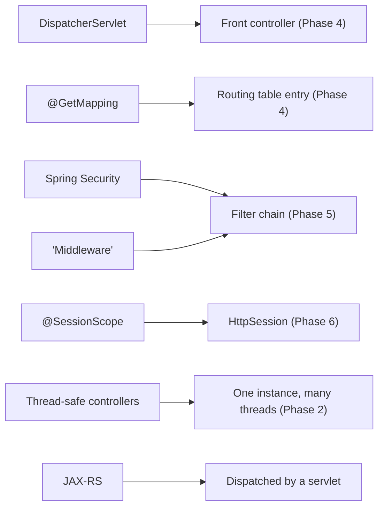

# From Servlets to Frameworks

Go back to the start of this guide for a second. A framework was a black box: you annotated a method, requests showed up, responses went out, and somewhere in the middle a lot of magic happened that you couldn't name.

Look at what you can see now. You know a request arrives at a **container**, which hands it to a **servlet** as an `HttpServletRequest` and an `HttpServletResponse`. You know that servlet is *one instance serving many threads*, which is exactly why shared mutable state bites you. You know a single **front-controller** servlet can route every URL to the right handler. You know **filters** wrap your servlet to run code before and after. You know **sessions** stitch state across a stateless protocol. That's not trivia - that's the whole shape of Java web, and you've now seen all of it bare.

This last phase is the payoff. We're not adding new mechanism. We're pointing the X-ray vision you just built at the frameworks you'll actually use at work, and watching the magic turn into machinery you can already name.

## Mapping the magic to the mechanism

💡 Here's the thing worth reading slowly: every "feature" in a Java web framework is a convenience over something in this guide. Once you've seen the bare version, the framework version stops being a spell and becomes a name for a thing you understand.



Reading that left to right, in plain words:

- **Spring MVC's `DispatcherServlet`** is a front-controller servlet - the exact pattern from [Phase 4](04-mapping-and-the-front-controller.md). The name even says it out loud: it's a *servlet* that *dispatches*. One servlet catches every request and routes it onward.
- **`@GetMapping("/users")`** is an entry in that front controller's routing table. In Phase 4 you wrote the routing map by hand, matching paths to handlers. The annotation is the framework filling in that same table for you.
- **Spring Security** is a servlet **filter chain** - [Phase 5](05-filters-and-the-chain.md), generalized. Authentication, authorization, CSRF protection: each is a filter that runs before your code, can short-circuit the request, or pass it along the chain.
- **"Middleware,"** anywhere you've heard the word, is a filter underneath. Different ecosystems coined a friendlier name for "code that wraps the request before and after your handler." You built one in Phase 5.
- **`@SessionScope`** (a bean that lives for the length of a user's session) is `HttpSession` from [Phase 6](06-sessions-and-state.md), dressed up. The framework stashes the object in the session and pulls it back out per user.
- **Thread-safe controllers** are the one-instance-many-threads rule from [Phase 2](02-the-servlet-container-and-lifecycle.md). Your Spring `@Controller` is a singleton, shared across every concurrent request - which is why you keep request state in locals and parameters, not in fields.
- **JAX-RS** (the Jakarta EE REST standard) is dispatched by a servlet too. A single servlet at the front receives requests and routes them to your annotated resource methods. Same shape, different vendor.

That covers two whole worlds. Spring's web layer lives on top of this - see [Spring Framework From Zero](/guides/spring-framework-from-zero). So does Jakarta's - see [Jakarta EE From Zero](/guides/jakarta-ee-from-zero). Underneath both: a servlet, a front controller, and a filter chain.

## Why you still reach for a framework

Let me be direct, because a roots guide that pretends raw servlets are enough would be doing you a disservice: you don't want to build a real app out of bare servlets. It's genuinely tedious.

You'd hand-write the routing table and keep it in sync by hand. You'd serialize and deserialize JSON yourself, field by field. There's no dependency injection, so you'd wire every collaborator manually. Validation, content negotiation, error pages, exception mapping - all boilerplate you'd write and maintain. The frameworks exist because smart people got tired of writing that code a thousand times, and the conveniences they added are real and worth having.

💡 So here's the point of having learned this: you almost certainly won't write servlets at work - you'll write Spring or Jakarta. What changed is that you now understand *what those frameworks are conveniences over*. That's the entire purpose of a roots guide. When `DispatcherServlet` shows up in a stack trace, you don't flinch - you know it's a front-controller servlet and you can reason about it. When a security filter blocks a request, you know it's a filter in a chain and you know where to look. The framework didn't get simpler; you got the map.

## A note on the modern shift

One plain caveat, because the picture isn't frozen. A newer wave of stacks - reactive, non-blocking, built on event-loop servers like Netty (think Spring WebFlux, or parts of Quarkus) - steps *outside* the classic servlet model. They trade the familiar thread-per-request shape for a smaller pool of threads juggling many requests, and in doing so they bypass the servlet container you met here.

Don't let that unsettle what you just learned. The servlet API still underlies the **vast majority** of Java web running in production today, and the mental model - a request arriving, something routing it, filters wrapping it, a response going back - carries over even to the reactive world; the plumbing differs, the shape rhymes. Knowing the servlet model is still the right foundation, and it's the one almost everything you'll touch is built on.

## What to build - and a last word

📝 Reading got you here. One small build will lock it in for good. Here's the exercise that cements everything:

Build a tiny app with **raw servlets** - no framework. Give it a single front-controller servlet that routes a couple of URLs (Phase 4). Add one **filter** that checks for a logged-in user and redirects to a login page if there isn't one (Phase 5). Use an **`HttpSession`** to remember who's logged in across requests (Phase 6). Keep it small - a couple of pages and a login.

Then do the magic trick: imagine rebuilding the same thing in Spring or Jakarta, and watch it collapse. The routing servlet becomes `@GetMapping` methods. The auth filter becomes a few lines of Spring Security config. The session juggling becomes `@SessionScope` or just disappears. *That contrast* - the bare version next to the convenient version - is what fuses the two layers in your head permanently. You'll never look at a framework annotation the same way again.

When you want the authoritative reference, go to the **Jakarta Servlet specification and its API docs**. They're precise, they're the source of truth, and now that you have the concepts, they'll read as confirmation rather than fog.

The line to carry out of this whole guide: **every Java web framework is conveniences over a servlet, a front controller, and a filter chain - and now you can see all three.** The magic was always just this. Go build the small thing, and watch it stay gone.

## Recap

1. **The X-ray vision is the whole point.** You can now see, under any Java web framework, the request lifecycle, the front controller, the filter chain, and sessions - the bare mechanism this guide built.
2. **Each framework "feature" maps to something you know:** `DispatcherServlet` is a front controller (Phase 4), `@GetMapping` is a routing-table entry, Spring Security and "middleware" are filter chains (Phase 5), `@SessionScope` is `HttpSession` (Phase 6), thread-safe controllers are the one-instance-many-threads rule (Phase 2), and JAX-RS is dispatched by a servlet too.
3. **Frameworks earn their keep.** Raw servlets are tedious - manual routing, manual serialization, no DI, endless boilerplate. Frameworks add the conveniences; this guide showed you *what they're conveniences over*.
4. **A modern caveat:** reactive/Netty-based stacks (WebFlux, parts of Quarkus) step outside the classic servlet model, but the servlet API still underlies the vast majority of Java web, and the mental model carries over.
5. **Build to cement it:** a tiny raw-servlet app with a front controller, an auth filter, and a session - then notice how a framework would collapse it. The Jakarta Servlet spec is your authoritative source.

## Quick check

One last check - the mappings that turn frameworks from magic into mechanism:

```quiz
[
  {
    "q": "Spring MVC's DispatcherServlet is, mechanically, an example of what?",
    "choices": [
      "A front-controller servlet that routes every request onward",
      "A brand-new protocol that replaces HTTP",
      "A database connection pool",
      "A reactive event loop unrelated to servlets"
    ],
    "answer": 0,
    "explain": "The name says it: it's a servlet that dispatches. One front-controller servlet catches every request and routes it to the right handler - exactly the front-controller pattern from Phase 4. @GetMapping is just an entry in its routing table."
  },
  {
    "q": "When a framework talks about 'middleware' or a security layer like Spring Security, what servlet concept is it built on?",
    "choices": [
      "The servlet filter chain",
      "The HttpSession",
      "The servlet's destroy() callback",
      "A second servlet container running alongside the first"
    ],
    "answer": 0,
    "explain": "'Middleware' anywhere, and Spring Security specifically, is a servlet filter chain underneath - code that wraps your servlet to run before and after the request, able to pass it along or short-circuit it. That's Phase 5, generalized."
  },
  {
    "q": "Which statement about the modern reactive shift is accurate?",
    "choices": [
      "Some reactive stacks (WebFlux, parts of Quarkus) bypass the classic servlet model, but the servlet API still underlies the vast majority of Java web",
      "Reactive stacks have completely replaced servlets everywhere",
      "The servlet API was never used in production",
      "Reactive frameworks have nothing to do with HTTP requests and responses"
    ],
    "answer": 0,
    "explain": "Reactive, non-blocking stacks built on event-loop servers like Netty step outside the thread-per-request servlet model - but they're the minority. The servlet API still underlies most Java web in production, and the request/route/filter/response mental model carries over."
  }
]
```

---

[← Phase 6: Sessions & State](06-sessions-and-state.md) · [Guide overview](_guide.md)
