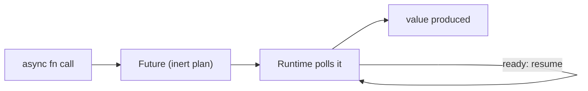

# What Tokio Is & Why Futures Need a Runtime

Here's the thing nobody warns you about when you start writing async Rust: the language hands you `async`,
`await`, and the `Future` trait - and then ships **nothing** to actually run any of it. You can write a
perfect `async fn`, call it, and have *zero lines of its body execute*. The compiler will even shrug and
warn you about an "unused future." Coming from almost any other language, that feels broken. It isn't - once
it clicks, the `#[tokio::main]` sitting at the top of every Rust web server
([axum](/guides/axum-from-zero), actix, Rocket) stops looking like a magic incantation and starts looking
like the plug it actually is.

This is the **roots** guide. The same way [WSGI/ASGI](/guides/wsgi-and-asgi-explained) is the foundation
every Python web app quietly stands on, **Tokio is the foundation every async Rust program stands on**.
Learn this one layer and a whole stack of mysteries above it dissolves.

## The mental model: producers and an engine

Hold this picture and everything in this guide follows from it:

> 📝 **`async fn`s produce inert futures. A runtime (Tokio) is the engine that polls those futures to
> completion.** The function call builds a *plan* for some work; it does not *do* the work. Something else
> has to pick up that plan and drive it. That something is the runtime.

A `Future` in Rust is a value - a little state machine describing "here's the work, and here's how to make
progress on it one step at a time." Calling an `async fn` returns one of these values. That's *all* it does.
Nobody is running it yet. It just sits there, fully formed and completely idle, waiting to be **polled**.

The runtime is the part that polls. It takes your future, asks it "can you make progress?", and keeps asking
- parking the future when it'd block on something slow (a socket, a timer) and waking it back up when that
thing is ready - until the future finally produces its value.



*What just happened:* the diagram is the whole story. An `async fn` call gives you an inert future. Left
alone, it sits at step B forever. The runtime is what carries it from B to D - polling, parking when work
would block, resuming when it can. No runtime, no movement. The future is a plan; Tokio is the worker who
reads the plan and does it.

## Seeing it: `#[tokio::main]`

So how do you actually get a runtime? In a real program you'd build one by hand, but Tokio gives you a
one-line shortcut for the common case. First, pull in the dependency:

```bash
cargo add tokio --features full
```

Then the canonical async program:

```rust
#[tokio::main]
async fn main() {
    println!("hello from an async main");
    say_hi().await;
}

async fn say_hi() {
    println!("hi");
}
```

*What just happened:* `#[tokio::main]` is **sugar**, not magic. At compile time it rewrites your
`async fn main` into an ordinary, non-async `fn main` that does two things: builds a Tokio runtime, then
calls `block_on(...)` on the runtime, handing it the future your async `main` produced. `block_on` is the
bridge from the normal blocking world into async-land - it drives that one future to completion and blocks
the thread until it's done. Inside, `say_hi().await` produces a future *and* tells the runtime "drive this
to completion before moving on," so you see `hello...` then `hi`. Without the macro, `main` can't be `async`
at all (Rust's real entry point is a plain `fn`), which is exactly the gap Tokio is filling.

⚠️ **The gotcha that bites everyone once.** Drop the `.await` and write just `say_hi();`. It compiles. It
runs. And `"hi"` **never prints** - because `say_hi()` only built a future and then dropped it on the floor,
unpolled. The compiler flags this with `warning: unused implementer of Future that must be used` and the
note `futures do nothing unless you .await or poll them`. Read that warning literally: it is not a style
nag, it's the runtime telling you nothing ran. If async code mysteriously "does nothing," a missing
`.await` is the first suspect.

## What a runtime actually does

You'll go deep on the scheduler in Phase 4, but the high-level job of a runtime is worth naming now. A Tokio
runtime is two cooperating parts:

- **The executor** - the part that holds your futures and *polls* them, deciding which one gets to make
  progress next. It runs them concurrently, often across a small pool of OS threads.
- **The reactor** - the part wired into the operating system's I/O and timers. When a future says "I'm
  waiting on this socket / this 5-second timer," the executor **parks** it (stops polling, frees the thread
  for other work) and the reactor remembers to **wake** it the moment that resource is ready.

That park-and-wake dance is the entire point of async: one thread can babysit thousands of in-flight futures
because a future waiting on the network costs nothing while it waits - it's parked, not blocking a thread.

## If you know JavaScript's event loop

📝 If you've written async JavaScript, Tokio plays a role you already recognize: it's the engine that runs
your async code, the rough equivalent of the **event loop** that drives JS promises and `await`. The shape
is familiar - submit async work, let the engine interleave it, get woken when things resolve.

But there's one difference that explains the unused-future warning above. A JavaScript promise is **eager**:
the moment you create it, its work is already scheduled and running. A Rust future is **lazy and polled**:
creating it runs *nothing*, and it only advances when the runtime polls it. That's why a forgotten `.await`
in Rust is silent dead code, where a forgotten `await` in JS still runs the work (you just don't wait for
the result). Same overall job - drive async tasks - opposite default. For the deeper comparison of these
two models, see [/guides/async-await-and-the-event-loop](/guides/async-await-and-the-event-loop).

## Recap

1. Rust gives you `async`/`await` and the `Future` trait but **ships no runtime** - there's nothing built in
   to actually execute futures.
2. A `Future` is **inert**: calling an `async fn` returns a future that does *nothing* until something polls
   it to completion. A missing `.await` runs zero code (and triggers the "unused future" warning).
3. A **runtime** (executor + reactor) is the engine that drives futures: it polls them, parks them when
   they'd block on I/O or timers, and wakes them when ready. **Tokio** is the de-facto one.
4. `#[tokio::main]` is sugar that turns `async fn main` into a normal `fn main` which builds a runtime and
   `block_on`s your async main future.
5. Mental model to keep: **`async fn`s produce inert plans; Tokio is the engine that runs them.** Every Rust
   web server is a pile of futures on this runtime.
6. Like JS's event loop in role, but Rust futures are **lazy and polled**, not eager - which is exactly why
   forgetting `.await` silently runs nothing.

## Quick check

One quick check before we open up the `Future` trait itself in Phase 2:

```quiz
[
  {
    "q": "You call an async fn but forget to .await it (and don't spawn it). What happens?",
    "choices": [
      "None of its body runs - it just builds an inert future that gets dropped, and the compiler warns about an unused future",
      "It runs immediately to completion, you just can't read the return value",
      "It runs on a background thread automatically",
      "The program fails to compile"
    ],
    "answer": 0,
    "explain": "A Rust future is inert: calling the async fn only builds the future. Without .await (or spawning) nothing polls it, so no body runs - and rustc emits 'futures do nothing unless you .await or poll them'. It still compiles; it's just silent dead code."
  },
  {
    "q": "What does #[tokio::main] actually do to your async fn main?",
    "choices": [
      "Rewrites it into a normal non-async fn main that builds a Tokio runtime and block_on()s your async main future",
      "Marks main as a coroutine the OS schedules directly",
      "Spawns every statement in main on its own thread",
      "Replaces println! with an async logging system"
    ],
    "answer": 0,
    "explain": "It's compile-time sugar. Rust's real entry point must be a plain fn, so the macro generates one that constructs a runtime and calls block_on on the future your async main produces - bridging the blocking world into async-land."
  },
  {
    "q": "How does a Rust future differ from a JavaScript promise?",
    "choices": [
      "A Rust future is lazy and only advances when a runtime polls it; a JS promise is eager and starts running the moment it's created",
      "They're identical - both run eagerly on creation",
      "A Rust future runs eagerly, while a JS promise must be polled",
      "Neither does anything until awaited"
    ],
    "answer": 0,
    "explain": "Both fill the 'drive async work' role, but with opposite defaults. JS promises are eager (work is scheduled on creation), while Rust futures are inert until a runtime polls them - which is why a forgotten .await in Rust runs nothing at all."
  }
]
```

---

[Guide overview](_guide.md) · [Phase 2: Async, Await & Futures →](02-async-await-futures.md)
