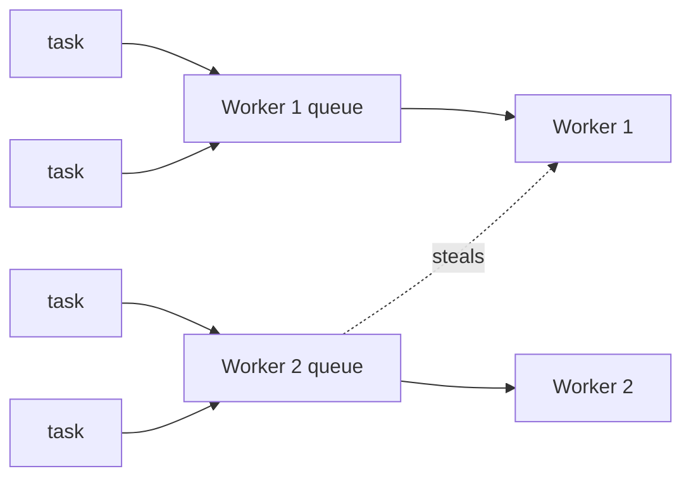

# The Runtime & Scheduler

Here's the mental model to carry through this whole phase, because everything else is a consequence of it:

> 💡 **Tokio runs thousands of tasks on a tiny pool of threads — usually about one thread per CPU core.** Many tasks, few threads. The scheduler keeps those few threads busy by handing each one its own queue of ready tasks, and when a thread runs dry it *steals* work from a neighbor. That's the engine. Once you internalize "few threads, many tasks, balanced by stealing," the one rule that matters falls out on its own: **never let a single task hog a thread.**

You met tasks and `tokio::spawn` in [Tasks & Spawning](03-tasks-and-spawning.md). Now we look under the floorboards at the thing that actually *runs* them — and at the single mistake that brings more async Rust servers to their knees than any other.

## A picture of the engine

When you write the default `#[tokio::main]`, Tokio builds a **multi-threaded runtime**: a pool of **worker threads** (by default, as many as you have CPU cores). Each worker owns a **local queue** of tasks that are ready to make progress. The worker pulls a task off its queue, polls it until it hits an `.await` that isn't ready, sets it aside, and grabs the next one. That's how a handful of threads juggle thousands of tasks — each task only occupies a thread for the brief moment it's actually doing work.

The clever part is **work-stealing**. If one worker empties its queue while another is buried, the idle worker reaches over and steals half the busy worker's tasks. No central dispatcher, no thread sitting idle while another drowns — the load balances itself.



*What just happened:* Tasks land in per-worker queues; each worker chews through its own queue, and an idle Worker 1 steals from Worker 2's queue to even out the load. The arrows are tasks flowing to threads; the dotted arrow is the steal that keeps everyone busy.

## Runtime flavors

You don't always want a whole pool. Tokio gives you three ways to choose:

```rust
// 1. The default: multi-threaded, work-stealing, ~one worker per core.
#[tokio::main]
async fn main() {
    // ...
}

// 2. Single-threaded: everything runs on one thread. Great for tests,
//    CLIs, and light apps where a thread pool is overkill.
#[tokio::main(flavor = "current_thread")]
async fn main() {
    // ...
}
```

*What just happened:* The first form is the multi-threaded runtime you get for free. The second, `current_thread`, runs every task on the single thread that called `main` — no work-stealing, no cross-thread coordination, and your tasks don't need to be `Send`. It's lighter and easier to reason about; it just can't use more than one core.

When you need to set the knobs yourself, build the runtime explicitly with `Builder`:

```rust
fn main() {
    let runtime = tokio::runtime::Builder::new_multi_thread()
        .worker_threads(4)        // pin the pool to 4 workers
        .enable_all()             // turn on the I/O and timer drivers
        .build()
        .unwrap();

    runtime.block_on(async {
        // your async program runs here
    });
}
```

*What just happened:* `Builder` is what `#[tokio::main]` expands into under the hood. `new_multi_thread()` picks the work-stealing scheduler, `worker_threads(4)` overrides the default (instead of "one per core"), `enable_all()` switches on the I/O and time drivers, and `block_on` hands an async block to the runtime and blocks the calling thread until it finishes. Reach for this when the macro's defaults don't fit — separate runtimes for different subsystems, a fixed thread count, custom thread names.

## ⚠️ The cardinal sin: blocking a worker

Here is the mistake. Remember the model: a worker thread polls one task, and it can only move to the *next* task when the current one yields at an `.await`. So what happens if a task **never yields** — if it sits in a tight CPU loop, or calls a synchronous blocking function that parks the thread?

The worker is stuck. It can't poll any of the other tasks sitting in its queue. They're all frozen behind the one greedy task. On a 4-core machine you've just lost a quarter of your entire capacity to a single task. Do it on enough tasks and the whole server seizes up.

> ⚠️ **Blocking the executor is the one mistake that turns a fast async server into a frozen one.** The symptoms are nasty because they're *spooky*: latency spikes out of nowhere, requests that should take 2ms taking 2000ms, "the server just froze for a few seconds." It rarely looks like the line of code that caused it.

Here's the trap in its most innocent form:

```rust
#[tokio::main]
async fn main() {
    // Spawn 100 tasks. Looks harmless. It is not.
    for id in 0..100 {
        tokio::spawn(async move {
            // ⚠️ THE SIN: std::thread::sleep blocks the OS thread.
            // This task does NOT yield — it parks the whole worker.
            std::thread::sleep(std::time::Duration::from_secs(1));
            println!("task {id} done");
        });
    }
    tokio::time::sleep(std::time::Duration::from_secs(5)).await;
}
```

*What just happened:* `std::thread::sleep` puts the *operating-system thread* to sleep — the worker, not the task. While that worker naps, every other task in its queue is stranded. With only a few workers, those 100 tasks crawl through in batches instead of all finishing in roughly one second. The function name says "sleep," but to the runtime it reads as "freeze a worker for one full second." Anything synchronous and slow does the same: a blocking database driver, `std::fs` file reads, a JSON parse over a 50MB payload, a hash over a huge buffer.

## The fixes

Once you see the disease, the cures are mechanical. There are two questions: *is it a timer, or is it real work?*

### If you're sleeping or timing, use Tokio's async sleep

```rust
#[tokio::main]
async fn main() {
    for id in 0..100 {
        tokio::spawn(async move {
            // ✅ tokio::time::sleep yields the worker back to the runtime.
            tokio::time::sleep(std::time::Duration::from_secs(1)).await;
            println!("task {id} done");
        });
    }
    tokio::time::sleep(std::time::Duration::from_secs(2)).await;
}
```

*What just happened:* `tokio::time::sleep(...).await` doesn't park the thread — it tells the runtime "wake me in a second" and **yields**, freeing the worker to poll the other 99 tasks immediately. Now all 100 genuinely run concurrently and finish in about a second. The difference between this and the broken version is a single `.await` on the right `sleep`, and it's the difference between a healthy server and a frozen one.

### If it's unavoidable blocking or heavy CPU work, use `spawn_blocking`

Sometimes you *can't* make the call async — a legacy synchronous library, a blocking driver, or genuinely CPU-bound work like resizing an image. Don't run it on an async worker. Hand it to `spawn_blocking`, which runs your closure on a **separate pool of blocking threads** that exists precisely so async workers stay free:

```rust
#[tokio::main]
async fn main() {
    let result = tokio::task::spawn_blocking(|| {
        // Heavy, synchronous, no .await anywhere — and that's fine here.
        // This runs on the blocking pool, not on an async worker.
        expensive_hash_computation()
    })
    .await
    .unwrap(); // unwrap the JoinError; result is the closure's return value

    println!("hash = {result}");
}

fn expensive_hash_computation() -> u64 {
    (0..50_000_000u64).fold(0, |acc, n| acc.wrapping_add(n.wrapping_mul(31)))
}
```

*What just happened:* `spawn_blocking` moves the closure onto Tokio's dedicated blocking thread pool, so the synchronous CPU grind never touches an async worker — the workers keep serving other tasks the whole time. It hands back a `JoinHandle` just like `tokio::spawn`, so you `.await` it to get the result; the outer `.unwrap()` handles the `JoinError` (if the closure panicked), and the inner value is whatever the closure returned.

> 📝 For **CPU-bound parallelism** — processing thousands of images, crunching a big dataset across all cores — `spawn_blocking` works, but a dedicated thread pool like [rayon](https://docs.rs/rayon) is often the better tool. Rayon is built for data parallelism (`par_iter` and friends) and won't compete with Tokio's I/O threads. Rule of thumb: **async is for waiting; threads (spawn_blocking or rayon) are for computing.**

### A brief note on `block_in_place`

> 📝 There's a third option, `tokio::task::block_in_place`, for when you must block *inside* a multi-threaded worker without shipping the work elsewhere. It tells the runtime "I'm about to block this worker — go move my sibling tasks to other threads first," so they aren't stranded. It's a sharper, more situational tool than `spawn_blocking` (it only works on the multi-threaded runtime, not `current_thread`), so reach for `spawn_blocking` first and keep `block_in_place` in your back pocket for the cases where moving the work out isn't practical.

## Recap

- The default `#[tokio::main]` builds a **multi-threaded, work-stealing runtime**: a pool of worker threads (≈ one per CPU core), each with a local task queue, with idle workers stealing from busy ones to balance load.
- Flavors: the multi-thread default, `current_thread` (everything on one thread — ideal for tests and light apps), or an explicit `tokio::runtime::Builder` when you need to set `worker_threads` and other knobs.
- **Blocking the executor is the cardinal sin:** a task that loops on CPU or calls a synchronous blocking function never yields, so it parks a whole worker and freezes every other task behind it — the source of mystery latency spikes and "the server froze."
- For sleeping and timers in async code, use `tokio::time::sleep(...).await` (it yields), never `std::thread::sleep` (it parks the thread).
- For unavoidable blocking or heavy CPU work, use `tokio::task::spawn_blocking`, which runs the closure on a **separate blocking thread pool** so async workers stay free; reach for rayon for CPU-bound parallelism.
- `block_in_place` exists for blocking inside a multi-thread worker without moving the work, but it's a niche tool — prefer `spawn_blocking`.

## Quick check

```quiz
[
  {
    "q": "On the default multi-threaded runtime, what does the work-stealing scheduler do when one worker thread empties its task queue?",
    "choices": ["It shuts that worker down to save memory", "It steals ready tasks from a busier worker's queue", "It blocks until the main thread assigns it more work", "It spawns a brand-new OS thread for each idle moment"],
    "answer": 1,
    "explain": "Each worker has a local queue; an idle worker steals tasks from a busy one, so load balances itself without a central dispatcher."
  },
  {
    "q": "Why is calling std::thread::sleep inside a Tokio task a problem?",
    "choices": ["It returns an error at compile time", "It parks the whole worker thread, so other tasks on that worker can't make progress", "It silently does nothing in async code", "It uses more memory than tokio::time::sleep"],
    "answer": 1,
    "explain": "std::thread::sleep parks the OS thread (the worker), not just the task. Every other task queued on that worker is frozen until it returns. Use tokio::time::sleep(...).await, which yields."
  },
  {
    "q": "You must run a synchronous, CPU-heavy library call from async code. What's the right tool?",
    "choices": ["Wrap it in an async block and .await it", "Call it directly inside tokio::spawn", "Run it inside tokio::task::spawn_blocking", "Replace it with tokio::time::sleep"],
    "answer": 2,
    "explain": "spawn_blocking runs the closure on Tokio's separate blocking thread pool, so the async worker threads stay free to keep polling other tasks."
  }
]
```

[← Phase 3: Tasks & Spawning](03-tasks-and-spawning.md) · [Guide overview](_guide.md) · [Phase 5: Channels & Synchronization →](05-channels-and-sync.md)
