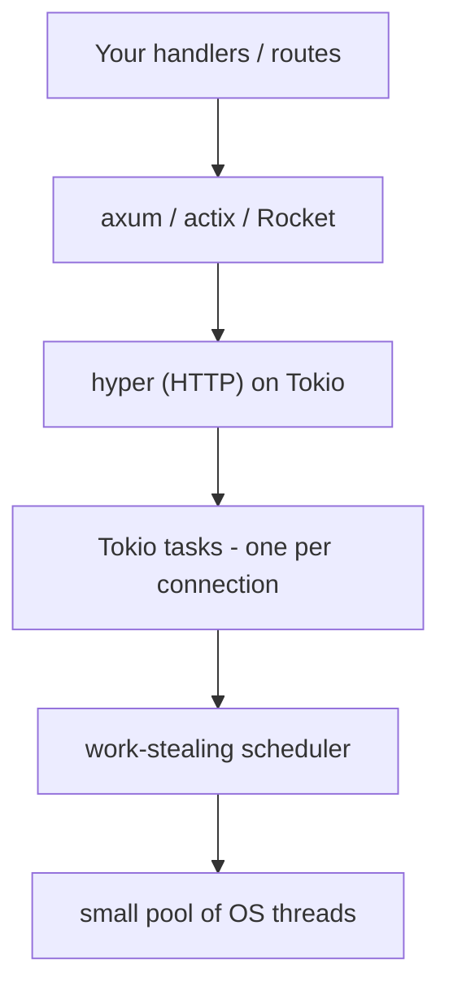

# Where to Go Next

Look at how far you've come. Six phases ago, `#[tokio::main]` was a magic incantation you copied off a tutorial and hoped worked. Now you can name every piece under it.

You know **futures** are inert plans and `.await` is a cooperative yield point - the future hands control back to the runtime instead of blocking. You know **tasks** are spawned with `tokio::spawn`, that they're cheap green threads multiplexed onto a small pool of real ones, and that a `JoinHandle` lets you wait on the result. You know the **scheduler** is multi-threaded and work-stealing, that blocking it starves every other task, and that `spawn_blocking` is the escape hatch. You know **channels** - `mpsc`, `oneshot`, `broadcast` - and why an async-aware `Mutex` is held across `.await` where a `std` one must not be. And you know `select!` races futures, drops the losers, and gives you timeouts and cancellation almost for free.

That's the whole engine. The runtime under every async Rust program is no longer magic - it's machinery you can name.

This last phase doesn't add new mechanism. It points your new X-ray vision at the frameworks and libraries you'll actually reach for, and tells you what to build next.

## Your web framework is a pile of Tokio tasks

💡 Here's the realization that pays off the whole guide: **axum, actix-web, and Rocket aren't alternatives to Tokio - they're Tokio applications.**

When you write `#[tokio::main]` at the top of an axum server, that macro builds the runtime you just learned about. The server itself binds a `TcpListener`, then loops accepting connections - and for each connection it calls `tokio::spawn`. Every request your server handles is running inside a task, on the work-stealing scheduler, woken when its socket has bytes ready. The "framework" is a very nice set of conveniences - routing, extractors, middleware - layered over exactly the spawning and polling you already understand.



Read that top to bottom: your code sits on a framework, the framework sits on **hyper** (the HTTP implementation), hyper sits on Tokio tasks, the scheduler runs those tasks across a handful of real threads, and the OS handles the rest. Nothing in that stack is mysterious to you now.

See [axum from zero](/guides/axum-from-zero) for the framework most new Rust web work starts with, [actix-web from zero](/guides/actix-web-from-zero) for the high-throughput veteran, and [hyper & tower](/guides/hyper-and-tower) for the HTTP layer sitting directly on Tokio - the one place this picture gets concrete.

## The ecosystem worth knowing

Tokio is more than a scheduler. It ships the async building blocks you'll use constantly, and a galaxy of crates is built on top.

From Tokio itself:

- **`tokio::net`** - `TcpListener` and `TcpStream` for TCP, plus UDP sockets. This is where a server actually accepts connections.
- **`tokio::io`** - the `AsyncRead` and `AsyncWrite` traits, the async cousins of `std`'s `Read`/`Write`. Almost everything that moves bytes implements them.
- **`tokio::fs`** - file operations that don't block the scheduler (under the hood it uses `spawn_blocking`, because the OS has no truly async file API on most platforms).
- **`tokio::time`** - `sleep`, `interval`, and the `timeout` you met in [Phase 6](06-select-and-timeouts.md).

And the crates built on Tokio that you'll meet at work:

- **hyper** - the HTTP/1 and HTTP/2 implementation under most Rust web frameworks.
- **tonic** - gRPC, for service-to-service APIs.
- **reqwest** - the ergonomic HTTP *client*, for calling other services.
- **sqlx** - async, compile-time-checked database access (Postgres, MySQL, SQLite).
- **tokio-util** - extras like `CancellationToken` (clean shutdown across many tasks) and codecs for framing byte streams.

📝 You don't need to learn these all at once. The point is that when one shows up in a `Cargo.toml` or a stack trace, you already know the ground it stands on.

## A word on the alternatives

Let me be honest, because a roots guide that pretended Tokio were the only option would be doing you a disservice: it isn't. **`async-std`** and **`smol`** are other async runtimes, and they're real, working projects with thoughtful designs.

But here's the practical reality. Tokio is dominant, and most of the async library ecosystem assumes it. The crates above - hyper, tonic, reqwest, sqlx - are built against Tokio. If you pick a different runtime, you'll find a thinner shelf of compatible libraries and more rough edges.

There's a deeper reason this matters, and it's worth holding onto: **a future generally needs to run on the runtime it was created for.** Tokio's I/O types register with Tokio's reactor; hand one to `async-std`'s executor and it has nothing to wake it. You can't freely mix futures from different runtimes in the same program. So the runtime choice is a foundational one, not a swappable detail - and for almost everyone, the answer that keeps the most doors open is Tokio.

## What to build

💡 Reading got you here. Building is what makes it permanent. You now understand the layer every async Rust program stands on - the fastest way to lock that in is to make the engine do real work.

Pick one of these. Each leans on a different piece you just learned:

- **A chat server.** Accept connections with `tokio::net`, spawn a task per client, and use a `broadcast` channel to fan every message out to all of them. This is the canonical exercise for "many tasks sharing state without locks."
- **A concurrent downloader.** Take a list of URLs, `spawn` a task per download (with `reqwest`), and `join!` them so they all run at once instead of one after another. You'll *feel* the concurrency in the wall-clock time.
- **A worker pool.** Push jobs into an `mpsc` channel from one side; on the other side, a fixed set of worker tasks pull and process them. Backpressure, fan-out, graceful shutdown - all the patterns from [Phase 5](05-channels-and-sync.md) in one small program.

When you've built one and want to see the HTTP layer that sits directly above Tokio - where connections become requests and responses - read [hyper & tower](/guides/hyper-and-tower). That's the natural next rung up the stack.

The line to carry out of this whole guide: **`async fn`s make inert futures; Tokio is the engine that polls, schedules, and wakes them - and now you know the engine.** Go build something that makes it run.

## Recap

1. **Frameworks are Tokio apps.** axum, actix-web, and Rocket build the runtime with `#[tokio::main]` and run as a pile of spawned tasks - one per connection - on the work-stealing scheduler. The framework is conveniences over spawning and polling you already understand.
2. **The stack is legible top to bottom:** your handlers → framework → hyper (HTTP) → Tokio tasks → scheduler → a small pool of OS threads.
3. **Tokio ships the building blocks:** `tokio::net` (TCP/UDP), `tokio::io` (`AsyncRead`/`AsyncWrite`), `tokio::fs`, and `tokio::time`. On top sit hyper, tonic, reqwest, sqlx, and tokio-util.
4. **Alternatives exist but Tokio dominates.** `async-std` and `smol` are real runtimes, but most libraries assume Tokio - and futures generally need the runtime they were made for, so the choice is foundational, not swappable.
5. **Build to cement it:** a chat server (`broadcast`), a concurrent downloader (`spawn` + `join!`), or a worker pool (`mpsc`). Then read hyper & tower for the HTTP layer above Tokio.

## Quick check

One last check - the picture that turns Rust web servers from magic into machinery:

```quiz
[
  {
    "q": "Mechanically, what is an axum (or actix-web, or Rocket) server?",
    "choices": [
      "A Tokio application: #[tokio::main] builds the runtime, and the server spawns a task per connection on the scheduler",
      "A standalone runtime that replaces Tokio entirely",
      "A synchronous, thread-per-request server with no async involved",
      "A browser-side framework that never touches the runtime"
    ],
    "answer": 0,
    "explain": "These frameworks are Tokio apps. The #[tokio::main] macro builds the runtime you learned about, and the server accepts connections in a loop, calling tokio::spawn for each one. Routing and extractors are conveniences over that spawning and polling."
  },
  {
    "q": "Which crate is the HTTP implementation that most Rust web frameworks sit on, directly above Tokio?",
    "choices": [
      "hyper",
      "sqlx",
      "tonic",
      "tokio-util"
    ],
    "answer": 0,
    "explain": "hyper is the HTTP/1 and HTTP/2 implementation under most Rust web frameworks; it runs on Tokio. sqlx is async database access, tonic is gRPC, and tokio-util provides extras like CancellationToken and codecs."
  },
  {
    "q": "Why is choosing a runtime a foundational decision rather than a swappable detail?",
    "choices": [
      "A future generally needs to run on the runtime it was created for, and most async libraries assume Tokio",
      "Runtimes are interchangeable, so any future runs on any executor without issue",
      "async-std is required before Tokio will start",
      "The runtime only matters for file I/O and nothing else"
    ],
    "answer": 0,
    "explain": "Tokio's I/O types register with Tokio's reactor; an executor from a different runtime has no way to wake them. You can't freely mix futures across runtimes, and since most of the ecosystem (hyper, reqwest, sqlx) targets Tokio, it's the choice that keeps the most doors open."
  }
]
```

---

[← Phase 6: select! & Timeouts](06-select-and-timeouts.md) · [Guide overview](_guide.md)
