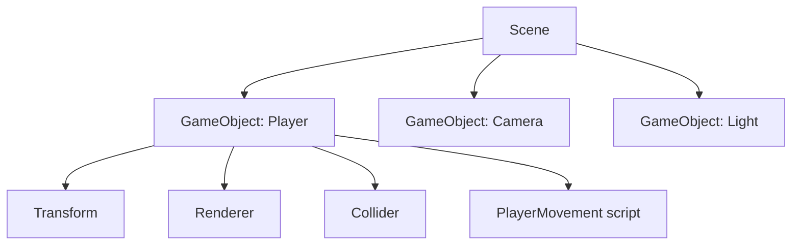

# What Unity Is

You already know [C#](/guides/csharp-from-zero) - classes, methods, fields, inheritance. That
single fact is the reason Unity is your fastest route into making games. Unity powers an enormous
slice of the games you've actually played: indie darlings, the mobile titles topping the charts,
and plenty of AA productions. It's also a career path of its own, sitting well apart from web and
backend work.

Here's the one idea to hold before any of the windows and menus pile up. An **engine** is a
framework for games - the same "don't call us, we'll call you" relationship you met in
[What a Framework Even Is](/guides/what-a-framework-even-is), pointed at a different problem. The
engine owns the loop, the rendering, the physics, the clock; you fill in the blanks with assets
and scripts, and the engine runs them at the right moments. You are not writing the thing that
draws pixels to the screen sixty times a second. You're writing the thing that decides what those
pixels should *do*.

## The mental model: bags of Components

If you remember nothing else from this phase, remember this sentence:

> **A Scene is a collection of GameObjects; a GameObject is a bag of Components; your scripts are
> Components the engine runs.**

Let's unpack it from the outside in.

📝 **Scene** - one self-contained slice of your game: a level, a menu, a loading screen. You build
your game out of scenes and switch between them. Whatever is "live" right now lives in the current
scene.

📝 **GameObject** - a single thing *in* a scene. The player is a GameObject. So is the camera, the
light, an enemy, a button on your UI, an invisible spawn point. Here's the catch that trips people
up: a GameObject, on its own, **does nothing**. It's an empty container with a name. It has no
shape, no behavior, no physics until you give it some.

📝 **Component** - the part that actually *does* something, attached to a GameObject. Want the
object to be somewhere in space? That's the **Transform** component (every GameObject has one, for
free - position, rotation, scale). Want it to be visible? Add a **Renderer**. Want it to fall and
collide? Add a **Rigidbody** and a **Collider**. Want it to chase the player? Add *your script* -
because a script is a Component too (more on that in Phase 4).

So a "player" isn't a special Player type the engine knows about. It's a plain GameObject with a
Transform, a Renderer so you can see it, a Collider so it bumps into walls, and a movement script
you wrote. Stack different components and you get a different thing. Same container, different
contents.



*What just happened:* the scene holds several GameObjects, and the Player GameObject is nothing but
the four components clipped onto it. Pull off the script and the player stops moving but still
exists. Pull off the Renderer and it moves invisibly. The GameObject is the hook; the components
are everything that matters.

### Composition over inheritance - the real shift

This is the single biggest mental adjustment for someone coming from ordinary OOP, so it's worth
saying plainly.

📝 **Composition over inheritance** - instead of building a deep class tree (`Entity` →
`Character` → `Enemy` → `FlyingEnemy`) and inheriting behavior, you keep GameObjects simple and
**attach** behavior as components. A flying enemy isn't a subclass; it's a GameObject with a
Renderer, a Collider, a `Flying` component, and an `Enemy` component. Want a flying *player*?
Attach the same `Flying` component to the player. Nothing to refactor.

💡 Coming from C#, your instinct is to reach for inheritance - make a base class, override methods,
build the hierarchy. Unity gently steers you the other way. You'll still write classes (each script
*is* a class), but you compose a GameObject's abilities by mixing components rather than by
subclassing a god-object. Fight this instinct and Unity feels awkward. Lean into it and the whole
engine clicks.

## What the engine gives you vs. what you write

A clean way to keep your bearings: know which side of the line each thing is on.

**The engine handles** (you configure it, you don't build it):

- **Rendering** - turning your 3D/2D scene into pixels on screen, every frame.
- **Physics** - gravity, collisions, forces, bouncing (via Rigidbody and Collider components).
- **Audio** - playing sounds and music, positioned in space.
- **Input** - reading the keyboard, mouse, gamepad, or touchscreen.
- **Builds** - packaging your project into an actual app for Windows, macOS, Android, iOS,
  consoles, and the web.

**You supply:**

- **Assets** - the raw materials: 3D models, sprites, textures, audio clips, fonts.
- **C# scripts** - the *behavior*. The rules of your game. What happens when the player presses a
  key, touches a pickup, runs out of health.

⚠️ That split is the deal Unity offers, and it's a good one - but it means a chunk of your work
happens in the editor (dragging assets, wiring up components in the Inspector) rather than purely
in code. Unity is not a library you `import` into a C# project; it's an application you work
*inside*. We'll tour that editor in Phase 2.

## A first taste of a script

You won't write much code in this phase - the full script lifecycle is Phase 4 - but seeing one
now makes "a script is a Component" concrete. In the editor you'd create a C# script (an
asset in your Project window), open it, and you'd find something close to this:

```csharp
using UnityEngine;

public class HelloWorld : MonoBehaviour
{
    // Unity calls this once, automatically, when the object comes to life.
    void Start()
    {
        Debug.Log("The pickup game is alive!");
    }
}
```

*What just happened:* you wrote a normal C# class, but it inherits from **`MonoBehaviour`** - the
base class that makes a script attachable to a GameObject as a Component. You never call `Start()`
yourself. The engine does, exactly once, when the GameObject wakes up - that's the framework
relationship in action. `Debug.Log` prints to Unity's Console window (the engine's version of
`Console.WriteLine`). Attach this script to any GameObject, press Play, and the message appears.
That's the entire shape of Unity scripting: write a `MonoBehaviour`, attach it, let the engine call
your methods at the right time. Phase 4 covers `Update` and the rest of the lifecycle.

## The game we'll build

To keep everything grounded, this whole guide builds one small, real game together: a top-down
**collect-the-pickups** game.

- A **player** GameObject you move around with the keyboard.
- A handful of **pickup** GameObjects scattered around to grab.
- A **score** that goes up each time you collect one.

It's deliberately tiny, but it exercises the real machinery: input and movement (Phase 5), physics
and triggers so the player can "touch" a pickup (Phase 6), spawning pickups at runtime (Phase 7),
and a score UI plus a built, playable file you can hand to a friend (Phase 8). Every concept lands
in that one game instead of floating as a disconnected demo.

⚠️ One practical note before we go further: Unity does all of this inside its own **editor**
application, not on a web page - so unlike the runnable snippets elsewhere in this library, the
code here is shown to read and to type into Unity, not to run in your browser. Getting comfortable
in that editor is exactly what Phase 2 is for.

## Recap

1. **Unity is a game engine + editor.** The engine owns rendering, physics, audio, input, and
   cross-platform builds; you supply **assets** and **C# scripts**. It's a framework for games and
   a career path of its own.
2. **The core mental model:** a **Scene** holds **GameObjects**; a **GameObject** is an empty bag
   of **Components**; the components are what give it shape, physics, and behavior.
3. **A GameObject does nothing by itself.** Every one has a free **Transform** (position/rotation/
   scale); you add a Renderer (looks), a Collider/Rigidbody (physics), and your scripts (behavior).
4. 📝 **Composition over inheritance** is the big shift from ordinary OOP: attach components to
   compose behavior instead of subclassing a god-object. A script *is* a Component, via
   `MonoBehaviour`.
5. **You work inside Unity's editor app**, not just in a code file - and the engine calls your
   script methods (like `Start`) for you, the classic "don't call us, we'll call you."
6. We'll build one running example throughout: a **collect-the-pickups** game (move a player, grab
   pickups, raise a score).

## Quick check

Three questions on the ideas that have to stick - what Unity is, how the GameObject/Component model
works, and the composition shift:

```quiz
[
  {
    "q": "In Unity's model, what is a GameObject on its own?",
    "choices": [
      "An empty container that does something only via the Components attached to it",
      "A fully-featured player character with built-in movement and physics",
      "A C# class you must inherit from to make a game",
      "The window where you edit your scene"
    ],
    "answer": 0,
    "explain": "A GameObject is just a named container. It does nothing until you attach Components - every one has a free Transform, and you add a Renderer, Collider/Rigidbody, and scripts to give it looks, physics, and behavior."
  },
  {
    "q": "Which work does the Unity engine handle for you, versus what you supply?",
    "choices": [
      "The engine handles rendering, physics, audio, input, and builds; you supply assets and C# scripts",
      "The engine writes your game logic; you only design the box art",
      "You handle rendering and physics by hand; the engine just stores files",
      "The engine and you both write the rendering loop together each frame"
    ],
    "answer": 0,
    "explain": "Unity's deal: the engine owns rendering, physics, audio, input, and cross-platform builds. You provide the assets (models, sprites, audio) and the C# scripts that define behavior."
  },
  {
    "q": "What does 'composition over inheritance' mean in Unity?",
    "choices": [
      "You attach Components to compose behavior instead of subclassing a deep god-object hierarchy",
      "You must inherit every GameObject from a single base Entity class",
      "Composition means writing music for your game before the code",
      "It means you never write C# classes at all in Unity"
    ],
    "answer": 0,
    "explain": "Rather than a deep inheritance tree, you keep GameObjects simple and mix in behavior by attaching Components. A script is itself a Component (a MonoBehaviour), so you compose abilities instead of subclassing."
  }
]
```

---

[Guide overview](_guide.md) · [Phase 2: The Editor →](02-the-editor.md)
