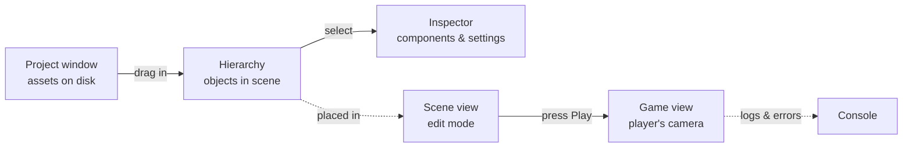

# The Editor

Here's the mental model to carry through this whole phase: **the editor is where you assemble a Scene.** Everything you see on screen is one window doing one job in that assembly. The **Hierarchy** lists the objects in your scene. The **Scene view** is where you place and move them. The **Inspector** configures each one. The **Project window** holds the raw assets on disk. And the **Game view** plus the **Play** button show you what the player will actually experience. Once you know which window does what, the editor stops being a wall of panels and becomes a workshop where each tool has its bench.

> 💡 You don't *program* the layout of a scene — you *arrange* it by hand, visually, and then your scripts (Phase 4 onward) animate that arrangement. The editor is the hands-on half of Unity; C# is the other half.

## Getting in: Unity Hub and a new project

You don't download "Unity" as a single thing. You download **Unity Hub** — a small launcher whose job is to manage editor versions and your projects. Think of the Hub as the front desk: it installs the actual editor (you can have several versions side by side) and creates projects that are pinned to a version.

When you install an editor version, pick an **LTS** release (Long-Term Support). LTS versions are the boring, stable ones that get bug fixes for years — exactly what you want while learning, instead of chasing the newest features and their newest bugs.

Then create a new project. The Hub asks you to pick a **template**:

- **3D** — a scene set up for three-dimensional games (perspective camera, 3D physics).
- **2D** — a scene set up for flat games (orthographic camera, 2D sprites and physics).

> 📝 For the collect-the-pickups game this guide builds, a **3D** template is the simplest starting point — we'll move a sphere around a flat plane. Give the project a name, pick a folder, and let the Hub open the editor. The first open is slow; it's compiling and importing. That's normal.

## Walking the windows

When the editor opens you'll see a handful of docked panels. The exact arrangement varies by layout, but every Unity install has these six, and learning what each is *for* matters far more than where it happens to sit.

**Hierarchy** — the list of every GameObject in the *current* scene, shown as a tree. A fresh 3D scene usually starts with a **Main Camera** and a **Directional Light** already in it. When you add objects, they appear here. The Hierarchy is your scene's table of contents — it answers "what's in this scene?"

**Scene view** — the interactive viewport where you build. You orbit, pan, and zoom around your world here, and you select, move, rotate, and scale objects directly. This is **edit mode** — the workbench. Nothing here is "running"; you're laying out the furniture.

**Game view** — what the player sees, rendered through the scene's **Camera**. It looks similar to the Scene view but it's a fundamentally different thing: the Scene view is *your* god's-eye editing camera, while the Game view is the *player's* camera. The Game view comes alive when you press Play.

**Inspector** — the properties panel for whatever you've selected. Select a GameObject and the Inspector shows its **Components** — each one a block of editable settings. This is where you tweak almost everything in Unity: position, color, physics settings, the public fields of your scripts. If you ever wonder "where do I change this?", the answer is usually the Inspector.

**Project window** — your assets as they live **on disk**: scripts, 3D models, textures, audio, prefabs, and scenes. This is the difference between *what exists in your project* (Project window) and *what's placed in the current scene* (Hierarchy). You drag assets from here into the scene to use them.

**Console** — the message log. Errors (red), warnings (yellow), and your own `Debug.Log` output (white) all show up here. When something doesn't work, the Console is the first place to look — a red error with a line number is Unity telling you exactly what broke.

> 💡 Two pairs are easy to confuse, so anchor them now: **Scene view = your editing camera / Game view = the player's camera.** And **Hierarchy = objects in this scene / Project = assets on disk.** Mixing these up is the most common beginner stumble.



## Play mode, and the trap that bites everyone

The **Play** button (the triangle at the top center of the editor) runs your game. Press it and the editor switches focus to the **Game view**: scripts start executing, physics simulates, input is read, and you can actually play what you've built. Press it again to stop and return to edit mode.

This is the single most powerful thing about the editor — you can test instantly, without building or exporting anything. But it comes with a trap that catches nearly every beginner at least once:

> ⚠️ **Changes you make to objects WHILE in Play mode are DISCARDED when you stop.** If you press Play, then move the player or tweak a value in the Inspector to "fix" something, all of those edits vanish the moment you hit Stop. Unity does this on purpose — Play mode is a sandbox so you can experiment freely without wrecking your scene. The rule: **make real edits in edit mode (Play not pressed).** A common safeguard is to tint the editor a different color while in Play mode (a setting in Preferences) so you can *see* at a glance that your edits are temporary.

## Building the first scene

Now put the windows to work and lay down the start of the actual game: a flat ground and a player to stand on it. These are pure editor steps — no code yet. You'll do this in **edit mode**, with Play *not* pressed.

**1. Create and save a Scene.** A **Scene** is a saved arrangement of GameObjects — a level, a menu, a screen. A project has many of them. Your new project already opened with an empty-ish scene, so save it first with `File → Save As`, and call it something like `Main`. It'll appear in the Project window as a `.unity` asset. Saving early means there's something to save *to* as you work.

**2. Add the ground.** In the menu bar, choose `GameObject → 3D Object → Plane`. A flat square appears in the Scene view and a "Plane" entry shows up in the Hierarchy. That's your floor.

**3. Add the player.** Choose `GameObject → 3D Object → Sphere` (a capsule works too). A ball drops into the scene. Rename it in the Hierarchy — double-click and type `Player` — so future-you knows what it is. By default it'll likely spawn at the world origin, halfway sunk into the plane.

**4. Position it with the Inspector.** Select `Player` in the Hierarchy. The Inspector fills with its Components — the most important being the **Transform**, which holds **Position**, **Rotation**, and **Scale**. The Transform is on *every* GameObject; it's how Unity knows where a thing is. Set the Player's Position **Y** to something like `0.5` so the sphere rests *on* the plane instead of inside it. Watch the Scene view update live as you type.

> 💡 You just used the core loop of editor work: **add a GameObject, select it, configure it in the Inspector.** Notice you changed the object's place in the world by editing a *Component* (the Transform) — not the object directly. That's the composition idea from Phase 1 made concrete, and it's exactly what Phase 3 cracks open: every GameObject is a bag of Components, and the Transform is the one they all share.

**5. Press Play.** Hit the Play button and look at the **Game view** — you'll see your sphere on a plane, through the Main Camera's eyes. Nothing moves yet (no scripts), but this *is* your game, running. Press Play again to stop. (And remember the trap: if you nudged anything while playing, it didn't stick.)

That's a real, if very quiet, scene — assembled entirely with the windows you just learned.

## Recap

- The editor is **where you assemble a Scene**; each window has one job in that assembly.
- **Hierarchy** = objects in the current scene · **Project** = assets on disk · **Scene view** = your editing camera · **Game view** = the player's camera · **Inspector** = the selected object's Components · **Console** = logs and errors.
- You get Unity through **Unity Hub**, which installs editor versions (pick **LTS**) and creates projects from a **2D** or **3D** template.
- **Play mode** runs the game instantly in the Game view — but ⚠️ edits made *during* Play are discarded; make real changes in edit mode.
- A **Scene** is a saved arrangement of GameObjects; the core editor loop is **add a GameObject → select it → configure it in the Inspector** (where the **Transform** lives).

Check yourself before moving on:

```quiz
[
  {
    "q": "What's the difference between the Hierarchy and the Project window?",
    "choices": ["They're two names for the same panel", "Hierarchy lists objects in the current scene; Project shows assets on disk", "Hierarchy is for 3D and Project is for 2D", "Hierarchy shows assets; Project shows the running game"],
    "answer": 1,
    "explain": "The Hierarchy is the tree of GameObjects in the scene you're editing; the Project window is your assets (scripts, models, scenes) as files on disk."
  },
  {
    "q": "You press Play, move the Player in the Scene view to fix its position, then press Stop. What happens to that move?",
    "choices": ["It's saved permanently", "It's discarded — edits made during Play mode don't stick", "It saves only if you also save the scene", "Unity asks whether to keep it"],
    "answer": 1,
    "explain": "Play mode is a sandbox: any change you make while playing is thrown away when you stop. Edit in edit mode (Play not pressed)."
  },
  {
    "q": "Where do you change a GameObject's position, and through what?",
    "choices": ["In the Console, by typing a command", "In the Project window, on the asset file", "In the Inspector, via its Transform component", "In the Game view, by dragging the camera"],
    "answer": 2,
    "explain": "Selecting an object shows its Components in the Inspector. The Transform component holds Position, Rotation, and Scale — and every GameObject has one."
  }
]
```

[← Phase 1: What Unity Is](01-what-unity-is.md) · [Guide overview](_guide.md) · [Phase 3: GameObjects & Components →](03-gameobjects-and-components.md)