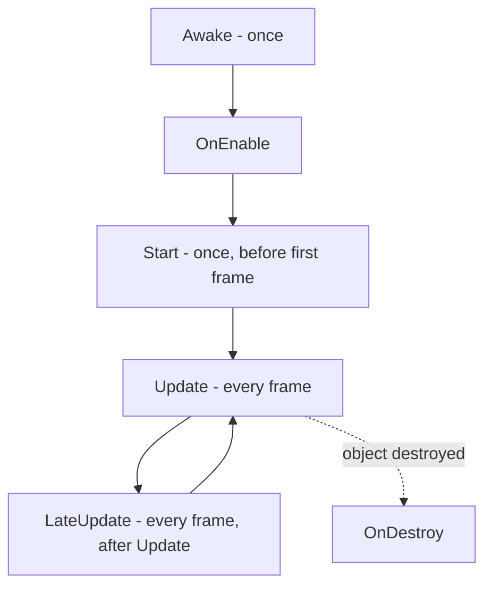

# MonoBehaviour & the Game Loop

**A MonoBehaviour is a Component the engine drives.** You don't write a `main()` and call your own code. You write a class, override a few specially-named methods, attach it to a GameObject - and from then on Unity calls those methods *for* you, on a schedule. `Start` runs once. `Update` runs every single frame, forever, until the object goes away. That repeating call is the game loop, and your scripts ride on top of it.

> 💡 If you've done web work, flip your usual instinct. There you mostly *call* the framework. Here the framework calls *you*. Your job is to fill in the right hooks and trust the engine to invoke them at the right moments. This is the inversion of control that makes a real-time game possible.

## A script becomes a Component

Back in [Phase 3](03-gameobjects-and-components.md) you saw that a GameObject is a bag of Components, and your scripts are Components too. The mechanism is one keyword: your class inherits from **`MonoBehaviour`**.

```csharp
using UnityEngine;

public class Player : MonoBehaviour
{
    void Start()
    {
        Debug.Log("Player ready");
    }

    void Update()
    {
        // runs once per frame
    }
}
```

*What just happened:* `Player` inherits `MonoBehaviour`, which is what lets you drag the `Player.cs` file onto a GameObject and have it show up as a Component in the Inspector. Once attached, Unity sees the `Start` and `Update` methods and calls them automatically - `Start` one time as the object comes alive, `Update` on every frame after. Notice you never wrote a line that *calls* `Start` or `Update`. You don't. That's the engine's job.

> 📝 The file name must match the class name. `Player.cs` must contain `class Player`. If they disagree, Unity refuses to attach the script and gives you an error in the Console. This trips up nearly everyone once.

## The lifecycle methods

Unity calls a set of methods at specific moments in an object's life. You override the ones you care about and ignore the rest. Here are the ones that actually matter day to day, in roughly the order they fire:

- **`Awake()`** - called once, the moment the object loads, before anything else. Use it to set up *this* object's own references (grabbing a Component, initializing a field).
- **`OnEnable()`** - called whenever the object or component becomes enabled (including every time it's re-enabled later).
- **`Start()`** - called once, just before the object's first frame, *after* every object's `Awake` has run. Because all the `Awake`s are done by now, `Start` is the safe place for setup that reaches *across* objects ("find the score manager and talk to it").
- **`Update()`** - called **every frame**. This is where most of your game logic lives: reading input, moving things that aren't physics-driven, checking conditions.
- **`FixedUpdate()`** - called every fixed physics step (not every frame). Anything touching a Rigidbody or physics goes here - that's [Phase 6](06-physics-and-collisions.md).
- **`LateUpdate()`** - called after *all* `Update`s have run this frame. Classic use: a camera that follows a target, so it moves only after the target has finished moving.
- **`OnDestroy()`** - called when the object is destroyed. Clean-up lives here.



The `Awake` vs `Start` split confuses people, so hold this: **`Awake` = set yourself up. `Start` = talk to others.** By the time any `Start` runs, every object has finished its `Awake`, so cross-object references are guaranteed to exist.

## The #1 beginner bug: forgetting `Time.deltaTime`

This is the trap that catches everyone, so read it twice. Your `Update` runs once per frame - but **frames don't arrive at a fixed rate.** A beefy gaming PC might render 240 frames a second; a tired laptop might manage 30; and even on one machine the rate jitters moment to moment.

So if you move an object "a little bit each frame," you've accidentally tied your game's speed to the frame rate. The same code crawls on a slow machine and rockets on a fast one. That's not a quirk you can ignore - it makes your game unplayable on hardware you didn't test on.

The fix is **`Time.deltaTime`**: the number of seconds that elapsed since the *previous* frame. Multiply any per-frame change by it, and you convert "per frame" into "per second" - frame-rate independent.

```csharp
using UnityEngine;

public class Mover : MonoBehaviour
{
    public float speed = 5f;

    void Update()
    {
        transform.position += Vector3.forward * speed * Time.deltaTime;
    }
}
```

*What just happened:* every frame, this nudges the object forward. On a 60-FPS machine `Time.deltaTime` is about `0.0166` (1/60th of a second); on a 30-FPS machine it's about `0.0333`. The slower machine runs `Update` half as often but moves *twice as far* each time - so over a full second both machines move exactly `speed` units (5 units/sec). That's the whole point: the object travels the same real-world distance per second regardless of how fast the hardware draws frames.

> ⚠️ Drop the `* Time.deltaTime` and your object moves `speed` units *per frame* instead of per second - meaning it flies five-plus times faster on a 300-FPS desktop than on a 60-FPS laptop. If your movement "works on my machine" but is unplayable elsewhere, this is almost always why. Make `* Time.deltaTime` a reflex for anything time-based in `Update`.

## Public fields show up in the Inspector

Notice `public float speed = 5f` in that script. Because it's `public`, Unity surfaces it as an editable field in the Inspector when you select the GameObject. A designer (or you, an hour later) can retune the speed by typing a new number - no code change, no recompile.

If you'd rather keep the field private to your code but *still* expose it in the Inspector, mark it with `[SerializeField]`:

```csharp
using UnityEngine;

public class Mover : MonoBehaviour
{
    [SerializeField] private float speed = 5f;

    void Update()
    {
        transform.position += Vector3.forward * speed * Time.deltaTime;
    }
}
```

*What just happened:* `speed` is now `private` - other scripts can't reach in and change it - yet `[SerializeField]` tells Unity to show and serialize it in the Inspector anyway. You get the best of both: encapsulation in code, tweakability in the editor. This is the idiomatic Unity way, and it's how you let non-programmers balance your game without touching C#.

> 💡 The Inspector value *wins* over the value in your code. If you write `= 5f` but type `8` in the Inspector, the object runs with `8`. The code value is just the default for a freshly-added component.

## Talking to the Console with `Debug.Log`

Your oldest, most reliable friend for figuring out what a script is doing is **`Debug.Log(...)`**, which prints to the Console window you met in [Phase 2](02-the-editor.md).

```csharp
void Start()
{
    Debug.Log("Player ready, speed is " + speed);
}
```

*What just happened:* when this object comes alive, a line appears in the Console. Sprinkle these to answer "did this method even run?" and "what's this value right now?" - the two questions behind most early Unity confusion. It's the print-debugging you already know, wired into the editor.

> 📝 A note you'll need in Phase 6: keep **logic in `Update`** and **physics in `FixedUpdate`**. Reading input and non-physics movement belong in `Update` (it tracks the frame rate, so it feels responsive). Anything that pushes a Rigidbody around belongs in `FixedUpdate` (it runs on the steady physics clock, so the simulation stays stable). Mixing them up - shoving a Rigidbody in `Update` - leads to jittery, frame-rate-dependent physics. We'll do this properly when we add collisions.

## Recap

- A class becomes a Component by inheriting **`MonoBehaviour`**; attach the `.cs` file to a GameObject and Unity calls its lifecycle methods for you - you never call them yourself.
- The lifecycle in order of use: **`Awake`** (set yourself up, once), **`OnEnable`**, **`Start`** (talk to other objects, once before the first frame), **`Update`** (every frame, game logic), **`FixedUpdate`** (physics steps), **`LateUpdate`** (after all Updates, e.g. cameras), **`OnDestroy`** (cleanup).
- **`Update` runs every frame, and frame rate varies between machines** - so multiply anything time-based by **`Time.deltaTime`** to make movement consistent (units per second, not per frame). Forgetting this is the classic beginner bug.
- **`public`** or **`[SerializeField]`** fields appear in the Inspector, letting you and designers retune values without editing code; the Inspector value overrides the code default.
- **`Debug.Log`** prints to the Console - your go-to for checking whether code ran and what a value is.

## Quick check

Test the lifecycle and the `deltaTime` rule before moving on:

```quiz
[
  {
    "q": "Which method does Unity call once per frame, where most game logic and non-physics movement belong?",
    "choices": ["Awake()", "Start()", "Update()", "OnDestroy()"],
    "answer": 2,
    "explain": "Update() runs every frame. Awake and Start run once; OnDestroy runs when the object is destroyed."
  },
  {
    "q": "Why must you multiply per-frame movement by Time.deltaTime?",
    "choices": ["To make the object move faster", "Because frame rate varies between machines, so it keeps speed measured per second instead of per frame", "Because Update only runs on physics steps", "It's only needed in FixedUpdate"],
    "answer": 1,
    "explain": "Time.deltaTime is the seconds since the last frame. Multiplying by it converts 'per frame' into 'per second', so movement is the same speed regardless of frame rate."
  },
  {
    "q": "How do you make a private field editable in the Inspector?",
    "choices": ["Make it public", "Mark it with [SerializeField]", "Call Debug.Log on it", "Move it into Awake()"],
    "answer": 1,
    "explain": "[SerializeField] exposes a private field in the Inspector while keeping it private to your code. (Making it public also exposes it, but loses the encapsulation.)"
  }
]
```

[← Phase 3: GameObjects & Components](03-gameobjects-and-components.md) · [Guide overview](_guide.md) · [Phase 5: Transforms, Input & Movement →](05-transforms-input-movement.md)
