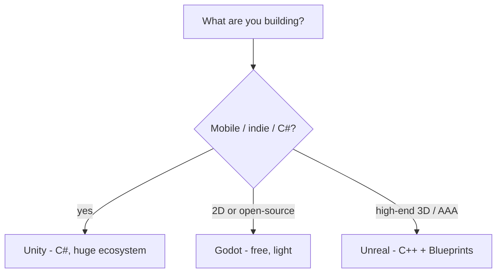

# Where to Go Next

Look at what you can actually do now. You can open the Unity editor and not feel lost in it. You understand that a scene is a pile of **GameObjects**, each one a bag of **Components**, and that your scripts are Components the engine wires into its own loop. You've written a `MonoBehaviour` with `Start` and `Update`, moved an object frame-rate-independently, read input, given things a Rigidbody and watched physics catch collisions, spawned objects from a **prefab** at runtime, put a score on screen, played a sound, and **built** the whole thing into something a person can run. That's not a tech demo you copied. That's a game. You made it.

And the quiet bigger win: the composition model you held onto the whole way through isn't a Unity quirk, it's how the engine *thinks*. You can read a scene now. You can look at a GameObject in the Inspector, see its stack of Components, and reason about why it behaves the way it does. That instinct carries into everything you build next.

So this last phase isn't more `Update` loops. It's the map: where Unity sits among the other engines, the features you'll reach for as your games get bigger, a clear word about what gamedev actually demands, and one concrete thing to go finish.

## Unity vs the field

Unity isn't the only engine, and pretending otherwise does you no favors. Here's the clear-eyed lay of the land for the three you'll hear about most.



- **Unity** - C#, an enormous asset store and community, and it ships everywhere: mobile, desktop, console, web. It's the workhorse of indie and a lot of AA. (You're here, and you already speak its language.)
- **Godot** - free and fully open-source, lighter and faster to start, with its own **GDScript** (and C# support too). It shines for 2D and small indie projects, and there's no company or license fee between you and your game.
- **Unreal** - C++ plus **Blueprints** (a visual, node-based scripting system), with AAA-grade rendering out of the box. It's aimed at bigger, high-end 3D projects and is the standard in a lot of studios.

💡 If you already know C#, Unity is a strong default, especially for mobile and indie. Reach for Godot when you want open-source and 2D; reach for Unreal when you're chasing high-end 3D and don't mind C++. The language matters less than people think, but if you want to deepen the one Unity speaks, [C# From Zero](/guides/csharp-from-zero) is right next door.

None of these is "the best engine." They're aimed at different jobs, and knowing which fits *this* project is the senior instinct. You've got the pieces for it now.

## What to learn next in Unity

You learned the engine's spine. These are the next vertebrae, roughly in the order they'll start to matter.

- **ScriptableObjects** - data as assets. Instead of stuffing config, item definitions, or event channels into GameObjects, you make a `ScriptableObject` asset that lives in your project and gets shared and edited in the Inspector. It's how you keep data out of your scenes and your designers happy.
- **Coroutines** - for timed sequences. A method returning `IEnumerator` with `yield return` lets you spread work across frames: wait two seconds, then spawn; fade something out over time; run a step-by-step intro. It's the everyday tool for "do this, wait, then do that."
- **The Animator** - Unity's animation state machine, for character animation, transitions, and blends. Anything that moves with more life than a script nudging a Transform usually runs through here.
- **The new Input System** - action-based input that maps "Jump" or "Move" to keys, buttons, and gamepad sticks without hard-coding devices. It's where input is heading; worth adopting once your control scheme grows past a couple of keys.
- **The Asset Store & Package Manager** - you don't build everything from scratch. The Asset Store has art, tools, and systems; the Package Manager pulls in official Unity packages. Learning to lean on these well is its own skill.
- **DOTS / ECS** - the data-oriented stack, for when you need *thousands* of objects on screen at once and the normal GameObject model can't keep up. It's advanced and a real shift in thinking. File it under "later, if a project demands it" - don't reach for it early.

A small `ScriptableObject` to hold your pickup's settings, a coroutine to spawn pickups on a timer - those two alone will level up the game you already have.

## Gamedev is more than code

📝 Here's the thing nobody tells you early enough: gamedev is as much **design, art, and audio** as it is programming. A mechanically perfect game with no feel, no art, and no sound is a prototype, not a game. You'll spend real time on level pacing, on how a jump *feels*, on a sound that makes a pickup satisfying. That's not a distraction from the "real" work - it *is* the work.

And the hardest, most important lesson: **small finished games beat big unfinished ones.** Every beginner has a sprawling dream project. Almost none of them ship it. The ones who get good are the ones who finished something small, learned what finishing actually costs, and did it again.

The best forcing function for that is a **game jam**. Events like **Ludum Dare** and **GMTK Jam** give you a theme and a deadline (often 48 hours), and the deadline does something tutorials can't: it makes you *ship*. You'll cut scope, solve real problems, and have a finished thing at the end. Do one. It's worth more than a month of reading.

## What to build

Reading more won't make this stick. Finishing one real thing will. So, concretely:

**First, extend the pickups game you built.** Add a **timer** so rounds end. Add **lives**. Add a couple of **levels** that ramp up. Put a **start menu** in front of it and a **game over** screen behind it. Every one of those touches something you learned: UI, game state, prefabs, audio. You'll hit small walls, and climbing them is where the learning is.

**Then, build one small game end to end and publish it.** Pick something tiny and complete it all the way: title screen, gameplay, a win and a lose, and a build you can hand to someone. Then **put it online** - [itch.io](https://itch.io) is the friendliest home for indie games, and a **WebGL** build runs right in the browser so anyone can play with a link. Shipping something a stranger can play is a different feeling from anything a tutorial gives you. Go get it.

And remember the through-line. A scene is a pile of **GameObjects**. Each one is a bag of **Components**. Your scripts are Components among them, and the engine calls them every frame. That's not one kind of Unity game - that's *every* Unity game. You understand it, and now you build them. Go finish something, publish it, and show someone.

## Recap

1. **You shipped a real game** - editor, GameObjects and Components, the `MonoBehaviour` loop, movement and input, physics and collisions, prefabs and spawning, UI and audio, and a finished build. And you understand the composition model underneath it.
2. **Choose your engine on purpose** - Unity for C#/mobile/indie, Godot for open-source and 2D, Unreal for high-end 3D. None is "best"; each fits a different job.
3. **Learn the next features as you need them** - ScriptableObjects for data, Coroutines for timed sequences, the Animator for animation, the new Input System, the Asset Store, and DOTS/ECS only when sheer object counts demand it.
4. **Gamedev is design, art, and audio too** - not just code. Small finished games beat big unfinished ones, and a game jam (Ludum Dare, GMTK) is the fastest way to learn to ship.
5. **Build one thing and finish it** - extend the pickups game (timer, lives, levels, menu), then make one small complete game and publish it on itch.io or as a WebGL build.

## Quick check

Three calls to take with you as you leave this guide:

```quiz
[
  {
    "q": "You already know C# and want to build a 2D mobile indie game with a big community and asset ecosystem behind you. Which engine fits best?",
    "choices": [
      "Unreal, because it has the best rendering",
      "Unity, a strong C# default for mobile and indie with a huge ecosystem",
      "Godot, because it's the only one that does 2D",
      "It doesn't matter; all engines are identical"
    ],
    "answer": 1,
    "explain": "Unity is a strong default for C# developers targeting mobile and indie, with an enormous asset store and community. Godot is the open-source/2D pick and Unreal aims at high-end 3D, but none is universally 'best' - it depends on the job."
  },
  {
    "q": "You want to store your pickup's settings as a shared, editable data asset that lives in the project rather than on a GameObject. What's the right Unity feature?",
    "choices": [
      "A Coroutine",
      "A ScriptableObject",
      "The Animator",
      "DOTS / ECS"
    ],
    "answer": 1,
    "explain": "ScriptableObjects are data assets - config, item definitions, event channels - that live in your project and are edited in the Inspector, keeping data out of your scenes. Coroutines handle timed sequences, the Animator handles animation, and DOTS is for massive object counts."
  },
  {
    "q": "Which piece of advice matches the straight-talk take on getting good at gamedev?",
    "choices": [
      "Start with a huge ambitious project so you learn everything at once",
      "Gamedev is purely a programming problem; art and audio don't matter",
      "Finish small games and try a game jam - small finished beats big unfinished",
      "Skip publishing; nobody needs to play what you build"
    ],
    "answer": 2,
    "explain": "Gamedev is design, art, and audio as much as code, and small finished games beat big unfinished ones. Game jams like Ludum Dare and GMTK force you to ship, which teaches more than tutorials - and publishing something playable is the real milestone."
  }
]
```

---

[← Phase 8: UI, Audio & Building](08-ui-audio-and-building.md) · [Guide overview](_guide.md)
