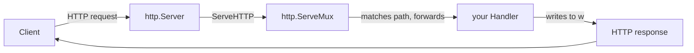

# The net/http Mental Model

Here's a thing that catches people off guard when they come to Go from almost anywhere else: you often
don't reach for a web framework at all. The standard library ships a production-grade HTTP server, a
router, and everything you need to read a request and write a response — right there in `net/http`, no
`go get` required. This is the **roots** guide. Learn what's in here and [Gin](/guides/gin-from-zero),
Echo, and chi stop being magic — they read as "net/http with some boilerplate removed."

> 📝 This is the Go parallel to [WSGI & ASGI Explained](/guides/wsgi-and-asgi-explained) — Python's
> foundation under Flask and Django. Same idea, different ecosystem: a standard shape that the server and
> your code agree on. This guide assumes you know basic HTTP (methods, status codes, headers — see
> [HTTP, Explained](/guides/http-explained)) and Go itself ([Go From Zero](/guides/go-from-zero)).

## The whole architecture is three types

Before any code, get the picture in your head — the code will then just be names attached to ideas you
already hold. The entire `net/http` server model is **three standard types**, and they each do exactly
one job.

📝 **`http.Handler`** — an interface with a single method:

```go
type Handler interface {
    ServeHTTP(w http.ResponseWriter, r *http.Request)
}
```

Anything that has a `ServeHTTP(w, r)` method *is* a handler. This is **your request-handling code** — the
part that looks at a request and writes a response. `r` is the incoming request (method, path, headers,
body); `w` is where you write the reply.

📝 **`http.HandlerFunc`** — an adapter that lets a plain function `func(w, r)` count as a `Handler`,
so you don't have to declare a type with a method every time you want to handle a request. (More on the
trick behind this below — it's the one piece of cleverness in the whole design.)

📝 **`http.ServeMux`** — the **router** (mux = "multiplexer"). It maps URL patterns like `/ping` or
`/messages` to the handler that should serve them. The neat part: a `ServeMux` is *itself* a `Handler` —
its `ServeHTTP` looks at the request path and forwards to the right registered handler.

📝 **`http.Server`** — ties an **address** (like `:8080`) to a handler and **listens** for connections.
It owns the accept-loop and the HTTP plumbing; when a request arrives it calls the handler's `ServeHTTP`.

Here's the mental model to carry through the whole guide, the sentence everything else hangs off of:

💡 **The mux routes a request to a handler; the handler writes the response.** That's it. The server runs
the loop, the mux picks who handles each request, and the handler does the one interesting thing —
decides what to send back.



*What just happened:* the client sends a request; the **server** accepts it and calls the handler it was
given. That handler is usually the **mux**, which looks at the path and forwards to the specific handler
you registered for it. Your handler writes the response into `w`, and the server ships it back. Notice the
mux is just a handler that happens to delegate — that uniformity is why the whole thing composes so well.

## The smallest server that does something

Now the picture in code. This is a complete, runnable Go program — a server that answers `/ping` with
`pong`.

```go
package main

import (
    "fmt"
    "net/http"
)

func main() {
    mux := http.NewServeMux()
    mux.HandleFunc("/ping", func(w http.ResponseWriter, r *http.Request) {
        fmt.Fprintln(w, "pong")
    })
    http.ListenAndServe(":8080", mux)
}
```

*What just happened:* line by line against the three types —

- `http.NewServeMux()` creates the **router**. Empty for now, with no routes.
- `mux.HandleFunc("/ping", ...)` registers a route: "when a request comes in for `/ping`, run this
  function." The function is a plain `func(w, r)` — `HandleFunc` wraps it as a `Handler` for you (that's
  the `HandlerFunc` adapter doing its job behind the scenes).
- Inside the handler, `fmt.Fprintln(w, "pong")` writes `pong` to `w` — the `ResponseWriter`. Writing to
  `w` *is* sending the response body. No `return` of a value; you write, the client receives.
- `http.ListenAndServe(":8080", mux)` is the **server**: bind to port 8080 and listen, using `mux` as the
  top-level handler. This call blocks — it runs the accept-loop forever (until something goes wrong).

⚠️ `http.ListenAndServe` returns an `error` and we're ignoring it here. That's fine for a first sketch,
but real code checks it — `log.Fatal(http.ListenAndServe(...))` is the usual one-liner. Phase 6 replaces
this convenience with an explicit `http.Server` so you can set timeouts and shut down cleanly. For now,
know that `ListenAndServe` is a shortcut that builds an `http.Server` for you under the hood. **The mux is
the handler it serves.**

Run it and hit it:

```bash
go run main.go
# in another terminal:
curl localhost:8080/ping
# pong
```

*What just happened:* `go run main.go` compiles and starts the program; it sits there blocked in
`ListenAndServe`, holding port 8080. `curl` opens a connection, sends `GET /ping`, the server routes it
through the mux to your function, your function writes `pong`, and curl prints it. You just ran a web
server with zero dependencies.

## Why a plain function is allowed to be a Handler

Look back at that example: `ServeMux` wants `Handler`s (things with a `ServeHTTP` method), but you handed
it a bare function. How does a function satisfy an *interface*? This is `http.HandlerFunc`, and it's worth
understanding because it's the move every Go web framework copies.

`http.HandlerFunc` is a named function type defined in the standard library, roughly:

```go
type HandlerFunc func(w http.ResponseWriter, r *http.Request)

func (f HandlerFunc) ServeHTTP(w http.ResponseWriter, r *http.Request) {
    f(w, r) // calling ServeHTTP just calls the function
}
```

*What just happened:* `HandlerFunc` is a type *whose underlying type is a function*, and it has a
`ServeHTTP` method that calls the function it wraps. So when you convert a `func(w, r)` into a
`HandlerFunc`, it suddenly satisfies the `Handler` interface — `ServeHTTP` is defined, and all it does is
invoke your function. `mux.HandleFunc(...)` does that conversion for you; you could also write
`mux.Handle("/ping", http.HandlerFunc(myFunc))` and get the same result. The adapter exists so you can
write handlers as ordinary functions instead of declaring a struct with a method every single time.

💡 This is the small, elegant trick at the heart of `net/http`: by making "a handler" an interface with
one method, *anything* can be a handler — a function (via `HandlerFunc`), a struct, the mux itself, or a
wrapper around another handler (that last one is middleware, in Phase 4). One interface, endless
composition.

## Where the frameworks fit — and what we'll build

Here's the reveal that justifies the whole guide. When you eventually use Gin or Echo or chi, you're not
escaping these types — you're sitting on top of them.

💡 **Gin, Echo, and chi are conveniences over exactly `Handler`, `HandlerFunc`, and `ServeMux`.** Their
routers are `http.Handler`s; you can mount a chi router as the handler in an `http.Server`, or wrap a Gin
engine and serve it the same way you served `mux` above. They add nicer routing, parameter binding, and
helpers — but the request still enters through a server, gets routed, and lands on something that writes a
response. The skeleton is the one you just met.

To make all of this concrete instead of abstract, the rest of the guide builds one small thing the whole
way through: a **messages** service. The core data is deliberately tiny —

```go
type Message struct {
    ID   int
    Text string
}
```

*What just happened:* nothing yet — that's just the shape of the data our API will serve. Over the next
phases we'll route requests to it (Phase 2), read and write it as JSON (Phase 3), wrap it with middleware
(Phase 4), and grow it into a full CRUD REST API with no framework at all (Phase 5). Every step is the
same three types, doing their one job each.

## Recap

1. The entire `net/http` server model is **three types**: `http.Handler` (your code), `http.ServeMux`
   (the router), and `http.Server` (listens on an address) — plus the `HandlerFunc` adapter.
2. A **`Handler`** is anything with a `ServeHTTP(w, r)` method. You write to `w` to send the response; `r`
   is the incoming request.
3. The mental model, all the way down: **the mux routes a request to a handler; the handler writes the
   response.** The mux is itself a handler that delegates by path.
4. **`http.HandlerFunc`** lets a plain `func(w, r)` satisfy the `Handler` interface — its `ServeHTTP` just
   calls the function — so you write handlers as ordinary functions.
5. `http.ListenAndServe(":8080", mux)` is a convenience that builds an `http.Server` for you and serves
   the mux as its handler. Phase 6 swaps in an explicit `http.Server` for timeouts and graceful shutdown.
6. **Gin/Echo/chi are conveniences over these same types** — their routers are `http.Handler`s. We'll
   build a **messages** service (`Message{ID, Text}`) on the bare standard library across the guide.

## Quick check

Three questions on the ideas that have to stick before Phase 2:

```quiz
[
  {
    "q": "What makes something an http.Handler in Go?",
    "choices": [
      "It has a ServeHTTP(w http.ResponseWriter, r *http.Request) method",
      "It is registered with mux.HandleFunc",
      "It imports the net/http package",
      "It returns an (response, error) pair"
    ],
    "answer": 0,
    "explain": "http.Handler is an interface with exactly one method, ServeHTTP(w, r). Anything that defines that method satisfies the interface and can serve requests — a function (via HandlerFunc), a struct, even the ServeMux itself."
  },
  {
    "q": "In one sentence, what is the net/http mental model?",
    "choices": [
      "The mux routes a request to a handler; the handler writes the response",
      "The handler routes requests and the server writes the response",
      "The client builds the response and the server validates it",
      "The Server parses the body and the Handler manages the TCP socket"
    ],
    "answer": 0,
    "explain": "The ServeMux looks at the request path and forwards to the right handler; that handler writes the reply into w. The Server runs the accept-loop and calls the handler. Mux routes, handler writes — that's the whole architecture."
  },
  {
    "q": "Why can you pass a plain func(w, r) where a Handler is expected?",
    "choices": [
      "http.HandlerFunc is a function type whose ServeHTTP method just calls the function, so it satisfies the Handler interface",
      "Go automatically treats every function as an interface",
      "ListenAndServe converts all functions into goroutines",
      "ServeMux ignores the Handler interface entirely"
    ],
    "answer": 0,
    "explain": "http.HandlerFunc is a named type whose underlying type is func(w, r), and it defines ServeHTTP to call that function. Converting your function to a HandlerFunc gives it a ServeHTTP method, so it satisfies Handler. mux.HandleFunc does this conversion for you."
  }
]
```

---

[Guide overview](_guide.md) · [Phase 2: Handlers & Routing by Hand →](02-handlers-and-routing.md)
