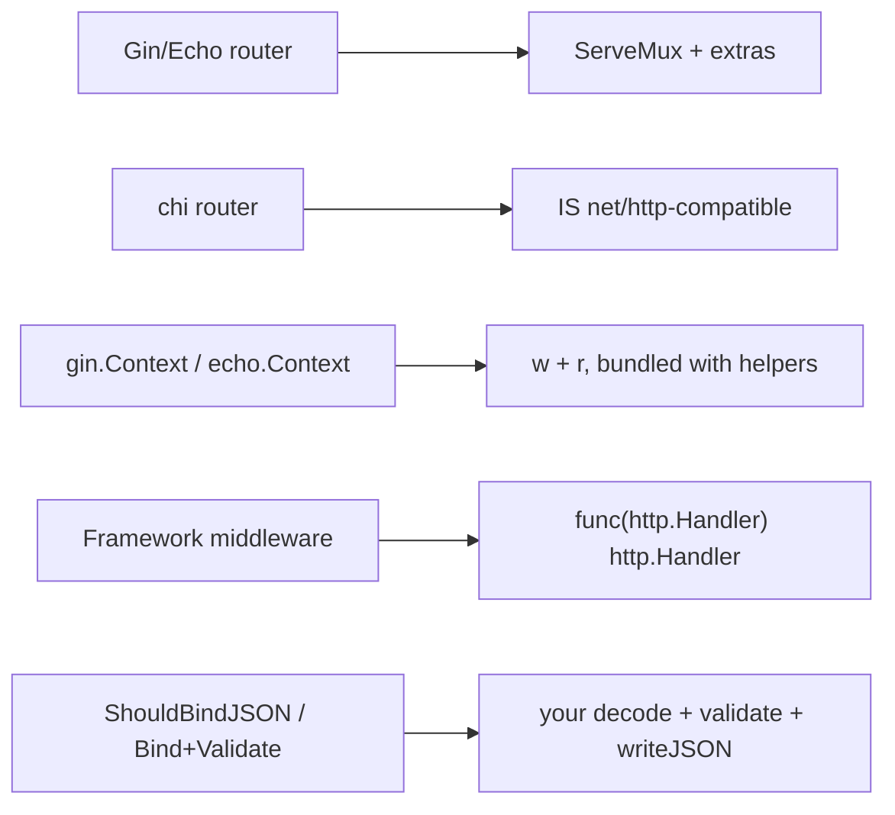

# What the Frameworks Add

Take a second to notice what you just did. You built a real JSON REST API — routing, request decoding, JSON responses with the right status codes, middleware, a sensible project structure, a `context` that cancels, and a server that shuts down without dropping in-flight requests. And you did all of it with the standard library and nothing else. No imports you had to learn from a framework's docs. Just `Handler`, `ServeMux`, and `Server`.

That's the whole point of this guide. The frameworks people reach for — [Gin](/guides/gin-from-zero), [Echo](/guides/echo-from-zero), [chi](/guides/chi-from-zero) — are not a different world. They're conveniences layered over the exact skeleton you now have in your hands. So this last phase is the payoff: we point your new X-ray vision at the frameworks and watch the "magic" turn into machinery you can already name.

## Mapping the magic to the mechanism

💡 Here's the thing worth reading slowly: every "feature" a Go web framework advertises is a convenience over something in this guide. Once you've seen the bare version, the framework version stops being a spell.



Reading that left to right, in plain words:

- **The router.** A framework router is `http.ServeMux` with extras bolted on: route groups, richer path patterns, and (before Go 1.22 made it unnecessary) parameter parsing. [chi](/guides/chi-from-zero)'s router is the friendliest case — it *is* net/http-compatible, so a chi route is a plain `http.Handler` and you keep using `w`/`r` directly. [Gin](/guides/gin-from-zero) and [Echo](/guides/echo-from-zero) ship their own fast radix-tree routers for speed, but each one still implements `http.Handler` underneath. Same contract you learned in [Phase 1](01-the-mental-model.md).
- **The context object.** Gin's `*gin.Context` and Echo's `echo.Context` bundle the `w` and `r` you've been passing around, plus a pile of helpers: `c.JSON(...)` instead of hand-writing headers and `json.NewEncoder`, `c.Param("id")` instead of `r.PathValue("id")`, and request binding. chi adds *no* context object — that's deliberate, and it's why chi feels like "net/http with a better router."
- **Middleware.** chi uses the *exact* `func(http.Handler) http.Handler` signature you wrote in [Phase 4](04-middleware-is-a-wrapper.md) — your logging and auth wrappers would drop straight into a chi app. Gin and Echo use their own context-based middleware signature, but it's the identical idea: a function that runs before and after the next handler and can short-circuit the chain.
- **Binding, validation, render helpers, and error handling.** This is where frameworks genuinely earn their keep. In your bare API you hand-rolled `json.NewDecoder(r.Body).Decode(...)`, checked fields yourself, and wrote a `writeJSON` helper. Gin gives you `c.ShouldBindJSON(&v)` plus struct-tag validation (`binding:"required"`); Echo gives you `c.Bind(&v)` paired with `c.Validate(v)`; both let you register one central error handler instead of repeating error-writing in every handler. You built the manual version, so you know exactly what these are saving you.

That covers the Go web world. The frameworks differ in ergonomics and feature sets — but underneath, every one of them is an `http.Handler` that a `Server` invokes.

## Do I even need a framework?

📝 Let me be honest, because a roots guide that pretends you must reach for a framework would be lying to you: a lot of the time, plain net/http is genuinely enough now.

The reason is [Phase 2](02-handlers-and-routing.md). Since **Go 1.22**, the standard `http.ServeMux` does method-and-path routing — `mux.HandleFunc("GET /messages/{id}", ...)` with `r.PathValue("id")` — which is the single biggest thing frameworks used to be *required* for. For a small service with a handful of routes, you can ship the bare stdlib version and not feel like you're missing anything.

So when do you reach for a framework? When you want the batteries:

- **You want binding and validation, a big middleware ecosystem, and you're writing a lot of routes** — reach for **[Gin](/guides/gin-from-zero)** or **[Echo](/guides/echo-from-zero)**. The `ShouldBindJSON` + validator-tags story alone saves real boilerplate once you have dozens of endpoints.
- **You love the stdlib but want nicer routing ergonomics without leaving it** — reach for **[chi](/guides/chi-from-zero)**. It's net/http-pure: your `func(http.Handler) http.Handler` middleware and your `w`/`r` handlers work unchanged.

That's the honest decision. Not "always use a framework," and not "frameworks are bloat" — just match the tool to the size of the job.

## Where to go from here

You're now in the rare, comfortable position of being able to **pick a framework with your eyes open** instead of cargo-culting a tutorial:

- **[Gin](/guides/gin-from-zero)** — the batteries-included popular default, biggest ecosystem, terse `c.JSON` style.
- **[Echo](/guides/echo-from-zero)** — similar feature set with a slightly cleaner error-returning handler style (`func(c) error`).
- **[chi](/guides/chi-from-zero)** — stdlib-pure, no context object, the natural next step if you liked this guide.

And whichever you choose, a real service needs a database. The standard next move is to add persistence: see **[GORM From Zero](/guides/gorm-from-zero)** to swap your in-memory messages slice for a real store.

## The magic was always three types

Here's the line to carry out of this whole guide: the "magic" inside every Go web framework was always just **`Handler`, `ServeMux`, and `Server`** — a thing that handles one request, a thing that routes to it, and a thing that listens. Everything else is convenience stacked on top. Binding is your decode step with a nicer name. The context object is `w` and `r` in a bag. Middleware is a function wrapping a handler.

You didn't learn one framework. You learned the foundation under *all* of them. Open the source of any Go web codebase now — Gin's, Echo's, chi's, or some service at your job — and you'll find the same skeleton you built by hand, with the boilerplate filed off. You can read all of it.

## Recap

1. **Frameworks are conveniences over net/http, not a separate world.** The router is `ServeMux` plus extras, the context object bundles `w`/`r` with helpers, and middleware is the wrap-the-next-handler idea you already wrote.
2. **chi is the net/http-pure option:** its router is `http.Handler`-compatible, it adds no context object, and it uses the exact `func(http.Handler) http.Handler` middleware signature from Phase 4.
3. **Gin and Echo earn their keep on batteries:** `ShouldBindJSON` / `Bind`+`Validate` with struct-tag validation and central error handlers replace the decode/validate/`writeJSON` you hand-rolled.
4. **Since Go 1.22, plain net/http is genuinely enough for small services** — the stdlib mux does method+path routing. Reach for a framework when you want binding/validation, a big middleware ecosystem, and lots of routes.
5. **The skeleton is always `Handler`, `ServeMux`, `Server`** — learn it once and you can read any Go web codebase, framework or not. Add a database next with [GORM From Zero](/guides/gorm-from-zero).

## Quick check

One last check — the mappings that turn frameworks from magic into mechanism:

```quiz
[
  {
    "q": "Mechanically, what is a Gin or Echo router relative to net/http?",
    "choices": [
      "http.ServeMux with extras (route groups, richer patterns) — and it still implements http.Handler",
      "A replacement for the http.Server that listens on its own",
      "A browser-side routing library",
      "A database query router with no relation to net/http"
    ],
    "answer": 0,
    "explain": "Gin and Echo ship their own fast radix routers for speed, but each still implements http.Handler — it's ServeMux's job with extras. chi goes further and its router is directly net/http-compatible."
  },
  {
    "q": "What is a framework's context object, like *gin.Context or echo.Context?",
    "choices": [
      "The w and r you already pass around, bundled together with helpers like c.JSON and c.Param",
      "A second http.Server running concurrently",
      "Go's context.Context renamed",
      "A database connection pool"
    ],
    "answer": 0,
    "explain": "gin.Context and echo.Context bundle the ResponseWriter and *Request with conveniences (c.JSON, c.Param, binding). chi deliberately adds no context object — you use w and r directly, which is why it feels like plain net/http."
  },
  {
    "q": "Given Go 1.22, when is reaching for Gin or Echo most justified over plain net/http?",
    "choices": [
      "When you want binding/validation, a large middleware ecosystem, and you're writing lots of routes",
      "Whenever you need any routing at all, since the stdlib mux can't route by method",
      "Only when you cannot use the standard library for licensing reasons",
      "Never — frameworks no longer add anything over net/http"
    ],
    "answer": 0,
    "explain": "Since Go 1.22 the stdlib ServeMux does method+path routing, so small services often need nothing more. Frameworks earn their keep on batteries — binding/validation, big middleware ecosystems, and many routes — or, for stdlib-pure ergonomics, chi."
  }
]
```

---

[← Phase 6: Structure, Context & Graceful Shutdown](06-structure-and-shutdown.md) · [Guide overview](_guide.md)
