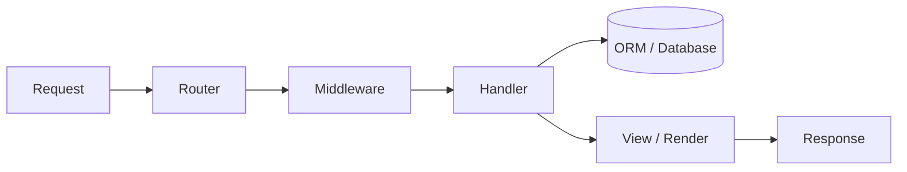

# The Anatomy of (Almost) Any Framework

Here's the payoff phase. Once you've learned a *second* web framework, a quiet realization sets in: this is the same machine wearing different clothes - routing, a request pipeline, your handlers, a data layer, a way to render output, and a startup sequence that wires it together. Nearly every web/backend framework is some arrangement of those six parts.

The names change - what one framework calls *middleware*, another calls *filters* or *interceptors* - but the **shape** holds. Learning a new framework stops being "memorize everything" and becomes a scavenger hunt: *where does this one put each of the six parts?*

## 1. Routing - the request's front door

📝 **Routing** maps an incoming request (a URL plus a method, like `GET /users/42`) to the specific piece of *your* code that should handle it. Every web framework has this - it's the switchboard between the outside world and your code.

What you write is a small table of patterns:

```text
GET   /users/:id   ->  show_user
POST  /users       ->  create_user
GET   /            ->  home_page
```

*What just happened:* you described which URL shapes exist and what runs for each. The `:id` is a placeholder - the router pulls `42` out of `/users/42` and hands it to your function. You never wrote the URL-parsing code; the framework does that and calls you (inversion of control from [Phase 1](01-framework-vs-library.md), in the wild).

When you meet a new framework, finding the router is step one - it's the index of everything the app can do.

## 2. Middleware - the request pipeline

📝 **Middleware** is a chain of functions every request passes *through* on its way to your handler (and often back out). Each link does one cross-cutting job: check authentication, log the request, parse the JSON body, catch errors. Your handler sits at the end, receiving a request that's already been cleaned and checked.

Think onion, or security checkpoint: the request walks in through layer after layer before touching your code, then the response walks back out the same way. Put your auth check in the pipeline once, and *every* route behind it is protected.

This part has the most aliases - same idea, different word:

- **middleware** (Express, Django, Rails, ASP.NET)
- **filters** or **interceptors** (Spring, Angular, many Java frameworks)
- **hooks** or **plugins** (Fastify, and a lot of frontend frameworks)
- **guards** (NestJS, Angular's router)

## 3. Controllers / handlers - where your code lives

📝 **Controllers** (also **handlers**, **views**, **actions**, or in frontend land, **components**) are the blanks the framework calls - the function that runs when a route matches and the request has cleared the pipeline. It does the actual work and returns a response.

This is the heart of inversion of control: you don't write the loop that listens for and dispatches requests. The framework owns that loop; you just fill in "when *this* happens, do *that*."

🪖 When you're lost in a new codebase, the handlers are where the *business logic* lives. Find the router, follow it to the handlers, and you're reading the code that matters.

## 4. The data layer - talking to the database

📝 The **data layer**, usually an **ORM** (Object-Relational Mapper), maps your objects/structs to database rows, so you write `user.save()` or `User.find(42)` instead of hand-writing SQL. The point is to stay in your language's world instead of constantly switching to raw SQL and back.

That's partly hiding SQL from you - and that's the magic with a [price](03-the-price-of-magic.md). A naive ORM call can quietly fire hundreds of queries, and it won't teach you what [joins](/guides/sql-joins-explained) or a [database](/guides/what-a-database-is) is actually doing underneath. Every serious ORM keeps an **escape hatch**: a way to drop down and run raw SQL when the generated query isn't good enough.

## 5. Templating / views / rendering - turning data into output

📝 **Rendering** turns your data into what the client receives. Server-side, that's usually **templating** - an HTML file with blanks (`Hello, {{ name }}`) filled in with your data. Frontend, it's a **render cycle** turning data and **components** into the UI tree the browser shows.

Same idea, two outfits: structured data in, presentation out. When mapping a new framework, ask "where does data become output here?"

## 6. Configuration & the lifecycle (including dependency injection)

📝 The **lifecycle** is how the app gets wired up and started: it reads **configuration** (config files, env vars - database URL, secret keys), runs a **bootstrap/startup** sequence that constructs everything in order, then begins accepting requests. It's the framework's power-on self-test.

A big piece of this is **dependency injection** (DI):

📝 **Dependency injection** means the framework *constructs the things your code needs and hands them to you*, rather than you creating them yourself. Your handler says "I need a database connection and a logger," and the framework supplies them already configured. Another face of inversion of control - even your objects get assembled for you.

All six parts as a single request flowing through them:



*What just happened:* the request hits the **router**, which picks a handler; it flows through the **middleware** pipeline; your **handler** runs, reaching into the **ORM** for data and passing it to the **view** to render; the output goes back as the **response**. Configuration and the lifecycle aren't in the flow because they ran *before* it - they're what set the machine up in the first place.

## The transferable-learning payoff

💡 **This is the whole point of the guide:** when you walk up to a brand-new framework, *don't read the docs front to back.* Hunt for the six parts - router, middleware, handlers, data layer with its SQL escape hatch, rendering, startup/DI. Answer those six questions and you've mapped the framework, usually in an afternoon, not a month.

The map travels further than you'd think. Frontend frameworks rename some parts - **components**, **state**, **props**, **render cycle** instead of controllers and templates - but the shape is identical: *the framework owns the loop and calls your blanks*. Once you see the anatomy, every framework is the same animal in a different coat.

## Recap

1. **Most web/backend frameworks share six parts**: routing, middleware, handlers, a data layer, rendering,
   and a configuration/lifecycle. Learn the parts once and every new framework gets faster to pick up.
2. **Routing** maps a URL+method to your code; **middleware** (a.k.a. filters, interceptors, hooks, guards)
   is the pipeline a request passes through before and after your handler.
3. **Controllers/handlers/components** are the blanks the framework calls - your code, the inversion of
   control from Phase 1 made concrete.
4. **The data layer (ORM)** maps objects to rows so you write code instead of SQL - with an escape hatch to
   real SQL for when you need it.
5. **Rendering** turns data into output (HTML via templates server-side; a component tree on the frontend),
   and the **lifecycle** wires the app up at startup, often via **dependency injection**.
6. **The payoff:** to learn a new framework, find these parts instead of reading cover to cover - and
   remember frontend frameworks rename them but keep the same "it calls your blanks" shape.

## Quick check

```quiz
[
  {
    "q": "A request comes in as `GET /users/42`. Which part of a framework is responsible for deciding that this should run your `show_user` function with `id = 42`?",
    "choices": [
      "Routing",
      "The ORM",
      "The templating layer",
      "Dependency injection"
    ],
    "answer": 0,
    "explain": "Routing maps an incoming URL and method to the specific handler that should run, pulling parameters like the `42` out of the path along the way."
  },
  {
    "q": "Your framework calls them 'interceptors'; a tutorial for a different framework calls them 'middleware.' What are both describing?",
    "choices": [
      "A chain of functions a request passes through (for auth, logging, parsing) before and after your handler",
      "The function that maps objects to database rows",
      "The file that holds environment variables and secrets",
      "The component tree the browser renders"
    ],
    "answer": 0,
    "explain": "Middleware, filters, interceptors, hooks, and guards are all names for the same idea: a pipeline of cross-cutting functions that wrap your handler, running before and after it."
  },
  {
    "q": "What's the recommended way to get productive in an unfamiliar web framework quickly?",
    "choices": [
      "Hunt for the six common parts (router, middleware, handlers, data layer, rendering, lifecycle) and look up the rest as needed",
      "Read the entire documentation cover to cover before writing any code",
      "Memorize every configuration option the framework exposes",
      "Avoid it until someone on your team can pair with you full-time"
    ],
    "answer": 0,
    "explain": "Frameworks are variations on the same anatomy. Finding each of the six parts maps the framework in an afternoon; the rest of the docs is detail you can reference when a specific need comes up."
  }
]
```

---

[← Phase 3: The Price of Magic](03-the-price-of-magic.md) · [Guide overview](_guide.md) · [Phase 5: Choosing & Learning a Framework →](05-choosing-and-learning-a-framework.md)
