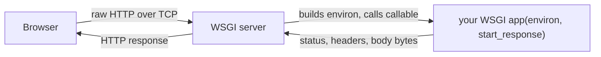

# What WSGI Is

Every Python web app you'll ever run in production - a Flask side project, a sprawling Django monolith,
a tiny internal tool - is standing on the same foundation. Strip away the routing decorators and the ORM
and the templating, and underneath there's a single, almost embarrassingly small agreement: a way for a
web server to hand your code a request and get a response back. That agreement is **WSGI**, and this guide
is about the bedrock it sits on.

This is the roots guide. You'll rarely write raw WSGI by hand at work - frameworks exist precisely so you
don't have to - but every Python web framework is a convenience layer over the thing you're about to meet.

## The problem WSGI solved

Let's start with the world *before* WSGI, because the contract makes no sense until you've felt the pain it
removed.

📝 **The pre-WSGI mess** - in the early 2000s, every Python web framework talked to web servers its own
way. A framework written for one server (say, mod_python on Apache) wouldn't run on another without
glue code. Servers and frameworks weren't interchangeable: pick a framework and you were often locked into
a particular way of deploying it. There was no shared plug.

The fix was to agree on one standard plug shape, written down so everyone could build to it.

📝 **WSGI** (Web Server Gateway Interface, defined by **PEP 3333**) - the standard contract between a
Python **web server** (gunicorn, uWSGI, mod_wsgi) and a Python **web application** (Flask, Django, or
something you write by hand). Build your app to the WSGI interface once, and it runs on *any* WSGI-compliant
server. Pick a different server next year - your app doesn't change.

> 💡 **Key point.** WSGI is not a server, not a framework, not a library you install. It's an *interface* -
> an agreement about function shapes. Its whole job is to make Python web apps and Python web servers
> mix-and-match, the way a standard wall socket lets any appliance run off any outlet.

## The contract: a callable

So what does this "standard plug" actually look like? It's smaller than you'd guess.

📝 **WSGI application** - a **callable** (a function, or any object with a `__call__` method) with this exact
signature:

```python
def app(environ, start_response):
    ...
```

That's the entire interface. Three moving parts:

- **`environ`** - a plain dict describing the incoming request: the HTTP method, the path, the headers, the
  query string, the request body stream, and more. The server fills this in and hands it to you.
- **`start_response`** - a function the server gives you. You *call* it with the status line and the response
  headers when you're ready to begin replying.
- **the return value** - you return the response **body** as an iterable of `bytes` (commonly a list with
  one bytestring in it).

```python
def app(environ, start_response):
    # 1. read the request from environ (method, path, headers...)
    # 2. call start_response(status, headers) to set the reply line
    # 3. return an iterable of bytes as the body
    ...
```

*What just happened:* this isn't a working app yet - it's the *shape* every WSGI app shares, and the whole
contract fits in three comments. The server promises to call you with `environ` and `start_response`; you
promise to call `start_response` once and return some bytes. Phase 2 fills in the body and runs it for real.
For now, sit with how little there is: no base class to inherit, no framework to import. A WSGI app is just
a callable that follows the rules.

## Server vs app: who does what

Here's the part that trips people up first. You write the app callable - but you never *call* it yourself.
Something else owns that job.

📝 **WSGI server** (gunicorn, uWSGI, Waitress) - a running program that accepts incoming TCP connections,
parses the raw HTTP off the wire, packs the request into an `environ` dict, and then **calls your app
callable** - once per request. It takes whatever you return and serializes it back into a proper HTTP
response over the socket. The server is the thing that's actually running; your app is code it invokes when
a request arrives.

Picture the division of labor:



*What just happened:* the browser opens a connection and sends bytes. The **server** does every piece of
unglamorous plumbing - accepting the socket, reading and parsing the HTTP, building the tidy `environ` dict,
calling your callable, and afterward turning your status/headers/body back into HTTP and shipping it. Your
app sits in the middle and does the one interesting part: looks at the request, decides what to send back.

💡 **The server does the grunt work; you write the handler.** You don't manage sockets, parse headers, or
speak HTTP/1.1 by hand - the server hands you a parsed request and waits for your response. In exchange, you
write your logic to *its* shape: a callable it knows how to invoke. The server owns the loop and calls your
code, not the other way around - that's the inversion of control at the heart of Python web.

## Where your frameworks fit

Here's the reveal that justifies the whole guide. That `app(environ, start_response)` callable? It's not a
relic you'll skip past on the way to "real" frameworks. It *is* what the real frameworks are made of.

When you write a Flask app and create `app = Flask(__name__)`, that `app` object **is a WSGI application** -
a callable with exactly the `(environ, start_response)` signature, with all the routing and request parsing
hidden inside its `__call__`. When you run `flask run` in development or `gunicorn myapp:app` in production,
the WSGI *server* is calling that *app* - the same handshake from the diagram above.

- **Flask** - `app` is the WSGI callable; the `@app.route(...)` decorators are a routing layer it consults
  inside `__call__` to decide which view function handles the request. See
  [/guides/flask-from-zero](/guides/flask-from-zero).
- **Django** - `get_wsgi_application()` (the thing in your project's `wsgi.py`) returns the WSGI callable
  gunicorn invokes. Django's middleware, URL resolver, and views all live behind it.
- **Frameworks are conveniences over the callable.** Routing, request objects, templating, sessions - the
  framework adds ergonomics, but the request still enters through the server and lands on one WSGI callable.

💡 If this rings a bell, it should: it's the same idea as Java's Servlet API
([/guides/the-servlet-api](/guides/the-servlet-api)), where a servlet container (Tomcat) calls a servlet
object that handles one request. Same architecture - a standard interface between server and app - in a
different ecosystem. Python calls its version WSGI; Java calls its version the Servlet API. The shape is the
same: the server runs, your handler gets called. (If HTTP status codes and headers are fuzzy,
[/guides/http-explained](/guides/http-explained) is the companion read.)

## Why learn it

Let's be honest about the trade-off, because this project's whole voice is anti-hand-waving.

⚠️ **You will rarely write a raw WSGI app at a real job - and that's fine.** Frameworks exist for good
reasons: they spare you boilerplate and give you routing, sessions, and validation for free. Reaching for
raw WSGI when Flask would do is usually a mistake, not a badge of honor. So this guide is *not* arguing you
should hand-write WSGI apps in production.

It's arguing something more useful: knowing this layer is what makes the layers above it stop being magic.
Once you've seen the callable underneath, a pile of mysteries resolve at once -

- **Why you run gunicorn in prod** - because Flask's dev server is a WSGI server too, but a slow,
  single-purpose one; gunicorn is a production-grade server that calls the very same app callable.
- **What middleware actually is** - a WSGI app that wraps another WSGI app, intercepting `environ` on the way
  in and the response on the way out. (We'll build one.)
- **Why ASGI exists** - WSGI's one-call-per-request shape is synchronous to the bone, which is exactly why
  async Python needed a different contract. That's the rest of this guide.

The fastest way to make all of that concrete is to write a WSGI app by hand - no framework, just the
callable - and run it. That's Phase 2.

## Recap

1. **The problem:** before WSGI, every Python framework talked to servers differently, so frameworks and
   servers weren't interchangeable. WSGI (**PEP 3333**) is the standard contract that fixed it.
2. A **WSGI application** is a **callable** with the signature `app(environ, start_response)`. That's the
   whole interface - no base class, no framework required.
3. `environ` is a dict describing the request; `start_response` is a function you call with the status and
   headers; you **return the body as an iterable of bytes**.
4. The **WSGI server** (gunicorn, uWSGI) handles sockets and HTTP parsing and **calls your app** once per
   request. The server does the grunt work; you write the handler.
5. A **Flask or Django app *is* a WSGI application** - `flask run` and `gunicorn` are the WSGI servers
   calling it. Frameworks are conveniences over this callable, mirroring Java's Servlet API.
6. ⚠️ You'll rarely write raw WSGI at work - but it explains why you run gunicorn, what middleware is, and
   (next) why ASGI exists.

## Quick check

Three questions on the ideas that have to stick before Phase 2:

```quiz
[
  {
    "q": "What is WSGI, in one sentence?",
    "choices": [
      "The standard contract (PEP 3333) between a Python web server and a Python web app, so any compliant app runs on any compliant server",
      "A Python web server you install and run, like gunicorn",
      "A web framework that competes with Flask and Django",
      "The HTTP protocol, reimplemented in Python"
    ],
    "answer": 0,
    "explain": "WSGI is an interface - an agreement about function shapes - not a server, framework, or protocol. Its job is to make Python apps and servers mix-and-match. gunicorn is a server that speaks WSGI; Flask is a framework whose app object is a WSGI callable."
  },
  {
    "q": "What is the signature of a WSGI application callable?",
    "choices": [
      "app(environ, start_response) - environ is the request dict, start_response sets status/headers, and you return the body as bytes",
      "app(request, response) - two framework objects you mutate in place",
      "app() with no arguments, returning an HTML string",
      "handle(socket) - you read and write the raw TCP socket yourself"
    ],
    "answer": 0,
    "explain": "A WSGI app is a callable taking environ (a dict describing the request) and start_response (a function you call with the status line and headers), and it returns the response body as an iterable of bytes. That's the entire contract."
  },
  {
    "q": "When you run `gunicorn myapp:app`, who calls whom?",
    "choices": [
      "The WSGI server (gunicorn) calls your app callable once per request, after parsing the HTTP and building environ",
      "Your app starts gunicorn and hands it requests to serve",
      "The browser calls your app directly, with no server in between",
      "gunicorn and your app each parse half of the HTTP request"
    ],
    "answer": 0,
    "explain": "The server owns the running process and all the HTTP plumbing: it accepts the socket, parses the request into environ, and calls your app callable, then ships whatever you return. The server does the grunt work; your app just handles the request."
  }
]
```

---

[Guide overview](_guide.md) · [Phase 2: A WSGI App From Scratch →](02-a-wsgi-app-from-scratch.md)
