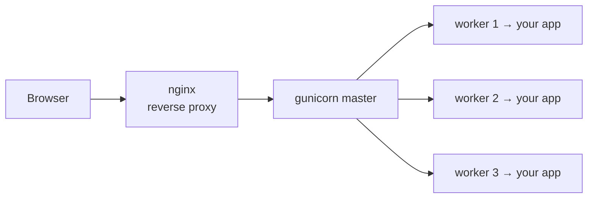

# The WSGI Server & Middleware

In [Phase 2](02-a-wsgi-app-from-scratch.md) you wrote a WSGI app - a plain callable that takes `(environ, start_response)` and returns bytes - and you ran it with `wsgiref.simple_server` to see it answer a real HTTP request. That was the *app* half of the contract working. This phase is about the *other* half: the **server** that actually calls your app in production, and a single trick - wrapping one WSGI app in another - that turns out to be the root of every "middleware" you've ever met.

Two ideas, one mental model each. Let's build them.

## The dev server isn't enough

Here's the thing nobody warns you about until it bites: ⚠️ **the server you ran in Phase 2 - `wsgiref.simple_server` - is a *toy*.** So is `flask run`. So is Django's `runserver`. They exist to let you develop on your laptop with one command and zero config. They are not built to face the internet.

What's wrong with them? They're typically single-threaded - one request at a time, so a second visitor waits behind the first. They have no process management, no graceful restarts, no protection against slow clients, and the Python docs and framework docs say so out loud. Flask literally prints a warning: *"This is a development server. Do not use it in a production deployment."*

The mental model: 📝 **a dev server is a demo car with no seatbelts - fine for the parking lot, lethal on the highway.** It runs your WSGI app, but it can't run it *for real users at real volume*. For that you need a production WSGI server.

## Production WSGI servers

📝 **A production WSGI server is a program whose entire job is to accept HTTP connections, build the `environ` dict for each request, call your app callable, and ship the bytes back out.** It's the same job `wsgiref` did in Phase 2 - just hardened, concurrent, and built to stay up for months.

The popular ones in Python:

- **gunicorn** ("Green Unicorn") - the default choice, simple and battle-tested.
- **uWSGI** - older, extremely configurable, more knobs than most people need.
- **waitress** - pure-Python, works on Windows, nice when you can't compile C extensions.

They all speak the same WSGI contract, so they're interchangeable from your app's point of view. To run your Phase 2 app - say it lives in `myapp.py` and the callable is named `app` - you point gunicorn at it:

```bash
gunicorn myapp:app
```

```console
[2026-06-23 10:14:02 +0000] [4821] [INFO] Starting gunicorn 22.0.0
[2026-06-23 10:14:02 +0000] [4821] [INFO] Listening at: http://127.0.0.1:8000 (4821)
[2026-06-23 10:14:02 +0000] [4821] [INFO] Using worker: sync
[2026-06-23 10:14:02 +0000] [4824] [INFO] Booting worker with pid: 4824
[2026-06-23 10:14:02 +0000] [4825] [INFO] Booting worker with pid: 4825
[2026-06-23 10:14:02 +0000] [4826] [INFO] Booting worker with pid: 4826
```

*What just happened:* The argument `myapp:app` is `module:callable` - gunicorn **imports** the `myapp` module and grabs the `app` object out of it, exactly the callable you wrote by hand. That's the whole handshake. gunicorn now owns the socket on port 8000; when a request arrives, it builds `environ`, calls `app(environ, start_response)`, and writes the returned bytes back to the client. Notice it booted *three* workers (pids 4824–4826) - hold that thought, it's the next section. 💡 This is the answer to a question you've probably had: *why does every Python deploy guide say "run it with gunicorn"?* Because gunicorn **is** the WSGI server - the thing that calls your app. Your framework provides the app; gunicorn provides the runtime.

## Workers & concurrency

Look again at those three "Booting worker" lines. 📝 **A worker is a separate OS process that runs a full copy of your app and handles requests on its own.** gunicorn itself is a *master* process that doesn't touch requests - it just spawns workers, watches them, and restarts any that die. The workers do the actual serving.

Why more than one? Because WSGI is **synchronous**. A sync worker handles exactly one request at a time, start to finish - it reads the request, calls your app, waits for your code (including any database query or API call) to finish, sends the response, and only *then* is free for the next request. So your concurrency is, roughly, your worker count. Three workers means three requests being served at once; a fourth visitor waits for a worker to free up. Need more parallelism, add more workers (a common starting rule of thumb is `2 × CPU cores + 1`).

In a real deployment, gunicorn rarely faces the internet alone. It sits **behind a reverse proxy** - usually **nginx** - which handles TLS, serves static files, and buffers slow clients so a visitor on bad wifi can't tie up a worker just by sending bytes slowly.



*What just happened:* nginx terminates the connection from the browser and forwards the request to gunicorn's master, which has already handed the socket to its pool of workers; whichever worker is free picks up the request and runs your app. The reverse proxy is the bouncer at the door; the workers are the staff actually doing the work inside.

⚠️ Here's the limitation that matters for the rest of this guide: because a sync worker is **busy for the entire duration of a request**, one slow request - a 10-second external API call, a heavy report - ties up a whole worker for those 10 seconds, doing nothing but waiting. With three workers, three slow requests and your whole site stalls. This is the wall WSGI's synchronous model hits, and it's exactly the problem [Phase 4](04-why-asgi-exists.md) introduces ASGI to solve. File it away.

## WSGI middleware

Now the second idea - and it's a beautiful one, because it reuses everything you already know.

Suppose you want to time every request, or log it, or check an auth token before any request reaches your app. You *could* paste that code into the top of your app callable. But there's a cleaner move that the WSGI contract makes almost free.

📝 **A middleware is itself a WSGI app that wraps another WSGI app.** It's a callable with the exact same `(environ, start_response)` signature as your app - so the *server* can't tell the difference, it just calls the outermost one. Inside, the middleware does some work, then calls the **inner** app it's wrapping, then optionally does more work on the way back. The inner app has no idea it's been wrapped.

That's the entire trick. Same signature, one app holding another. Here's a timing-and-logging middleware around the app:

```python
import time

# Your actual app - the inner WSGI app from Phase 2.
def app(environ, start_response):
    start_response("200 OK", [("Content-Type", "text/plain")])
    return [b"Hello from the app"]

# The middleware: a WSGI app that wraps another WSGI app.
def timing_middleware(inner_app):
    def wrapped(environ, start_response):
        # --- BEFORE: runs on the way in ---
        start = time.perf_counter()
        path = environ.get("PATH_INFO", "/")

        result = inner_app(environ, start_response)   # call the wrapped app

        # --- AFTER: runs on the way back out ---
        elapsed = (time.perf_counter() - start) * 1000
        print(f"{path} took {elapsed:.1f}ms")
        return result
    return wrapped

# Wrap it. THIS is what the server now calls.
app = timing_middleware(app)
```

*What just happened:* `timing_middleware` takes the inner app and returns a *new* callable, `wrapped`, that has the same `(environ, start_response)` shape - so it **is** a WSGI app, indistinguishable to the server. When a request comes in, `wrapped` records a timestamp, calls `inner_app(environ, start_response)` to do the real work, then measures elapsed time and logs it before returning the inner app's result. The line `app = timing_middleware(app)` is the load-bearing one: the name `app` now points at the wrapper, so when gunicorn does `myapp:app` it calls the *middleware*, which calls your original app. Your handler stayed completely untouched - the cross-cutting concern lives entirely outside it.

💡 If that "before / call inner / after" shape feels familiar, it should. It is the *exact same sandwich* as a Java servlet filter's `doFilter` from [The Servlet API](/guides/the-servlet-api): code before, a single call that passes control inward, code after on the way back. Different language, identical idea. And it's the universal "middleware" pattern from [What a Framework Even Is](/guides/what-a-framework-even-is) - Express's `app.use(...)`, Django's middleware classes, ASP.NET's pipeline. Every one of them is *this*: something in the request's path, wrapping what comes next. You're looking at the root.

## The chain

You rarely have just one middleware. You have several - logging, then auth, then maybe compression - and you stack them by wrapping each around the previous result:

```python
app = logging_middleware(auth_middleware(timing_middleware(app)))
```

*What just happened:* Each call wraps the one inside it, building layers. The request enters `logging_middleware` first (outermost), which calls `auth_middleware`, which calls `timing_middleware`, which finally calls your real `app` at the core - and then the response unwinds back out through each layer in reverse. 💡 **It's an onion** - the same onion you saw with servlet filters. The request travels inward through every layer's "before" half to your app, and the response travels back outward through every "after" half. The first middleware to see the request is the last to see the response.

Frameworks dress this up with nicer APIs - `app.add_middleware(...)`, decorators, config lists - so you rarely hand-wrap callables like this in a real job. But underneath the syntax, it is *always* a WSGI app wrapping a WSGI app. There is no other mechanism. When a framework says "register this middleware," it is building this exact chain for you.

And now you can see the full production picture: a real WSGI server (gunicorn) running worker processes behind a reverse proxy, calling a stack of middleware that wraps your app. That's how Python web apps actually run. The one crack in it - the synchronous worker stuck waiting on slow work - is what [Phase 4](04-why-asgi-exists.md) cracks open.

## Recap

1. ⚠️ Dev servers (`wsgiref.simple_server`, `flask run`, Django's `runserver`) are single-threaded and unhardened - fine for development, never for production. You need a real WSGI server.
2. 📝 A production WSGI server (**gunicorn**, uWSGI, waitress) imports your app callable via `module:callable` and serves it. `gunicorn myapp:app` is why every deploy guide says "run gunicorn" - it's the runtime that calls your app.
3. 📝 gunicorn runs **worker processes** for concurrency; each sync worker handles one request at a time, usually behind nginx as a reverse proxy. ⚠️ A slow request ties up a whole worker - the wall that motivates ASGI.
4. 📝 **Middleware is a WSGI app that wraps another WSGI app** - same `(environ, start_response)` signature, doing work before/after it calls the inner app. It's the root of framework "middleware" and the twin of Java's servlet filter.
5. 💡 Middleware **stacks into a chain** - an onion the request passes through before reaching your app, and back out in reverse. Frameworks give nicer APIs, but underneath it's always one WSGI app wrapping another.

## Quick check

See whether the two big ideas - the server that calls your app, and the app that wraps your app - actually landed:

```quiz
[
  {
    "q": "What does the command `gunicorn myapp:app` actually do?",
    "choices": [
      "Imports the myapp module, grabs the `app` callable, and serves it by calling it for each request",
      "Compiles myapp.py into a standalone executable web server",
      "Starts Flask's built-in development server with extra logging",
      "Sends an HTTP request to the app and prints the response"
    ],
    "answer": 0,
    "explain": "`myapp:app` is module:callable. gunicorn imports myapp, takes the `app` object (your WSGI callable), and for each incoming request builds environ and calls app(environ, start_response). gunicorn is the WSGI server - the thing that calls your app."
  },
  {
    "q": "Why does a sync WSGI server like gunicorn run multiple worker processes?",
    "choices": [
      "Because each sync worker handles only one request at a time, so more workers means more concurrent requests",
      "Because each worker handles a different URL path",
      "Because Python code cannot be imported more than once per process",
      "Because one worker is for HTTP and the others are for HTTPS"
    ],
    "answer": 0,
    "explain": "WSGI is synchronous: a worker is busy for the whole duration of a request. So concurrency is roughly the worker count - three workers serve three requests at once. A slow request ties up its whole worker, which is exactly the limitation ASGI later addresses."
  },
  {
    "q": "What IS a piece of WSGI middleware, mechanically?",
    "choices": [
      "A WSGI app that wraps another WSGI app - same (environ, start_response) signature, doing work before and after it calls the inner app",
      "A special configuration file the server reads at startup",
      "A separate process that runs alongside gunicorn",
      "A subclass your app must inherit from to be servable"
    ],
    "answer": 0,
    "explain": "Middleware is just a WSGI app with the same signature as your app, holding the inner app and calling it in the middle. The server can't tell the difference. Stacked, they form a chain - an onion - exactly like servlet filters and every framework's 'middleware'."
  }
]
```

---

[← Phase 2: A WSGI App From Scratch](02-a-wsgi-app-from-scratch.md) · [Guide overview](_guide.md) · [Phase 4: Why ASGI Exists →](04-why-asgi-exists.md)
