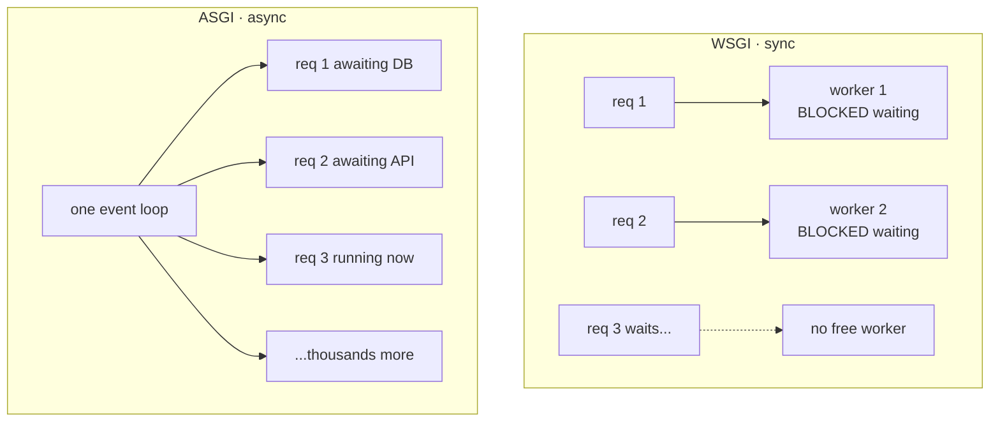

# Why ASGI Exists

By now you've seen the whole WSGI machine: an app callable, a production server like gunicorn running worker processes, middleware wrapping middleware. It's a clean, proven design — Python ran the web on it for over a decade. So why does a *second* contract exist at all?

Because WSGI has a ceiling, and you hit it the moment your app spends its time *waiting*. This phase is about that ceiling, the idea that breaks through it, and the new contract — ASGI — that bakes that idea in. We won't write a full ASGI app yet (that's [Phase 5](05-an-asgi-app-and-the-servers.md)); the goal here is the mental model, so the code in Phase 5 reads as inevitable rather than mysterious.

## WSGI's ceiling

📝 Recall the core fact from [Phase 3](03-the-wsgi-server-and-middleware.md): **WSGI is synchronous.** A sync worker is busy for the *entire* duration of a request — it reads the request, calls your app, and then sits there until your code returns, including every second your code spends waiting on a database query, a third-party API, or a slow client dribbling bytes over bad wifi.

That word — *waiting* — is the whole problem. Most web work is **I/O-bound**: your code isn't computing, it's blocked on something external coming back. And while a sync worker waits, it does *nothing else*. It can't pick up another request. It's a cashier standing frozen at the register because one customer is on the phone with their bank.

So your concurrency is capped at your worker count, and each worker is a full OS process holding a full copy of your app in memory. Want to serve 500 slow requests at once? You'd need something like 500 workers, and the RAM bill for that is brutal. The synchronous model makes high I/O concurrency expensive by construction.

⚠️ And there's a second limit that's even harder: **WSGI can't do long-lived connections at all.** Websockets, server-sent events, streaming responses — these stay open and exchange data over time. But the WSGI contract is shaped as *one request in, one response body out, done.* There is no place in `(environ, start_response) → bytes` for "keep this connection open and send more later." It's not that WSGI does websockets slowly; it can't express them. The shape doesn't fit.

## What async buys you

Here's the move that changes everything. 📝 **An async server runs many requests on a single thread using an event loop: while one request is parked waiting on I/O, the loop runs another request that's ready to make progress.** No request is ever frozen holding the thread hostage — the instant it says "I'm waiting on the database," the loop sets it aside and serves someone else, then comes back when the data arrives.

If that sounds familiar, it's the exact idea from [Async/Await & the Event Loop](/guides/async-await-and-the-event-loop): waiting is wasteful, so a single worker juggles many in-flight jobs instead of standing idle on any one of them. Same engine, now pointed at HTTP connections.

The payoff: one process can hold *thousands* of concurrent connections, because an idle connection costs almost nothing — it's just a paused task waiting for its turn, not a whole process consuming a worker slot. For I/O-bound work, that's a different order of magnitude.



*What just happened:* On the WSGI side, each request owns a worker for its whole life, so a blocked request wastes a whole worker and a third request has to wait for one to free up. On the ASGI side, a single event loop holds every connection at once; the ones awaiting I/O cost nothing while the loop drives whichever request is actually ready to run. Same hardware, vastly more concurrent connections — *for I/O-bound work*.

## ASGI: the async contract

ASGI (Asynchronous Server Gateway Interface) is WSGI's async successor — the same *idea* (a standard contract between a server and your app, so they stay swappable) rebuilt around `async`. 📝 **The app is an async callable with three arguments instead of two:**

```python
async def app(scope, receive, send):
    # scope: dict describing the connection (like WSGI's environ)
    # receive: await this to get incoming events (request body, ws messages)
    # send: await this to push outgoing events (response, ws messages)
    ...
```

*What just happened:* Compare this to WSGI's `def app(environ, start_response)`. Three things changed, each on purpose. First, `async def` — the app runs *on* the event loop, so it can `await` without freezing the loop. Second, `scope` replaces `environ`: a dict with the connection's details (type, path, headers), handed to you once when the connection opens. Third — and this is the big one — instead of returning a body, you're given two async callables: `receive`, which you `await` to pull the next incoming event, and `send`, which you `await` to push events back out. The full body of this app comes in [Phase 5](05-an-asgi-app-and-the-servers.md); right now just sit with the *shape*.

📝 That `receive`/`send` pair is the heart of it. ASGI is an **event-based** interface, not a single-return interface. A connection isn't "one request, one response" — it's a stream of messages flowing both ways over time. That's precisely what lets ASGI handle websockets and streaming, which WSGI structurally cannot.

## Why three args, and not a return value

💡 This is the question worth pausing on, because it's the *whole reason* ASGI exists — not cosmetics, not "async is trendy." It's structural.

In WSGI, your app **returns** a body. Returning is a one-time act: you hand back the bytes, and you're done. That's a perfect fit for request → response, and a dead end for anything else. Once you've returned, the conversation is over.

In ASGI, `receive` and `send` are async callables you can `await` **as many times as you like, over the life of the connection.** A websocket can `await send(...)` to push a message, `await receive()` to read the client's reply, and loop like that for minutes. A streaming response can `await send(...)` chunk after chunk as data becomes available. The connection is an ongoing exchange, not a single transaction — and you can only model an ongoing exchange with repeatable, awaitable calls, never with one return statement.

So the three-argument, event-driven signature isn't a restyle of WSGI. It's the minimum shape that can express "this connection stays open and trades many messages." That capability is the reason ASGI was created.

## WSGI vs ASGI — when to reach for each

Now the honest part, because "newer" does not mean "use it for everything."

💡 **WSGI is completely fine — and simpler — for ordinary synchronous apps.** A classic Flask app, a traditional Django project, a CRUD service whose database is fast and local: run it on gunicorn with sync workers and move on. You get a smaller mental model, no async footguns, and battle-tested tooling. Reaching for ASGI here buys you nothing and costs you complexity.

**Reach for ASGI when you have:** high-concurrency I/O-bound traffic (lots of requests, each mostly waiting on slow databases or external APIs), websockets, server-sent events, streaming responses, or a codebase that's already `async` end to end. This is the home turf of frameworks like FastAPI and Starlette — see [FastAPI From Zero](/guides/fastapi-from-zero) — which are ASGI-native and lean on exactly these strengths.

⚠️ One myth to kill before it bites you: **async is not automatically "faster."** It shines at *I/O-bound concurrency* — many connections that mostly wait. It does **nothing** for CPU-bound work; in fact, a heavy computation in an async handler *blocks the event loop* and freezes every other connection on that worker, which is worse than the sync model would have been. Async trades "many idle workers" for "one busy loop juggling many waits." If your bottleneck is the CPU crunching numbers, neither the loop nor `await` saves you — that's a job for more processes or a background queue, not ASGI.

With the *why* firmly in hand, [Phase 5](05-an-asgi-app-and-the-servers.md) fills in that three-argument app for real and introduces the servers (uvicorn, hypercorn) that run it.

## Recap

1. ⚠️ WSGI is **synchronous**: a worker is busy for the entire request, so it sits idle while waiting on I/O. High I/O concurrency means many workers, which means lots of memory.
2. ⚠️ WSGI **can't do long-lived connections at all** — websockets, SSE, streaming don't fit the "one request, one response body" shape.
3. 📝 An **async server** runs many requests on one event loop: while one awaits I/O, the loop serves others. Far more concurrent connections per process for I/O-bound work — the same idea as [the event loop guide](/guides/async-await-and-the-event-loop).
4. 📝 **ASGI** is the async contract: `async def app(scope, receive, send)`. `scope` is the connection info (like `environ`); `receive`/`send` are awaitable event channels, not a single return value.
5. 💡 You `await` `receive`/`send` repeatedly over a connection's life — that's the structural reason ASGI exists (it can model websockets and streaming), not a cosmetic change. WSGI stays fine and simpler for ordinary sync apps; ASGI wins for high-concurrency I/O, websockets, and streaming — but async ≠ faster for CPU work.

## Quick check

See whether the *why* behind ASGI actually landed — not the syntax, the reasoning:

```quiz
[
  {
    "q": "Why does a synchronous WSGI worker struggle under high I/O-bound concurrency?",
    "choices": [
      "It is busy for the entire request, sitting idle while waiting on I/O, so concurrency is capped at the worker count",
      "It can only handle GET requests, not POST",
      "It recompiles your app on every request, which is slow",
      "It uses too little memory to hold many connections"
    ],
    "answer": 0,
    "explain": "A sync worker is occupied for the whole request, including time spent waiting on a database or API. While it waits it can't serve anyone else, so concurrency equals worker count — and each worker is a full process, so scaling that up is expensive."
  },
  {
    "q": "What is the structural reason ASGI uses `receive`/`send` instead of returning a response body like WSGI?",
    "choices": [
      "Returning a body is a one-time act; awaitable `receive`/`send` can be called repeatedly, so a connection can exchange many messages over time (e.g. a websocket)",
      "It makes the code shorter to type",
      "Async functions are not allowed to use return statements",
      "It lets ASGI apps skip building the scope dict"
    ],
    "answer": 0,
    "explain": "Returning ends the conversation after one body. `receive`/`send` are awaitable callables you can use many times across a connection's life, which is the only way to model an ongoing, two-way exchange like a websocket or a streamed response. That capability is why ASGI exists."
  },
  {
    "q": "Your service does heavy CPU-bound number crunching per request. Will switching from WSGI to ASGI speed it up?",
    "choices": [
      "No — async helps I/O-bound concurrency, not CPU work; a heavy computation even blocks the event loop and freezes other connections",
      "Yes — async makes all Python code run faster",
      "Yes — the event loop runs your computation on multiple cores automatically",
      "No — but only because ASGI servers are slower than gunicorn"
    ],
    "answer": 0,
    "explain": "Async is for connections that mostly wait. CPU-bound work doesn't wait — and worse, a long computation in an async handler blocks the single event loop, stalling every other connection on that worker. The fix for CPU work is more processes or a background queue, not ASGI."
  }
]
```

---

[← Phase 3: The WSGI Server & Middleware](03-the-wsgi-server-and-middleware.md) · [Guide overview](_guide.md) · [Phase 5: An ASGI App & the Servers →](05-an-asgi-app-and-the-servers.md)