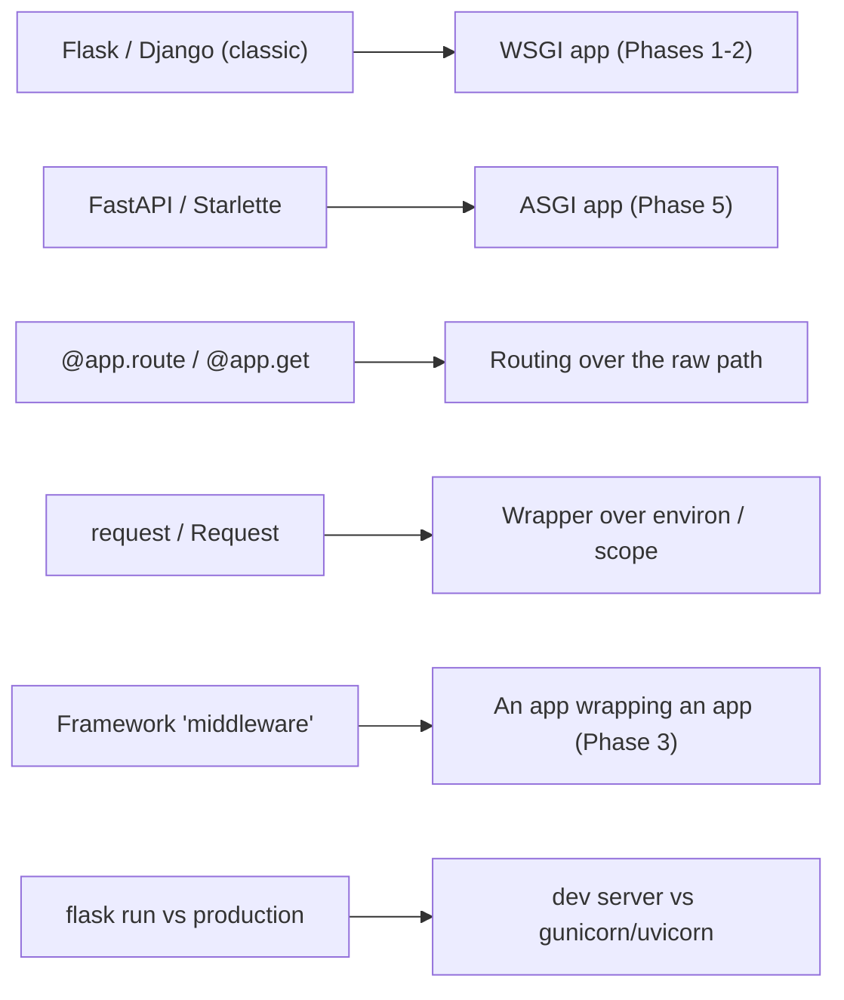

# From Protocol to Framework

Go back to the start of this guide for a second. A Python web framework was a black box: you wrote `@app.route` or `@app.get`, requests showed up as a tidy `request` object, you returned something, and a response went out. A lot happened in the middle that you couldn't name.

Look at what you can see now. You know a request arrives at a **server** - gunicorn or uvicorn - which calls your app as a **callable**. For synchronous frameworks that callable takes `(environ, start_response)`; for async ones it takes `(scope, receive, send)`. You know **middleware** is an app that wraps another app. You know why `flask run` is fine for your laptop and wrong for production. That's not trivia - that's the whole shape of Python web, and you've now seen all of it bare.

This last phase is the payoff. We're not adding new mechanism. We're pointing the X-ray vision you just built at the frameworks you'll actually use at work, and watching the magic turn into machinery you can already name.

## Mapping the magic to the mechanism

💡 Here's the thing worth reading slowly: every "feature" in a Python web framework is a convenience over something in this guide. Once you've seen the bare version, the framework version stops being a spell and becomes a name for a thing you understand.



Reading that left to right, in plain words:

- **Flask and classic Django are WSGI apps.** Under the decorators and the `request` object, each one *is* a WSGI callable - the same `(environ, start_response)` contract you wrote by hand in [Phase 2](02-a-wsgi-app-from-scratch.md). You serve them in production with **gunicorn** (or uWSGI). See [Flask From Zero](/guides/flask-from-zero) and [Django From Zero](/guides/django-from-zero).
- **FastAPI and Starlette are ASGI apps.** Underneath, each is an async callable taking `(scope, receive, send)` - exactly what you built in [Phase 5](05-an-asgi-app-and-the-servers.md). You serve them with **uvicorn**. See [FastAPI From Zero](/guides/fastapi-from-zero).
- **`@app.route("/users")` / `@app.get("/users")`** is routing over the raw path. In the bare apps you read `environ["PATH_INFO"]` (or `scope["path"]`) and branched by hand. The decorator is the framework filling in that same routing table for you.
- **`request` / `Request`** is a friendly wrapper over `environ` or `scope`. Method, path, headers, query string, body - the framework parses the raw dict you saw and hands you attributes instead of keys.
- **Framework "middleware"** is a WSGI/ASGI app wrapping an app - [Phase 3](03-the-wsgi-server-and-middleware.md), generalized. Code that runs before and after your handler, able to read or rewrite the request and response, or short-circuit it entirely. You built one.
- **`flask run` vs production** is the dev server vs gunicorn/uvicorn. The built-in server is a convenience for your laptop; in production a real WSGI/ASGI server runs your same app under load.

That covers the whole Python web world. The frameworks differ in ergonomics and features - but underneath, every one of them is a WSGI or ASGI callable that a server invokes.

## Why you still reach for a framework

Let me be honest, because a roots guide that pretends raw WSGI/ASGI is enough would be doing you a disservice: you don't want to build a real app out of bare callables. It's genuinely tedious.

You'd hand-write the routing and keep it in sync. You'd parse query strings and JSON bodies yourself, then serialize responses by hand. There's no dependency injection, no validation, no friendly request object - you'd reach into `environ` and `scope` for every value and write the same boilerplate a thousand times. The frameworks exist because smart people got tired of doing exactly that, and the conveniences they add are real and worth having.

💡 So here's the point of having learned this: you almost certainly won't write raw WSGI or ASGI at work - you'll write Flask, Django, or FastAPI. What changed is that you now understand *what those frameworks are conveniences over*. That's the entire purpose of a roots guide. When uvicorn shows up in a traceback, you don't flinch - you know it's calling your ASGI callable. When middleware swallows a request, you know it's an app wrapping an app and you know where to look. The framework didn't get simpler; you got the map.

## The deployment payoff

💡 There's a bonus here that pays off across every framework guide on this site: you now understand the deploy story, full stop.

It's the same picture under Flask, Django, and FastAPI, because they're all WSGI or ASGI apps. For a **WSGI** app (Flask, classic Django) you run **gunicorn**. For an **ASGI** app (FastAPI, Starlette) you run **uvicorn** - or, for the best of both, **gunicorn with uvicorn workers** (process management from gunicorn, async handling from uvicorn). In front of either you put **nginx** for TLS and static files, and you set `DEBUG=False` so you're not leaking stack traces in production.

When a deploy guide tells you to "run gunicorn behind nginx," that's no longer a recipe you follow on faith. It's gunicorn calling your WSGI callable, with nginx in front - the exact shape this guide drew.

## What to build - and a last word

📝 Reading got you here. One small build will lock it in for good. Here's the exercise that cements everything:

Write a **bare WSGI app** (about a dozen lines, `(environ, start_response)`) and a **bare ASGI app** (about a dozen lines, `async def app(scope, receive, send)`). Run the first with `gunicorn` and the second with `uvicorn`, and hit each with a browser or `curl`. Feel how little is actually there.

Then do the magic trick: open the source of a framework you use. Find Flask's `wsgi_app` / `__call__`, or Starlette's `async def __call__`, and locate the `(environ, start_response)` or `(scope, receive, send)` entry point. Seeing the exact signature you just wrote, sitting inside real framework code that powers production apps, is the moment it all fuses together. You'll never read a framework the same way again.

When you want the authoritative reference, go to **PEP 3333** (the WSGI spec) and the **ASGI specification**. They're precise, they're the source of truth, and now that you have the concepts, they'll read as confirmation rather than fog.

The line to carry out of this whole guide: **every Python web framework is conveniences over one small callable - and now you can see it.**

## Recap

1. **The X-ray vision is the whole point.** You can now see, under any Python web framework, a WSGI or ASGI callable, a server that calls it, and middleware that wraps it - the bare mechanism this guide built.
2. **Each framework maps to something you know:** Flask and classic Django are WSGI apps (served by gunicorn); FastAPI and Starlette are ASGI apps (served by uvicorn); `@app.route`/`@app.get` is routing over the raw path; `request`/`Request` wraps `environ`/`scope`; "middleware" is an app wrapping an app; `flask run` is the dev server, not production.
3. **Frameworks earn their keep.** Raw WSGI/ASGI is tedious - manual routing, manual parsing and serialization, no DI, endless boilerplate. Frameworks add the conveniences; this guide showed you *what they're conveniences over*.
4. **The deploy story is one picture.** gunicorn (WSGI) or uvicorn / gunicorn-with-uvicorn-workers (ASGI), behind nginx, with `DEBUG=False` - the same under Flask, Django, and FastAPI, because they're all WSGI/ASGI apps.
5. **Build to cement it:** a bare WSGI app and a bare ASGI app, run under gunicorn and uvicorn - then open a real framework's source and find the callable's entry point. PEP 3333 and the ASGI spec are your authoritative sources.

## Quick check

One last check - the mappings that turn frameworks from magic into mechanism:

```quiz
[
  {
    "q": "Mechanically, what are Flask and classic Django?",
    "choices": [
      "WSGI apps - callables taking (environ, start_response), served in production by gunicorn",
      "ASGI apps that only run under uvicorn",
      "Standalone web servers that replace gunicorn",
      "Browser-side JavaScript frameworks"
    ],
    "answer": 0,
    "explain": "Flask and classic Django are WSGI applications underneath the decorators and the request object - the same (environ, start_response) callable you wrote by hand in Phase 2. In production you run them with gunicorn (or uWSGI)."
  },
  {
    "q": "When a framework talks about 'middleware', what is it built on?",
    "choices": [
      "A WSGI or ASGI app that wraps another app",
      "A second web server running alongside the first",
      "A database connection pool",
      "The browser's fetch API"
    ],
    "answer": 0,
    "explain": "Framework 'middleware' is an app wrapping an app - Phase 3, generalized. It runs before and after your handler, can read or rewrite the request and response, or short-circuit the chain entirely."
  },
  {
    "q": "Which deployment statement is accurate across these frameworks?",
    "choices": [
      "WSGI apps run under gunicorn and ASGI apps under uvicorn (or gunicorn with uvicorn workers), typically behind nginx with DEBUG=False",
      "flask run is the recommended way to serve production traffic",
      "FastAPI must be served by gunicorn with no async support",
      "Django can only be deployed as static files"
    ],
    "answer": 0,
    "explain": "It's the same picture under Flask, Django, and FastAPI because they're all WSGI/ASGI apps: gunicorn for WSGI, uvicorn (or gunicorn with uvicorn workers) for ASGI, behind nginx, with DEBUG=False. The built-in flask run dev server is for your laptop, not production."
  }
]
```

---

[← Phase 5: An ASGI App & the Servers](05-an-asgi-app-and-the-servers.md) · [Guide overview](_guide.md)
