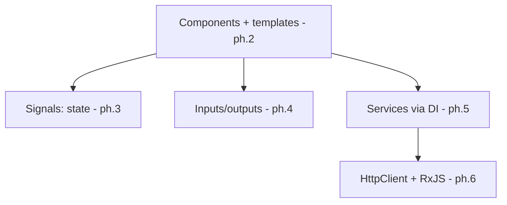

# What Angular Actually Is

React is a rendering library you assemble a stack around. Vue is a framework with an optional
ecosystem. Angular is the third answer: **the whole application platform, decided for you.**
Router, HTTP client, forms system, dependency injection, testing setup, build pipeline - one
coherent set, one version number, maintained together by one team at Google. You give up choosing;
you get back never having to choose - and a codebase that looks like every other Angular codebase,
which is precisely why large organizations keep picking it.

## The identity, concretely

Three commitments define Angular against its neighbors:

- **TypeScript is not optional.** Angular is written in TypeScript and assumes you are too. Types
  aren't a bonus layer; the framework's APIs, tooling, and error messages lean on them. If your
  TypeScript is shaky, budget for leveling it up alongside this guide - it pays either way.
- **The architecture ships in the box.** Where a React team debates data-fetching libraries and a
  Vue team decides when to adopt Pinia, an Angular team uses `HttpClient` and services, because
  that's what's there. Fewer decisions, more uniformity, at the cost of flexibility at the edges.
- **The CLI is the workflow.** You don't hand-create files; you generate them, and the generated
  code follows the conventions the rest of the toolchain expects.

```console
$ npm install -g @angular/cli
$ ng new my-shop
? Which stylesheet format would you like to use? CSS
? Do you want to enable Server-Side Rendering (SSR)? No

$ cd my-shop && ng serve

Initial chunk files | Names   | Raw size
main.js             | main    | 95.21 kB
Application bundle generation complete.
  ➜  Local:   http://localhost:4200/
```

*What just happened:* the CLI scaffolded a project - TypeScript configured, build pipeline wired,
test runner ready - and started the dev server. Day to day you'll also lean on
`ng generate component product-card` (files plus boilerplate, conventions included) and
`ng build` for production. The CLI even automates version upgrades (`ng update`), which is less
glamorous and more valuable than it sounds three years into an app's life.

## The unit: a standalone component

Everything on screen is a component - a TypeScript class with a decorator:

```ts
// src/app/app.ts
import { Component, signal } from '@angular/core';

@Component({
  selector: 'app-root',
  template: `
    <h1>{{ title() }}</h1>
    <button (click)="rename()">Rename</button>
  `,
})
export class App {
  title = signal('My Shop');
  rename() {
    this.title.set('My Better Shop');
  }
}
```

*What just happened:* the `@Component` decorator attaches metadata to a class - the `selector` is
the HTML tag this component answers to (`<app-root>` in `index.html`), and the `template` is its
markup (inline here; larger components point at a separate `templateUrl` file). The class holds
state and methods; the template reads them. `signal(...)` is phase 3's whole topic - for now, note
that state lives in signals and templates call them like functions: `{{ title() }}`.

📝 **Terminology:** components like this are **standalone** - they declare what they need and can
be used directly. Older Angular grouped components into **NgModules** (`@NgModule` declarations
in `app.module.ts` files), and most tutorials older than a couple of years - plus most codebases
you'll inherit - are built that way. The concepts in this guide transfer; the packaging differs.
If a tutorial starts with `app.module.ts`, it's teaching the legacy structure. New Angular code is
standalone by default, and this guide is standalone throughout.

## How the pieces will fit

The box is big; the load-bearing walls are few. This guide's map:



Components render. Signals tell them what changed. Inputs and outputs wire components to each
other. Services - delivered by dependency injection - hold what components share: state, logic,
and the HTTP layer. Those five ideas *are* daily Angular; the rest of the box (router, forms,
animations) attaches to them.

## An even-handed word on choosing it

| You are... | Angular's deal |
|---|---|
| A large team wanting uniform codebases and long-term support | ✓ this is the core case - conventions scale across people |
| An enterprise with 5-10 year application lifespans | ✓ Google's LTS cadence and `ng update` are built for this |
| A solo dev or small team optimizing for speed-to-first-feature | The box has a learning tax; React/Vue/Svelte get you moving faster |
| Building a content site where SEO and first paint dominate | Possible (SSR exists) but the meta-frameworks next door are more purpose-built |
| Coming from a strongly-typed backend (Java, C#) | ✓ DI + decorators + classes will feel like home faster than JSX will |

## Recap

1. Angular ships the whole platform - router, HTTP, forms, DI, testing - as one versioned,
   conventional set. Fewer choices, more uniformity.
2. TypeScript is mandatory and load-bearing, not decorative.
3. The CLI generates, builds, serves, and upgrades; it's the workflow, not a convenience.
4. A component = a decorated TypeScript class + template; modern components are standalone, and
   NgModule-based code is the legacy dialect you'll read at work.
5. Daily Angular is five ideas: components, signals, inputs/outputs, services/DI, HttpClient.

```quiz
[
  {
    "q": "A React developer asks what they get for accepting Angular's bigger learning tax. Per this phase, the core answer is:",
    "choices": [
      "Better runtime performance than a library can achieve",
      "The whole application architecture ships in the box, so teams don't assemble or debate a stack - and every Angular codebase looks alike",
      "No build step is required",
      "JavaScript instead of TypeScript"
    ],
    "answer": 1,
    "why": [
      "Performance across the big frameworks is comparable and workload-dependent - the differentiator is architectural, not speed.",
      null,
      "Angular's build pipeline is substantial - the CLI manages it, but it's very much there.",
      "It's the reverse: TypeScript is mandatory."
    ],
    "explain": "Angular's identity is the complete, opinionated platform: router, HTTP, forms, DI, and conventions decided once, uniformly, for every team in the org."
  },
  {
    "q": "A tutorial opens by editing app.module.ts and adding components to a declarations array. What should you conclude?",
    "choices": [
      "It's teaching a different framework",
      "It's teaching the legacy NgModule structure - concepts transfer, but modern code is standalone components",
      "The tutorial is for server-side Angular",
      "declarations is where standalone components are registered"
    ],
    "answer": 1,
    "why": [
      "It's Angular alright - an earlier packaging of it.",
      null,
      "SSR uses the same component model - module-vs-standalone is an era split, not a server split.",
      "Standalone components skip declarations arrays entirely - importing what they need directly."
    ],
    "explain": "NgModules grouped and declared components for a decade, and most existing codebases use them. New Angular defaults to standalone components; read both, write standalone."
  }
]
```

---

[← Guide overview](_guide.md) · [Phase 2: Components and Templates →](02-components-and-templates.md)
