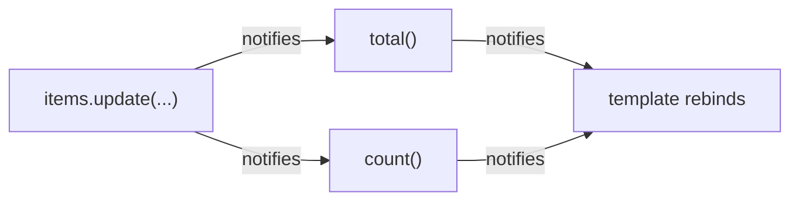

# Signals

Every phase so far has written state as `signal(...)` and read it as `title()`. Time to pay that
off. Signals are Angular's modern reactivity - the answer to "how does the framework know what
changed?" - and they'll feel familiar if you've read our Vue or Svelte guides, because all three
frameworks converged on the same idea: **track reads, notify on writes.** Angular's spelling is
just the most explicit of the family.

## The API: three verbs

```ts
import { Component, signal, computed } from '@angular/core';

@Component({
  selector: 'app-cart',
  template: `
    <p>{{ count() }} items - {{ total() }} cents</p>
    <button (click)="add(1900)">Add kettle</button>
    <button (click)="clear()">Clear</button>
  `,
})
export class Cart {
  items = signal<number[]>([]);

  count = computed(() => this.items().length);
  total = computed(() => this.items().reduce((s, p) => s + p, 0));

  add(price: number) {
    this.items.update(list => [...list, price]);
  }
  clear() {
    this.items.set([]);
  }
}
```

*What just happened,* verb by verb:

- **Read: call it.** `items()` returns the current value - and, when called during rendering,
  registers the caller as a dependent. That call syntax is the visible tip of the whole tracking
  system.
- **Write: `set` or `update`.** `set(newValue)` replaces; `update(fn)` computes the new value from
  the old - the right choice whenever new depends on old (the same old-value discipline as
  React's function-form setters, made a named method).
- **Derive: `computed`.** Reads other signals, caches its result, recomputes only when a
  dependency changed. Chains resolve automatically - `total` depends on `items`, the template
  depends on `total`, and a single `add()` updates exactly that chain.

⚠️ **Gotcha:** `update` hands you the current value, and the habit from other frameworks of
mutating it (`list.push(price); return list`) returns the *same object* - and signals, like
React, use reference equality to decide whether anything changed. Same reference = no
notification = stale screen. Return a fresh array/object (`[...list, price]`), exactly as the
example does. Angular's signals sit on the immutable-update side of the family tree, with Vue and
Svelte's proxies on the other.

## Why calling, not touching

Vue tracks reads through proxy traps (`user.name`), Svelte's compiler rewrites variable access -
both hide the tracking behind normal-looking syntax. Angular chose visibility: a read is a call,
so **every place your code depends on a signal is marked by parentheses.** The cost is typing
`()`; the payoff is that dependency edges are visible in code review, and there's no "is this
variable reactive?" ambiguity - if it's called, it's live; if it's not a signal, it's not.



📝 **Terminology - the era note.** Before signals, Angular detected changes with **zone.js**: a
patch over browser APIs that re-checked *every* component's bindings after *any* event, timeout,
or HTTP response - correct, but brute-force, and the source of the legacy `ExpressionChanged
AfterItHasBeenCheckedError` you may meet in older code. Signals give Angular precise knowledge of
what changed, and current Angular can run **zoneless**, updating only actual dependents. In
inherited codebases both worlds coexist: class fields without signals still work (zone.js catches
them); new code should be signals for precision and for a future that's already arriving.

## effect(): the escape hatch, rationed

```ts
import { effect } from '@angular/core';

export class Cart {
  items = signal<number[]>([]);

  constructor() {
    effect(() => {
      localStorage.setItem('cart', JSON.stringify(this.items()));
    });
  }
}
```

*What just happened:* the effect runs once, tracks what it read (`items`), and re-runs on change -
here syncing state to a system *outside* Angular (storage). That's the entire legitimate territory:
localStorage, logging, third-party libraries, manual DOM. The framework is blunt about the
boundary: **writing to signals inside an effect throws by default** - because "state syncing
state" is a `computed` wearing the wrong costume, one render behind and twice as confusable. Same
rule as React, Vue, and Svelte; Angular enforces it loudest. (Effects also accept an `onCleanup`
callback for the timer/subscription cases - the universal start-needs-a-stop discipline.)

## Recap

1. Read by calling (`items()`), write with `set`/`update`, derive with `computed` - chains wire
   themselves.
2. `update` must return a *new* object/array - signals compare by reference; in-place mutation is
   invisible.
3. The call syntax makes every dependency edge visible - Angular's trade of ergonomics for
   explicitness.
4. Zone.js is the legacy check-everything engine; signals are the precise modern one, and zoneless
   is where Angular is heading.
5. `effect()` faces outward only - writing signals inside one throws, and the fix is usually
   `computed`.

```quiz
[
  {
    "q": "cart.update(list => { list.push(item); return list; }) runs, but the template doesn't change. Why?",
    "choices": [
      "update() can't be used with arrays",
      "The same array reference came back - signals compare by reference, so no change was detected",
      "push is asynchronous",
      "The template forgot to call cart()"
    ],
    "answer": 1,
    "why": [
      "Arrays are fine - fresh ones.",
      null,
      "push is synchronous; the item is in the array - the signal just doesn't know.",
      "If the template didn't call the signal it would never have displayed the cart at all."
    ],
    "explain": "Signals detect change by reference equality. Mutate-and-return-same is invisible; return a new array ([...list, item]) so the reference changes and dependents re-run."
  },
  {
    "q": "What does Angular's signal-read-is-a-function-call syntax buy, compared to Vue's invisible proxy reads?",
    "choices": [
      "Faster reads at runtime",
      "Every dependency on reactive state is visibly marked in the code - no ambiguity about what's live",
      "It removes the need for computed",
      "It allows signals to work without TypeScript"
    ],
    "answer": 1,
    "why": [
      "Read cost is negligible either way - the trade is about legibility, not speed.",
      null,
      "computed is central to signals - the call syntax changes nothing there.",
      "TypeScript is mandatory in Angular regardless."
    ],
    "explain": "The parentheses are the tracking made visible: reviewers and tools can see exactly where code depends on reactive state. The cost is typing (); the trade is deliberate."
  },
  {
    "q": "An effect() that reads items() and writes a summary signal throws at runtime. What's Angular telling you?",
    "choices": [
      "Effects can only run in components, not services",
      "State derived from state belongs in computed() - effects are for the world outside the signal graph, and signal writes inside them are blocked by default",
      "The effect is missing its dependency array",
      "summary must be declared before items"
    ],
    "answer": 1,
    "why": [
      "Effects run fine in services (they need an injection context, which services have).",
      null,
      "Angular effects auto-track - no dependency arrays exist.",
      "Declaration order doesn't produce this error - the write itself does."
    ],
    "explain": "A value computed from other signals is a derivation: computed(). Effects exist for storage, logging, DOM, and libraries - and Angular enforces the boundary with an error rather than a lint warning."
  }
]
```

---

[← Phase 2: Components and Templates](02-components-and-templates.md) · [Guide overview](_guide.md) · [Phase 4: Component Inputs and Outputs →](04-inputs-and-outputs.md)
