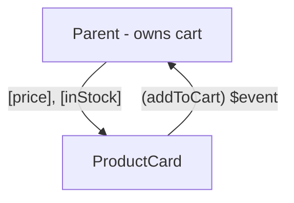

# Component Inputs and Outputs

An Angular app is a tree of components, and the tree needs plumbing: data flowing down, events
flowing up. Modern Angular expresses both as signal-based functions - `input()`, `output()`,
`model()` - which slot straight into the reactivity you learned last phase: an input *is* a
signal, so computeds and templates track it like any other. Same one-way philosophy as the rest of
the family; Angular's version comes with the types checked.

## input(): data down, as a signal

```ts
// product-card.ts
import { Component, input, computed } from '@angular/core';

@Component({
  selector: 'app-product-card',
  template: `
    <article [class.dimmed]="!inStock()">
      <h3>{{ name() }}</h3>
      <p>{{ displayPrice() }}</p>
    </article>
  `,
})
export class ProductCard {
  name = input.required<string>();
  price = input.required<number>();     // cents
  inStock = input(true);                // optional, with default

  displayPrice = computed(() => (this.price() / 100).toFixed(2) + ' €');
}
```

```html
<!-- parent template -->
<app-product-card name="Kettle" [price]="4900" [inStock]="false" />
```

*What just happened:* each `input()` declares a prop - `required` ones the compiler *refuses to
let a parent omit*, optional ones with defaults. At the call site, the phase 2 rule applies:
brackets bind expressions, bare attributes pass strings (`[price]="4900"` is the number;
`price="4900"` is a string, and with `input.required<number>()` the **build fails** - the
TypeScript payoff in action).

Because inputs are signals, `displayPrice` is just a `computed` over them: parent passes a new
price, the computed and the template update through the standard graph. No lifecycle hook to
intercept changes (`ngOnChanges`, the legacy way) - dependency tracking replaces it.

## output(): events up

```ts
import { Component, input, output } from '@angular/core';

@Component({
  selector: 'app-product-card',
  template: `
    <h3>{{ name() }}</h3>
    <button (click)="addToCart.emit(1)">Add</button>
  `,
})
export class ProductCard {
  name = input.required<string>();
  addToCart = output<number>();     // the payload type
}
```

```html
<!-- parent template -->
<app-product-card name="Kettle" (addToCart)="cart.add('kettle', $event)" />
```

*What just happened:* `output<number>()` declares a typed event; the child fires it with
`.emit(payload)`; the parent listens with the same `(round brackets)` used for DOM events, and
`$event` is the payload. The child announces intent, the parent owns the meaning - data down,
events up, with both directions in the class's first lines:



💡 **Key point:** a component's `input()`/`output()` declarations *are* its documentation - typed,
compiler-checked, and complete. This is Angular's version of the interface-first habit, and it's
why sprawling Angular codebases stay navigable: the contract is always at the top of the class.

## model(): two-way, composed

For genuinely co-owned values - the search box, the rating widget - `model()` declares an input
and its matching output as one:

```ts
// star-rating.ts
import { Component, model } from '@angular/core';

@Component({
  selector: 'app-star-rating',
  template: `
    @for (n of [1, 2, 3, 4, 5]; track n) {
      <button (click)="value.set(n)">{{ n <= value() ? '★' : '☆' }}</button>
    }
  `,
})
export class StarRating {
  value = model(0);
}
```

```html
<!-- parent -->
<app-star-rating [(value)]="rating" />
```

*What just happened:* `model(0)` is a *writable* input - the child may `set` it, and each set
emits a `valueChange` event under the hood. The parent's banana-in-a-box `[(value)]` wires both
directions. It's the same de-sugaring as `[(ngModel)]` in phase 2, now for your own components -
and the same consent principle as Svelte's `$bindable`: two-way exists only where the child
explicitly declares a `model`, never by ambush.

## Reading the legacy dialect

Most existing code declares its interface with decorators; the mapping is one-to-one:

| Legacy | Modern | Notes |
|---|---|---|
| `@Input() name: string;` | `name = input<string>()` | legacy inputs are plain fields, not signals - read `this.name`, no parens |
| `@Input({ required: true })` | `input.required<string>()` | |
| `@Output() add = new EventEmitter<number>();` | `add = output<number>()` | both fire with `.emit(...)` |
| `ngOnChanges(changes) {...}` | a `computed` or `effect` over the input signal | the hook watched inputs by hand |

The practical wrinkle: in legacy components, inputs are ordinary properties - templates say
`{{ name }}` not `{{ name() }}`. When you're editing a component, check which dialect it speaks
before adding parentheses (or forgetting them); phase 7's cheat-card includes the two mismatch
errors this produces.

## Recap

1. `input()` declares props as signals - `required` enforced at build time, defaults for the
   rest; computeds over inputs replace `ngOnChanges`.
2. `output<T>()` + `.emit(payload)` sends typed events up; parents listen with `(eventName)` and
   read `$event`.
3. `model()` is the declared two-way: writable input + implicit `xChange` output, bound with
   `[(x)]`.
4. The input/output block at the top of a class is the component's compiler-checked contract.
5. Legacy dialect: `@Input`/`@Output` decorators, non-signal fields, `ngOnChanges` - translate on
   sight, don't mix within a component.

```quiz
[
  {
    "q": "A parent writes <app-badge [count]=\"5\" /> but the build fails: required input 'label' has no value. What's Angular enforcing?",
    "choices": [
      "All inputs must always be provided",
      "The child declared label = input.required(), and required inputs are checked at compile time",
      "Inputs must be strings unless bracketed",
      "The selector app-badge is not imported"
    ],
    "answer": 1,
    "why": [
      "Optional inputs with defaults omit freely - only required ones are enforced.",
      null,
      "That's the string-vs-expression rule; this error is about absence, not type.",
      "A missing import is the unknown-element error (phase 7), not a missing-input one."
    ],
    "explain": "input.required() moves 'this prop is mandatory' from documentation into the compiler. The parent that forgets it gets a build error, not an undefined at runtime."
  },
  {
    "q": "Legacy component: @Input() title: string. You write {{ title() }} in its template and get a runtime error. Why?",
    "choices": [
      "Legacy inputs need the async pipe",
      "Decorator inputs are plain properties, not signals - there's nothing to call; it's {{ title }}",
      "The parentheses conflict with the event-binding syntax",
      "title must be initialized before use"
    ],
    "answer": 1,
    "why": [
      "The async pipe unwraps observables (phase 6) - unrelated to plain fields.",
      null,
      "() in interpolation is a call, not an event binding - the call itself is the problem.",
      "Initialization affects the value, not the calling-a-string crash."
    ],
    "explain": "The two dialects differ exactly here: signal inputs read with parens, decorator inputs without. Check which dialect a component speaks before editing its template."
  },
  {
    "q": "When does model() beat a plain input() plus output() pair?",
    "choices": [
      "Whenever a component has both inputs and outputs",
      "When parent and child genuinely co-own one value - form-like widgets where [(x)] binding is the natural interface",
      "Always - it's the modern replacement",
      "When the value is an object rather than a primitive"
    ],
    "answer": 1,
    "why": [
      "Most components have both - a product card's price in and addToCart out are two different values, not one shared one.",
      null,
      "One-way input/output remains the default and the majority - model() is the declared exception.",
      "Shape of the value is irrelevant; ownership is the criterion."
    ],
    "explain": "model() is for the rating-widget/search-box case: one value both sides read and write. Everything else stays one-way - data down, events up, traceable."
  }
]
```

---

[← Phase 3: Signals](03-signals.md) · [Guide overview](_guide.md) · [Phase 5: Services and Dependency Injection →](05-services-and-di.md)
