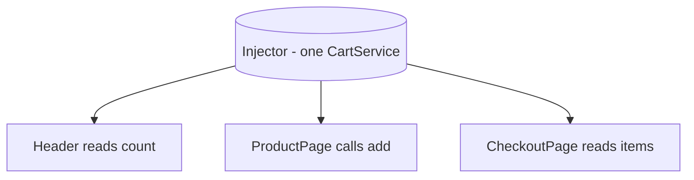

# Services and Dependency Injection

Ask "where does shared state live?" in React and you get a discussion. Ask in Angular and you get
one word: **a service.** Cart state, the HTTP layer, logging, the current user - anything more
than one component needs lives in a service class, and **dependency injection** (DI) delivers it.
DI is the most enterprise-scented term in this guide and the actual idea is small; ten minutes
here demystifies half of every Angular codebase you'll ever open.

## A service is a class with a marker

```ts
// src/app/cart.service.ts
import { Injectable, signal, computed } from '@angular/core';

@Injectable({ providedIn: 'root' })
export class CartService {
  private items = signal<{ id: string; qty: number }[]>([]);

  readonly count = computed(() => this.items().reduce((n, i) => n + i.qty, 0));

  add(id: string, qty = 1) {
    this.items.update(list => {
      const line = list.find(i => i.id === id);
      return line
        ? list.map(i => (i.id === id ? { ...i, qty: i.qty + qty } : i))
        : [...list, { id, qty }];
    });
  }
  clear() { this.items.set([]); }
}
```

*What just happened:* a plain class holds signals and the methods that update them - phase 3's
reactivity, outside any component. `@Injectable({ providedIn: 'root' })` registers it with the
injector: "root" means **one instance for the whole application**, created lazily the first time
someone asks. Note the shape: state `private`, a read-only `computed` exposed, mutations as named
methods - the service owns its invariants, and no component can reach in and corrupt the list.

## inject(): asking for it

```ts
// header.ts
import { Component, inject } from '@angular/core';
import { CartService } from './cart.service';

@Component({
  selector: 'app-header',
  template: `<span>Cart ({{ cart.count() }})</span>`,
})
export class Header {
  cart = inject(CartService);
}
```

```ts
// product-page.ts
export class ProductPage {
  cart = inject(CartService);
  buy(id: string) { this.cart.add(id); }
}
```

*What just happened:* both components asked the injector for `CartService` and received **the same
instance**. `ProductPage.buy()` updates the signal; `Header`'s template - subscribed through
`cart.count()` - updates immediately. Shared state without a prop chain, an event bus, or a store
library: a singleton service plus signals *is* Angular's store pattern.



📝 **Terminology:** `inject()` must run in an **injection context** - field initializers and
constructors, practically speaking. Calling it later (in a click handler, a `setTimeout`) throws
`NG0203`. The pattern is always the same: grab dependencies at the top of the class, use them
anywhere. Legacy dialect: constructor parameters -
`constructor(private cart: CartService) {}` - same injector, older spelling, everywhere in
existing code.

## Why the indirection earns its keep

You could `import { cartService } from './cart'` - a module singleton, like our Svelte guide's
`.svelte.js` pattern. Angular routes it through the injector for two reasons that matter at its
scale:

- **Swappability without surgery.** The injector is a lookup, and lookups can be overridden per
  environment or per test: hand the test a `FakeCartService` and the components under test never
  know. With hard imports, that seam doesn't exist - which is why "how do I mock this?" is a
  question Angular teams rarely ask. This is the testability argument that made DI famous, and it
  was Angular's core bet from version one.
- **Scoping when you need it.** `providedIn: 'root'` covers most services, but a component can
  provide its *own* instance (`providers: [WizardState]` in the decorator), giving each component
  subtree a private copy - the per-tree-instance case (two wizards, each with private step state)
  that pure module singletons can't express.

The trade, stated fairly: a layer of indirection you carry everywhere, for a seam you mostly
exploit in tests and larger architectures. Angular decided the trade once, for everyone - very on
brand.

## Services beyond state

The same mechanism carries stateless concerns - and composes:

```ts
@Injectable({ providedIn: 'root' })
export class NotificationService {
  private messages = signal<string[]>([]);
  readonly current = this.messages.asReadonly();

  show(msg: string) {
    this.messages.update(m => [...m, msg]);
    setTimeout(() => this.messages.update(m => m.slice(1)), 3000);
  }
}

@Injectable({ providedIn: 'root' })
export class CartService {
  private notify = inject(NotificationService);   // services inject services

  add(id: string, qty = 1) {
    /* ...update items... */
    this.notify.show('Added to cart');
  }
}
```

Layered services - the HTTP layer injected by data services injected by feature services - are the
skeleton of every large Angular app. Phase 6 adds the innermost layer: `HttpClient`, itself
delivered by DI.

## Recap

1. Shared state and logic live in `@Injectable` service classes; `providedIn: 'root'` = one lazy
   app-wide instance.
2. `inject(ServiceClass)` in a field initializer delivers it; constructor-parameter injection is
   the legacy spelling of the same thing.
3. Singleton service + signals = Angular's built-in store: private state, exposed computeds, named
   mutations.
4. DI's payoff is the seam - swap implementations in tests without touching consumers; its cost is
   indirection.
5. Component-level `providers` scope an instance to a subtree - the per-widget-tree case.

```quiz
[
  {
    "q": "Header and ProductPage both inject(CartService) with providedIn: 'root'. ProductPage adds an item. Why does Header's badge update?",
    "choices": [
      "Angular broadcasts a change event between components that inject the same class",
      "Both hold the same singleton instance, and the badge reads a computed over the instance's signal",
      "inject() creates linked copies that sync automatically",
      "The router refreshes all components on state change"
    ],
    "answer": 1,
    "why": [
      "No events are involved - just one object and the signal graph.",
      null,
      "No copies exist - that's the point of root scope: one instance, delivered to all askers.",
      "The router navigates; it plays no role in reactivity."
    ],
    "explain": "providedIn: 'root' means one instance per app. Shared instance + signals = shared reactive state: any component's write flows to any component's read through the normal dependency graph."
  },
  {
    "q": "Calling inject(CartService) inside a click handler throws NG0203. What's the rule?",
    "choices": [
      "Services can't be used from event handlers",
      "inject() only works in an injection context - grab dependencies in field initializers or the constructor, then use them anywhere",
      "The service was missing providedIn: 'root'",
      "Click handlers run outside Angular's zone"
    ],
    "answer": 1,
    "why": [
      "Using an already-injected service in a handler is the normal pattern - it's the injecting that's position-sensitive.",
      null,
      "A missing registration gives a no-provider error, not a context error.",
      "Zones relate to change detection, not injection timing."
    ],
    "explain": "The injector needs to know who is asking, which it only knows during construction. Inject at the top of the class (cart = inject(CartService)); call cart.add() from wherever you like."
  },
  {
    "q": "What does routing dependencies through the injector buy over a plain import of a module singleton?",
    "choices": [
      "Faster instantiation",
      "A replaceable seam - tests and environments can substitute implementations without touching consumer code - plus per-subtree scoping via component providers",
      "Automatic persistence of service state",
      "It's required for signals to work"
    ],
    "answer": 1,
    "why": [
      "Instantiation cost is identical - lazy either way.",
      null,
      "Nothing persists unless you write it somewhere - services are in-memory objects.",
      "Signals work anywhere; plenty of signal state lives outside services."
    ],
    "explain": "DI's indirection is a lookup you can override: FakeCartService in tests, scoped instances per subtree in the app. That seam is the argument that justifies the ceremony."
  }
]
```

---

[← Phase 4: Component Inputs and Outputs](04-inputs-and-outputs.md) · [Guide overview](_guide.md) · [Phase 6: HTTP and Just Enough RxJS →](06-http-and-just-enough-rxjs.md)
