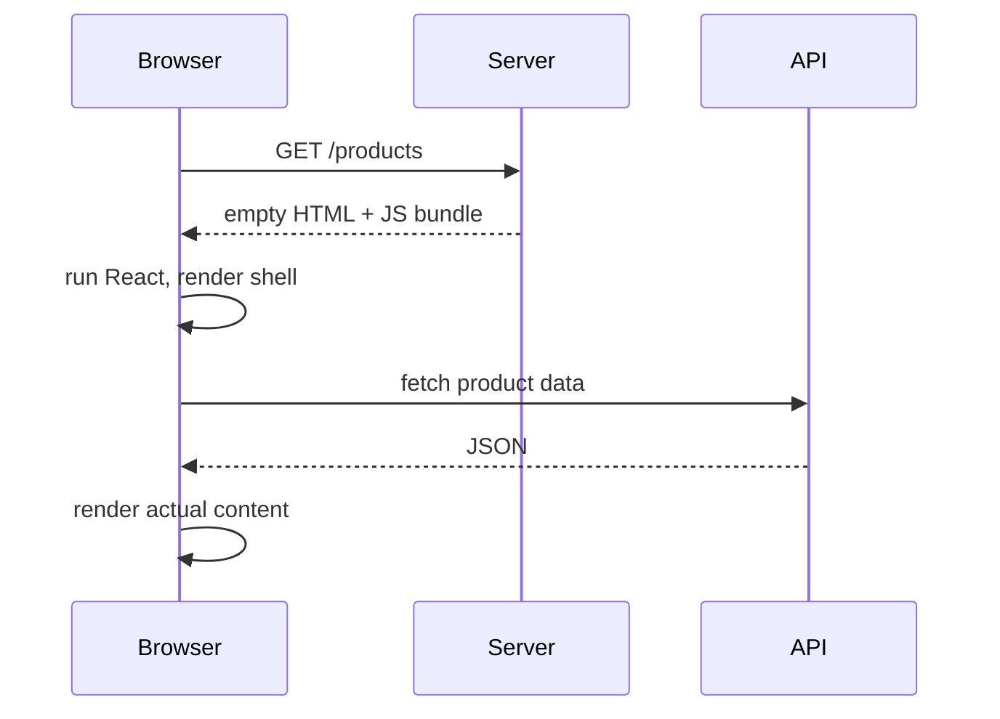
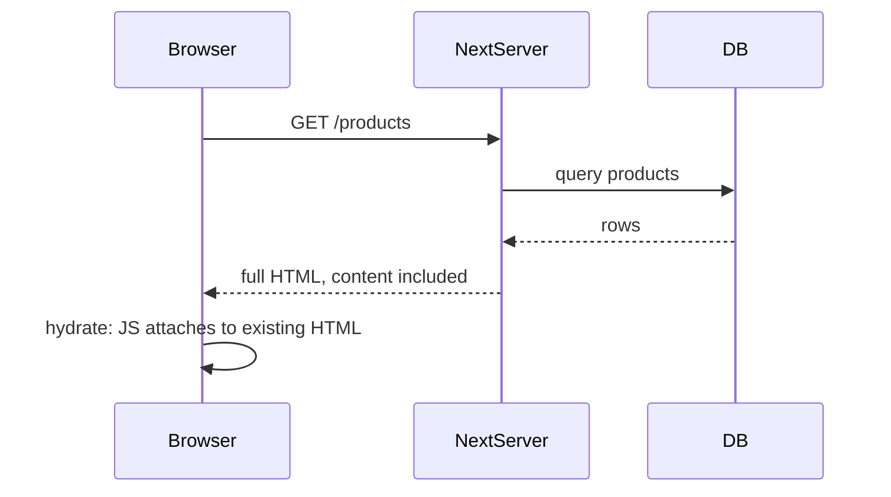

# What Next.js Actually Is

A plain React app (the Vite kind you built in React from Zero) has a specific shape, and that shape
has specific costs. Next.js exists because of those costs. Before touching the framework, look
squarely at what it's fixing - otherwise every Next convention feels like ceremony.

## What a plain React app actually ships

Build a Vite React app and look at what the server sends the browser:

```html
<!doctype html>
<html>
  <body>
    <div id="root"></div>
    <script src="/assets/index-BX7z3kQ9.js"></script>
  </body>
</html>
```

That's it. An empty div and a script tag. Everything the user sees is built *in their browser*,
after the JavaScript downloads, parses, and runs, and after that JavaScript fetches whatever data it
needs. This is a **single-page application** (SPA), and the sequence looks like:



Four steps before content appears, two of them network round-trips. The costs:

- **Slow first paint on slow devices and networks.** The user stares at a blank page (or a spinner)
  while the bundle loads and the data fetch completes.
- **Search engines and link previews see an empty div.** Crawlers have gotten better at running
  JavaScript, but "sometimes, eventually, partially" - and social-card scrapers mostly don't try.
  For content that lives on being found, that's disqualifying.
- **Your data layer is public.** Every fetch happens in the browser, so every API endpoint, and the
  tokens to call it, are visible to anyone who opens DevTools.

For an app behind a login (a dashboard, an editor), these costs are often fine, and a SPA is a
perfectly good architecture. For anything public - a store, a blog, a marketing site, this site -
they hurt.

## The move: render on the server first

Next.js's core move is old, and that's a compliment: like PHP or Rails, it runs your code on a
server and sends **finished HTML**. The difference from PHP is *what* runs: your same React
components. Next renders your component tree to HTML on the server, sends that, and the content is
on screen after one round-trip:



📝 **Terminology:** that last step is **hydration** - the browser downloads the component
JavaScript, React renders the tree in memory, and instead of creating DOM it *attaches* to the HTML
that's already there, wiring up event handlers. The page was readable before hydration; it becomes
*interactive* after. (Phase 7 covers what happens when the server HTML and the client render
disagree - the famous hydration mismatch.)

💡 **Key point:** Next.js is a server wrapped around React. HTML is produced on the server - either
per-request or ahead of time at build (phase 6) - and the browser's JavaScript takes over from
there. Every Next feature in this guide is a consequence of having that server: file routing
(phase 2), components that run only server-side (phase 3), data fetching without a public API
(phase 4), form handling on the server (phase 5), caching (phase 6).

## Hello, actual project

```console
$ npx create-next-app@latest my-shop
✔ Would you like to use TypeScript? … Yes
✔ Would you like to use ESLint? … Yes
✔ Would you like to use App Router? (recommended) … Yes
Creating a new Next.js app in ./my-shop

$ cd my-shop && npm run dev

   ▲ Next.js
   - Local:  http://localhost:3000
 ✓ Ready
```

*What just happened:* the scaffold created an `app/` directory (your routes and components), a
`public/` directory (static files), and config. `npm run dev` started the Next server - note that
word: unlike Vite's static-file dev server, this is the actual server architecture you'll deploy,
running your components on Node.

The one file worth reading immediately is `app/page.tsx` - it's the component behind `/`, and it
looks like the React you already know. Two phases from now you'll understand exactly which parts of
it ran on the server before your browser saw anything.

⚠️ **Gotcha:** "App Router" in that prompt refers to the current routing system built on the `app/`
directory - the one this guide teaches. Older tutorials (and many codebases) use the previous
system, the "Pages Router" (`pages/` directory, `getServerSideProps`). The concepts rhyme but the
APIs are entirely different; if a tutorial mentions `getStaticProps`, it's teaching the old system.

## So do you need it?

An even-handed table, because "always use a framework" is tool-brain:

| Situation | Plain React (Vite SPA) | Next.js |
|---|---|---|
| Internal dashboard behind a login | ✓ simpler, no server to run | overkill unless you want its DX |
| Public content site, store, blog | slow first paint, weak SEO | ✓ this is the core case |
| You need server-side secrets in the data path | build a separate API | ✓ built in |
| Team knows React, no ops appetite | ✓ static hosting is trivial | needs a Node server or a platform |
| Embedded widget inside another site | ✓ | wrong shape entirely |

## Recap

1. A SPA ships an empty div and builds everything in the browser: fine behind a login, costly for
   public content (first paint, SEO, exposed data layer).
2. Next.js renders your React components to HTML on a server first; the browser hydrates that HTML
   into an interactive app.
3. Everything Next adds - routing, server components, actions, caching - flows from having that
   server in front.
4. App Router (`app/` directory) is the current system and what this guide teaches; `pages/` +
   `getServerSideProps` is the older one you'll meet in legacy code.

```quiz
[
  {
    "q": "Why does a plain React SPA tend to show a blank page or spinner before content appears?",
    "choices": [
      "React is slower than other frameworks at rendering",
      "The server sends an empty shell, so content waits for the JS bundle to load and the data fetch to finish",
      "Browsers block rendering until all JavaScript is downloaded",
      "The virtual DOM must be built twice on first load"
    ],
    "answer": 1,
    "why": [
      "Rendering speed isn't the bottleneck - the network round-trips before rendering can even start are.",
      null,
      "Browsers happily render HTML while scripts load - but an empty div has nothing to render.",
      "There's no double build in a SPA; that's a garbled version of hydration, which only exists with server rendering."
    ],
    "explain": "The SPA sequence is: empty HTML, download JS, run React, fetch data, then render. Server rendering collapses that into one round-trip that already contains content."
  },
  {
    "q": "What does hydration mean in a Next.js app?",
    "choices": [
      "The server refreshes stale cached pages in the background",
      "Client JavaScript attaches React to the server-sent HTML, making it interactive",
      "CSS is inlined into the HTML to avoid a second request",
      "Data is streamed into the page as it loads"
    ],
    "answer": 1,
    "why": [
      "Background refresh of cached pages is revalidation - a phase 6 topic, unrelated to hydration.",
      null,
      "CSS inlining is a build optimization; hydration is about behavior, not styling.",
      "Streaming is real (phase 4) but it's about delivering HTML in pieces, not attaching interactivity."
    ],
    "explain": "The HTML arrives readable but inert. Hydration is React rendering in memory and adopting that existing DOM, wiring up handlers - readable first, interactive after."
  }
]
```

---

[← Guide overview](_guide.md) · [Phase 2: Routing with Files →](02-routing-with-files.md)
