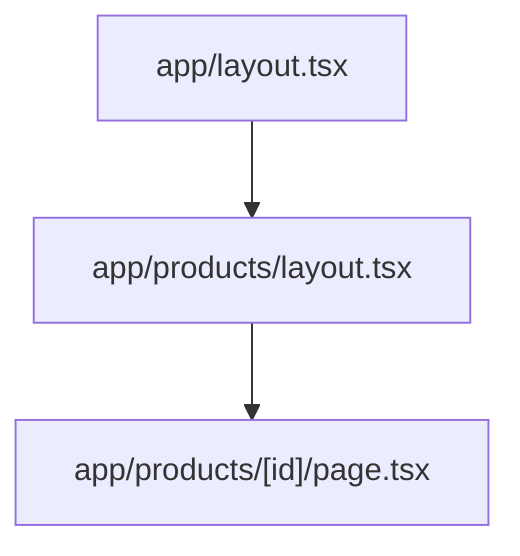

# Routing with Files

In a Vite SPA you'd install React Router and declare routes in code. Next.js replaced that
configuration with a convention: **the `app/` folder structure *is* the router**. Folders are URL
segments; special filenames say what each segment renders. Learn about six filenames and you can
read any Next project's URL space by looking at its file tree.

## Folders are URLs, page.tsx is the content

```text
app/
  page.tsx                →  /
  about/
    page.tsx              →  /about
  products/
    page.tsx              →  /products
    [id]/
      page.tsx            →  /products/42, /products/tea-kettle, ...
```

A folder only becomes a *visitable* URL when it contains a `page.tsx` (or `.jsx`). A folder without
one is just organization. The component in `page.tsx` is what renders at that URL:

```tsx
// app/about/page.tsx
export default function AboutPage() {
  return <h1>About us</h1>;
}
```

*What just happened:* the default export of `page.tsx` is an ordinary React component. Visit
`/about` and the Next server renders it (server-side first, per phase 1) into the layout stack
around it. No route table, no registration - the file's existence is the registration.

## Dynamic segments: [id]

Square brackets make a folder match *any* value in that position, and your page receives it:

```tsx
// app/products/[id]/page.tsx
export default async function ProductPage({ params }) {
  const { id } = await params;
  return <h1>Product {id}</h1>;
}
```

*What just happened:* `/products/42` renders this component with `id` equal to `"42"` (always a
string - parse it if you need a number). `params` arrives as a Promise in current Next versions,
hence the `await` - and yes, the component itself is `async`, which is a server-component
superpower phase 4 explains properly.

📝 **Terminology:** `[id]` is a **dynamic segment**. The catch-all variant `[...slug]` matches any
*depth* (`/docs/a/b/c` → `slug: ['a','b','c']`) - useful for docs sites and CMS-driven trees.

## layout.tsx: the persistent frame

Every folder can also have a `layout.tsx`. A layout wraps every page at its level *and below*:

```tsx
// app/layout.tsx - the root layout, required
export default function RootLayout({ children }) {
  return (
    <html lang="en">
      <body>
        <nav>...site nav...</nav>
        {children}
      </body>
    </html>
  );
}
```

Layouts nest: `/products/42` renders the root layout, then `app/products/layout.tsx` if it exists,
then the page - outermost to innermost, like nesting dolls.



💡 **Key point:** the thing that makes layouts more than a wrapper component: **layouts don't
re-render when you navigate between their children.** Go from `/products/42` to `/products/43` and
the product layout (its nav, its sidebar, its state) stays mounted - only the page swaps. That's
the interactive-app feel with URL-per-view semantics, and it's why putting a search box's state in
a layout survives navigation, while putting it in a page doesn't.

The other members of the special-file family, briefly - each applies to its segment and below:

| File | Role |
|---|---|
| `page.tsx` | the content; makes the URL visitable |
| `layout.tsx` | persistent frame around children |
| `loading.tsx` | instant fallback while the page's data loads (phase 4) |
| `error.tsx` | error boundary for this subtree (phase 4) |
| `not-found.tsx` | rendered by `notFound()` and unmatched URLs |
| `route.ts` | a raw HTTP endpoint instead of a page (phase 5) |

## Navigating: Link, not a href

```tsx
import Link from 'next/link';

<Link href="/products/42">Mechanical keyboard</Link>
```

A plain `<a href>` works, but it does a *full page load* - throwing away every bit of client state
and re-running hydration from scratch. `Link` renders a real `<a>` (right-click, open in new tab,
everything works) but intercepts the click and does a **client-side transition**: fetch the new
page's server-rendered payload, swap it into the layout stack, keep everything else mounted. It also
prefetches routes for links scrolled into view, which is why Next navigation feels instant.

For navigating from code (after a form submit, say), the client-side hook:

```tsx
'use client';
import { useRouter } from 'next/navigation';

const router = useRouter();
router.push('/thanks');
```

⚠️ **Gotcha:** that import is `next/navigation`. The near-identical `next/router` is the old Pages
Router API - importing it in an `app/` project throws at runtime. Tutorials older than the App
Router send people into this wall constantly. (The `'use client'` line at the top gets its full
explanation next phase.)

## Recap

1. Folders are URL segments; `page.tsx` makes a segment visitable; the file tree is the route table.
2. `[id]` captures a dynamic segment into `params` (a Promise - await it); `[...slug]` captures
   arbitrary depth.
3. Layouts wrap children persistently - they don't re-render on navigation between their children,
   so their state survives.
4. `Link` = client-side transition + prefetch; a raw `<a>` = full reload. `useRouter` comes from
   `next/navigation`, never `next/router`.

```quiz
[
  {
    "q": "A search input lives in app/products/layout.tsx. The user types a query, then clicks from one product page to another. What happens to the input's text?",
    "choices": [
      "It's cleared, because navigation re-renders everything under the root layout",
      "It survives, because layouts stay mounted when navigating between their children",
      "It's cleared unless the input is a controlled component",
      "It survives only if the two pages share the same params"
    ],
    "answer": 1,
    "why": [
      "That's exactly what layouts exist to prevent - only the page portion swaps on navigation.",
      null,
      "Controlled or not, what matters is whether the component owning the state stays mounted - and the layout does.",
      "Params identify the page, not the layout; the layout persists across different params at its level."
    ],
    "explain": "Layouts don't re-render on child navigation. State in a layout survives page-to-page moves within its subtree; state in a page dies with the page."
  },
  {
    "q": "You add app/dashboard/settings/ with a component in settings.tsx inside it, and /dashboard/settings gives a 404. Why?",
    "choices": [
      "The folder needs a route.ts to register the URL",
      "The file must be named page.tsx - only that name makes a folder visitable",
      "Nested folders need their own layout.tsx first",
      "The dev server needs a restart to pick up new routes"
    ],
    "answer": 1,
    "why": [
      "route.ts creates a raw HTTP endpoint, not a page - and nothing needs registering; the filename is the registration.",
      null,
      "Layouts are optional at every level - pages render into the nearest ancestor layout.",
      "The dev server picks up new files on the fly; the name is the problem."
    ],
    "explain": "Only the special filenames mean anything to the router. A component file with any other name is just code; page.tsx is what publishes the folder as a URL."
  }
]
```

---

[← Phase 1: What Next.js Actually Is](01-what-nextjs-actually-is.md) · [Guide overview](_guide.md) · [Phase 3: Server and Client Components →](03-server-and-client-components.md)
