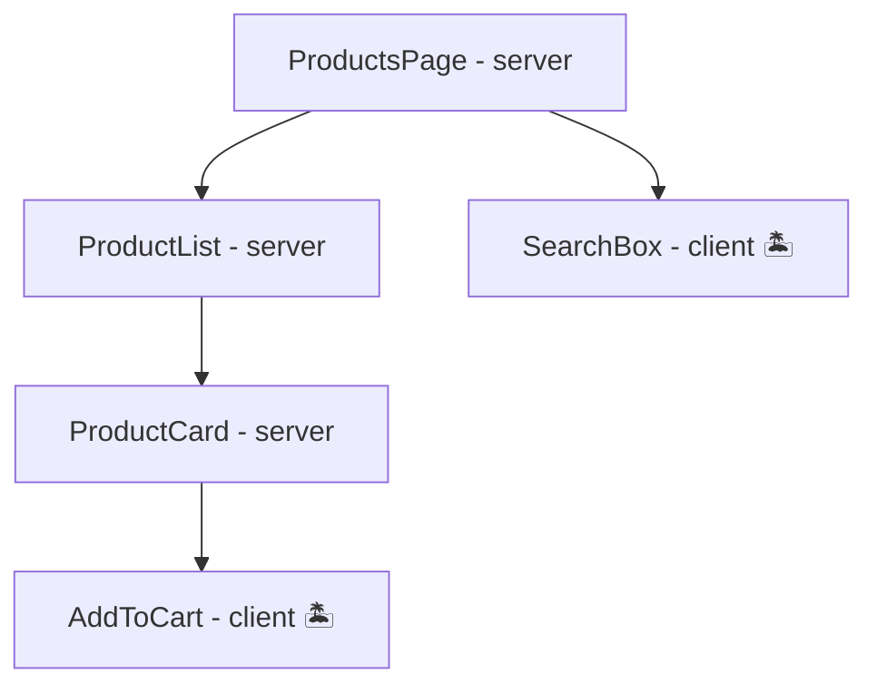

# Server and Client Components

This is the phase where Next.js stops being "React with routing." The App Router is built on React
Server Components, and the first time `useState` throws
`You're importing a component that needs useState... add the "use client" directive`, the framework
feels like it broke your React. It didn't - it split it. This phase makes the split precise, because
every confusing Next error for the rest of your career traces back to it.

## The default: components that only run on the server

In the `app/` directory, **every component is a server component until you say otherwise.** A server
component runs *once*, during the server render (phase 1), produces its bit of HTML-to-be, and then
is done. Its code is **never shipped to the browser.**

That "never shipped" is not a footnote - it's the point:

```tsx
// app/products/page.tsx - server component, and it can prove it
import { db } from '@/lib/db';           // the real database client
import { formatPrice } from 'heavy-money-lib';

export default async function ProductsPage() {
  const products = await db.query('SELECT * FROM products'); // secrets stay here
  return (
    <ul>
      {products.map(p => <li key={p.id}>{p.name} - {formatPrice(p.cents)}</li>)}
    </ul>
  );
}
```

*What just happened:* a component queried the database directly. No API route, no fetch, no exposed
endpoint - this code runs where the database is reachable and the credentials live, and the browser
receives only the resulting HTML. The heavy formatting library adds zero bytes to the client bundle
for the same reason. This is what phase 1's "your data layer is public" cost looks like when it's
fixed.

What a server component *can't* do follows from *when* it runs. It renders once on the server;
there's no "later" for it. So:

- **No state, no effects** - `useState`/`useEffect` are about re-rendering over time in a browser;
  a run-once render has no time axis.
- **No event handlers** - there's no user on the server to click anything.
- **No browser APIs** - `window`, `localStorage`, `document` don't exist in Node.

## 'use client': the interactivity boundary

When you need any of those, you declare it:

```tsx
// components/AddToCart.tsx
'use client';

import { useState } from 'react';

export function AddToCart({ productId }) {
  const [added, setAdded] = useState(false);
  return (
    <button onClick={() => setAdded(true)}>
      {added ? 'In cart ✓' : 'Add to cart'}
    </button>
  );
}
```

📝 **Terminology:** `'use client'` at the top of a file marks everything in that file - **and every
module it imports** - as **client components**: the React you already know, hydrated and interactive
in the browser. The directive isn't per-component, it's a *boundary marker*: it declares "from this
import edge inward, ship the JavaScript."

💡 **Key point:** client components *also* render once on the server, to produce the initial HTML
(that's hydration's other half). "Client component" doesn't mean "skips server rendering" - it means
"its code ships to the browser and comes alive there." Which is why browser-only code still needs an
effect guard even inside client components; phase 7 shows that failure.

## Composition: islands of interactivity

The design that falls out: server components form the static body of the page, with client
components as interactive islands wherever behavior is needed.



Two composition rules, both consequences of "server code never reaches the browser":

1. **A client component can't import a server component.** Once you're inside the client boundary,
   everything imported ships to the browser - a database-touching component can't. But a client
   component *can receive server-rendered children*: `<ClientTabs>{serverRenderedContent}</ClientTabs>`
   works, because the server content is passed as an already-rendered prop, not imported. When you
   need a server thing *inside* a client thing, pass it as `children`.
2. **Props crossing the boundary must be serializable.** They travel from the server render to the
   browser, so they have to survive the trip as data: strings, numbers, booleans, plain
   objects/arrays, null. Functions, class instances, and `Date` objects (in their raw form) can't
   cross - which is exactly what the error
   `Functions cannot be passed directly to Client Components` is telling you. (The one exception,
   server actions, is phase 5's whole topic.)

## Where to draw the line

The practical craft is pushing the boundary *down*:

```tsx
// ✗ page-level 'use client' - the whole page ships as JS, DB access now impossible
// ✓ server page, with a small client island for the one interactive part
export default async function ProductPage({ params }) {
  const { id } = await params;
  const product = await db.product(id);       // server: data, secrets, zero JS shipped
  return (
    <article>
      <h1>{product.name}</h1>
      <p>{product.description}</p>
      <AddToCart productId={product.id} />     {/* client: the island */}
    </article>
  );
}
```

The lazy failure mode is slapping `'use client'` at the top of every file until errors stop - it
works, and it quietly turns your app back into the SPA from phase 1, shipping everything to the
browser and cutting you off from direct data access. When an error demands `'use client'`, the right
question is "what's the *smallest* subtree that truly needs interactivity?"

## Recap

1. Default is server: runs once at render, can touch databases and secrets, ships no JS, can't use
   state/effects/handlers.
2. `'use client'` marks a boundary file: that module and its imports ship to the browser and hydrate.
3. Client components still server-render their initial HTML - the directive is about shipping code,
   not skipping the server.
4. Server content goes *inside* client components via `children`, never via import; props crossing
   the boundary must be serializable.
5. Push the boundary down: server body, small client islands.

```quiz
[
  {
    "q": "Adding useState to app/dashboard/page.tsx throws an error mentioning \"use client\". What is the actual conflict?",
    "choices": [
      "Pages are special files that can never hold state",
      "The component is a server component, which renders once on the server - there's no re-render lifecycle for state to drive",
      "useState must be imported from next/navigation inside the app directory",
      "State in a page would break the router's caching"
    ],
    "answer": 1,
    "why": [
      "Pages aren't special here - add 'use client' and the same page can hold state (at the cost of becoming a client subtree).",
      null,
      "useState always comes from react; next/navigation is for routing hooks.",
      "Caching interacts with rendering modes (phase 6), not with whether a component holds state."
    ],
    "explain": "State means re-rendering over time in a browser. A server component has no time axis - it runs once and is done - so the hook has nothing to attach to."
  },
  {
    "q": "Why does marking a small, frequently-used component file with 'use client' potentially affect much more than that one component?",
    "choices": [
      "The directive is contagious upward: its parents become client components too",
      "Everything that file imports is pulled into the client bundle along with it",
      "It disables server rendering for the whole route",
      "It forces every sibling component to hydrate first"
    ],
    "answer": 1,
    "why": [
      "It spreads down through imports, not up through parents - a server page can happily render client islands.",
      null,
      "Client components still server-render their initial HTML; nothing about the route's rendering is disabled.",
      "Hydration order isn't governed by the directive; bundle contents are."
    ],
    "explain": "'use client' marks a boundary: that module plus its entire import graph ships to the browser. A heavy import in a casually-marked file is a heavy addition to the bundle."
  },
  {
    "q": "A client component needs to display a chunk of UI that queries the database. What's the working pattern?",
    "choices": [
      "Import the server component inside the client component",
      "Have the parent server component render it and pass it in as children",
      "Mark the database component 'use client' so they match",
      "Fetch the data in a useEffect instead"
    ],
    "answer": 1,
    "why": [
      "Importing pulls it into the client bundle - where database code cannot go; this is the exact forbidden direction.",
      null,
      "That ships DB access code to the browser - it will fail to build, and it would be a security hole if it didn't.",
      "It works, but it recreates the SPA waterfall and a public API requirement - the costs Next exists to remove; use it when client-side freshness is genuinely needed, not as the default."
    ],
    "explain": "Server content crosses into client subtrees as already-rendered props (children), never as imports. <ClientFrame>{await serverThing()}</ClientFrame> is the shape."
  }
]
```

---

[← Phase 2: Routing with Files](02-routing-with-files.md) · [Guide overview](_guide.md) · [Phase 4: Data on the Server →](04-data-on-the-server.md)
