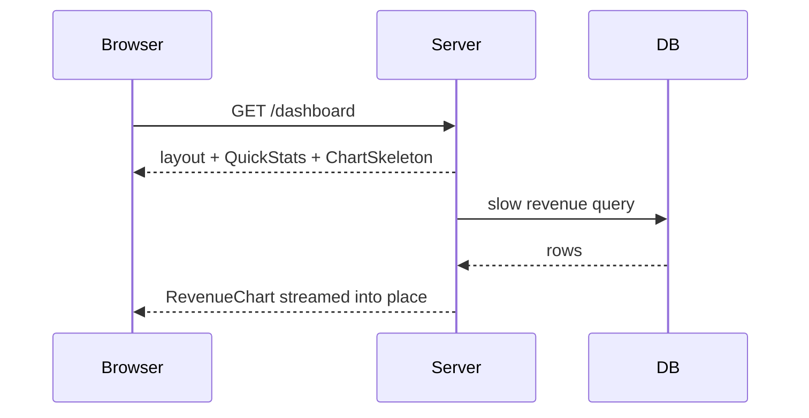

# Data on the Server

In React from Zero, fetching meant a `useEffect`, three pieces of state (`data`, `loading`,
`error`), a cancellation flag, and care. That machinery existed because a browser component can only
get data *after* it mounts. A server component has no such problem: it runs on the server, where the
data lives, *before* any HTML exists. So fetching collapses into the most boring possible code -
and the interesting questions move to "what does the user see while it's happening?"

## Fetching is just awaiting

```tsx
// app/orders/page.tsx
import { db } from '@/lib/db';

export default async function OrdersPage() {
  const orders = await db.orders.list();     // or: await fetch('https://api...').then(r => r.json())
  return (
    <table>
      {orders.map(o => <OrderRow key={o.id} order={o} />)}
    </table>
  );
}
```

*What just happened:* the component is an `async` function, so it can `await` anything - a database
call, an ORM, `fetch` against an external API. React waits for the promise, then renders the result
into the HTML response. No effect, no loading state, no race conditions - there's exactly one run,
and it has the data before it returns.

💡 **Key point:** the three-state fetch dance (`data`/`loading`/`error` in `useState`) is a *client*
pattern. On the server it dissolves: awaiting **is** loading, throwing **is** error, and both get
first-class UI files below. Reach for the client pattern only when the data must refresh *in the
browser* without navigation (live search, polling) - and then preferably via a library like TanStack
Query, per React from Zero phase 9.

Two components that need the same data? Fetch in both. Next deduplicates identical `fetch` calls
within a single render pass (and for non-fetch sources, React's `cache()` wraps a function with the
same per-render memoization), so you don't thread props through five layers just to share a query.

## loading.tsx: what renders while you await

A fair question about that `await`: the server can't send the finished page until the data
arrives, so what does the user stare at? Without help: the previous page, feeling frozen. The fix is
the `loading.tsx` special file from phase 2's table:

```tsx
// app/orders/loading.tsx
export default function OrdersLoading() {
  return <TableSkeleton rows={8} />;
}
```

*What just happened:* Next now responds **immediately** with the layout stack plus this skeleton,
keeps the connection open, and **streams** the real page content into place when the await
resolves. The user sees structure instantly and content moments later - no frozen click, no blank
page.

📝 **Terminology:** under the hood, `loading.tsx` wraps your page in a React **Suspense boundary** -
the mechanism that lets a tree say "this part isn't ready; show the fallback, swap in the content
when it resolves." The file is the convenient spelling; the mechanism is Suspense.

## Streaming the slow part, not the whole page

`loading.tsx` gates the *entire* page behind its slowest await. When one widget is slow and the rest
is fast, put the boundary around just the slow thing:

```tsx
import { Suspense } from 'react';

export default function Dashboard() {
  return (
    <>
      <QuickStats />                                {/* fast: renders in the first flush */}
      <Suspense fallback={<ChartSkeleton />}>
        <RevenueChart />                            {/* slow query: streams in when ready */}
      </Suspense>
    </>
  );
}
```



*What just happened:* one HTTP response, delivered in chunks. The fast content painted immediately;
the slow island arrived when its data did. This is the server-side answer to "spinner city" - each
slow region gets its own boundary instead of the whole page waiting on the slowest query.

⚠️ **Gotcha:** the await has to live *inside* the Suspense boundary to stream. If `Dashboard` itself
awaits the slow query and passes rows down to `RevenueChart`, the whole page waits - the boundary
can only cut off what suspends *within* it. Move the fetch into the component behind the fallback.

## error.tsx: when the await throws

Data code fails: the API times out, the row doesn't exist. The `error.tsx` file is the route
subtree's error boundary:

```tsx
// app/orders/error.tsx
'use client';   // error boundaries must be client components (they use state to recover)

export default function OrdersError({ error, reset }) {
  return (
    <div>
      <h2>Couldn't load your orders.</h2>
      <button onClick={reset}>Try again</button>
    </div>
  );
}
```

*What just happened:* an uncaught throw anywhere under `/orders` renders this instead of the page -
the layout stack above it stays intact, so the site chrome survives the crash. `reset` re-renders
the failed subtree for a retry. The mandatory `'use client'` isn't an exception to phase 3 - error
recovery is interactivity, and interactivity is client work.

For the specific case of "this thing doesn't exist," throw the router's own signal instead:

```tsx
import { notFound } from 'next/navigation';

const product = await db.product(id);
if (!product) notFound();   // renders the nearest not-found.tsx with a 404 status
```

A real 404 status matters: it tells crawlers "don't index this," where a styled "not found" page
returning 200 tells them the opposite - the SEO lesson hiding inside an error-handling API.

## Recap

1. Server components fetch by awaiting - one run, data before render, no loading/error state
   machinery.
2. Duplicate fetches within a render are deduplicated (`fetch` automatically, other sources via
   `cache()`) - fetch where you need, don't prop-thread.
3. `loading.tsx` streams the page: instant skeleton, content swapped in when ready. It's Suspense
   with a filename.
4. Wrap just the slow islands in `<Suspense>` - and put the await inside the boundary, or nothing
   streams.
5. `error.tsx` catches throws per subtree (always `'use client'`); `notFound()` gives missing
   resources a real 404.

```quiz
[
  {
    "q": "Why doesn't fetching in a server component need the data/loading/error useState pattern?",
    "choices": [
      "Next.js manages those three states automatically behind the scenes",
      "The component runs once with await - it has the data before it renders, so there are no in-browser states to track",
      "Server components are faster, so loading states never appear",
      "The pattern still applies; it's only written in a different file"
    ],
    "answer": 1,
    "why": [
      "Nothing is managed invisibly - the states genuinely don't exist, because there's no mounted component waiting for data.",
      null,
      "Speed isn't the reason - a slow query still takes time; that time is just handled by streaming (loading.tsx), not component state.",
      "loading.tsx and error.tsx replace the pattern's UI, but the state machinery itself is gone, not relocated."
    ],
    "explain": "The client pattern exists because browsers mount first and fetch after. A server component awaits first and renders once - loading UI comes from Suspense boundaries, errors from error.tsx."
  },
  {
    "q": "A dashboard page awaits a slow query at the top and passes the result into a component wrapped in <Suspense>. The whole page still waits for the query. Why?",
    "choices": [
      "Suspense only works with the loading.tsx file, not inline",
      "The await happens outside the boundary - the page suspends before Suspense can isolate anything",
      "The fallback component was too heavy to stream",
      "Streaming requires the Edge runtime"
    ],
    "answer": 1,
    "why": [
      "Inline <Suspense> works exactly like loading.tsx - the file is sugar for the same boundary.",
      null,
      "Fallback weight affects paint time, not whether streaming happens at all.",
      "Node streams these responses fine; no special runtime is involved."
    ],
    "explain": "A boundary can only cut off work that suspends inside it. Move the fetch into the component behind the fallback, and the rest of the page flushes immediately."
  }
]
```

---

[← Phase 3: Server and Client Components](03-server-and-client-components.md) · [Guide overview](_guide.md) · [Phase 5: Mutations: Forms and Server Actions →](05-mutations-and-server-actions.md)
