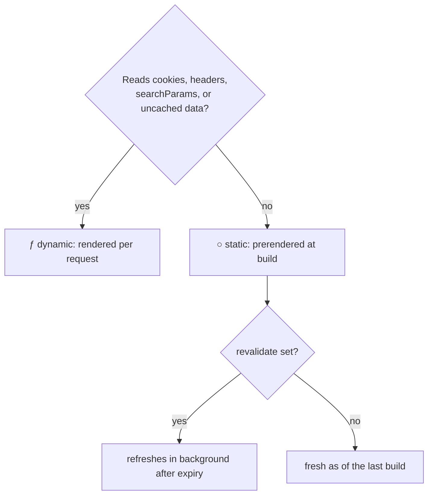

# Static, Dynamic, and the Cache

Here's the Next.js behavior that generates the most confused bug reports: you deploy, you update the
database, and the page *still shows old data* - not for one user, for everyone, indefinitely. Or the
mirror image: a page you expected to be instant hits the server on every request. Both trace to one
decision the framework makes per route, mostly silently: **render at build time, or render per
request?** This phase makes that decision visible.

## The two rendering times

**Static rendering** happens **once, at build time** (`next build`). The result - finished HTML -
is saved and served to every visitor, as fast as a file can be served, with your server doing no
per-request work. The page is identical for everyone and as fresh as the last build.

**Dynamic rendering** happens **per request**. Every visit runs your components (phase 4's awaits
included), so the page can be personalized and is always current - at the cost of doing the work
every time.

💡 **Key point:** Next's default is **static wherever possible** - it's the better deal whenever
it's legal. A route becomes dynamic when your code does something that *can't* be known at build
time. The build output tells you what happened to each route:

```console
$ npm run build

Route (app)
┌ ○ /                      # ○ = static: prerendered at build
├ ○ /about
├ ƒ /dashboard             # ƒ = dynamic: rendered per request
└ ○ /products/[id]
```

Reading this legend after every build is the habit that catches caching surprises before users do.

## What flips a route to dynamic

A route goes dynamic when it reads something that only exists at request time:

- **`cookies()` or `headers()`** - who's asking can't be known at build.
- **`searchParams`** on a page - `/products?sort=price` differs per URL.
- **An uncached data read** - a `fetch` opted out of caching, or the route/segment marked
  `export const dynamic = 'force-dynamic'`.

That's the mechanism behind the surprise: add an innocuous `cookies()` call for a theme preference
and your fully-static page quietly becomes render-on-every-request. The build legend flips from ○
to ƒ and the framework considers that your answer.

## Dynamic segments want a guest list

What about `/products/[id]` - static or dynamic? At build time Next can't know the ids. You can
tell it:

```tsx
// app/products/[id]/page.tsx
export async function generateStaticParams() {
  const products = await db.products.list();
  return products.map(p => ({ id: String(p.id) }));
}
```

*What just happened:* at build, Next calls this, gets the list of ids, and prerenders every one of
those product pages as static HTML. Without it, the route renders on demand. The middle way is both:
prerender the top 100 products, render rarer ids on first request, cache the result.

## Revalidation: static pages that refresh themselves

Static's weakness is staleness: content changed, build didn't. The blunt fix - redeploy on every
content change - doesn't survive contact with a CMS. The real fix is **revalidation**: static, with
an expiry.

```tsx
// re-render this page in the background at most every hour
export const revalidate = 3600;
```

*What just happened:* the page is served statically as usual. Once the copy is older than 3600
seconds, the *next* visitor still gets the cached copy instantly - but triggers a background
re-render, and everyone after gets the fresh one. Old name for this: ISR, incremental static
regeneration. Practical meaning: "static speed, at most an hour stale."

The event-driven version you already met in phase 5 beats the timer version when you control the
writes: `revalidatePath`/`revalidateTag` from a server action (or a CMS webhook hitting a route
handler) refresh the page *at the moment the data changes*, no polling interval to tune.

For per-fetch control, the options ride on `fetch` itself:

```tsx
await fetch(url, { cache: 'force-cache' });            // cache indefinitely (until revalidated)
await fetch(url, { next: { revalidate: 300 } });       // this data: at most 5 minutes stale
await fetch(url, { next: { tags: ['products'] } });    // invalidatable via revalidateTag
```

## The decision, as a picture



⚠️ **Gotcha:** the classic false diagnosis. Page shows stale data → developer adds
`force-dynamic` → page is correct now but renders on every request forever. The stale page was
*telling you* it was static without a revalidation story; the proportionate fix was `revalidate` or
a `revalidatePath` at the write site - keeping static speed *and* freshness. Reach for
`force-dynamic` when the page is genuinely per-visitor (a dashboard), not as a cache-buster.

⚠️ **Gotcha:** in development (`npm run dev`) every route renders per-request so you always see
fresh code and data. The static/stale behavior only exists in the built app - which is why "works
in dev, stale in prod" is this phase's signature bug report. Test caching behavior with
`npm run build && npm start`, never with the dev server.

## Recap

1. Static = rendered once at build, served as a file; dynamic = rendered per request. Default is
   static wherever legal.
2. `cookies()`, `headers()`, `searchParams`, and uncached reads flip a route dynamic - check the
   ○/ƒ legend after builds.
3. `generateStaticParams` prerenders dynamic segments' known values.
4. `revalidate = N` gives static pages an expiry; `revalidatePath`/`revalidateTag` refresh them the
   moment data changes.
5. Stale page ≠ reach for `force-dynamic` - that trades the caching away instead of fixing its
   freshness.

```quiz
[
  {
    "q": "A product page shows updated prices in dev but week-old prices in production. What's the most likely explanation?",
    "choices": [
      "The production database is behind the development one",
      "The route is static: it was prerendered at the last build and has no revalidation configured",
      "The CDN is ignoring cache headers",
      "generateStaticParams returned the wrong ids"
    ],
    "answer": 1,
    "why": [
      "Possible, but the works-in-dev/stale-in-prod signature points at rendering time: dev renders per request, the build doesn't.",
      null,
      "A CDN issue wouldn't respect the dev/prod split this cleanly - and Next's own cache sits before any CDN.",
      "Wrong ids would 404 or miss pages, not serve old prices on existing ones."
    ],
    "explain": "Dev renders every request; the built app serves what the build produced. A static page without revalidate stays as fresh as the last deploy - add revalidate or revalidate on write."
  },
  {
    "q": "Adding a cookies() call for a theme preference made a landing page render on every request. Why?",
    "choices": [
      "Reading cookies is slow, so Next disables caching to compensate",
      "Cookie values only exist per request, so the page can no longer be rendered once at build",
      "cookies() is only allowed in client components",
      "The theme value changes too often to cache"
    ],
    "answer": 1,
    "why": [
      "It's not a performance heuristic - it's a logical impossibility: there is no cookie at build time.",
      null,
      "cookies() is server-only - it's legal here; the cost is the rendering mode, not an error.",
      "Even a never-changing cookie has this effect; what matters is when the value becomes knowable."
    ],
    "explain": "Static rendering happens at build, where no request - and no cookie - exists. Reading request-time data forces per-request rendering. Consider reading the theme client-side to keep the page static."
  },
  {
    "q": "A marketing page's content updates in the CMS a few times a week. The team wants static-file speed. Best setup?",
    "choices": [
      "export const dynamic = 'force-dynamic' so it's always fresh",
      "Static with revalidation - a revalidate interval, or a CMS webhook calling revalidatePath",
      "A client component that fetches the content in useEffect",
      "Rebuild and redeploy the site on a nightly schedule"
    ],
    "answer": 1,
    "why": [
      "Always-fresh at the price of rendering every request - the exact overcorrection this phase warns about for content that changes twice a week.",
      null,
      "That reintroduces the SPA waterfall and hides content from crawlers - everything phase 1 left behind.",
      "It works, but couples freshness to deploy cadence and re-renders everything for one page's change - revalidation does it surgically."
    ],
    "explain": "Static with an expiry (or event-driven revalidation from the CMS webhook) is the built-for-this answer: file-serving speed, freshness within minutes of a change."
  }
]
```

---

[← Phase 5: Mutations: Forms and Server Actions](05-mutations-and-server-actions.md) · [Guide overview](_guide.md) · [Phase 7: When Next.js Breaks →](07-when-it-breaks.md)
