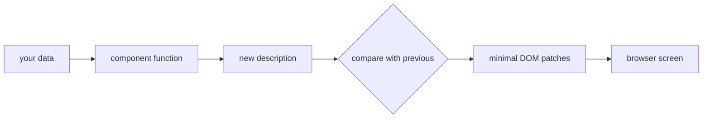

# What React Actually Is

Before React, building a web interface meant writing two kinds of code: code that draws the page the
first time, and code that *updates* it afterward. The second kind is where projects went to die. Every
new feature meant finding every element that might need to change, in every situation, and updating
each one by hand. Miss one and the page silently shows stale data. If you've ever debugged a page
where the counter says 3 but the list shows 4 items, you've met this bug.

React exists to delete that entire category of bug. Here's the one idea the whole library is built on:

💡 **Key point:** In React, you never update the screen. You update your **data**, and React redraws
the screen *from* the data. The UI is a function of the state: give it the same data, you get the same
screen, every time.

Hold onto that sentence. Components, hooks, props, keys - every React concept in this guide is a
consequence of it.

## The problem, concretely

Say you're building a shopping cart badge with plain JavaScript:

```js
let cartCount = 0;

function addToCart(item) {
  cartCount = cartCount + 1;
  // Now update every place the count appears... and don't miss one.
  document.querySelector('#cart-badge').textContent = cartCount;
  document.querySelector('#checkout-button').textContent = `Checkout (${cartCount})`;
  if (cartCount === 1) {
    document.querySelector('#empty-cart-message').style.display = 'none';
  }
}
```

**Why this falls apart.** The data (`cartCount`) and the screen are two separate things you must keep
in sync *manually*. Three places today, seven places after next sprint. The empty-cart message needs
to come *back* when the cart empties - did you remember to write that code too? Every possible
transition between UI states is your job to handle, and the number of transitions grows much faster
than the number of states.

## The React version of the same thing

```jsx
function CartHeader({ count }) {
  return (
    <header>
      <span id="cart-badge">{count}</span>
      <button>Checkout ({count})</button>
      {count === 0 && <p>Your cart is empty.</p>}
    </header>
  );
}
```

There is no update code. None. This function describes what the header looks like *for any value of
`count`* - zero, one, or a thousand. When the count changes, React calls the function again with the
new value and makes the real page match the new description. The empty-cart message appears and
disappears correctly forever, because it's derived from the data instead of toggled by hand.

**Why this saves you later.** The stale-UI bug class is gone. There is no screen state to forget to
update, because the screen is never updated directly - it's recomputed. Your job shrinks to: keep the
data right.

## What JSX actually is

That HTML-looking syntax inside JavaScript is called **JSX**, and it trips people up until they learn
one fact: it's not HTML, and it's not a template language. It compiles to plain function calls.

```jsx
// What you write:
const badge = <span className="badge">{count}</span>;

// What it becomes after the build tool compiles it:
const badge = createElement('span', { className: 'badge' }, count);
```

📝 **Terminology:** the thing `createElement` returns is a **React element** - a small plain
JavaScript object like `{ type: 'span', props: { className: 'badge', children: 3 } }`. It's a
*description* of a piece of UI, not the UI itself. Cheap to create, cheap to throw away.

That explains the JSX rules that otherwise feel arbitrary:

- `className` instead of `class` - because you're writing JavaScript, and `class` is a reserved word.
- `{count}` in curly braces - that's a real JavaScript expression being passed as an argument, not a
  template placeholder.
- One root element per return - a function returns one value, so a component returns one element
  (which can have unlimited children).

## How React makes the browser match

So a component returns a description. What does React *do* with it?



Each time your data changes, React calls your component again and gets a fresh description of the
whole UI. Then it **compares** that description with the previous one and applies only the
differences to the real page. If only the badge number changed, only the badge's text node is
touched - the rest of the page is left alone.

📝 **Terminology:** you'll hear this comparison called the **virtual DOM** or **reconciliation**.
Strip the mystique: React keeps the previous description in memory, diffs it against the new one, and
patches the real DOM minimally. That's the entire trick.

⚠️ **Gotcha:** "re-render" does *not* mean the browser repaints everything. It means React re-runs
your component functions to get fresh descriptions. Re-running a function that returns a small object
is cheap - it happens constantly in normal React apps and is almost never your performance problem.
Don't fear re-renders; understand them.

## Seeing it for real

You don't need a build setup to prove any of this, but for real work you'll use one. The standard
starter is Vite:

```console
$ npm create vite@latest my-app -- --template react
$ cd my-app
$ npm install
$ npm run dev

  VITE ready in 512 ms

  ➜  Local:   http://localhost:5173/
```

*What just happened:* Vite scaffolded a tiny project (an `index.html`, a `main.jsx`, an `App.jsx`),
installed React, and started a dev server that recompiles your JSX on every save. Open the local URL
and you're looking at your `App` component, rendered.

The whole app boots from one call in `main.jsx`:

```jsx
import { createRoot } from 'react-dom/client';
import App from './App.jsx';

createRoot(document.getElementById('root')).render(<App />);
```

*What just happened:* React took control of one DOM node (`#root`) and rendered your top-level
component into it. From here on, everything inside that node is React's to manage - you'll never
call `document.querySelector` to change it again.

## Recap

1. The core idea: UI is a function of state. You change data; React redraws from the data.
2. JSX is not HTML - it compiles to function calls that produce cheap description objects.
3. On every data change React re-runs your components, diffs the new description against the old
   one, and patches the real DOM minimally.
4. "Re-render" means "re-run the function", not "repaint the page" - it's cheap and normal.

A quick check before the next phase - these two ideas carry the entire guide:

```quiz
[
  {
    "q": "In React, how does the screen get updated when something changes?",
    "choices": [
      "You call DOM methods to change the elements that need updating",
      "You change your data, and React redraws the UI from the new data",
      "React watches the DOM for changes and syncs your data to match",
      "The browser re-runs your whole script from the top"
    ],
    "answer": 1,
    "why": [
      "That's the plain-JavaScript approach React exists to replace - manual DOM updates are exactly the bug factory this phase opened with.",
      null,
      "It's the reverse: data is the source of truth and the DOM follows it, never the other way around.",
      "Nothing re-runs your whole script; React re-runs your component functions and patches only what changed."
    ],
    "explain": "You update state, React re-runs your components and makes the DOM match the new description."
  },
  {
    "q": "What does JSX like <span>{count}</span> compile to?",
    "choices": [
      "An HTML string that gets inserted with innerHTML",
      "A template that the browser natively understands",
      "A function call returning a plain object describing the element",
      "Direct DOM manipulation code"
    ],
    "answer": 2,
    "why": [
      "React never builds HTML strings from your JSX - that would throw away the ability to diff and patch minimally (and would be an XSS hazard).",
      "Browsers can't parse JSX at all - that's why a build step exists.",
      null,
      "The compiled code creates descriptions; React separately decides what DOM operations those descriptions require."
    ],
    "explain": "JSX compiles to createElement calls that return cheap description objects - React elements."
  }
]
```

---

[← Guide overview](_guide.md) · [Phase 2: Components and Props →](02-components-and-props.md)
