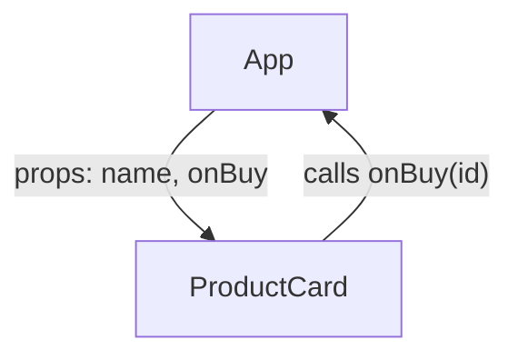

# Components and Props

Every React app, from a to-do list to Facebook, is built from one kind of piece: the component.
There's no second mechanism to learn later. Once you can read a component and see how data enters and
leaves it, you can read any React codebase, because that's all a React codebase is - components
handing data to other components.

## What a component actually is

**What it actually is.** A JavaScript function whose name starts with a capital letter and which
returns JSX. That's the whole definition.

```jsx
function Greeting() {
  return <p>Welcome back.</p>;
}
```

**What it does in real life.** Once defined, it becomes a tag you can use inside other components'
JSX: `<Greeting />`. When React renders that tag, it calls your function and slots the returned
description into the tree at that spot.

⚠️ **Gotcha:** the capital letter is not a style preference - it's how JSX tells your components
apart from HTML tags. `<greeting />` compiles to a request for a built-in element named "greeting"
(which doesn't exist, so you get nothing). `<Greeting />` compiles to a call to your function. A
lowercase component name is one of the quietest bugs in React: no error, just a component that never
appears.

## Props: the component's arguments

A component that always renders the same thing isn't worth much. **Props** make components
reusable - they're the function's arguments, passed in JSX the way attributes are written in HTML.

```jsx
function Greeting({ name, unreadCount }) {
  return (
    <p>
      Welcome back, {name}. You have {unreadCount} unread messages.
    </p>
  );
}

function App() {
  return (
    <main>
      <Greeting name="Ada" unreadCount={3} />
      <Greeting name="Grace" unreadCount={0} />
    </main>
  );
}
```

*What just happened:* React called `Greeting` twice, once with `{ name: 'Ada', unreadCount: 3 }` and
once with `{ name: 'Grace', unreadCount: 0 }`. All the props arrive as a single object (the first
argument), which is why you'll almost always see it destructured right in the parameter list.

Two syntax details that bite newcomers:

- **Strings** can be passed with plain quotes: `name="Ada"`. **Everything else** - numbers, booleans,
  arrays, objects, functions - needs curly braces: `unreadCount={3}`, `onSave={handleSave}`.
  `unreadCount="3"` passes the *string* `"3"`, and one day `"3" + 1` gives you `"31"` on screen.
- **`children`** is a prop with special syntax. Whatever you nest between a component's opening and
  closing tags arrives as `props.children`:

```jsx
function Card({ title, children }) {
  return (
    <section className="card">
      <h2>{title}</h2>
      {children}
    </section>
  );
}

// Used like:
<Card title="Danger zone">
  <p>Deleting your account is permanent.</p>
  <button>Delete</button>
</Card>
```

This is React's composition mechanism: `Card` owns the frame, callers own the contents. It's how you
build one Card, one Modal, one Layout and reuse them everywhere without them needing to know what
they'll contain.

## Props flow one way: down

Here is the rule that makes React apps debuggable at scale:

💡 **Key point:** data flows **down** the tree, from parent to child, through props. A child cannot
reach up and change its parent's data. When a child needs to *tell* the parent something, the parent
hands it a function as a prop, and the child calls it.

```jsx
function App() {
  function handleBuy(productId) {
    // the parent decides what buying means
  }
  return <ProductCard id="p-101" name="Mechanical keyboard" onBuy={handleBuy} />;
}

function ProductCard({ id, name, onBuy }) {
  return (
    <article>
      <h3>{name}</h3>
      <button onClick={() => onBuy(id)}>Buy</button>
    </article>
  );
}
```

*What just happened:* the data (`id`, `name`) went down as props; the event ("the user wants to buy")
went up as a function call. `ProductCard` doesn't know or care what buying does - it just reports.

**Why this saves you later.** When a value on screen is wrong, there's exactly one direction to
look: up the tree, following the prop until you find where the value was born. In two-way systems,
a wrong value could have been written by anyone from anywhere, and you get to interrogate every
suspect. One-way flow turns "who changed this?" from an investigation into a walk.



## Props are read-only

Inside a component, props are not yours to change:

```jsx
function Greeting({ name }) {
  name = name.toUpperCase(); // legal JavaScript, wrong React
  return <p>Hello {name}</p>;
}
```

Why the fuss? Remember phase 1: a component should return the same UI for the same inputs, every
time - that's what lets React re-run it freely. A component that edits its inputs is a component
whose output depends on *how many times it ran*. If you need a transformed value, compute a new one:

```jsx
function Greeting({ name }) {
  const displayName = name.toUpperCase();
  return <p>Hello {displayName}</p>;
}
```

Same result, but `name` still means what the parent sent, all the way through. This habit - derive,
don't overwrite - is the same immutability discipline that state will demand in the next phase, so
it's worth building now while the stakes are low.

## Recap

1. A component is a capitalized function returning JSX; `<Greeting />` means "call this function
   here."
2. Props are the arguments, passed as one object; non-string values need `{curly braces}`.
3. `children` is the composition prop: the frame owns the layout, the caller owns the contents.
4. Data flows down as props; events flow up as callback props. One-way flow is why debugging scales.
5. Props are read-only - derive new values, never overwrite what the parent sent.

```quiz
[
  {
    "q": "A component renders <profile /> (lowercase) and nothing appears, with no error. Why?",
    "choices": [
      "The component file wasn't imported correctly",
      "Lowercase tags are treated as HTML elements, so React never calls the Profile function",
      "Props are missing, so React skips rendering",
      "JSX requires self-closing tags to be capitalized only in strict mode"
    ],
    "answer": 1,
    "why": [
      "A missing import is a loud error (an undefined reference), not silence - the quiet failure is the lowercase tag.",
      null,
      "Missing props render just fine (they arrive as undefined); they don't make React skip a component.",
      "The capitalization rule is core JSX compilation, not a strict-mode behavior."
    ],
    "explain": "Capitalization is how JSX distinguishes your components from built-in tags - lowercase compiles to a DOM element lookup, not a function call."
  },
  {
    "q": "A child component needs to notify its parent that the user clicked Save. What's the React way?",
    "choices": [
      "The child modifies a shared global variable the parent checks",
      "The child changes its props to signal the parent",
      "The parent passes a function down as a prop and the child calls it",
      "The child re-renders the parent directly"
    ],
    "answer": 2,
    "why": [
      "Globals reintroduce exactly the who-changed-this debugging problem one-way flow exists to prevent.",
      "Props are read-only and flow downward - a child writing its props breaks the model and React doesn't propagate it anywhere.",
      null,
      "No component can render another component - each one only returns its own description."
    ],
    "explain": "Data down, events up: the parent decides what saving means and hands the child an onSave function to call."
  }
]
```

---

[← Phase 1: What React Actually Is](01-what-react-actually-is.md) · [Guide overview](_guide.md) · [Phase 3: State and Re-renders →](03-state-and-re-renders.md)
