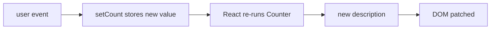

# State and Re-renders

Props come from outside. But some data is *born* inside a component: is the dropdown open, what has
the user typed, which tab is selected. That's **state**, and it's where React goes from "template
library" to "the thing running your app." It's also where the first real confusion lives, so this
phase moves slowly and names every trap.

## Why a normal variable can't work

The obvious attempt:

```jsx
function Counter() {
  let count = 0;
  function handleClick() {
    count = count + 1;
    console.log(count); // logs 1, 2, 3... but the screen says 0 forever
  }
  return <button onClick={handleClick}>Clicked {count} times</button>;
}
```

The variable really does increment - the console proves it. The screen never changes, for two
separate reasons, and understanding them *is* understanding React state:

1. **Nothing tells React to redraw.** Assigning to a local variable is invisible to React. No
   re-render happens, so the DOM keeps showing the description from the last render.
2. **The variable wouldn't survive anyway.** A re-render means *calling `Counter` again*. Every call
   creates a fresh `let count = 0`. Local variables have the lifespan of one function call; your UI
   needs memory that outlives the call.

State solves exactly these two problems: it's memory that lives *outside* your function between
calls, plus a way of changing it that *notifies React*.

## useState: memory plus a doorbell

```jsx
import { useState } from 'react';

function Counter() {
  const [count, setCount] = useState(0);
  return (
    <button onClick={() => setCount(count + 1)}>
      Clicked {count} times
    </button>
  );
}
```

*What just happened:* `useState(0)` registers a slot of memory with React (initial value `0`) and
returns a pair: the current value and a setter function. Click the button and `setCount(1)` does two
things - stores `1` in React's slot, and schedules a re-render. React calls `Counter` again;
this time `useState` returns the stored `1`; the new description says "Clicked 1 times"; React
patches the text. The loop from phase 1, now with memory:



📝 **Terminology:** `useState` is a **hook** - a function that hooks your component into a React
feature (here: persistent memory). Hooks have two hard rules: only call them **inside components**
(or other hooks), and only at the **top level** - never inside an `if`, a loop, or a callback. The
reason is mundane: React identifies each state slot *by the order the hooks are called in*. A hook
inside an `if` makes the order change between renders, and every slot after it silently gets the
wrong value. Phase 8 shows the error message this produces.

## State is a snapshot

Here's the trap that catches everyone in week one:

```jsx
function handleClick() {
  setCount(count + 1);
  setCount(count + 1);
  setCount(count + 1);
}
```

You'd expect +3. You get **+1**. Why: `count` isn't a live wire into React's memory - it's a plain
number that was copied into this render. If `count` was `0` when the render ran, all three lines say
`setCount(0 + 1)`. Three votes for the same value.

When the next value depends on the current one, pass the setter a *function*, and React will feed it
the latest value:

```jsx
function handleClick() {
  setCount(c => c + 1);
  setCount(c => c + 1);
  setCount(c => c + 1); // now it's +3
}
```

💡 **Key point:** each render sees a frozen snapshot of state. `setX(newValue)` when the new value is
independent; `setX(old => new)` whenever the new value is computed *from* the old one. Adopting the
function form as a reflex will also quietly save you from a stale-closure bug in phase 6.

## Why you must not mutate

The second trap, and the single most common "React is broken" moment:

```jsx
const [todos, setTodos] = useState([{ id: 1, text: 'Learn state' }]);

function addTodo(text) {
  todos.push({ id: 2, text }); // mutates the existing array
  setTodos(todos);             // "nothing happens"
}
```

The screen doesn't update, and here's the exact mechanism: when you call `setTodos`, React
compares the value you passed with the value it already has - using `Object.is`, which for arrays and
objects means *"is this the same object in memory?"* You pushed into the same array and handed the
same array back. Same object, "nothing changed," no re-render. Your data is right and your screen is
wrong - the exact bug class React was supposed to abolish, reintroduced by mutation.

The fix is always the same move: **make a new object/array that shares the unchanged parts**.

```jsx
function addTodo(text) {
  setTodos([...todos, { id: crypto.randomUUID(), text }]);
}

function removeTodo(id) {
  setTodos(todos.filter(t => t.id !== id));
}

function renameTodo(id, text) {
  setTodos(todos.map(t => (t.id === id ? { ...t, text } : t)));
}
```

*What just happened:* spread (`...`), `filter`, and `map` all return **new** arrays, so the identity
check sees a different object and re-renders. Note the pattern in `renameTodo`: new array, and a new
object for the one changed item, while untouched items are reused as-is. That's not waste - copying
references is cheap, and it's precisely what lets React's diff skip everything that didn't change.

⚠️ **Gotcha:** the mutating array methods - `push`, `pop`, `splice`, `sort`, `reverse` - all modify
in place. `sort` is the sneakiest: `setTodos(todos.sort(...))` returns the *same* array, mutated.
Use `setTodos([...todos].sort(...))` (or `toSorted(...)` in modern runtimes).

## One more shape: object state

```jsx
const [form, setForm] = useState({ name: '', email: '' });

function updateEmail(email) {
  setForm({ ...form, email }); // copy the object, overwrite one field
}
```

Same rule, object edition. `form.email = email` mutates; `{ ...form, email }` replaces. If you find
yourself spreading three levels deep on every update, that's a signal the state is too nested -
flatten it, or wait for the reducer pattern in a follow-up guide. For this guide's purposes: keep
state flat and small, and the spreads stay one level deep.

## Recap

1. Local variables reset on every render and can't trigger one - state is React-managed memory plus
   a re-render trigger.
2. `useState` returns `[value, setter]`; calling the setter is what schedules the redraw.
3. Hooks: top level only, components only - React tracks slots by call order.
4. State is a snapshot per render: use `setX(old => new)` when new depends on old.
5. Never mutate. React detects change by object identity, so mutation looks like "no change." New
   array, new object, every time.

```quiz
[
  {
    "q": "You call setItems(items) after items.push(newItem), and the screen doesn't update. Why?",
    "choices": [
      "push is asynchronous, so the item isn't in the array yet",
      "You passed the same array object, so React's identity check sees no change",
      "setItems only works with primitive values like numbers and strings",
      "The component is missing a key prop"
    ],
    "answer": 1,
    "why": [
      "push is synchronous - the item is in the array immediately; the data is right and the screen is wrong, which is the signature of a mutation bug.",
      null,
      "Setters accept any value, including arrays and objects - the constraint is identity, not type.",
      "Keys are about list items, and their absence produces a console warning, not a frozen UI."
    ],
    "explain": "React compares old and new state by identity (Object.is). Mutating in place and passing the same reference reads as 'nothing changed'."
  },
  {
    "q": "Inside one click handler you call setCount(count + 1) twice. count was 5. What does the UI show after the re-render?",
    "choices": ["7", "6", "5", "It depends on how fast React batches"],
    "answer": 1,
    "why": [
      "Both calls read the same snapshot (5), so both say 'set it to 6' - to get 7 you'd use the function form setCount(c => c + 1) twice.",
      null,
      "The setter does work - one increment lands; it's the second one that collapses into the first.",
      "Batching timing never changes the arithmetic here; the snapshot value does."
    ],
    "explain": "State is a per-render snapshot: both calls computed 5 + 1. The function form setCount(c => c + 1) reads the latest value instead."
  },
  {
    "q": "Why do the rules of hooks forbid calling useState inside an if statement?",
    "choices": [
      "Conditional state is bad program design",
      "React matches state slots to hook calls by their order, and a conditional call changes the order between renders",
      "if statements can't contain function calls in JSX",
      "It would create a new state slot on every render, leaking memory"
    ],
    "answer": 1,
    "why": [
      "It's not a style rule - it's a mechanical constraint of how React stores your state.",
      null,
      "This is regular JavaScript, where function calls are legal anywhere - the constraint comes from React, not the language.",
      "Slot creation only happens on the first render either way; the danger is misalignment, not leakage."
    ],
    "explain": "Hook calls are matched to their stored slots positionally. If call #2 sometimes doesn't happen, every hook after it reads the wrong slot."
  }
]
```

---

[← Phase 2: Components and Props](02-components-and-props.md) · [Guide overview](_guide.md) · [Phase 4: Lists, Keys, and Conditional Rendering →](04-lists-keys-and-conditional-rendering.md)
