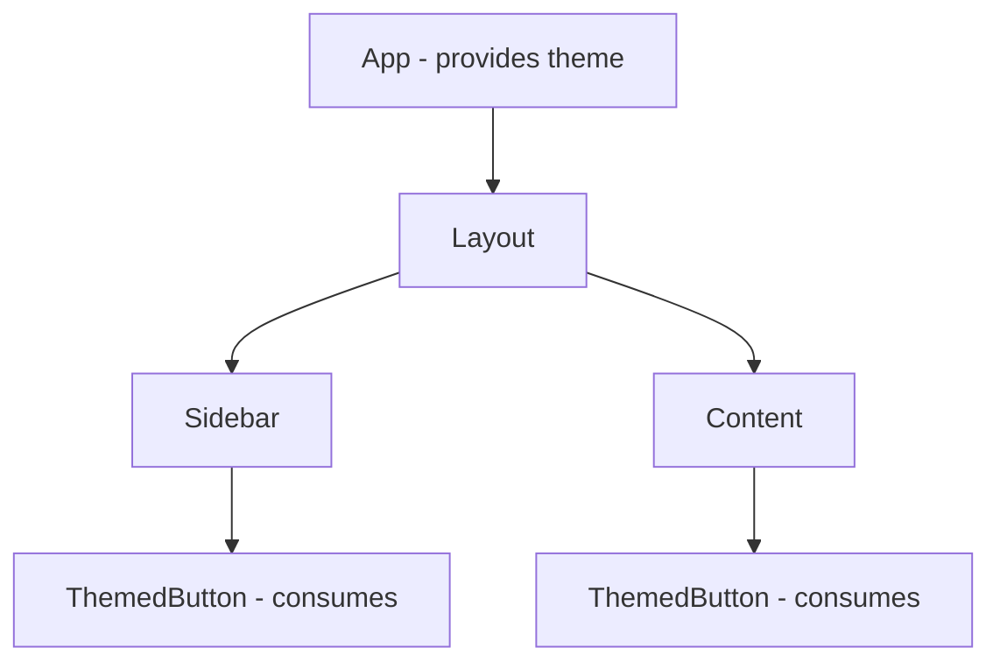

# Sharing State

Sooner or later two components need the same piece of data: a search box in the header and a results
list in the main column. Or every component in the app needs the current theme. React's answer isn't
a new kind of state - it's a question about **where** the state you already know should live. Get the
location right and the sharing follows from the prop rules you learned in phase 2.

## Lifting state up

The rule of thumb, and it covers most cases:

💡 **Key point:** state lives in the **closest common parent** of every component that needs it.
The parent passes the value down as a prop to readers, and a setter callback down to writers.

```jsx
function SearchPage() {
  const [query, setQuery] = useState('');       // lives here: the common parent

  return (
    <>
      <SearchBox query={query} onQueryChange={setQuery} />
      <ResultsList query={query} />
    </>
  );
}

function SearchBox({ query, onQueryChange }) {
  return <input value={query} onChange={e => onQueryChange(e.target.value)} />;
}

function ResultsList({ query }) {
  const matches = ALL_ITEMS.filter(i => i.name.includes(query));
  return <ul>{matches.map(m => <li key={m.id}>{m.name}</li>)}</ul>;
}
```

*What just happened:* `SearchBox` doesn't own the query - it's a controlled component all the way up:
value from a prop, changes reported through a callback. `ResultsList` just reads. There is exactly
one `query` in the whole app, so the two can never disagree.

The refactor is mechanical when you see the smell: two components with their *own* copies of state
that are supposed to stay equal. Copies drift. Move the state up, pass it down, delete the copies.

⚠️ **Gotcha:** lift to the *closest* common parent, not to the top. Every state's change re-renders
the component holding it and its subtree. Hoisting everything into `App` means every keystroke
re-renders the world - correct behavior, needless work, and eventually sluggish typing. State wants
to live as *low* as it can while still reaching everyone who needs it.

## Prop drilling - and why it's usually fine

When the common parent is far above the readers, the value has to ride through layers that don't use
it:

```jsx
<App>               {/* owns currentUser */}
  <Layout user={user}>          {/* doesn't use it, passes it */}
    <Sidebar user={user}>       {/* doesn't use it, passes it */}
      <UserBadge user={user} /> {/* finally uses it */}
```

This is **prop drilling**, and it gets more hatred than it earns. Passing a prop through two or
three layers is explicit, greppable, and refactor-safe - you can see exactly where every value goes.
Drilling is a real problem only when it's *wide and deep*: the same value threading through many
layers on many separate branches, where adding one consumer means touching six files.

## Context: broadcast for the true cross-cutters

For those genuinely app-wide values - theme, current user, language - React provides **context**:
a way for a parent to make a value available to *any* component below it, without the intermediate
layers passing anything.

```jsx
import { createContext, useContext, useState } from 'react';

const ThemeContext = createContext('light');          // 1. create (module scope, exported)

function App() {
  const [theme, setTheme] = useState('light');
  return (
    <ThemeContext.Provider value={theme}>              {/* 2. provide */}
      <Layout />                                       {/* nothing threads theme props */}
    </ThemeContext.Provider>
  );
}

function ThemedButton() {                              // anywhere under Layout, any depth
  const theme = useContext(ThemeContext);              // 3. consume
  return <button className={`btn-${theme}`}>Save</button>;
}
```

*What just happened:* `ThemedButton` asked for the nearest `ThemeContext.Provider` above it and got
its current value. When `theme` state changes, the provider's `value` changes, and every component
that consumes the context re-renders with the new value - no matter how deep it sits.



⚠️ **Gotcha:** every consumer re-renders whenever the provided value changes - context has no
partial subscription. Put your fast-changing form state in a context and the whole consuming tree
re-renders per keystroke. Context earns its keep for values that are *widely read and rarely
changed*. That's also why context isn't a state-management upgrade or a Redux replacement - it's a
transport mechanism. The state still lives in a plain `useState` at the provider; context just
delivers it.

⚠️ **Gotcha:** consuming a context with no provider above you silently returns the default value
from `createContext('light')` - no warning. If your theme toggle "does nothing," check that the
provider actually wraps the part of the tree you're standing in.

## Choosing, in one table

| Situation | Reach for |
|---|---|
| One component needs it | `useState` right there - don't share what isn't shared |
| Siblings need the same value | Lift to the common parent, pass props |
| 2-3 quiet layers between owner and reader | Prop drilling - it's fine, really |
| Widely read, rarely changed (theme, user, locale) | Context |
| Complex updates, many actions, shared everywhere | A follow-up guide (reducers, external stores) |

## Recap

1. Shared state lives in the closest common parent - one copy, readers get props, writers get
   callbacks.
2. As low as possible, as high as necessary: hoisting everything to the top trades correctness for
   nothing and performance for pain.
3. Prop drilling through a few layers is explicit and fine; it's a smell only at width and depth.
4. Context broadcasts widely-read, rarely-changed values; every consumer re-renders on change.
5. Context transports state; it doesn't manage it.

```quiz
[
  {
    "q": "A search input component and a results component each keep their own query state, and they keep showing different things. What's the fix?",
    "choices": [
      "Sync the two states with a useEffect in each component",
      "Move the query state to their common parent and pass it to both",
      "Wrap the app in a context that holds both copies",
      "Give both components the same key so React links them"
    ],
    "answer": 1,
    "why": [
      "Effect-syncing two copies is a perpetual chase - there's always a render where they disagree, which is the bug you started with.",
      null,
      "Context would deliver the value, but the actual fix is having one value instead of two - and for siblings, lifting is the direct tool.",
      "Keys identify list items to the reconciler; they create no data link between components."
    ],
    "explain": "Two copies of one truth always drift. Lift the state to the common parent so there is exactly one query, passed down to both."
  },
  {
    "q": "When does context clearly beat lifting state and passing props?",
    "choices": [
      "Whenever more than one component needs a value",
      "When a rarely-changing value is read by many components across distant branches",
      "When the state changes on every keystroke",
      "Whenever you would otherwise pass a prop through even one intermediate layer"
    ],
    "answer": 1,
    "why": [
      "Two siblings sharing a value is the textbook lifting case - context adds indirection for nothing there.",
      null,
      "Fast-changing values are context's worst case: every consumer re-renders on every change.",
      "One or two pass-through layers is ordinary, healthy prop drilling - explicit and greppable."
    ],
    "explain": "Context is a broadcast for widely-read, rarely-changed values like theme or current user. For siblings and short distances, lift state and use props."
  }
]
```

---

[← Phase 6: Effects](06-effects.md) · [Guide overview](_guide.md) · [Phase 8: When React Breaks →](08-when-it-breaks.md)
