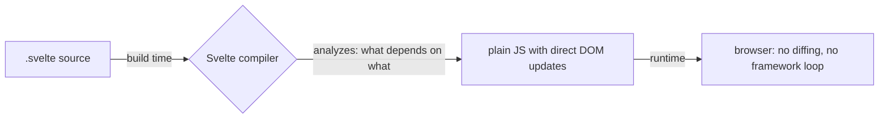

# What Svelte Actually Is

Every frontend framework answers the same question: *when data changes, how does the screen find
out?* React's answer is re-render and diff. Vue's is track reads and notify. Svelte's answer is the
one that sounds like cheating: **figure it out before the app ever runs.**

## A compiler, not a library

A `.svelte` file is not JavaScript that imports a framework - it's source code *for* a compiler.
At build time, Svelte reads your component, sees exactly which pieces of markup depend on which
pieces of state, and emits plain JavaScript that updates those pieces directly:

```html
<script>
  let count = $state(0);
</script>

<button onclick={() => count++}>
  Clicked {count} times
</button>
```

What the compiler emits (conceptually - the real output is more careful):

```js
// "when count changes, set this text node" - decided at BUILD time
button.addEventListener('click', () => {
  count++;
  textNode.data = `Clicked ${count} times`;
});
```

*What just happened:* there is no framework in that output. No virtual DOM to build, no diff to
run, no dependency graph to consult at runtime - the compiler *already knew* that `count` affects
exactly one text node, and wrote the update by hand, so to speak. That's the whole trick, and it
has two visible consequences:

- **Less JavaScript shipped.** You ship your compiled components plus a small runtime, not a
  framework that must be able to handle any component generically.
- **No reconciliation work at runtime.** Updates go straight to the affected nodes.



📝 **Terminology:** you'll hear "Svelte has no virtual DOM" as its tagline. Now you know what it
actually means: the *work* a virtual DOM does (figuring out what changed) is done once, at compile
time, instead of on every update at runtime. The trade-off is equally real: a compiler can only
analyze what it can see, which is why Svelte state needs to be *declared* as reactive (`$state` -
next phase) rather than being any old variable.

## The .svelte file

Like Vue, Svelte uses single-file components; the anatomy is nearly identical:

```html
<script>
  // logic - plain JavaScript (or TypeScript with lang="ts")
  let name = $state('world');
</script>

<!-- markup: HTML at the top level, no wrapper element required -->
<p class="greeting">Hello, {name}!</p>

<style>
  /* scoped BY DEFAULT - these rules affect only this component */
  .greeting { color: teal; }
</style>
```

Three differences from its neighbors worth noticing:

- **Markup is top-level.** No `<template>` wrapper, no single-root rule - the HTML just sits there.
- **`{expression}`** - single curly braces interpolate any JavaScript expression into text or
  attributes: ``. One syntax for both, no `:`
  prefix or mustache distinction to remember.
- **Styles are scoped by default.** No `scoped` attribute needed - leaking styles is the opt-in
  (`:global(...)`), not the accident.

## Booting a project

```console
$ npx sv create my-app
┌  Welcome to the Svelte CLI!
◇  Which template would you like?  SvelteKit minimal
◇  Add type checking with TypeScript?  Yes
└  Project created

$ cd my-app && npm install && npm run dev

  VITE ready in 621 ms
  ➜  Local:   http://localhost:5173/
```

*What just happened:* the official scaffold creates a **SvelteKit** project even for learning -
SvelteKit is to Svelte what Next is to React (routing, server rendering; phase 8), but you can
ignore all of it for now: your components live in `src/routes/+page.svelte` and
`src/lib/*.svelte`, and everything this guide teaches is pure Svelte that works the same anywhere.

For what it's worth: the site you're reading runs on exactly this stack, serving these guides with
the compiled-away approach this phase just described. When phase 8 weighs SvelteKit, it's a review
from a resident, not a tourist.

## Recap

1. Svelte is a compiler: dependency analysis happens at build time, and the output updates the DOM
   directly - no virtual DOM, no runtime diffing.
2. The trade: less shipped JS and no reconciliation cost, in exchange for reactivity being explicit
   (declared state) so the compiler can see it.
3. A `.svelte` file = `<script>` + top-level markup + auto-scoped `<style>`; `{expr}` interpolates
   everywhere.
4. The official scaffold gives you SvelteKit; plain Svelte knowledge transfers into it unchanged.

```quiz
[
  {
    "q": "Where does Svelte figure out which DOM nodes a piece of state affects?",
    "choices": [
      "At runtime, by diffing the new render against the previous one",
      "At runtime, by tracking which templates read which data",
      "At build time - the compiler analyzes the component and emits direct update code",
      "In the browser's devtools protocol"
    ],
    "answer": 2,
    "why": [
      "That's React's model - Svelte ships no diffing machinery at all.",
      "That's Vue's model - Svelte has no runtime tracking system to consult.",
      null,
      "Devtools observe your app; they don't participate in rendering."
    ],
    "explain": "Svelte is a compiler: the depends-on-what analysis happens once at build time, and the output is plain JavaScript that updates exactly the affected nodes."
  },
  {
    "q": "What does \"Svelte has no virtual DOM\" actually mean in practice?",
    "choices": [
      "Svelte can't update the DOM dynamically",
      "The change-detection work a virtual DOM does at runtime was done once by the compiler instead",
      "Svelte manipulates a hidden iframe instead of the real DOM",
      "Svelte apps must be fully static"
    ],
    "answer": 1,
    "why": [
      "Updates are fully dynamic - they're just precomputed rather than discovered by diffing.",
      null,
      "No iframes involved - the output touches the real DOM directly.",
      "Svelte apps are as interactive as any other framework's."
    ],
    "explain": "A virtual DOM exists to answer 'what changed?' at runtime. Svelte answers it at build time, so the runtime just executes the precomputed updates."
  }
]
```

---

[← Guide overview](_guide.md) · [Phase 2: Runes: State That Compiles →](02-runes-state-that-compiles.md)
