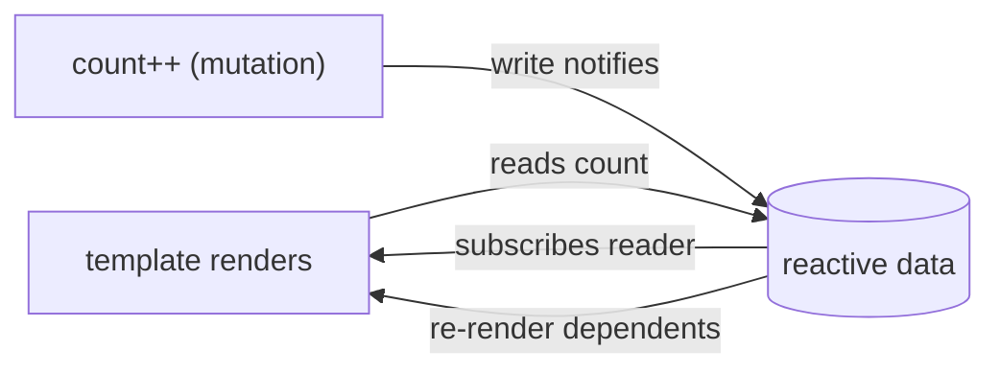

# What Vue Actually Is

Strip away the ecosystem and Vue is two ideas holding hands:

1. **Reactive data** - JavaScript objects that *know when they're read and when they're changed*.
2. **Templates** - HTML that declares which data it depends on, and re-renders itself when that
   data changes.

You change the data - directly, with ordinary assignments - and every piece of the page that used
that data updates. No manual DOM work, and no "you must not mutate" rules either. That second part
is worth dwelling on, because it's Vue's defining bet.

## The five-line version

```html
<script setup>
import { ref } from 'vue';
const count = ref(0);
</script>

<template>
  <button @click="count++">Clicked {{ count }} times</button>
</template>
```

*What just happened:* `ref(0)` created a reactive container holding `0`. The template reads it
(`{{ count }}`), which - and this is the trick - **registers the template as a dependent of
`count`**. The click runs `count++`, a plain mutation. The container notices the write, checks who
depends on it, and re-renders exactly that button's text. Nobody called a render function; nobody
told the DOM anything.

💡 **Key point:** Vue's model is a **dependency-tracking system**. Reading reactive data inside a
template (or a computed, or a watcher - later phases) subscribes the reader to that data. Writing
the data notifies the subscribers. Your job is to read and write naturally; the bookkeeping is the
framework's.



📝 **Terminology:** if you've read our React guide - this is the philosophical fork in the road.
React re-runs your whole component and diffs the output, so it needs *new objects* to detect change
(mutation breaks it). Vue tracks reads at property level, so it knows precisely what changed and
*wants* you to mutate. Neither is wrong; they're different answers to "how does the framework find
out?" Vue's answer: the data itself reports.

## The .vue file: one component, three blocks

That snippet above is a **single-file component** (SFC) - Vue's signature format. One `.vue` file
holds a component's logic, markup, and styling:

```html
<script setup>
// logic: state, functions, imports
import { ref } from 'vue';
const name = ref('world');
</script>

<template>
  <!-- markup: HTML plus Vue's template syntax -->
  <p class="greeting">Hello, {{ name }}!</p>
</template>

<style scoped>
/* styling: 'scoped' = these rules apply to THIS component only */
.greeting { color: teal; }
</style>
```

Three things to notice, one per block:

- **`<script setup>`** - the `setup` attribute is modern Vue's shorthand: everything declared at
  the top level (variables, functions, imports) is automatically available to the template. Older
  tutorials show `export default { data() {...}, methods: {...} }` - that's the **Options API**,
  the previous style. It still works, but this guide (like current Vue docs) teaches the
  **Composition API** with `<script setup>`; if a tutorial nests things under `data()` and
  `methods:`, it's teaching the older dialect.
- **`<template>`** - looks like HTML because it mostly is. It's compiled, not string-interpolated:
  Vue's build step turns it into a render function that knows exactly which dynamic parts depend on
  which data.
- **`<style scoped>`** - `scoped` rewrites the selectors so they can't leak out and hit other
  components. Component-local CSS, no naming conventions required.

## Booting an app

```console
$ npm create vue@latest my-app
✔ Project name: … my-app
✔ Add TypeScript? … No
✔ Add Vue Router for Single Page Application development? … No
✔ Add Pinia for state management? … No

$ cd my-app && npm install && npm run dev

  VITE ready in 487 ms
  ➜  Local:   http://localhost:5173/
```

*What just happened:* the official scaffold (`create-vue`) built a Vite project - Vue and Vite come
from the same team, and the dev experience shows it. The prompts offer Router and Pinia; saying no
is right while learning - both get their moment in phase 8.

The whole app starts from one mount call in `src/main.js`:

```js
import { createApp } from 'vue';
import App from './App.vue';

createApp(App).mount('#app');
```

*What just happened:* `createApp` builds an application instance around your root component and
`mount` hands it a DOM node to own. Everything inside `#app` is Vue's from here on - the same
"one root node, framework takes over" contract as every modern frontend framework.

## Recap

1. Vue = reactive data + templates subscribed to it. Reads register dependencies; writes notify
   them.
2. Mutation is the intended API: `count++` and `user.name = 'Ada'` are how change happens here.
3. A `.vue` SFC holds logic (`<script setup>`), markup (`<template>`), and styles
   (`<style scoped>`) for one component.
4. Composition API with `script setup` is the current dialect; Options API (`data()`, `methods:`)
   is the older one you'll meet in legacy code.
5. `createApp(App).mount('#app')` hands Vue its patch of the page.

```quiz
[
  {
    "q": "In Vue, how does the framework know which parts of the page to update when data changes?",
    "choices": [
      "It re-renders the whole app and diffs the result",
      "Reads are tracked: whatever read the data during render is registered as its dependent, and writes notify exactly those dependents",
      "It polls data for changes on every animation frame",
      "The developer lists dependencies for each template block"
    ],
    "answer": 1,
    "why": [
      "That's closer to React's model - Vue's tracking is finer-grained: it knows which property each template depends on.",
      null,
      "No polling exists - reactive objects report writes at the moment of assignment.",
      "Templates never declare dependencies; using a value in a template IS the registration."
    ],
    "explain": "Vue's reactivity is a subscription system: reading reactive data subscribes the reader, writing publishes to the subscribers. That's why plain mutation works."
  },
  {
    "q": "A tutorial's component has export default with data() and methods: sections. What are you looking at?",
    "choices": [
      "A syntax error - Vue components must use script setup",
      "The Options API - Vue's older component style, still supported",
      "A React component ported to Vue",
      "Server-side Vue, which uses a different syntax"
    ],
    "answer": 1,
    "why": [
      "It's fully valid Vue - just the previous idiom, not an error.",
      null,
      "React has neither data() nor methods: - this shape is distinctly Vue, just older Vue.",
      "Server-side rendering uses the same component syntax; the dialect split is Options vs Composition, not server vs client."
    ],
    "explain": "Vue has two component dialects. Options API organizes by option type (data, methods, computed); Composition API with script setup organizes by feature. New code and current docs use the latter."
  }
]
```

---

[← Guide overview](_guide.md) · [Phase 2: Templates That React →](02-templates-that-react.md)
