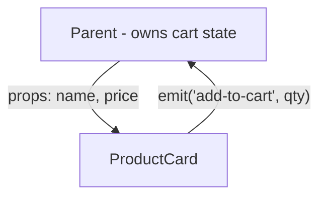

# Components: Props, Events, and v-model

An SFC becomes a reusable building block the moment it can take data in and report changes out.
Vue's answer is the same shape as every component system - props down, events up - with the
directions *declared* rather than implied. And once you know both halves, `v-model` on components
stops being magic: it's the two halves in a trench coat.

## Props: declared inputs

```html
<!-- ProductCard.vue -->
<script setup>
const props = defineProps({
  name: { type: String, required: true },
  price: { type: Number, required: true },
  inStock: { type: Boolean, default: true },
});
</script>

<template>
  <article :class="{ dimmed: !inStock }">
    <h3>{{ name }}</h3>
    <p>{{ (price / 100).toFixed(2) }} €</p>
  </article>
</template>
```

```html
<!-- used from a parent -->
<ProductCard name="Kettle" :price="4900" :in-stock="false" />
```

*What just happened:* `defineProps` declares what this component accepts - with runtime types,
required flags, and defaults. Vue warns in the console when a parent passes the wrong type or skips
a required prop: your component's contract, enforced during development. Note the casing at the
call site: camelCase props are written kebab-case in templates (`inStock` → `:in-stock`).

⚠️ **Gotcha:** `:price="4900"` versus `price="4900"` matters exactly like phase 2's binding rule -
without the colon you're passing the *string* `"4900"`, and the type check will tell you so. The
colon means "expression"; quotes alone mean "literal string."

**Props are one-way.** Assigning to a prop (`props.name = 'x'`) logs a warning and doesn't
propagate - a child editing its inputs would make data flow untraceable, the same reasoning as
every one-way framework. The child's move when it *wants* a change is the other half:

## Emits: declared outputs

```html
<!-- ProductCard.vue -->
<script setup>
defineProps({ name: String, price: Number });
const emit = defineEmits(['add-to-cart']);
</script>

<template>
  <article>
    <h3>{{ name }}</h3>
    <button @click="emit('add-to-cart', 1)">Add</button>
  </article>
</template>
```

```html
<!-- parent -->
<ProductCard name="Kettle" :price="4900" @add-to-cart="qty => cart.add('kettle', qty)" />
```

*What just happened:* the child *emits* a named event with a payload; the parent listens with the
same `@` syntax used for DOM events. The child doesn't know what adding to a cart means - it
announces intent, the parent decides. `defineEmits` documents the component's outputs the way
`defineProps` documents inputs; one file tells a new teammate the entire interface.



## v-model on components: the trench coat opens

Phase 2 used `v-model` on inputs. On your own components, it's the props/emits pattern with agreed
names - `modelValue` in, `update:modelValue` out:

```html
<!-- these two lines are identical -->
<StarRating v-model="rating" />
<StarRating :modelValue="rating" @update:modelValue="v => rating = v" />
```

So a component supports `v-model` by implementing that contract:

```html
<!-- StarRating.vue -->
<script setup>
defineProps({ modelValue: Number });
const emit = defineEmits(['update:modelValue']);
</script>

<template>
  <span>
    <button v-for="n in 5" :key="n" @click="emit('update:modelValue', n)">
      {{ n <= modelValue ? '★' : '☆' }}
    </button>
  </span>
</template>
```

*What just happened:* the component never stores the rating - it displays the prop and emits the
requested change; the parent's `v-model` writes it back into the parent's ref. State stays in one
place (the parent), and the child stays a pure view of it. This is "lifting state up" as a
first-class framework convention.

📝 **Terminology:** current Vue wraps this whole contract in one macro - `defineModel()` declares
the prop and emit pair and hands you a writable ref. Sugar over sugar; knowing the
`modelValue`/`update:modelValue` layer underneath is what lets you debug either spelling.

## Where state should live

The same question every component system asks, with the same answer:

- **One component cares** → a `ref` inside it.
- **Siblings need it** → lift it to the common parent; props down, emits up.
- **The whole app needs it** (theme, user, cart) → `provide`/`inject` (phase 5) or a store
  (phase 8).

The anti-pattern to name early: **copying a prop into a local ref** so you can mutate it
(`const localName = ref(props.name)`). Now there are two truths, and the copy goes stale the moment
the parent updates. If the child needs to change it, that's the emit pattern; if the child needs a
transformed view of it, that's a `computed` reading the prop.

## Recap

1. `defineProps` declares typed, defaulted inputs; camelCase in script, kebab-case in templates;
   `:` for expressions.
2. Props are one-way - children request changes by emitting, parents decide.
3. `defineEmits` + `emit('event', payload)` is the child-to-parent channel, listened to with `@`.
4. Component `v-model` = `modelValue` prop + `update:modelValue` emit (or the `defineModel` sugar).
5. Don't copy props into local state - derive with computed, or emit to change the source.

```quiz
[
  {
    "q": "A child component copies a prop into a ref (const local = ref(props.title)) and edits that. What goes wrong?",
    "choices": [
      "Vue throws a warning about mutating props",
      "The copy disconnects from the parent - later parent updates never reach it, and the child's edits reach nobody",
      "The ref fails because props aren't reactive",
      "Nothing - this is the recommended pattern"
    ],
    "answer": 1,
    "why": [
      "No warning fires - the prop itself was never assigned; that's what makes this bug quiet.",
      null,
      "Props are reactive - but ref(props.title) captures the current value once, not a live link.",
      "It's the canonical two-sources-of-truth mistake: emit to change it, or compute a derived view."
    ],
    "explain": "ref(props.title) snapshots the value at setup time. The parent and child now hold independent copies that drift. Emit for changes; computed for transformations."
  },
  {
    "q": "What is <Toggle v-model=\"enabled\" /> shorthand for?",
    "choices": [
      "A two-way proxy that lets the child write the parent's ref directly",
      ":modelValue=\"enabled\" plus @update:modelValue writing back into enabled",
      "A shared reactive object both components mutate",
      ":value=\"enabled\" plus @input, like on a DOM input"
    ],
    "answer": 1,
    "why": [
      "The child never touches the parent's ref - it emits a request; the parent's generated handler does the writing.",
      null,
      "No shared object exists - state stays in the parent; the child is a view of it.",
      "That's the expansion on native inputs; components use the modelValue/update:modelValue pair."
    ],
    "explain": "Component v-model is convention, not magic: a modelValue prop in, an update:modelValue event out, and the parent's v-model wires the event back into its own state."
  }
]
```

---

[← Phase 3: Reactivity for Real](03-reactivity-for-real.md) · [Guide overview](_guide.md) · [Phase 5: Slots and Composition →](05-slots-and-composition.md)
