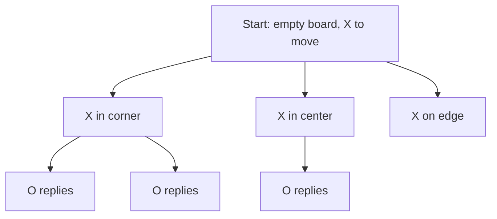

# Game Trees: Every Game as a Branching Map

When you plan a chess move, you picture futures: "if I take that pawn, they take my bishop, then I fork their rooks." A computer does the same thing, except it writes the futures down in a data structure. That structure is the **game tree**, and nearly every game-playing program is a way of walking it.

This phase gives you the vocabulary and the one number that decides which games a computer can brute-force and which it cannot.

## States and moves

A **state** is a complete snapshot of the game: where every piece is, and whose turn it is. A **move** takes one state to another. The rules of the game are exactly the answer to "from this state, which moves are legal?"

Draw each state as a dot and each legal move as an arrow to the next state, and you have the **game tree**. The starting position is the **root**. A position where the game is over (a win, a loss, a draw) is a **leaf**.



Each level of the tree is one **ply**: a single move by one player. Chess players say "move" for a pair of plies (White then Black), so programmers use "ply" to avoid confusion.

> 📝 **Terminology.** The tree is strictly a tree only if you count every path to a position separately. Two different move orders can reach the same board, so the same state can appear many times. Programs that notice this and reuse the answer are using a **transposition table**; you will meet the idea again later.

## The branching factor is the whole story

The **branching factor** is the number of legal moves available in a typical state. If every state has about `b` moves and the game lasts about `d` plies, the tree has roughly `b` to the power `d` leaves. The exponent is what hurts: adding one more ply of lookahead multiplies the work by `b`. This is the same explosion that [Big-O Without the Math Panic](/guides/big-o-without-the-math-panic) calls exponential growth.

Tic-tac-toe has at most 9 moves at the start and one fewer each turn, so it is small enough to count by machine. Run this:

```python runnable
LINES = [(0,1,2),(3,4,5),(6,7,8),(0,3,6),(1,4,7),(2,5,8),(0,4,8),(2,4,6)]

def winner(b):
    for i, j, k in LINES:
        if b[i] != " " and b[i] == b[j] == b[k]:
            return b[i]
    return None

def moves(b):
    return [i for i in range(9) if b[i] == " "]

def play(b, i, p):
    return b[:i] + p + b[i+1:]

def count_games(b, p):
    if winner(b) or not moves(b):
        return 1
    other = "O" if p == "X" else "X"
    return sum(count_games(play(b, m, p), other) for m in moves(b))

def count_positions():
    seen = set()
    def walk(b, p):
        if b in seen:
            return
        seen.add(b)
        if winner(b) or not moves(b):
            return
        other = "O" if p == "X" else "X"
        for m in moves(b):
            walk(play(b, m, p), other)
    walk(" " * 9, "X")
    return len(seen)

print("distinct games:", count_games(" " * 9, "X"))
print("distinct positions:", count_positions())
```

The board is a 9-character string, `winner` checks the eight lines, and `count_games` walks every path from the empty board to a finished game. When this program ran for this guide it printed:

```console
distinct games: 255168
distinct positions: 5478
```

*What just happened:* there are 255,168 different complete games, but only 5,478 different boards they pass through. The gap is the transposition effect: many move orders arrive at the same board. A computer finishes both counts in a blink, which is why tic-tac-toe is the standard first test for a game-playing program.

## Where brute force stops working

Now scale up. In 1950, Claude Shannon wrote the first serious analysis of how a computer could play chess ([Programming a Computer for Playing Chess](https://doi.org/10.1080/14786445008521796), *Philosophical Magazine*). He estimated that a typical position offers on the order of 30 legal moves and a game lasts around 40 moves per side. That gives a game tree with about 10^120 branches, a figure now called the **Shannon number**. It is an estimate of the number of distinct games, not an exact count, and it is a rough order of magnitude, but the lesson does not depend on the exact digits. No computer can list anything near 10^120 items.

Go is worse. The Google DeepMind team described Go's search space as more than a googol (10^100) times larger than chess's ([AlphaGo, Google Research blog](https://research.google/blog/alphago-mastering-the-ancient-game-of-go-with-machine-learning/)). A 19-by-19 board offers far more legal moves per turn than chess, and games run long, so both `b` and `d` are big.

| Game | Branching factor | Can brute force finish it? |
|---|---|---|
| Tic-tac-toe | at most 9 | Yes, instantly |
| Checkers | modest (jumps are often forced) | Not directly. It took years of work (phase 5) |
| Chess | about 30 (Shannon's estimate) | No |
| Go | much larger than chess | No, by a huge margin |

The table is qualitative for checkers because exact figures depend on how you define a position. The shape is what matters: the bigger `b` is, the faster the tree outgrows any machine.

## So what do programs do instead?

They stop trying to see everything. Every technique in the rest of this guide attacks the explosion in one of three ways:

1. **Skip branches that cannot matter** (alpha-beta pruning, [phase 3](03-alpha-beta-pruning.md)).
2. **Stop early and guess** (evaluation functions, [phase 4](04-evaluation-and-stockfish.md)).
3. **Sample instead of enumerate** (Monte Carlo search and learning, [phase 5](05-solving-learning-and-constraints.md)).

Check yourself before moving on:

```quiz
[
  {"q": "A game has about 20 legal moves per position. You add one more ply of lookahead. Roughly how much more work does a full search do?", "choices": ["About 20 times more", "About 20 more nodes", "Twice as much", "The same, because pruning applies"], "answer": 0, "explain": "Each extra ply multiplies the number of leaves by the branching factor, so work grows exponentially with depth."},
  {"q": "Why did the tic-tac-toe program count 255,168 games but only 5,478 positions?", "choices": ["Half the games are illegal", "Many different move orders reach the same board", "Positions are counted only for X", "Rotations were removed"], "answer": 1, "explain": "Different sequences of moves can transpose into the same board, so there are far fewer boards than paths."},
  {"q": "What did Shannon's 10^120 figure estimate?", "choices": ["The number of legal chess positions exactly", "The number of moves in the longest game", "The number of distinct chess games, roughly", "The speed a computer would need"], "answer": 2, "explain": "It is a rough estimate of the number of distinct games, from about 30 moves per position over about 40 moves per side."}
]
```

## Recap

1. A game is states connected by legal moves; written out, it is a tree whose leaves are finished games.
2. A ply is one player's move, and the branching factor is the typical number of legal moves.
3. Tree size grows exponentially: roughly `b` to the power `d`.
4. Tic-tac-toe has 255,168 games and 5,478 positions, small enough to enumerate.
5. Shannon estimated chess at around 10^120 games, and Go's search space is vastly larger still.

Next up, [Minimax: Playing Perfectly on Tic-Tac-Toe](02-minimax.md): how to pick a move by assuming the opponent plays their best.
