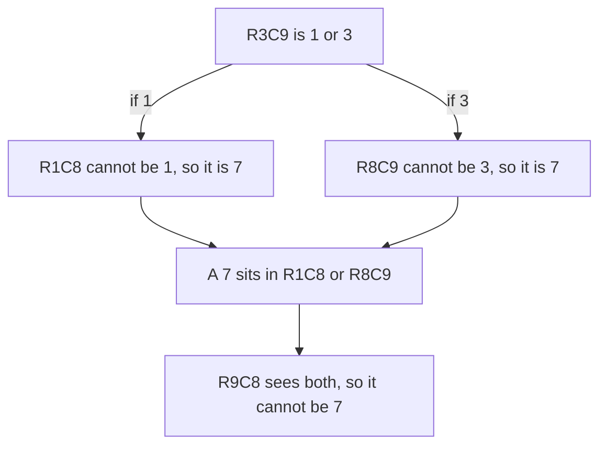

# Fish and Wings: Advanced Patterns

Pairs and pointing look inside one or two units at a time. The patterns in this phase look across several, and that is why they feel like magic until you see the argument. They are not magic. Each one is a pigeonhole argument or a two-case argument, and once you can state the argument, you can rebuild the pattern from memory instead of memorizing its shape.

You need pencil marks for these (phase 3). The examples show one digit at a time, with `o` marking where that digit can still go.

## Fish: one digit, a few rows, a few columns

Start with a fact about a single digit. In a solved grid, the digit 7 appears exactly once in every row and exactly once in every column.

Now suppose two rows each have only two possible cells for a 7, and both rows use the same two columns. Call the rows A and B and the columns X and Y. Row A's 7 is in X or in Y. Row B's 7 is in X or in Y. They cannot both be in X, because that would put two 7s in one column. So they are in different columns, which means the two rows between them supply a 7 to column X **and** a 7 to column Y. Either:

```text
        X   Y            X   Y
  A     7   .      or    .   7
  B     .   7            7   .
```

In both cases, columns X and Y already have their 7 from rows A and B. No other cell in column X or column Y can be 7.

That is an **X-Wing**. It is the smallest member of a family called **fish**. The two rows are the **base** (where the digit must be placed) and the two columns are the **cover** (where all the base's candidates sit). The elimination rule is the same for every fish: **if the base rows' candidates for a digit all lie inside the cover columns, remove the digit from every other cell in the cover columns.** Rows and columns swap roles freely, so a fish can also have columns as the base.

## An X-Wing in a real puzzle

```text
    1 2 3   4 5 6   7 8 9
  +-------+-------+-------+
1 | 1 . . | . . . | 5 6 9 |
2 | 4 9 2 | . 5 6 | 1 . 8 |
3 | . 5 6 | 1 . 9 | 2 4 . |
  +-------+-------+-------+
4 | . . 9 | 6 4 . | 8 . 1 |
5 | . 6 4 | . 1 . | . . . |
6 | 2 1 8 | . 3 5 | 6 . 4 |
  +-------+-------+-------+
7 | . 4 . | 5 . . | . 1 6 |
8 | 9 . 5 | . 6 1 | 4 . 2 |
9 | 6 2 1 | . . . | . . 5 |
  +-------+-------+-------+
```

The digit 7 appears nowhere among the givens, so every empty cell is still a candidate for 7 for now. Here is the map:

```text
    1 2 3   4 5 6   7 8 9
  +-------+-------+-------+
1 | . o o | o o o | . . . |
2 | . . . | o . . | . o . |
3 | o . . | . o . | . . o |
  +-------+-------+-------+
4 | o o . | . . o | . o . |
5 | o . . | o . o | o o o |
6 | . . . | o . . | . o . |
  +-------+-------+-------+
7 | o . o | . o o | o . . |
8 | . o . | o . . | . o . |
9 | . . . | o o o | o o . |
  +-------+-------+-------+
```

Row 2 has empty cells at C4 and C8 only. Row 6 has empty cells at C4 and C8 only. Same two rows, same two columns: R2C4, R2C8, R6C4, R6C8 form the X-Wing. Row 2's 7 and row 6's 7 are in columns 4 and 8 between them, so columns 4 and 8 have no room left for any other 7.

Eight candidates disappear in one deduction: 7 is removed from R1C4, R5C4, R8C4, R9C4 (column 4) and from R4C8, R5C8, R8C8, R9C8 (column 8). Every one of those is an empty cell that still carried a 7 in its pencil marks.

*What just happened:* you proved that 7 cannot be in eight cells without finding where 7 goes in any of the corner cells. That is the typical shape of a fish: it deletes candidates and leaves the digit's final position to later steps.

## Swordfish: the same idea with three

Replace "two rows and two columns" with "three rows and three columns". Each of three rows has two or three candidates for a digit, and all of those candidates sit inside the same three columns. Three rows need three different columns for their three 7s (or 8s, or whatever the digit is), so the three columns' digit is all spoken for. Anything else in those columns goes. That is a **Swordfish**. (Four of each is a Jellyfish, and the rule is the same.)

The rows do not each need all three columns. Here is the digit 8 in another puzzle:

```text
    1 2 3   4 5 6   7 8 9
  +-------+-------+-------+
1 | 8 . . | . 2 . | . . 6 |
2 | . . . | 1 . . | . . . |
3 | 1 . . | 3 . . | 9 . 7 |
  +-------+-------+-------+
4 | 3 . . | . . . | 5 . . |
5 | . 7 . | 9 8 . | 2 . . |
6 | . . . | . 7 . | . . 8 |
  +-------+-------+-------+
7 | . 6 . | 8 . 9 | . . . |
8 | . . . | . . . | . 3 . |
9 | . 3 . | 7 . 6 | . 2 . |
  +-------+-------+-------+
```

```text
    1 2 3   4 5 6   7 8 9
  +-------+-------+-------+
1 | 8 . . | . . . | . . . |
2 | . . . | . . o | o o . |
3 | . . . | . . o | . o . |
  +-------+-------+-------+
4 | . o o | . . . | . . . |
5 | . . . | . 8 . | . . . |
6 | . . . | . . . | . . 8 |
  +-------+-------+-------+
7 | . . . | 8 . . | . . . |
8 | . o o | . . . | o . . |
9 | . . o | . . . | o . . |
  +-------+-------+-------+
```

Look at the rows with candidates for 8:

```text
R4: C2, C3
R8: C2, C3, C7
R9: C3, C7
```

All the candidates in rows 4, 8, and 9 sit in columns 2, 3, and 7. Rows 4, 8, and 9 must each place one 8, in three different columns, and there are only three columns to choose from. So columns 2, 3, and 7 get their 8 from these three rows. The map shows one other 8 candidate in those columns, at R2C7, and it is eliminated: **R2C7 is not 8**.

> 💡 **Key point**: every fish is the pigeonhole principle. n rows, each needing a distinct column from a set of n columns, use up all n columns. The rest of the pattern is bookkeeping.

## XY-Wing: a two-case argument across three cells

Fish work with one digit. **XY-Wing** works with three cells and three digits. It uses a different kind of reasoning: split into the two possibilities for one cell and see what both lead to.

The pattern has three cells, each with exactly two candidates:

- The **pivot** has candidates X and Y.
- One **pincer** sees the pivot and has candidates X and Z.
- The other **pincer** sees the pivot and has candidates Y and Z.

The rule: **Z can be removed from any cell that sees both pincers.** Here it is in a real position.

```text
    1 2 3   4 5 6   7 8 9
  +-------+-------+-------+
1 | 4 . . | 3 . 9 | 2 . 8 |
2 | . . . | . . . | . . 6 |
3 | . . . | 7 6 8 | 5 . . |
  +-------+-------+-------+
4 | 1 4 . | . . . | . . . |
5 | 5 . . | . . . | . . . |
6 | . 8 6 | 9 . . | . . 4 |
  +-------+-------+-------+
7 | . . 8 | 4 . 3 | . 5 . |
8 | 6 . . | . 9 1 | . 2 . |
9 | . . . | 8 . . | . . 9 |
  +-------+-------+-------+
```

The three cells:

```text
R3C9 (pivot):    1 3
R1C8 (pincer):   1 7
R8C9 (pincer):   3 7
```

R3C9 sees R1C8 (they share box 3) and sees R8C9 (they share column 9). The pivot is 1 or 3, and there are no other possibilities. Take each case:



If the pivot is 1, the pincer R1C8 loses its 1 (it sees the pivot), leaving 7. If the pivot is 3, the pincer R8C9 loses its 3, leaving 7. Either way, one of the two pincers is 7, and we do not need to know which. Now find a cell that sees both pincers: R9C8 shares column 8 with R1C8 and box 9 with R8C9. It cannot be 7 in either case, and R9C8 had 1, 3, 4, 6, 7 as candidates, so **R9C8 is not 7**.

*What just happened:* a proof by cases. When two cases force the same conclusion, the conclusion is true no matter which case holds. You never learned the pivot's value.

## Finding them, and what lies beyond

Fish and wings take practice to spot, and nobody finds them at first glance. A few habits help:

- **For fish**, pick one digit and list, for each row, where it can go. Look for two rows with the same two positions (X-Wing) or three rows whose positions union to three columns (Swordfish). Then repeat with columns as the base.
- **For XY-Wing**, start from cells with exactly two candidates, called bivalue cells. Pick one as the pivot (candidates X and Y), then look for two cells that both see it: one with candidates X and Z, the other with Y and Z, where Z is a third digit.
- **Do every simpler technique first.** Singles, pairs, and pointing delete candidates cheaply, and each deletion can turn a hard pattern into a plain single.

These are the named patterns in this guide, and plenty of puzzles live past them. Longer chains of two-candidate links, coloring a single digit's links, and larger groups of cells with shared candidates all follow the same style of argument: assume, follow the consequences, and find what both branches share. [HoDoKu's technique pages](https://hodoku.sourceforge.net/en/tech_fishb.php) catalogue them with diagrams if you want to go further. In phase 5 you will see a computer take the same assume-and-follow idea to its extreme.

## Your turn: apply a fish

```exercise
[
  {
    "type": "predict",
    "task": "In the Swordfish example (the puzzle for the digit 8), which cell loses its candidate 8? Answer in RxCy form, like R2C5.",
    "accept": ["R2C7"],
    "hint": "Find the 8-candidate in columns 2, 3, or 7 that is not in rows 4, 8, or 9."
  }
]
```

Check yourself before moving on:

```quiz
[
  {
    "q": "In an X-Wing, a digit has exactly two candidate cells in row 2, in columns 3 and 7, and exactly two in row 6, also in columns 3 and 7. What can you remove?",
    "choices": [
      "The digit from other cells in rows 2 and 6",
      "The digit from other cells in columns 3 and 7, outside rows 2 and 6",
      "All other candidates from the four corner cells"
    ],
    "answer": 1,
    "explain": "Rows 2 and 6 between them place the digit in columns 3 and 7, so those columns have no room for it elsewhere. Rows 2 and 6 are the base, and the elimination goes into the cover columns."
  },
  {
    "q": "An XY-Wing has pivot 4 6, one pincer 4 9, and the other pincer 6 9. Which candidate can be removed, and from where?",
    "choices": [
      "9, from any cell that sees both pincers",
      "4, from any cell that sees both pincers",
      "9, from the pivot"
    ],
    "answer": 0,
    "explain": "If the pivot is 4, the first pincer cannot be 4, so it is 9. If the pivot is 6, the second pincer cannot be 6, so it is 9. A 9 sits in one of the pincers in both cases, so any cell seeing both cannot be 9."
  },
  {
    "q": "Why does a Swordfish on rows work?",
    "choices": [
      "Three rows must each place the digit in a different column, and all their candidates sit in only three columns, so those columns are used up",
      "Three rows always hold the same digits as three columns",
      "Three rows are the same as one box"
    ],
    "answer": 0,
    "explain": "It is the pigeonhole principle: three rows, three columns available, each row needs a distinct column, so every one of the three columns gets its digit from these rows."
  }
]
```

## Recap

1. A fish (X-Wing is size 2, Swordfish size 3, Jellyfish size 4) is n rows whose candidates for a digit all lie in the same n columns; remove the digit from the rest of those columns.
2. The reason is the pigeonhole principle: n rows need n different columns, so the columns are all used.
3. An XY-Wing is a pivot X Y with pincers X Z and Y Z; Z is removed from any cell that sees both pincers.
4. The reason is a proof by cases: both possibilities for the pivot place a Z in a pincer.
5. Use simpler techniques first; each of these patterns deletes candidates, and the placements follow later.

Next up, [How a Computer Solves Sudoku](05-how-a-computer-solves-sudoku.md): what it takes to teach a machine all of this, and how it can skip most of it.
