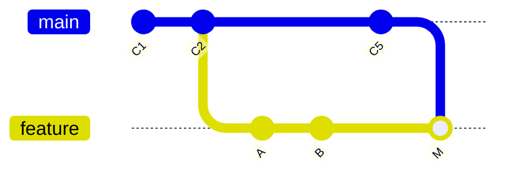
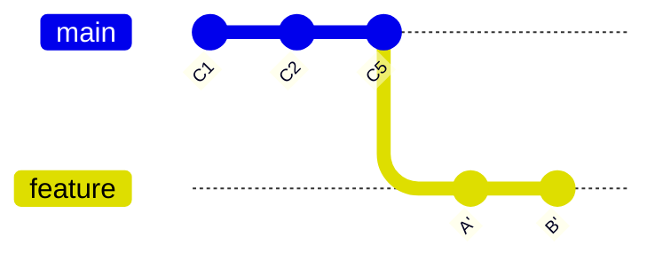

# Rebase Without Fear

`rebase` has a fearsome reputation, and it's half-earned: it's a genuinely sharp tool that *rewrites
history*, and used carelessly it can hand you a confusing mess. But the fear mostly comes from not knowing
what it actually does. Once you do — and once you have the reflog from [Phase 1](01-the-reflog.md) as your
undo — rebase becomes a precise, friendly tool you'll reach for often.

## What rebase actually does

**What it actually is.** Rebase picks up the commits on your branch and **re-plays them onto a different
starting point**, one by one. The key word is *re-plays*: it doesn't move your original commits, it makes
**brand-new commits** with the same changes and messages but new parents — and therefore new hashes. The
originals become unreachable (and yes, the reflog still has them).

Compare it with merge, which you already know. Say `main` moved forward while you worked:

**Merge `main` into your branch** — a merge commit `M` ties the two histories together:


**Rebase your branch onto `main`** — your `A`,`B` are re-created as `A'`,`B'` on top of `C5`, a straight line with no merge commit:


**Why reach for it.** The result is a *linear* history — your work sits cleanly on top of the latest
`main`, as if you'd started from there this morning. No merge bubbles. Many teams prefer that tidiness, and
it makes a PR easier to read.

📝 **Terminology.** "Rebase your branch *onto* `main`" means: use the current tip of `main` as the new base
your commits sit on. Your commits move; `main` doesn't.

## Rebasing your branch onto the latest `main`

This is the everyday use — the rebase-flavored alternative to the "fold `main` in" merge from the team
guide:
```console
$ git switch feature/cart
$ git fetch
$ git rebase origin/main
Successfully rebased and updated refs/heads/feature/cart.
```
*What just happened:* Git set your branch's commits aside, fast-forwarded your starting point to the latest
`origin/main`, then re-applied your commits on top as new commits. Your branch is now a clean line on top
of current `main`.

**When a conflict interrupts it.** Because rebase re-applies your commits one at a time, a conflict stops it
mid-flight:
```console
$ git rebase origin/main
Auto-merging pricing.js
CONFLICT (content): Merge conflict in pricing.js
error: could not apply 2b3c4d5... Add tax line
Resolve all conflicts manually, mark them resolved with "git add",
then run "git rebase --continue". You can instead skip this commit: "git rebase --skip".
To abort and get back to the state before "git rebase", run "git rebase --abort".
```
Resolve the file as usual, then *don't commit* — tell the rebase to carry on:
```console
$ git add pricing.js
$ git rebase --continue
```
*What just happened:* You resolved the clash for that one replayed commit and `--continue` resumed applying
the rest. (Conflicts can recur for each commit — keep resolving and continuing.) Lost the thread entirely?
**`git rebase --abort`** returns you to exactly where you stood before the rebase, no harm done. That escape
hatch is why you can always try a rebase.

## Cleaning up history before a PR (interactive rebase)

Here's where rebase earns real love. Before opening a pull request, you can polish your messy
work-in-progress commits into a clean story with **interactive rebase**. Say your last three commits are:
```console
$ git log --oneline -3
3c4d5e6 Add tax line
2b3c4d5 fix typo
1a2b3c4 Add subtotal calc
```
Start an interactive rebase over those three:
```console
$ git rebase -i HEAD~3
```
Git opens an editor listing them oldest-first, with a menu of actions:
```text
pick 1a2b3c4 Add subtotal calc
pick 2b3c4d5 fix typo
pick 3c4d5e6 Add tax line

# Commands:
# p, pick   = use the commit as-is
# r, reword = use the commit, but edit its message
# s, squash = meld into the previous commit (keep both messages)
# f, fixup  = like squash, but discard this commit's message
# d, drop   = remove the commit entirely
```
Edit the verbs to reshape history — here, fold the typo fix into the commit it belongs to, and reword the
last one:
```text
pick  1a2b3c4 Add subtotal calc
fixup 2b3c4d5 fix typo
reword 3c4d5e6 Add tax line
```
Save and close. The result:
```console
$ git log --oneline -2
8f9e0d1 Add tax line and rounding
7a8b9c0 Add subtotal calc
```
*What just happened:* Git replayed the commits applying your instructions — the "fix typo" commit got
absorbed into "Add subtotal calc" (`fixup`), and you got a chance to rewrite the final message (`reword`).
Three scrappy commits became two clean ones. Reviewers see a tidy story instead of your thought process.

## The one rule that keeps rebase safe

Everything above is safe because those commits lived only on your machine. The danger is rewriting commits
that *other people already have*. Burn this in:

> ⚠️ **The Golden Rule of Rebase: never rebase commits that exist outside your own repository.** If you've
> pushed them to a shared branch and others may have pulled them, rebasing creates *different* commits with
> the same content — and now their history and yours disagree, in a way that's painful for everyone to
> untangle.

The safe zone is your own un-pushed (or solo) branch — clean it up all you like before sharing. `main` and
any branch teammates build on are off-limits to rebase. (Rebasing a branch *only you* use, even after
pushing it, is fine — but it requires a force-push, which is exactly what [Phase 3](03-undoing-pushed-history.md)
covers safely.)

## Rescuing a rebase that already finished badly

`--abort` only works *during* a rebase. What if it completed and *then* you realized it mangled things? This
is where Phase 1 pays off — the reflog remembers where you were before the rebase started:
```console
$ git reflog
8f9e0d1 (HEAD -> feature/cart) HEAD@{0}: rebase (finish): returning to refs/heads/feature/cart
...
3c4d5e6 HEAD@{5}: rebase (start): checkout origin/main
e1f2a3b HEAD@{6}: commit: Add tax line        ← the branch tip BEFORE the rebase
$ git reset --hard e1f2a3b
```
*What just happened:* The reflog clearly brackets the rebase with `rebase (start)` and `rebase (finish)`
entries. The commit just before the start (`HEAD@{6}` here) is your branch exactly as it was pre-rebase.
`git reset --hard` to it and the rebase is undone — original commits and all. Nothing was ever lost.

## Recap

1. **Rebase replays your commits onto a new base as new commits** (new hashes) — the originals become
   unreachable but the reflog keeps them.
2. **`git rebase origin/main`** gives a clean linear history; resolve conflicts then `--continue`, or
   `--abort` to bail out safely.
3. **`git rebase -i`** lets you squash, fixup, reword, reorder, and drop commits to tidy history before a
   PR.
4. **The Golden Rule:** never rebase commits others already have — keep it to your own un-shared work.
5. **Undo a finished bad rebase** via the reflog: `git reset --hard <pre-rebase-hash>`.

---

[← Phase 1: The Reflog](01-the-reflog.md) · [Guide overview](_guide.md) · [Phase 3: Undoing What You've Already Pushed →](03-undoing-pushed-history.md)

## Try it yourself

Run commands and watch the history graph build — `commit -m "first"`, `branch dev`, `checkout dev`, `commit -m "work"`, `checkout main`, `merge dev`:

```playground-git
```
