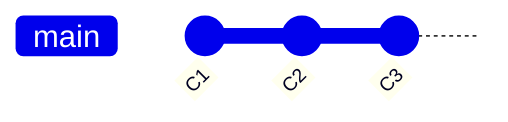
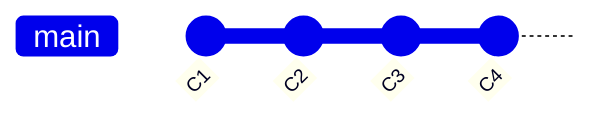
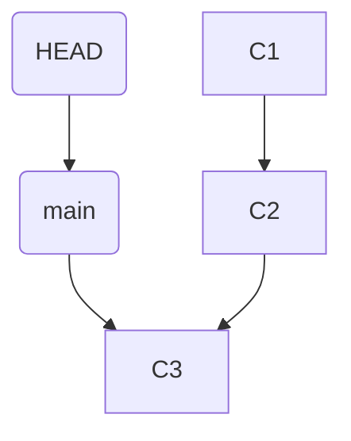
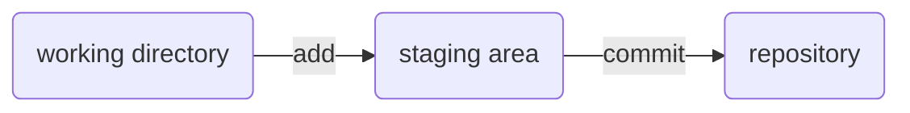

# The Mental Model — What Git Actually Is

You've used Git. You've typed `git commit`, `git push`, maybe `git pull` a hundred times. And yet the
moment something unexpected happens — a merge conflict, a "detached HEAD," a teammate's force-push —
your stomach drops.

Here's the secret nobody tells you: **almost every Git nightmare is the same problem wearing different
masks — not understanding what Git is actually doing underneath.** Git has a reputation for being
terrifying and arbitrary. It is neither. It's built on about five simple ideas, and once they click,
the fear doesn't shrink — it disappears, because you can *reason* about what's happening instead of
guessing.

So we won't memorize commands yet. First, the five ideas. Give me twenty minutes and Git stops being a
haunted house.

## Idea 1: A commit is a snapshot

**What it actually is.** A commit is a photograph of your *entire project* at one moment in time. Not
"the changes you made" — the whole thing, every file, exactly as it looked when you hit commit. Git
gives that photograph a unique name (a long ID called a *hash*, like `9f2a1c7`) and remembers which
commit came right before it: its *parent*.

That's the whole definition. A commit is a snapshot, plus a name, plus a pointer to the previous
snapshot.

**Why people get this wrong.** Most tutorials say a commit "stores your changes," so people picture Git
saving little diffs and stacking them up. That picture falls apart the first time you try to undo
something. The truth — *each commit is a complete snapshot* — is what makes everything else make sense.


Each box is a complete snapshot; each commit points back at the one before it (its parent). Follow the arrows backward and you're walking through
history, one complete snapshot at a time.

**A real example.**
```console
$ git commit -m "Add login button"
[main 9f2a1c7] Add login button
 1 file changed, 12 insertions(+)
```
*What just happened:* Git took a snapshot of your project, named it `9f2a1c7`, wrote your message on
it, and recorded that its parent is whatever commit you were sitting on a moment ago. That snapshot is
now permanent history. The `1 file changed` line is Git being friendly and *summarizing* the difference
from the parent — but what it stored is the full snapshot, not only those 12 lines.

**Why this saves you later.** Because commits are complete snapshots that only ever point backward, your
old versions aren't destroyed when you make new ones. "Going back" means walking the arrows. This is why
"I think I lost my work" is almost always wrong: the snapshot is still there; you only lost sight of it.

## Idea 2: A branch is a sticky note

**What it actually is.** Here's the idea that unlocks everything: **a branch is a sticky note with a
name on it, stuck onto one specific commit.** That's the whole thing. `main` is not a copy of your
project. It's not a folder. It's a label — a small pointer — that says "this commit is the tip of
`main`."


The `main` label sits on C3, the newest commit — a sticky note, not a copy of your project.

**What it does in real life.** When you make a new commit on `main`, Git creates the snapshot and then
*peels the sticky note off the old commit and sticks it on the new one*. The label always moves to
point at the newest commit on that branch.


You commit C4, and Git peels the `main` label off C3 and sticks it on C4 — the label always rides the newest commit.

**A real example.** Creating a branch costs almost nothing, because you're adding a second sticky note
and nothing else:
```console
$ git branch feature
$ git log --oneline -1
9f2a1c7 (HEAD -> main, feature) Add login button
```
*What just happened:* `git branch feature` put a second label — `feature` — on the *exact same commit*
`main` is on. Nothing was copied. See how the log shows both `main` and `feature` next to `9f2a1c7`?
Two sticky notes, one commit. That's why branching in Git is instant: it's a line of bookkeeping, not a
duplicate of your code.

**Why this saves you later.** Once you *see* branches as movable labels, a pile of scary things turn
simple. "Undoing a commit"? Move the label back. "I committed to the wrong branch"? Put a label on the
commit, move the wrong label back. "Where did my branch go?" The commits are fine; a label moved. Hold
onto this one — it's the most valuable idea in Git.

## Idea 3: HEAD is "you are here"

**What it actually is.** `HEAD` is the "you are here" arrow on the map. It points at the branch you're
currently on — and therefore at the commit you're currently sitting on.


Read it as: "you are on `main`, which is currently at commit C3."

**What it does in real life.** When you switch branches, you move the "you are here" arrow:
```console
$ git switch feature
Switched to branch 'feature'
```
*What just happened:* HEAD now points at `feature` instead of `main`, and your files on disk changed to
match whatever commit `feature` points at. You didn't move any commits — you moved *yourself*.

**The gotcha: "detached HEAD."** Sometimes HEAD points *directly at a commit* instead of at a branch
label. Git calls this a "detached HEAD," which sounds like a horror-movie injury but means something
tame: "you are here, but not on any branch." It happens when you check out a specific commit by its
hash. You can look around safely; only remember to create a branch (a fresh sticky note) before making
commits you want to keep — otherwise there's no label following you, and those commits are hard to find
later.

**Why this saves you later.** "Detached HEAD" is one of the most common Git panics, and it's harmless.
It's the "you are here" arrow standing on a commit that has no sticky note next to it. The fix is to put
a sticky note there: `git switch -c my-branch`.

## Idea 4: The three places your work lives

**What it actually is.** Between "I edited a file" and "it's saved in history," your work passes through
*three* places. This is the source of more confusion than anything else in Git, and it's genuinely
simple once you draw it:



1. **Working directory** — your actual files, with your actual edits. What you see in your editor.
2. **Staging area** (also called the *index*) — a box where you place the changes you want in your
   *next* commit. Picture packing a box before you tape it shut.
3. **Repository** — the committed history; the snapshots that are now permanent.

**What it does in real life.** `git add` copies the current state of a file into the box. `git commit`
tapes the box shut and turns it into a snapshot.

```console
$ git add file.js
$ git status
On branch main
Changes to be committed:
  modified:   file.js
```
*What just happened:* `file.js` is now *in the box* ("changes to be committed"). It isn't in history
yet — you haven't committed — but you've decided it's going in the next snapshot.

**The gotcha that bites everyone.** The staging area holds a snapshot of the file *as it was the moment
you ran `git add`*. Edit the file again afterward, and those newer edits are not in the box. Git will
cheerfully show you the same file as both "staged" and "not staged":
```console
$ git status
Changes to be committed:
  modified:   file.js        (the version you added)
Changes not staged for commit:
  modified:   file.js        (the edits you made AFTER adding)
```
*What just happened:* Both lines are true. The box holds the older version; your working file has newer
edits on top. Run `git add file.js` again to put the newer version in the box. This confuses
*everybody* the first time — now it won't confuse you.

**Why this saves you later.** "Why is my change not in the commit?" and "why is `git diff` empty?" are
both this. Staging is a real place, separate from your files and separate from history. When you know
there are three places, you always know which one to look in.

## Idea 5: The remote is another copy

**What it actually is.** A *remote* (the famous `origin`) is another complete copy of your repository
that lives somewhere else — on GitHub, GitLab, a company server. It isn't special. It isn't "the real
one." It's a peer copy that you sync with.


**What it does in real life.** Three sync operations move commits between the copies:
- **`git push`** — "send my new commits up to origin."
- **`git fetch`** — "download origin's new commits so I can see them," without touching your files.
- **`git pull`** — "fetch, then merge them into what I'm working on" (fetch + apply, in one step).

**The gotcha.** Because both copies move independently, they drift apart. If origin has commits you
don't have yet and you try to push, Git refuses — it won't overwrite history you haven't seen:
```console
$ git push
 ! [rejected]        main -> main (fetch first)
error: failed to push some refs to 'origin'
```
*What just happened:* Someone pushed to origin before you. Your copy and origin's copy disagree about
where `main` should point, and Git won't guess. The fix is to `git pull` first (bring in their
commits), then push. Not a catastrophe — a sync conflict, the same kind two people get editing a shared
doc.

**Why this saves you later.** Much of "Git won't let me push!" terror is this: two copies, out of sync,
and Git refusing to silently clobber one with the other. Once origin is "another copy I sync with,"
those errors turn from scary into routine.

## The five ideas, recapped

That's the whole foundation. Read these five lines slowly:

1. **A commit** is a complete snapshot of your project, with a name and a pointer to its parent.
2. **A branch** is a movable sticky note pointing at one commit.
3. **HEAD** is the "you are here" arrow — usually pointing at your current branch.
4. **Three places**: your files → the staging box (`add`) → committed history (`commit`).
5. **A remote** is another copy you sync with (`push` / `fetch` / `pull`).

Notice what's underneath all five: **Git mostly doesn't destroy things — it moves labels and takes
snapshots.** Commits keep pointing backward at their parents; branches are cheap labels; your work sits
in places you can name. That's why, in the next phases, almost every "oh no" turns out to be
recoverable — and why the commands stop feeling like magic spells and start feeling like tools you
understand.

Next up: **[Phase 2 — the everyday commands](02-everyday-commands.md)**, where we take each command you
already type and show what it's *actually* doing to these five things.

---

[← Guide overview](_guide.md) · [Phase 2: The Everyday Commands →](02-everyday-commands.md)
