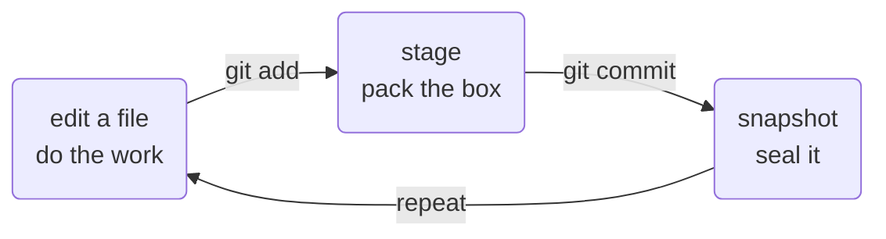

# Your First Repository — init, add, commit, log

Git is installed and knows your name. Now you'll actually use it: create a project, and take your first
real snapshot of it. Everything in this phase happens on your own computer — no internet, no GitHub, no
account. Git works perfectly well entirely alone, and starting here keeps the moving parts to a minimum.

Type along. Doing it once in your own terminal teaches more than reading it five times.

## Make a project folder

First, a plain folder with one file in it. In your terminal:
```console
$ mkdir hello-git
$ cd hello-git
```
*What just happened:* `mkdir` ("make directory") created an empty folder called `hello-git`, and `cd`
("change directory") moved you *into* it. Your terminal is now "standing inside" that folder, so the
commands you type next apply there. Nothing about Git yet — this is just a normal folder.

## `git init` — start tracking this folder

```console
$ git init
Initialized empty Git repository in /home/ada/hello-git/.git/
```
*What just happened:* `git init` ("initialize") turned this ordinary folder into one Git is watching. It
did that by creating a hidden sub-folder named `.git` — see it mentioned in the output? That hidden folder
*is* the repository: it's where Git will quietly store every snapshot and all the history. Your files stay
exactly where they are; Git just added a notebook to the corner of the room.

📝 **Terminology.** A **repository** (everyone says "repo") is a project folder that Git is tracking,
together with its entire history stored in that hidden `.git` folder. "Make a repo" just means "run
`git init` in a folder."

⚠️ **Gotcha.** Run `git init` *inside the folder you want to track* — check with `cd` first. Accidentally
running it in your home folder or Desktop makes Git try to track everything you own, which is a confusing
mess to undo. If you ever see `fatal: not a git repository` later, it's the opposite problem: you're
standing in a folder Git isn't watching. Both are in the [Phase 4 cheat-card](04-first-day-snags.md).

## Create a file, then check `git status`

Let's add something to take a snapshot of. Create a simple text file:
```console
$ echo "Hello, Git!" > hello.txt
```
*What just happened:* `echo` printed the text `Hello, Git!`, and `>` redirected that text into a new file
called `hello.txt` instead of to the screen. (You could just as easily create the file in any text
editor — this is only a quick way to do it from the terminal.)

Now ask Git what it sees:
```console
$ git status
On branch main

No commits yet

Untracked files:
  (use "git add <file>..." to include in what will be committed)
        hello.txt

nothing added to commit but untracked files present (use "git add" to track)
```
*What just happened:* `git status` is your dashboard — it reports the state of things and changes nothing,
so run it as often as you like. It's telling you two things: there are `No commits yet` (you haven't taken
any snapshots), and `hello.txt` is **untracked** — Git can see the file sitting there but isn't recording
it yet. New files start out untracked; you opt them in.

## `git add` — choose what goes in the snapshot

```console
$ git add hello.txt
$ git status
On branch main

No commits yet

Changes to be committed:
  (use "git rm --cached <file>..." to unstage)
        new file:   hello.txt
```
*What just happened:* `git add hello.txt` moved the file into a holding area Git calls the **staging
area** — think of it as packing a box with the things you want in your next snapshot. Notice `hello.txt`
flipped from "Untracked" to "Changes to be committed." It's *in the box*, but the box isn't sealed yet —
nothing is saved to history at this point.

You might wonder why there's a separate "add" step instead of Git just snapshotting everything. Short
answer: it lets you choose *exactly* what goes into each snapshot — useful once projects have many files.
For now, "`add` puts a file in the box" is all you need. The next guide explains the staging area in
depth.

## `git commit` — seal the snapshot

```console
$ git commit -m "Add hello.txt"
[main (root-commit) 0a3f9c2] Add hello.txt
 1 file changed, 1 insertion(+)
 create mode 100644 hello.txt
```
*What just happened:* `git commit` sealed the box into a permanent snapshot. The `-m` flag attaches a
**message** — your note describing the save ("Add hello.txt"). That's it: **you just made your first
commit.** A few things in the output worth reading:

- `(root-commit)` means this is the very first commit in the repo — the root of all history.
- `0a3f9c2` is the commit's unique ID (its *hash*). Yours will differ; every commit gets its own.
- `1 file changed, 1 insertion(+)` is Git summarizing what's new compared to before (one new line).

📝 **Terminology.** A **commit** is one saved snapshot, with its message, ID, and a record of what came
before it. "Commit your work" means "take a snapshot now."

⚠️ **Gotcha.** If you run `git commit` *without* `-m "..."`, Git opens a text editor to make you write a
message — and on many systems that editor is **Vim**, which is notoriously hard to exit if you've never
met it. If you get stranded in it, type `:q!` and press Enter to back out without committing, then run the
command again *with* `-m`. (Also in the Phase 4 cheat-card.)

## Do it again — the loop you'll repeat forever

Here's the whole rhythm of using Git day to day. Change a file, then add and commit. Let's add a second
line:
```console
$ echo "Version control is just save-points." >> hello.txt
$ git add hello.txt
$ git commit -m "Add a second line"
[main 7b1e4d8] Add a second line
 1 file changed, 1 insertion(+)
```
*What just happened:* `>>` *appends* a line to the file (a single `>` would overwrite it). Then the same
two moves — `add` to stage, `commit` to seal. No `(root-commit)` this time, because this snapshot has a
parent: your first commit. That's the loop, forever:



## `git log` — see your history

```console
$ git log --oneline
7b1e4d8 (HEAD -> main) Add a second line
0a3f9c2 Add hello.txt
```
*What just happened:* `git log` lists your commits, newest first — your two snapshots, each with its short
ID and message. `--oneline` keeps it to one tidy line each (plain `git log` shows a fuller, screen-filling
version; if it ever traps you in a scrolling pager, press `q` to quit). This list is your project's memory.
Every commit you make joins it.

💡 **Key point.** You now have a complete, private version-controlled project. You can keep working like
this forever without ever touching the internet — `edit → add → commit`, and `git log` to look back.
GitHub, next, is only about putting a copy of this online.

## Recap

1. **`git init`** turns a folder into a repo (creates the hidden `.git`).
2. **`git status`** shows you what's going on — run it constantly; it changes nothing.
3. **`git add <file>`** puts a file in the box (staging) for the next snapshot.
4. **`git commit -m "message"`** seals the box into a permanent snapshot.
5. **`git log --oneline`** shows your history of snapshots.

That `edit → add → commit` loop is the heart of Git. Everything else builds on it. Next, let's get this
project onto GitHub so it's backed up and shareable.

---

[← Phase 1: What Version Control Even Is](01-what-is-version-control.md) · [Guide overview](_guide.md) · [Phase 3: Putting It on GitHub →](03-putting-it-on-github.md)
