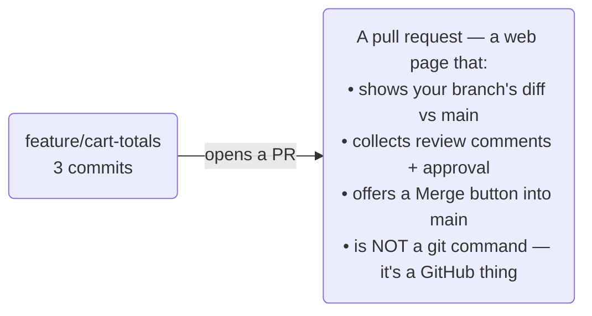

# Pull Requests & Review — Getting Your Work Into main

Your branch is done, committed, pushed, and in sync with `main`. Now for the final step nobody quite
explains: getting it *into* `main`. On a team you almost never merge your own branch from the command line.
Instead you open a **pull request** — and if that phrase has always been a bit of a mystery, this phase
clears it up completely.

## What a pull request actually is

**What it actually is.** A pull request (PR) is you formally saying: *"Here are the commits on my branch.
Please review them and merge them into `main`."* It's a request, with a discussion attached.

**The part that confuses everyone:** a pull request is **not a Git feature.** Git has no `pull request`
command. A PR is a feature of the *website* — GitHub, GitLab, Bitbucket — built *on top* of Git. It wraps
your branch in a web page where people can see your changes, comment line by line, request tweaks, approve,
and finally click a button to merge. Git moves the commits; the website adds the conversation and the
safety of review.



📝 **Terminology.** GitHub and Bitbucket say *pull request* (PR); GitLab says *merge request* (MR). Same
idea, different name.

## Step 1: Open the PR

After you push a branch, GitHub shows a **"Compare & pull request"** button (and you saw it print a PR URL
in [Phase 1](01-the-feature-branch-workflow.md)). Click it, and you'll fill in:

```text
   Base: main   ←   Compare: feature/cart-totals     (merge YOUR branch INTO main)

   Title:        Add cart subtotal and tax line
   Description:  What changed and why. Link the ticket. Note anything
                 reviewers should look at closely or test.
```

**Write the description for a tired reviewer.** A good PR description says *what* changed, *why*, and *how
to check it*. The reviewer wasn't in your head for the last two days — three sentences of context saves a
dozen back-and-forth comments.

💡 **Keep PRs small.** A 40-line PR gets a careful review in minutes; a 2,000-line PR gets a nervous
"looks good" and a rubber stamp. Smaller branches merged more often are easier to review, easier to
sync, and far less likely to hide a bug.

## Step 2: Respond to review

A teammate reads your PR and leaves comments — questions, suggestions, "can you rename this?" You don't
open a new PR to address them; you just **commit more to the same branch and push**:
```console
$ git add pricing.js
$ git commit -m "Rename helper for clarity (review feedback)"
$ git push
```
*What just happened:* Because your branch is linked to the PR, those new commits appear in the PR
automatically — the reviewer sees the update in place. A PR is a *living view* of your branch, not a
one-time snapshot. Round-trip until the reviewer approves.

🪖 **War story.** The first PR I ever opened was 1,800 lines across 30 files. The reviewer sat on it for
three days, finally wrote "I trust you 🤷," and approved without really reading it — which is to say, the
review did *nothing*. The next one I split into five small PRs; each got real comments that caught real
bugs. Small PRs aren't politeness; they're the only size review actually works on.

## Step 3: Merge

Once approved, you merge — usually by clicking the merge button on the PR. GitHub offers three flavors, and
teams pick one as their norm:

| Button | What it does | Feels like |
|---|---|---|
| **Create a merge commit** | Adds all your branch's commits to `main`, plus one merge commit tying them together | Full history, branch shape preserved |
| **Squash and merge** | Combines your whole branch into **one** tidy commit on `main` | Clean, one-commit-per-feature `main` (very common) |
| **Rebase and merge** | Replays your commits onto `main` individually, no merge commit | Linear history, no merge bubbles |

*What just happened when you click it:* GitHub performs the merge on the server and moves `main` forward to
include your work. Your feature is now part of the shared, always-working branch. If you're unsure which
button, **ask what your team uses** — consistency is the whole point, and many teams default to *Squash and
merge* for a clean `main`.

## Step 4: Clean up and reset for the next thing

After the merge, your feature branch has done its job. Delete it (GitHub offers a **"Delete branch"** button
right after merging — take it), then update your local world:
```console
$ git switch main
$ git pull                       # bring the just-merged work into local main
$ git branch -d feature/cart-totals
Deleted branch feature/cart-totals (was 9a1b2c3).
```
*What just happened:* You switched to `main`, pulled so your local `main` now contains your merged feature,
and deleted the local feature branch (`-d` only deletes branches already merged — a safety check, so it
won't let you drop unmerged work). You're back on a clean, current `main`, ready to branch for the next
task. That's one full lap of the loop.

⚠️ **Gotcha.** Don't keep working on a feature branch *after* it's been merged and deleted. Start each new
piece of work from a fresh branch off the updated `main` (Phase 1, Step 1). Reusing an old merged branch is
a reliable way to resurrect confusing history.

## When GitHub says it can't merge automatically

Sometimes the PR shows **"This branch has conflicts that must be resolved"** — `main` changed under you in
a way that clashes with your branch. GitHub can't guess the resolution, so you fix it locally with the exact
move from [Phase 2 §3–4](02-staying-in-sync.md):
```console
$ git switch main && git pull          # get the latest main
$ git switch feature/cart-totals
$ git merge main                       # resolve the conflict here, then commit
$ git push                             # the PR updates; the conflict clears
```
*What just happened:* You folded the latest `main` into your branch, resolved the clash on your own machine
where you have real tools, and pushed — which updates the PR and re-enables its merge button. Same conflict
skill you already have, just triggered by the PR.

## Tagging a release

When a particular commit on `main` is a version worth naming — a release — you mark it with a **tag**. A tag
is a permanent, human-friendly label on one commit (unlike a branch, it doesn't move):
```console
$ git switch main && git pull
$ git tag -a v1.2.0 -m "Cart totals and promo codes"
$ git push origin v1.2.0
```
*What just happened:* `git tag -a` created an *annotated* tag `v1.2.0` (the `-a`/`-m` records who tagged it,
when, and why) on the current `main` commit. Tags don't push with normal `git push`, so you send it
explicitly. On GitHub, that tag can become a **Release** — a download page with notes — built right on top
of it.

📝 **Terminology.** A **tag** names one commit forever (e.g. `v1.2.0`); a **release** is GitHub's page built
on a tag, with notes and downloadable assets. The version numbers themselves (what `1.2.0` means) follow a
convention called *semantic versioning* — a topic of its own.

## You can work on a team now

Step back and see the whole lap you can now run: branch off a current `main`, commit in isolation, sync as
`main` moves, open a PR, take review, merge cleanly, delete the branch, and tag a release when it ships.
That's the daily rhythm of professional Git — and none of it was new commands, just the workflow nobody
writes down.

**Where to go next.** You've stayed deliberately on the safe, merge-based path. The advanced guide —
**Git Disaster Recovery** — is where we pick up the sharp tools: `rebase` and how to use it without
hurting anyone, recovering commits you thought were gone with the **reflog**, and undoing work you've
*already pushed*. That's the last rung, for when something has truly gone sideways and you need to fix it
with a steady hand.

## Recap

1. A **pull request** is a website feature (not a Git command) that wraps your branch in review +
   discussion and offers a merge button into `main`.
2. **Open** a PR after pushing; write a description for a tired reviewer; **keep it small.**
3. **Respond to review** by pushing more commits to the same branch — the PR updates itself.
4. **Merge** via merge-commit / squash / rebase (use your team's norm), then **delete the branch** and
   `git switch main && git pull`.
5. Fix PR conflicts by **merging `main` into your branch locally**; **tag** named versions with
   `git tag -a` and push the tag.

---

[← Phase 2: Staying in Sync](02-staying-in-sync.md) · [Guide overview](_guide.md)
