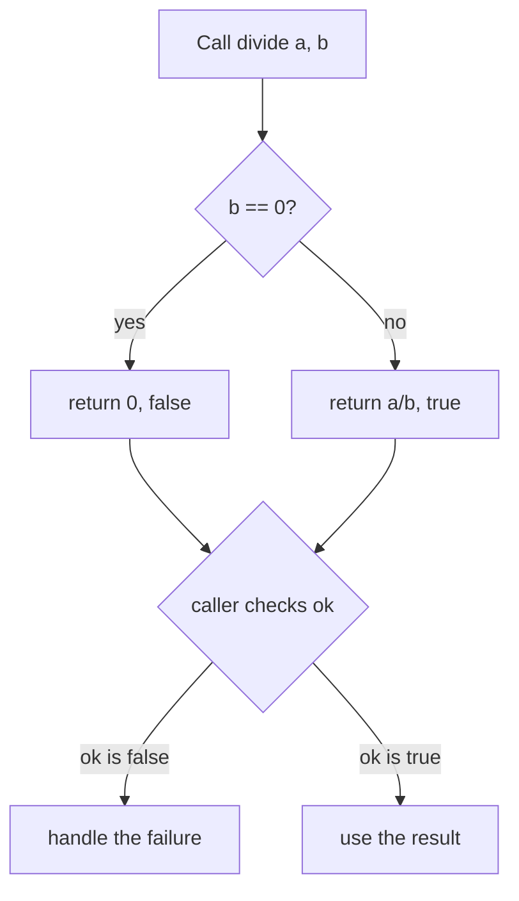

# Control Flow & Functions

Up to now your programs run straight down, top to bottom. Real logic *branches* (do this if that),
*repeats* (do this for each item), and is *organized into reusable pieces* (functions). Go's take on all
three is unusually lean — there's one loop, not three, and functions can hand back more than one value at
a time. That second feature shapes how *all* Go code reads, so we'll spend real time on it.

## `if` — branching, with a twist

The basic `if` looks like you'd expect, with one Go quirk: **no parentheses around the condition, but
braces are mandatory.**
```go
package main

import "fmt"

func main() {
	age := 20
	if age >= 18 {
		fmt.Println("adult")
	} else {
		fmt.Println("minor")
	}
}
```
```console
$ go run main.go
adult
```
*What just happened:* `if age >= 18` checked the condition; since `20 >= 18` is true, the first block ran
and printed `adult`. Note there are no `( )` around `age >= 18` (Go doesn't use them), but the `{ }` are
required even for a single line (Go never lets you omit them — this prevents a famous class of bugs where
an unbraced `if` silently covers only one statement).

Go's distinctive touch is the **`if` with an init statement** — you can declare a variable right in the
`if`, scoped to just that block:
```go
if n := len("hello"); n > 3 {
	fmt.Println("long word, length", n)
}
```
```console
long word, length 5
```
*What just happened:* `if n := len("hello"); n > 3` does two things separated by the semicolon: first it
declares `n` (the length, 5), then it tests `n > 3`. The variable `n` exists *only* inside the `if`/`else`
blocks and vanishes after. This keeps short-lived helper values from leaking into the surrounding code —
you'll see it constantly with error checks in [phase 7](07-errors-and-io.md).

## `for` — Go's one and only loop

Here's a genuine surprise: **Go has exactly one loop keyword, `for`.** No `while`, no `do-while`, no
separate `foreach` statement. The designers decided one flexible loop was clearer than four, and `for`
shape-shifts to cover every case.

The classic counting loop:
```go
package main

import "fmt"

func main() {
	for i := 0; i < 3; i++ {
		fmt.Println(i)
	}
}
```
```console
$ go run main.go
0
1
2
```
*What just happened:* `for i := 0; i < 3; i++` has the three familiar parts separated by semicolons:
**init** (`i := 0`, runs once), **condition** (`i < 3`, checked before each pass — keep going while
true), and **post** (`i++`, runs after each pass; `i++` means "add one to `i`"). So it printed `0`, `1`,
`2` and stopped when `i` hit `3`.

Drop the init and post, keep only a condition, and the same `for` becomes a "while" loop:
```go
n := 3
for n > 0 {
	fmt.Println(n)
	n--
}
```
```console
3
2
1
```
*What just happened:* `for n > 0` loops as long as the condition holds — this is exactly what other
languages spell `while (n > 0)`. Go just reuses `for`. (`n--` means "subtract one from `n`.") Drop the
condition too — `for { ... }` — and you get an infinite loop, which you exit with `break` or `return`.

And you've already seen the third form: `for ... range` over a collection, back in
[phase 3](03-collections.md). One keyword, three shapes.

💡 **Key point.** Whenever you'd reach for `while` in another language, in Go you write `for condition`.
There's nothing to memorize beyond "it's always `for`."

## `switch` — cleaner than a stack of `if`s

When you're comparing one value against several options, `switch` reads better than a tower of
`else if`:
```go
package main

import "fmt"

func main() {
	day := "Sat"
	switch day {
	case "Sat", "Sun":
		fmt.Println("weekend")
	case "Fri":
		fmt.Println("almost there")
	default:
		fmt.Println("weekday")
	}
}
```
```console
$ go run main.go
weekend
```
*What just happened:* `switch day` compared `day` against each `case`. It matched `"Sat"` in the first
case (which lists two values, `"Sat", "Sun"`, either of which matches) and printed `weekend`. `default`
runs when nothing else matches. 

⚠️ **Gotcha (the good kind) — Go's `switch` does not fall through.** If you've used C, Java, or
JavaScript, you're used to needing `break` at the end of every `case` or execution "falls through" into
the next one. **Go is the opposite: each case stops on its own**, no `break` needed. This removes the
classic "I forgot the `break` and three cases ran" bug. (If you ever *want* fall-through, there's an
explicit `fallthrough` keyword — but you'll rarely need it.)

## Functions — and the multiple-return signature that defines Go

A **function** is a named, reusable block of code that takes inputs (**parameters**) and hands back
outputs (**return values**). Here's one that adds two numbers:
```go
package main

import "fmt"

func add(a int, b int) int {
	return a + b
}

func main() {
	fmt.Println(add(3, 4))
}
```
```console
$ go run main.go
7
```
*What just happened:* `func add(a int, b int) int` reads as "a function named `add`, taking two `int`
parameters `a` and `b`, and *returning* an `int`." The return type sits **after** the parameters — that
ordering takes a moment if you're used to `int add(...)`, but it reads naturally left-to-right once it
clicks. `return a + b` hands the sum back, and `main` printed it.

Now the feature that shapes all of Go: **a function can return more than one value.** This is everywhere
in real Go, most importantly for returning a result *and* whether it failed:
```go
package main

import "fmt"

func divide(a, b int) (int, bool) {
	if b == 0 {
		return 0, false   // can't divide by zero — signal failure
	}
	return a / b, true
}

func main() {
	result, ok := divide(10, 2)
	fmt.Println(result, ok)

	result, ok = divide(10, 0)
	fmt.Println(result, ok)
}
```
```console
$ go run main.go
5 true
0 false
```
*What just happened:* `func divide(a, b int) (int, bool)` returns *two* values — the result and a boolean
saying whether it worked. (Notice `a, b int` is shorthand for "both are `int`.") The caller catches both
with `result, ok := divide(...)`. When we divided by zero, the function returned `0, false` instead of
crashing, and the caller could check `ok` and react. This `(value, ok)` or — far more commonly —
`(value, error)` shape is *the* Go signature. You'll see it on nearly every function that can fail, and
it's why Go doesn't need exceptions, which we'll unpack in [phase 7](07-errors-and-io.md).

Here's that decision in one picture — exactly the shape of code you'll write hundreds of times:



## `defer` — a teaser for cleanup done right

One more keyword you'll meet constantly: **`defer`**. It schedules a function call to run *when the
surrounding function is about to return*, no matter how it returns:
```go
package main

import "fmt"

func main() {
	defer fmt.Println("goodbye")
	fmt.Println("hello")
}
```
```console
$ go run main.go
hello
goodbye
```
*What just happened:* `defer fmt.Println("goodbye")` didn't run immediately — Go *deferred* it until
`main` was finishing. So `hello` printed first (the normal line), then `goodbye` ran on the way out. The
reason `defer` is everywhere: it's how Go guarantees cleanup. When you open a file or a connection, you
`defer` closing it right next to opening it, and Go runs the close no matter which path the function takes
out. We'll use it for real in [phase 7](07-errors-and-io.md); for now, just know it means "run this last,
guaranteed."

## Recap

1. **`if`** uses no parentheses but requires braces; its **init form** (`if x := …; cond`) scopes a
   helper variable to the block.
2. Go has **one loop, `for`** — it covers counting (`for i := 0; …`), while (`for cond`), infinite
   (`for {}`), and `for … range`.
3. **`switch`** compares a value against cases and **does not fall through** — no `break` needed.
4. **Functions** put the return type after the parameters; **multiple return values** (especially
   `(value, error)`) are the defining Go signature.
5. **`defer`** schedules a call to run when the function returns — the idiomatic way to guarantee cleanup.

Next, we stop writing single files and start building *projects*: modules, packages, why a capital letter
makes something public, and a sane layout — the groundwork for the goroutines in phase 6.

---

[← Phase 3: Collections](03-collections.md) · [Guide overview](_guide.md) · [Phase 5: Modules & Project Layout →](05-modules-and-project-layout.md)
